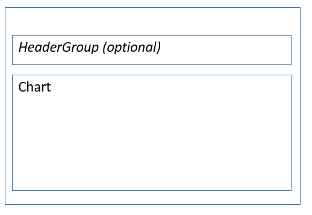

# Section Chart form pattern

[!include [banner](../includes/banner.md)]

This article provides information about the Section Chart form pattern. This pattern is primarily used in conjunction with the Operational Workspace pattern, and specifically on forms that contain a chart control.

## Usage

The Section Chart form pattern is intended to be used primarily in conjunction with the Operational Workspace pattern. Specifically, the chart section or summary section contains Form Part Controls that point to forms that contain charts. These referenced forms are intended to use the Section Chart pattern.

## Wireframe

## Pattern changes for finance and operations apps
This pattern didn't exist for Microsoft Dynamics AX 2012.

## Model
### High-level structure

- Form Design

    - *HeaderGroup (Group) \[Optional\]* – This uses one of the [Filters and Toolbar](filters-toolbar-subpattern.md) subpatterns.
    - Chart

### Core components

Apply the Section Chart pattern to the appropriate form/container.

### Related container patterns

-   [Workspace](workspace-form-pattern.md)
-   [Section stacked chart](section-stacked-chart-subpattern.md)

## UX guidelines
The verification checklist shows the steps for manually verifying that the form complies with UX guidelines. This checklist doesn't include any guidelines that will be enforced automatically through the development environment. Open the form in the browser, and walk through these steps. None

## Examples
Form: **FmBiChartPart\_VehicleByModel** (**All workspaces** &gt; **Reservation Management** (see the **Statistics** section) 

## Appendix
### Frequently asked questions

This section will have answers to frequently asked questions that are related to this guideline/pattern.

### Open issues

None

[!INCLUDE[footer-include](../../../includes/footer-banner.md)]
