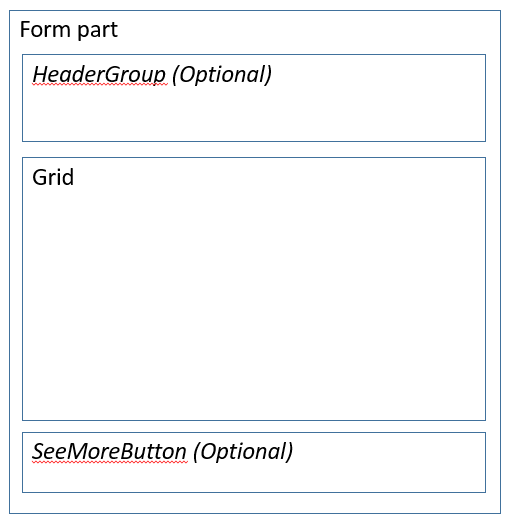
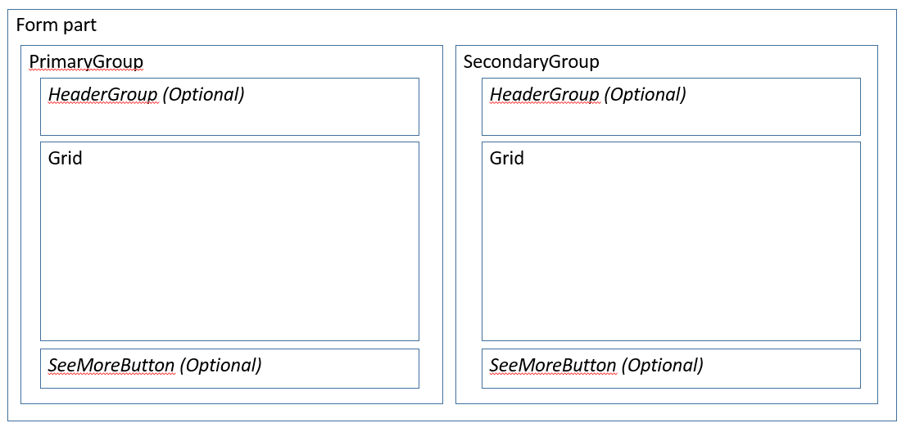

# Form Part Section List form patterns

[!include [banner](../includes/banner.md)]

This article provides information about the Form Part Section List form patterns. These workspace-specific patterns have been developed to show filtered lists inside workspaces.

## Usage

The Form Part Section List form patterns are workspace-specific patterns that are used to show filtered lists. The tabbed section of the workspace contains a set of vertical tabs. Each tab contains a Form Part Control that points to a form that contains one of the Form Part Section List patterns. Two patterns are described in this article:

-   **Form Part Section List** – This is the default Section pattern. It allows for a single list of data, together with an optional header group that contains filters and/or actions.  Most content areas in the tabbed section of a workspace will use this pattern.
-   **Form Part Section List - Double** – This variant enables a second list of data to appear to the right of the primary list. By default, the secondary list is hidden. To show it, the user clicks a button on the Toolbar above the primary list.

## Wireframe
### Form Part Section List

### Form Part Section List - Double

## Pattern changes for finance and operations apps
These patterns did not exist for Microsoft Dynamics AX 2012.

## Model
### Form Part Section List: High-level structure

- Design | Container

    - *Header (Group) \[Optional\]* – This must use one of the [Filters and Toolbar](filters-toolbar-subpattern.md) subpatterns.
    - Grid
    - *GridDefaultAction (Button) \[Optional\]*
    - *SeeMoreButton (Button) \[Optional\]*

### Form Part Section List - Double: High-level structure

- Design | Container

    - PrimaryGroup (Group)

        - *Header (Group) \[Optional\]* – This must use one of the [Filters and Toolbar](filters-toolbar-subpattern.md) subpatterns.
        - Grid
        - *GridDefaultAction (Button) \[Optional\]*
        - *SeeMoreButton (Button) \[Optional\]*

    - SecondaryGroup (Group)

        - *Header (Group) \[Optional\]* – This must use one of the [Filters and Toolbar](filters-toolbar-subpattern.md) subpatterns.
        - Grid
        - *GridDefaultAction (Button) \[Optional\]*
        - *SeeMoreButton (Button) \[Optional\]*

### Core components

1.  Apply the appropriate Form Part Section List pattern on **Form.Design**.
2.  In the backing Operational workspace form, set the Form Part control on the corresponding vertical tab to point to a menu item that points to this form.

### Related container patterns

-   [Section Tabbed List](section-tabbed-list-subpattern.md)
-   [Filters and Toolbar](filters-toolbar-subpattern.md)

## UX guidelines
The verification checklist shows the steps for manually verifying that the form complies with UX guidelines. This checklist doesn't include any guidelines that will be enforced automatically through the development environment. Open the form in the browser, and walk through these steps.

-   **General form guidelines**
    -   Standard form guidelines have been consolidated into the [General Form Guidelines](general-form-guidelines.md) document.
-   **Pattern-specific guidelines**
    -   If a backing form exists, and especially if not all the records are shown in the list, a **See more** button should appear at the bottom of the list, so that the user can see the full list.
    -   Up to two important filters exist above the list.
    -   Up to three frequently used actions exist above the list.
-   **Grid**
    -   Lists are filtered down to an interesting, relatively small set of data.
    -   List grids have no more than three lines of data per row.
    -   Card grids show no more than four fields (not including an image).
    -   Tabular grids show no more than eight fields.
-   **Form Part Section List - Double guidelines**
    -   If both lists have actions and/or filters, both list must use the same [Filters and Toolbar](filters-toolbar-subpattern.md) subpattern (either the Stacked variant or the Inline variant).

## Examples
### Form Part Section List

Form: **PurchOrderProcessReceiptsWorkspace** &gt; **PurchOrdersWithDelayedReceiptsPart** (**All workspaces** &gt; **Purchase order receipt and follow-up**) 

### Form Part Section List - Double

Form: **BudgetTrackingWorkspace** &gt; **BudgetTransactionPart** (**All workspaces** &gt; **Ledger budgets and forecasts**) 

## Appendix
### Frequently asked questions

This section will have answers to frequently asked questions that are related to this guideline/pattern.

### Open issues

None

[!INCLUDE[footer-include](../../../includes/footer-banner.md)]
