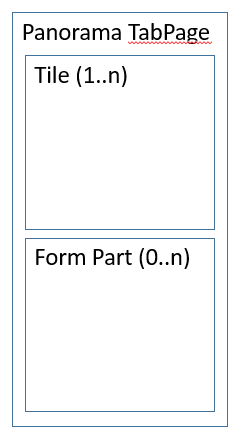

# Section Tiles subpattern

[!include [banner](../includes/banner.md)]

This article provides information about the Section Tiles subpattern. This subpattern is used as part of the Operational Workspace pattern, specifically for the first panorama section (the Summary section) that contains a set of tiles, charts, and singleton cards. 

## Usage

The Section Tiles subpattern is used as part of the Operational Workspace pattern, specifically for the first panorama section (the **Summary** section) that contains a set of tiles, charts, and singleton cards.

## Wireframe

## Pattern changes for Microsoft Dynamics AX
This pattern didn't exist for Microsoft Dynamics AX 2012.

## Model
### High-level structure

- TabPage

    - *TileButton (TileButton) \[0..N\]*
    - *TargetForm (FormPart) \[0..N\]*

The Form Parts are used to embed Charts or singleton Cards into the **Summary** section of the workspace. Each form that represents a Chart should use the [Section Chart](section-chart-form-pattern.md) form pattern.

### Core components

Apply Section Tiles to the first tab page in the Operational Workspace.

### Related container patterns

-   [Operational Workspace](workspace-form-pattern.md)
-   [Section Chart](section-chart-form-pattern.md)

## UX guidelines
The verification checklist shows the steps for manually verifying that the form complies with UX guidelines. This checklist doesn't include any guidelines that will be enforced automatically through the development environment. Open the form in the browser, and walk through these steps.

-   The **Summary** section should be named "Summary" or a variant that qualifies the word “Summary.”
-   No two tiles in the workspace should have the same symbol.
-   There should be a maximum of one "New" tile.
-   Chart sizes should correspond to multiples of tile sizes.
    -   Available sizes include 1 tile tall × 2 tiles wide, 2 × 2, 2 × 3, 2 × 4, 2 × 6, 4 × 4, 4 × 6, and 4 × 8.

## Examples
Form: **PurchOrderMaintainWorkspace** (**All workspaces** &gt; **Purchase order preparation** (see the **Summary** section)

## Appendix
### Frequently asked questions

This section will have answers to frequently asked questions that are related to this guideline/pattern.

### Open issues

None

[!INCLUDE[footer-include](../../../includes/footer-banner.md)]
