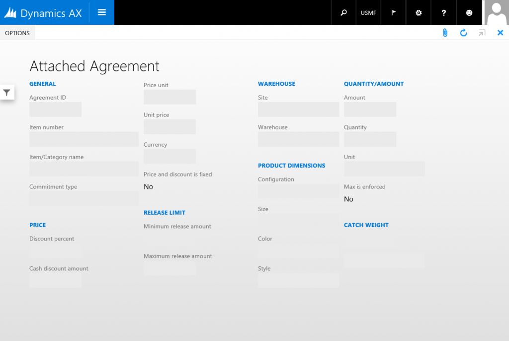
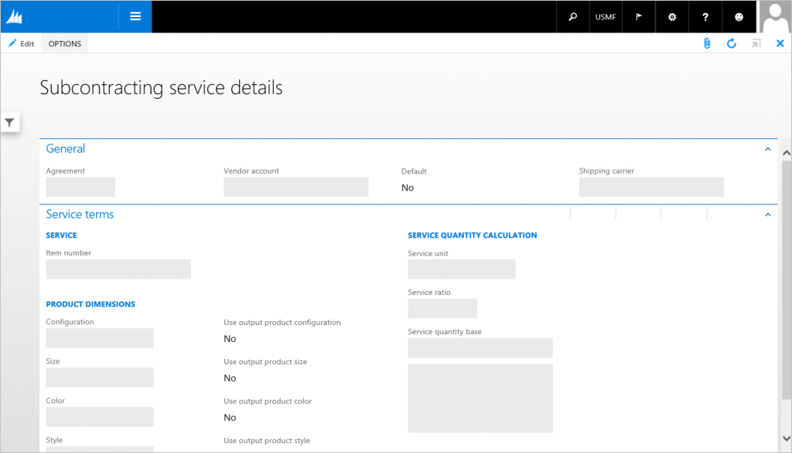
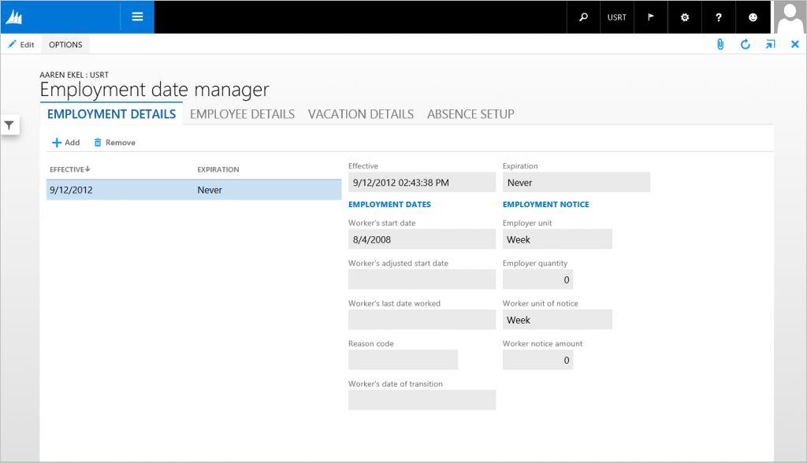
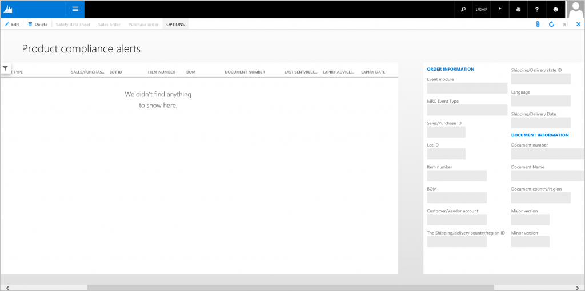

# Simple Details form pattern

[!include [banner](../includes/banner.md)]

This article describes the Simple Details form pattern. This pattern is used when only a simple set of fields must be presented to the user.

## Usage

The Simple Details pattern is used when only a simple set of fields must be presented to the user. Examples include the display of totals and customer balances. Typically, view mode is used for the Simple Details pattern. However, in cases where the form provides editable information, the edit mode should be synced to the parent form. Four patterns are described in this document:

-   **Simple Details w/Toolbar and Fields** – This is the basic Simple Details pattern, in which several fields are displayed in the form. The fields can optionally appear inside Groups.
-   **Simple Details w/Fast Tabs** – This is the Simple Details pattern that should be used when fields are organized into FastTabs.
-   **Simple Details w/Standard Tabs** – This is the Simple Details pattern that should be used when fields are organized into traditional tabs.
-   **Simple Details w/Panorama** – This is the Simple Details pattern that should be used when information is intended to be displayed in a panorama format.

## Wireframe

## Pattern changes
There are no planned changes for the use of this pattern in the current version of Microsoft Dynamics AX.

## Model
### Simple Details w/Toolbar and Fields – High-level structure

- Design

    - ActionPane (ActionPane)
    - Body (Group) – **Note:** A field subpattern is used.

### Simple Details w/FastTabs – High-level structure

- Design

    - ActionPane (ActionPane)
    - *HeaderGroup (Group) \[Optional\]*
    - Body (Tab, Style=FastTabs)

        - BodyTabPages (TabPage repeats 1..N)

    - *FooterGroup (Group) \[Optional\]*

### Simple Details w/Standard Tabs – High-level structure

- Design

    - ActionPane (ActionPane)
    - *HeaderGroup (Group) \[Optional\]*
    - Body (Tab, Style=Tabs)

        - BodyTabPages (TabPage repeats 1..N)

    - *FooterGroup (Group) \[Optional\]*

### Simple Details w/Panorama – High-level structure

- Design

    - ActionPane (ActionPane)
    - Body (Tab, Style=Panorama)

        - BodyTabPages (TabPage repeats 1..N)

    - *FooterGroup (Group) \[Optional\]*

### Core components

1.  Apply the SimpleDetails pattern on **Form.Design**.
2.  Address BP Warnings:
    1.  **Design.Caption** isn't empty.
    2.  The form must be referenced by at least one menu item.
    3.  **TabPage.Caption** isn't empty.
    4.  MainMenu must not contain menu items that reference a SimpleDetails form.

### Commonly used subpatterns

-   [Fields and Field Groups](fields-field-groups-subpattern.md)
-   [Toolbar and Fields](toolbar-fields-subpattern.md)
-   [Tabular Fields](tabular-fields-subpattern.md)
-   [Toolbar and List](toolbar-list-subpattern.md)

## UX guidelines
The verification checklist shows the steps for manually verifying that the form complies with UX guidelines. This checklist doesn't include any guidelines that will be enforced automatically through the development environment. Open the form in the browser, and walk through these steps. **Standard form guidelines:**

-   Standard form guidelines have been consolidated into the Dynamics AX [General Form Guidelines](general-form-guidelines.md) document.

**Simple Details** **guidelines:**

-   The form page should display a Form Caption that accurately describes the entity.
    -   The Form Caption should be in a singular form.

## Examples
### Simple Details w/Toolbar and Fields

Form: **AgreementLine** 

### Simple Details w/FastTabs

Form: **PlanActivityServiceDetails** 

### Simple Details w/Standard Tabs

Form: **HcmEmploymentDateManager** (Click **Human Resources** &gt; **Common** &gt; **Workers** &gt; **Workers**, click **General** &gt; **Versions** &gt; **Employment History**, and then click **Date Manager**.) 

### Simple Details w/Panorama

Form: **PdsMRCEventTracker** 

## Appendix
### Frequently asked questions

This section will have answers to frequently asked questions that are related to this guideline/pattern.

### Open issues

-   Investigate whether Simple Details forms that show a small amount of related content should have a different presentation than a full-page form.

[!INCLUDE[footer-include](../../../includes/footer-banner.md)]
