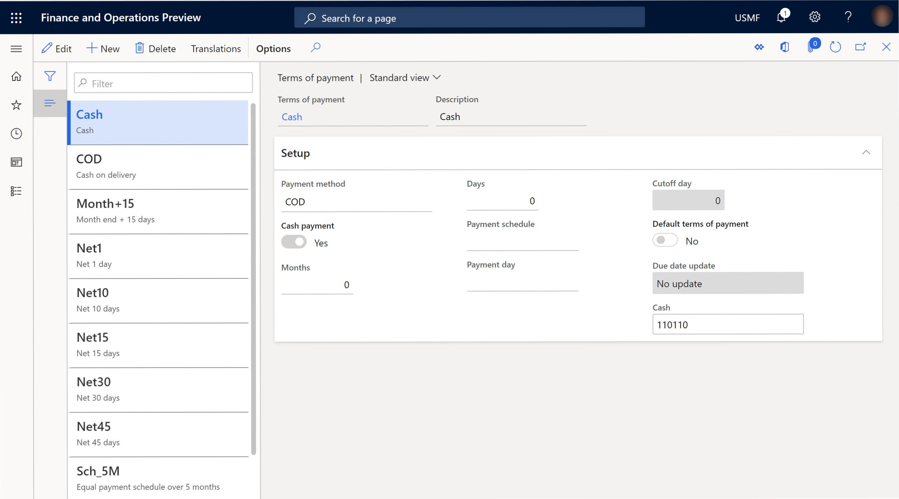
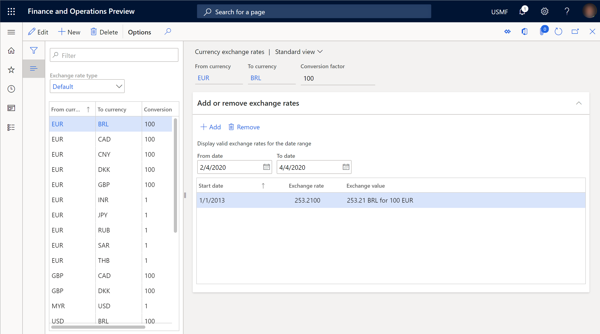
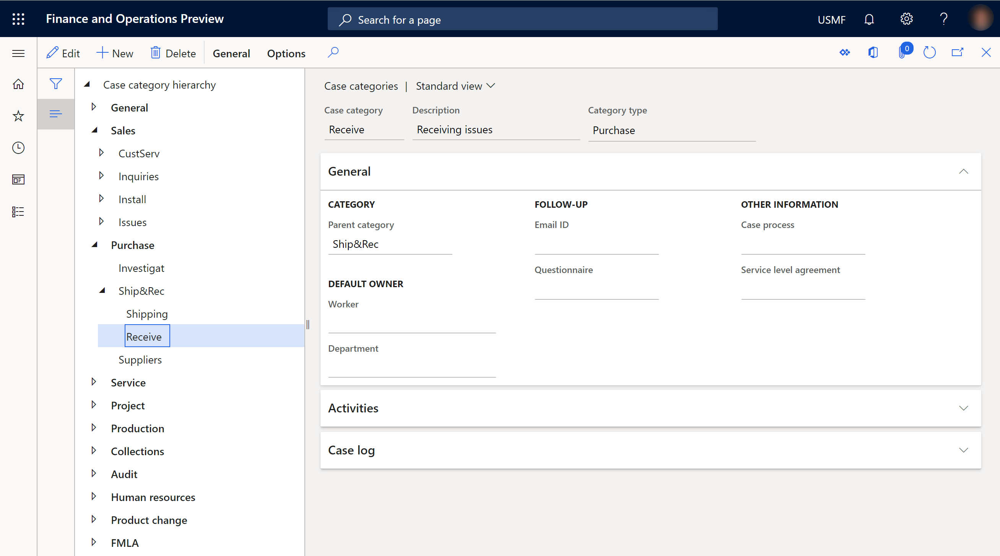

# Simple List and Details form pattern

[!include [banner](../includes/banner.md)]

This article provides information about the Simple List and Details form pattern. This pattern is used to maintain data for entities of medium complexity.

## Usage

The Simple List and Details (SL+D) pattern is used to maintain data for entities of medium complexity. Entities of medium complexity are those entities that have six or more fields. The Simple List pattern should be used for simple entities that have fewer than six fields. There are some exceptions where entities that have up to 15 fields are still considered simple entities. The Simple List and Details pattern is prescribed when these conditions are met:

-   The underlying data has more than six fields.
-   There are between zero and five child data collections.

Three patterns are described in this document:

-   **Simple List and Details – List Grid** – This is the basic SL+D pattern. This is the pattern that should be used by default.
-   **Simple List and Details – Tabular Grid** – This is the SL+D pattern that should be used if the number of fields in the “simple list” part of the form is larger than expected (see the "Pattern changes" section later in this article).
-   **Simple List and Details – Tree** – This is the SL+D pattern that should be used if the “simple list” part of the form is actually a tree.

## Wireframe

## Pattern changes
Here are the main changes to this pattern since Microsoft Dynamics AX 2012:

-   The top ActionPane strip control has been converted to a standard ActionPane.
-   **New**, **Delete**, and **Edit** buttons are provided by the framework.
-   View mode is used by default.
-   A Quick Filter control has been added above the “list” part of the form.
-   Whenever possible, use the list-style grid for the “list” part of the form. A tabular grid is an acceptable alternative in some situations, such as when these conditions are met:
    -   Multiple fields of the same type (for example, three date fields) would not be distinguishable in the list-style grid.
    -   The user’s task is to compare a sequence of dates/numbers across rows in the list (for example, date effective dates or route step numbers).
    -   The number of fields in the grid is larger than expected (if each row takes up more than three lines in the list-style grid).
-   Fields in the header group are arranged horizontally instead of vertically.
-   FactBoxes are allowed.
-   The form structure has been simplified (the BodyGroup container has been removed).

## Model
### High-level structure

- Design

    - ActionPane
    - NavigationList (Group)

        - Quick Filter
        - *CustomFilterGroup (Group) \[Optional\]*
        - ListStyleGrid (Grid) | Tree | TabularGrid (Grid)

    - VerticalSplitter (Group) *\[only allowed for Tree or TabularGrid variants\]*
    - DetailsHeader (Group)
    - DetailsTab (Tab)

### Core components

1.  Apply one of the SimpleListDetails patterns on **Form.Design**.
2.  Resolve required BP checks:
    1.  Set **Design.Caption** the same as the label that is used on the **Name** property of the table.
    2.  Set **Design.Datasource** the same as **Grid.Datasource**.
    3.  Set the primary data source to **InsertIfEmpty**=**No**.
    4.  Set the primary **ActionPane.DataSource** the same as **Grid.Datasource**.
    5.  Set **Grid.Datasource** to the primary data source.

### Commonly used subpatterns

-   [Fields and Field Groups](fields-field-groups-subpattern.md)
-   [Toolbar and List](toolbar-list-subpattern.md)
-   [Toolbar and Fields](toolbar-fields-subpattern.md)
-   [Nested Simple List and Details](nested-simple-list-details-subpattern.md)

## UX guidelines
The verification checklist shows the steps for manually verifying that the form complies with UX guidelines. This checklist doesn't include any guidelines that will be enforced automatically through the development environment. Open the form in the browser, and walk through these steps. 

**Standard form guidelines:**

-   Standard form guidelines have been consolidated into the Microsoft Dynamics AX [General Form Guidelines](general-form-guidelines.md) document.

**Simple list & detail guidelines:**

-   The page should display a Form Caption that accurately describes the entity.
    -   The Form Caption should be in plural form.
-   There should not be duplicate **New** or **Delete** buttons.
-   By default, the Quick Filter should use the name or description column.
-   Guidelines for custom filters have been consolidated into the Custom Filter Group subpattern document.
    -   There should be no more than two custom filter fields in a SL&D form.
-   There should be a tabular grid, a list-style grid, or a tree control on the left edge of the form.
    -   List-style grids should display no more than three rows (lines) for each record in the List-style grid. Typically, just the ID and Description are sufficient.
    -   Between two and five fields should be used for the list on the left.
    -   A tabular grid can be used in some unique situations but isn't generally recommended.
        -   If a tabular grid is used, it should **not** be editable.
    -   When there is no data, the grid or tree control should not automatically add a new record.
-   A **Details** section should be displayed on the right of the form:
    -   The list fields (whether they are from a list, tabular grid, or tree) should be the first fields in Header Group. They should appear in the same order that they appear in the grid or tree, so that the user can edit and see the labels of the fields.
-   Simple List and Detail forms must **not** have these elements:
    -   Standard tabs to group fields

## Examples
### Simple List and Details – List Grid

Form: **PaymTerm** 

### Simple List and Details – Tabular Grid

Form: **ExchangeRate** 

### Simple List and Details – Tree

Form: **CaseCategorySetup** 

## Appendix
### Frequently asked questions

This section will have answers to frequently asked questions that are related to this guideline/pattern.

-   **When do I use icons on actions in the toolbars?**
    -   See the Button Image Guidelines in the [General Form Guidelines](general-form-guidelines.md) document.

### Open issues

-   **How can a developer move between the ListStyleGrid and the TabularGrid patterns?**
    -   Currently, developers must manually move between the patterns.
-   **Are we going to allow modeling without FastTabs in the details body?**
    -   Although we require FastTabs in the details body, we plan to eventually hide the FastTab header if only one FastTab is visible.
-   **How do we allow for exceptions to the FastTab rule for legacy situations such as the Interest form?**
    -   Whenever possible, refactor the form to fit the SL&D pattern (as the **Interest** form has done). Otherwise, use custom containers.
-   **How do we prevent hyperlinks on fields in the UI?**
    -   For some fields, you can **set IgnoreEDTRelation**=**Yes** to prevent hyperlinks in the UI. Regardless (as of Platform update 17), you can set **EnableFormRef**=**No** on an input control to disable a hyperlink.

### AX 2012 content

[!INCLUDE[footer-include](../../../includes/footer-banner.md)]
