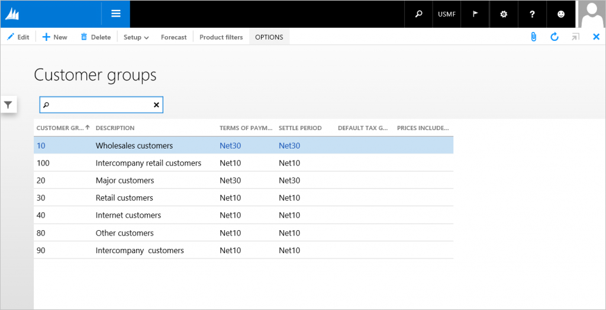

# Simple List form pattern

[!include [banner](../includes/banner.md)]

This article provides information about the Simple List form pattern. This pattern is used to maintain data for simple entities.

## Usage

The Simple List pattern is used to maintain data for simple entities. Simple entities are entities that have six or fewer fields and no parent/child relationships. There are some exceptions where entities that have up to 15 fields are still considered simple entities.

## Wireframe

## Pattern changes
Here are the main changes to this pattern since Microsoft Dynamics AX 2012:

-   The top ActionPane strip control has been converted to a standard ActionPane.
-   **New**, **Delete**, and **Edit** buttons are provided by the framework.
-   View mode is used by default.
-   A Quick Filter has been added above the grid.
-   When the form is used as a dependent form, the parent form record context is automatically shown above the form caption.
    -   The page title group for dependent form usage was removed, because it will be provided by the framework.
-   The pattern allows for multiple selections in the grid.

## Model
### High-level structure

- Design

    - ActionPane (ActionPane)
    - Custom Filter (Group)

        - Quick Filter (Quick Filter)
        - *OtherFilters ($Field) \[0..N\]*

    - TabularGrid (Grid)
    - *Footer (Group) \[Optional\]*

### Core components

1.  Apply the SimpleList pattern on **Form.Design**.
2.  Address BP Warnings:
    1.  **Design.Caption** isn't empty.
    2.  **Design.DataSource** isn't empty.
    3.  **Grid.Datasource** must be set.
    4.  The form must be referenced by at least one menu item.
    5.  **Design.Datasource** is set the same as **Grid.Datasource**.
    6.  The primary key field of the primary data source’s table has **IgnoreEDTRelation**=**Yes**.
    7.  The grid must not contain more than 15 fields.

### Commonly used subpatterns

-   [Custom Filter Group](custom-filter-group-subpattern.md)

## UX guidelines
The verification checklist shows the steps for manually verifying that the form complies with UX guidelines. This checklist doesn't include any guidelines that will be enforced automatically through the development environment. Open the form in the browser, and walk through these steps. 

**Standard form guidelines:**

-   Standard form guidelines have been consolidated into the Microsoft Dynamics AX [General Form Guidelines](general-form-guidelines.md) document.

**Simple list guidelines:**

-   By default, the Quick Filter should use the name or description column.
-   The list can display up to 15 columns.

    **Note:** This guideline has been relaxed from AX 2012.

-   There should not be any duplicate **New** or **Delete** buttons.
-   The page title should be in a plural form.
-   When there is no data, the grid should not automatically add a new record.

## Examples
Form: **CustGroup** 

 

**Note:** We plan to extend the grid lines to the right and bottom edges in a future client deliverable.

## Appendix
### Frequently asked questions

This section will have answers to frequently asked questions that are related to this guideline/pattern.

### Open issues

None at this time.

### AX 2012 content

[!INCLUDE[footer-include](../../../includes/footer-banner.md)]
