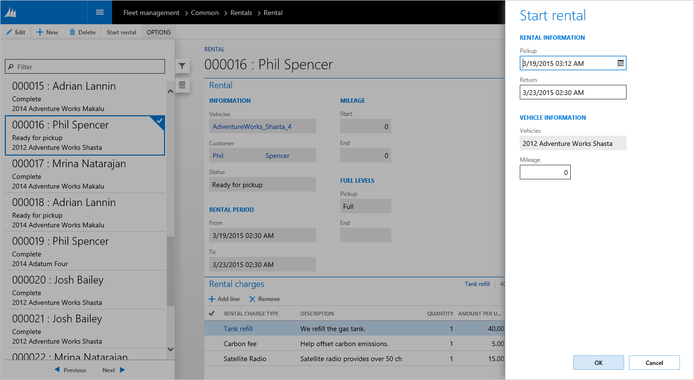
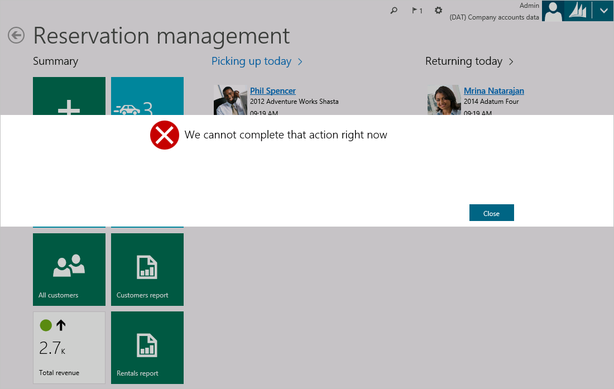

# Slider and MessageBox dialogs

[!include [banner](../includes/banner.md)]

Dialogs

There are two dialogs that replace the existing dialog box, the Slider and the MessageBox from Dynamics AX 2012:

-   Slider
-   MessageBox

The following sections discuss the specific goals for each concept.

## Slider
The slider, or slider dialog, is a dialog box that "slides" in on top of the active page's content from the right edge of the screen. In the following screen shot, the slider is the white region that has the caption **Start rental** on the right side of the window. Notice that the area to the left of the slider is shaded to help the user understand that the page beneath the slider isn't currently available for interaction. 

 

After a slider opens, the user can dismiss it in two ways:

-   Perform an action within the slider that causes the underlying form to dismiss itself. For example, click **Cancel**, or enter required information and then click **OK**.
-   Click outside the slider in the shaded area to the left. This cancels the slider, and no further actions are performed.

A slider contains a modeled form and is used to gather information from the user. Therefore, a slider should be used in most situations where a dialog box has been used in the past. For example, a slider is typically used when the user creates a new record, as in the preceding screen shot. However, a slider should not be used for simple notifications or messages to the user. For these situations, a MessageBox should be used, as described in the next section. To model a slider, you create a form, and then set the **Style** property to **Dialog** on the **Form.Design** node. You then model the form elements that you require (for example, fields and buttons). The caption is defined by **Form.Design.Caption**. To simplify the process for creating sliders, we have provided the **SysBPStyle\_Dialog** form as a template for modeling slider dialogs. To use this template, copy it into a new form, and then extend it as you require.

## MessageBox
A MessageBox is a type of dialog that is rendered as a "lightbox" on top of an existing page. A MessageBox appears as a full-width modal pop-up. The following screen shot shows an example of a MessageBox. 

 

A MessageBox is the correct mechanism to use when you must interrupt the user to notify the user about a critical situation. For example, a MessageBox is used to display a Message center error message to the user. Because a MessageBox is modal, the user can't interact with the page beneath the MessageBox until that MessageBox has been dealt with or dismissed. In the preceding screen shot, notice that the page is obscured by the MessageBox. Additionally, the areas above and below the MessageBox are shaded to help the user understand that the page isn't currently available for interaction. Be aware that, unlike a slider, the user can't dismiss a MessageBox by clicking outside it, in the shaded areas. A MessageBox can be triggered by using either the Box application programming interface (API) or any of the methods that are described earlier for triggering the display of an error. For more information, see the [Message API: Message center, message bar, message details](messaging-api-center-bar-details.md).

[!INCLUDE[footer-include](../../../includes/footer-banner.md)]
