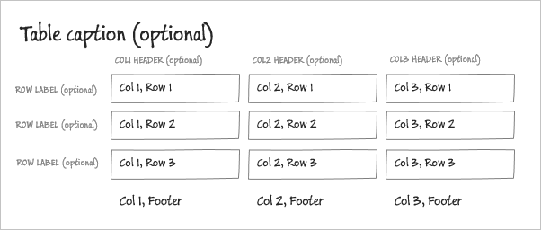

# Tabular Fields subpattern

[!include [banner](../includes/banner.md)]

This article provides information about the Tabular Fields subpattern. This subpattern is used to show information efficiently in a tabular format. 

## Usage

This subpattern is used to show information efficiently in a tabular format. The fields are arranged in a table that contains rows and columns, and that optionally contains column headers, row labels, a caption, and a footer. The Tabular Fields subpattern can be applied on the following controls:

-   TabPage control
-   Group control

## Wireframes

Structural wireframe

## Pattern changes
In previous releases of Microsoft Dynamics AX, there was no formally accepted way to model this pattern. Therefore, this pattern was modeled in many inconsistent ways that must be modified to match the current pattern. The most common way to model this pattern was to use groups for columns. However, groups are now used for the rows. The primary reason for this change was to better match the HTML/CSS constructs, and it also helps keep the tab sequence and semantics of a table.

## Model
### High-level structure

- TabularFields (Group\*)

    - CaptionGroup (Group)

        - *TableCaption (StaticText) \[Optional\]*

    - TableHeaderRow (Group)

        - *Column0Label (StaticText) \[Optional\]* – **Note:** This static text fills col0, row0 with a blank.
        - ColumnLabels (StaticText) \[1..N\] – **Note:** These are the normal column headers.

    - TableRows (Group) \[1..N\]

        - *RowLabel (StaticText) \[Optional\]*
        - RowValues ($Field) \[1..N\] OR SecondaryColumnLabel (StaticText) \[1..N\]

    - TableFooterGroup (Group)

        - *Column0Label (StaticText) \[Optional\]* – **Note:** This static text fills col0, footer with a blank.
        - *RowValues ($Field) \[0..N\]* – **Note:** All the footer fields are in view mode.

Note that the four groups in the top-level tabular fields are mandatory structural elements. However, the contents of all those groups exception the Rows (Group) are optional. Additionally, note that Tabular Fields can also be used on a TabPage control. The structure is the same as the structure that is shown here.

### Core components

Apply the Tabular Fields pattern on the top-level group or tab page. Address the pattern errors and problems.

## UX guidelines
No manual verification is required.

## Examples
Form: **LedgerJournalTransVendPaym** **(Balances)** (**Accounts payable** &gt; **Journals** &gt; **Payment journal** &gt; **Lines**) 

## Resources
### Typically used by patterns

-   [Simple List and Details](simple-list-details-form-pattern.md)
-   [Table of Contents](table-of-contents-form-pattern.md)
-   [Details Master](details-master-form-pattern.md)
-   [Details Transaction](details-transaction-form-pattern.md)

## Appendix
### Frequently asked questions

This section will have answers to frequently asked questions that are related to this guideline/pattern.

-   **Why are we changing how the tabular field layout is created?**
    -   To accomplish the layout in HTML, we must align with the way that HTML layout works. HTML layout groups by rows, not by columns.

### Open issues

-   None

[!INCLUDE[footer-include](../../../includes/footer-banner.md)]