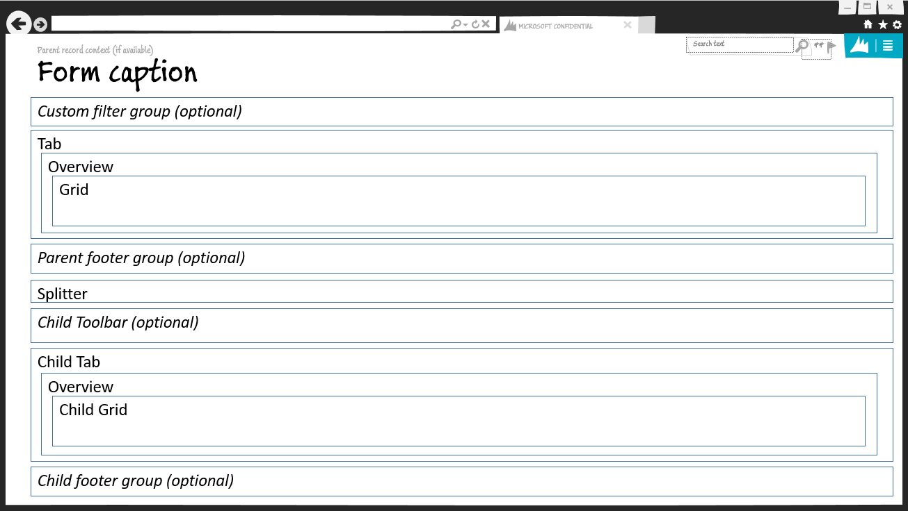
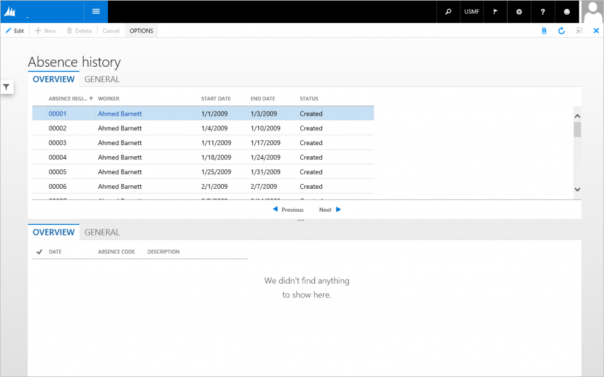
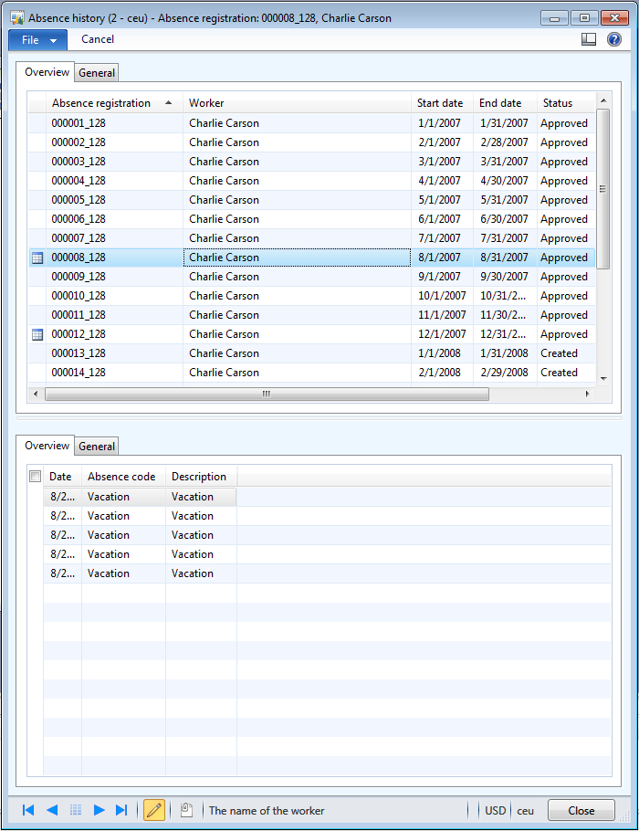

# Task Double form pattern

[!include [banner](../includes/banner.md)]

This article provides information about the Task Double form pattern. This pattern was previously used to present a parent and child entity in the same form.

## Usage

This type of form has previously been used when you wanted to present parent/child entities in the same form. This isn't a recommended pattern for new forms. No new forms should be created that use this pattern. This pattern will provide structure and stability for legacy forms, and will also provide a migration path to more modern form patterns.

## Wireframe

]

## Pattern changes
Here are the main changes to this pattern since Microsoft Dynamics AX 2012:

-   The form opens in view mode.
-   The top ActionPane strip control has been converted to a standard ActionPane.
-   The **Overview** label on the parent tab has been changed to **List**.
-   The contents of the tab container use dynamic columns for a responsive layout.
-   The label for the child tab’s list should be **&lt;x&gt; list**, where **&lt;x&gt;** is replaced by an appropriate string, based on the entity. For example, if the child entity is usually called Charges, the label for the tab should be **Charges list**.
    -   Exception: If the child entity is “lines” of some sort, the word “list” should not be added to the end.

## Model
### High-level structure

- Design

    - ActionPane (Action Pane)
    - *CustomFilter (Group) \[Optional\]*
    - ParentTab (Tab)

        - ParentList (TabPage) – **Note:** The Toolbar and List subpattern is used.
        - General (TabPage repeats 0..N)

    - *ParentFooterGroup (Group) \[Optional\]*
    - HSplitter (Group)
    - *ChildToolbar (ActionPane) \[Optional\]*
    - ChildTab (Tab)

        - ChildList (TabPage) – **Note:** The Toolbar and List subpattern is used.
        - General (TabPage, repeats 0..N)

    - *ChildFooterGroup (Group) \[Optional\]*

### Core components

1.  Apply the Task Double pattern on **Form.Design**.
2.  Address BP Warnings:
    1.  **Design.Caption** isn't empty.
    2.  The form must be referenced by at least one menu item.
    3.  **TabPage.Caption** isn't empty.
    4.  **TabPage.DataSource** isn't empty.
    5.  **StaticText.Text** isn't empty.

### Related patterns

-   [Task Single](task-single-form-pattern.md)

### Commonly used subpatterns

-   [Custom Filter Group](custom-filter-group-subpattern.md)
-   [Fields and Field Groups](fields-field-groups-subpattern.md)
-   [Toolbar and List](toolbar-list-subpattern.md)
-   [Toolbar and Fields](toolbar-fields-subpattern.md)

## UX guidelines
The verification checklist shows the steps for manually verifying that the form complies with UX guidelines. This checklist doesn't include any guidelines that will be enforced automatically through the development environment. Open the form in the browser, and walk through these steps.

**Standard form guidelines:**

-   Standard form guidelines have been consolidated into the Microsoft Dynamics AX [General Form Guidelines](general-form-guidelines.md) document.

**Task Double guidelines:**

-   The **Overview** tab is the first tab and is active when the form is opened.
-   The first tab on a child tab control should be called **Lines list** or an appropriate variation.
-   Selection in the parent grid will update content in the child grid.

## Example
Form: **HRMAbsenceTableHistory** 

## Appendix
### Frequently asked questions

This section will have answers to frequently asked questions that are related to this guideline/pattern.

### Open issues

-   None

### AX 2012 content

[!INCLUDE[footer-include](../../../includes/footer-banner.md)]
