# Task Recorder quick reference

[!include [banner](../includes/banner.md)]

This article provides a quick reference sheet that explains what each button in the Task recorder menus does.

## Main menu

<table>
<colgroup>
<col width="50%" />
<col width="50%" />
</colgroup>
<tbody>
<tr class="odd">
<td></td>
<td><h3 id="create-recording">Create recording</h3>
Choose this option to begin creating a new recording.
<h3 id="play-recording-as-guide">Play recording as guide</h3>
Choose this option to see what your recording looks like when viewed as a Help article or played as a Task guide.
<h3 id="change-recording-text">Edit recording</h3>
Choose this option if you need to change the recording’s name, description, or the text that is displayed in the steps.
<h3 id="playback-recording">Playback recording</h3>
Choose this option if you need to add or remove steps. You can also use this mode to automatically play a recording.</td>
</tr>
</tbody>
</table>

## Open and save options
<table>
<colgroup>
<col width="50%" />
<col width="50%" />
</colgroup>
<tbody>
<tr class="odd">
<td> <a href="./media/Update-recording-steps-menu.png">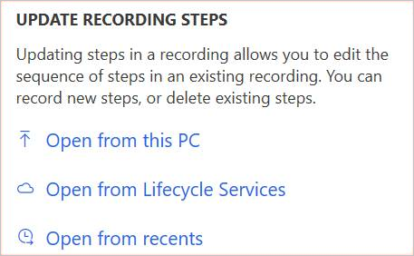</a><a href="./media/Save-menu.png">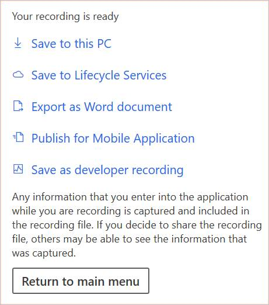</a></td>
<td><h3 id="opensave-fromto-this-pc">Open/Save from/to this PC</h3>
These options allow you to open a recording that is saved on your computer, or save a recording to your computer.
<h3 id="opensave-fromto-lcs">Open/Save from/to Lifecycle Services</h3>
This option allows you to open a recording that has been saved to a Lifecycle Services library, or save a recording to a Lifecycle Services library.
<h3 id="open-from-recents">Open from recents</h3>
This option allows you to pick from a list of Task recordings that you have recently created.
<h3 id="export-as-work-document">Export as Word document</h3>
This option allows you to download a Word document that contains the list of steps in the recording.
<h3 id="publish-for-mobile-application">Publish for Mobile Application</h3>
This option allows you to publish the task recording for a mobile application.
<h3 id="save-as-developer-recording">Save as developer recording</h3>
This option allows you to save the task recording as a developer recording.</td>
</tr>
</tbody>
</table>

## Playback controls
<table>
<colgroup>
<col width="50%" />
<col width="50%" />
</colgroup>
<tbody>
<tr class="odd">
<td><a href="./media/playback-controls-menu-Pause.png">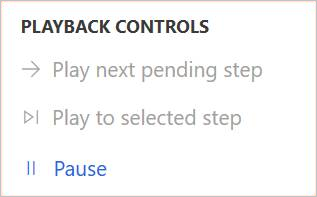</a></td>
<td><h3 id="play-next-pending-step">Play next pending step</h3>
This option will cause Task recorder to execute and record the next pending step, which is indicated by the arrow in the Steps list.
<h3 id="play-to-selected-step">Play to selected step</h3>
This option will cause Task recorder to begin playing and recording pending steps, beginning at the next pending step and pausing after playing the step that was selected in the list when this option was clicked.
<h3 id="play-all-pending-steps">Play all pending steps</h3>
This option will cause Task recorder to play and record all remaining pending steps, until there are no remaining pending steps.
<h3 id="pause">Pause</h3>
This option only appears while playback is in progress. This option allows you to pause playback manually.</td>
</tr>
</tbody>
</table>

## Step actions
<table>
<colgroup>
<col width="50%" />
<col width="50%" />
</colgroup>
<tbody>
<tr class="odd">
<td><a href="./media/Steps-menu-Delete-step.png">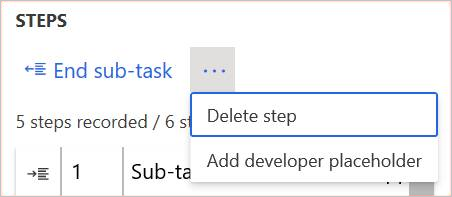</a><a href="./media/Steps-menu-Restore-step.png">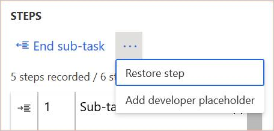</a></td>
<td><h3 id="start-sub-taskend-sub-task">Start sub-task/End sub-task</h3>
These options allow you to add special steps to the recording. These special steps are task steps, and you can use them to indicate when a sub-task begins and when it ends. These options are disabled while playback is in progress.
<h3 id="delete-steprestore-step">Delete step/Restore step</h3>
These options allow you to remove steps from the recording. If you delete a pending step, it will be skipped during playback, and it will not be recorded. If you delete a recorded step, then it will be flagged for removal and it will not be included in the recording when you save the recording. You can only restore steps that have been successfully recorded. You cannot delete a task while it is in progress.</td>
</tr>
</tbody>
</table>

## Steps list

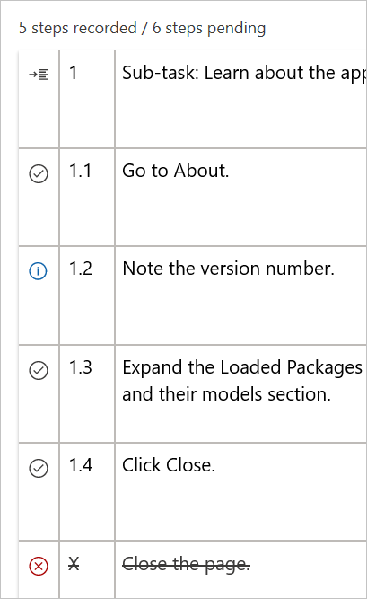

### Step counter
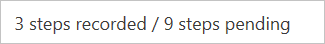

This keeps track of how many steps have been recorded. This includes steps played by using the Playback controls, as well as steps recorded by actions that you take in the client.

### Pending step
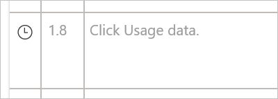

This symbol represents a step that is pending and has not been recorded yet. Pending steps can be played using the Playback controls. When a pending step is played successfully, it is recorded and the symbol will update appropriately. <em>Pending steps are not included in the recording when you save the recording.</em> You must first play the pending steps so that they are recorded. If the steps are played and recorded successfully, then they will be included when you save the recording.

### Next pending step</td>
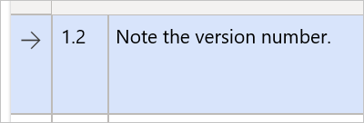

This symbol represents the next pending step. If you start playback, this is the first step that will be played.

### Queued pending step
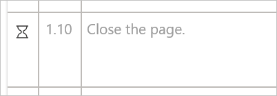

This symbol represents pending steps that are queued for playback. This symbol is updated either when playback pauses, or when the queued pending step is played.

### Recorded action step
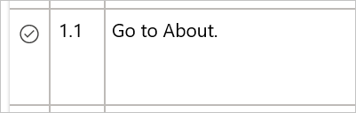

This symbol represents steps that were recorded successfully, either from being played back, or manually recorded by you.

### Recorded info step
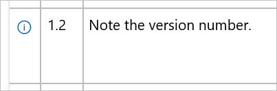

This symbol represents an info step that was played and recorded. Info steps do not result in any action being executed on the application.

### Recorded begin sub-task step
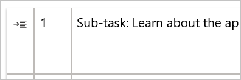

This symbol indicates the beginning of a sub-task. Sub-task steps do not result in any action being executed on the application.

### Recorded end sub-task step
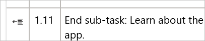

This symbol indicates the end of a sub-task. Sub-task steps do not result in any action being executed on the application.

### Deleted recorded step
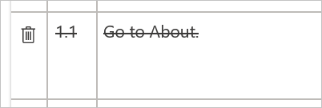

This symbol represents a successfully recorded step that you have marked for deletion. Recorded steps that are marked for deletion will not be included when you save the recording. If a step has been successfully recorded when you decide to delete it, then you have the option to restore the deleted step before you save the recording.

### Deleted pending step
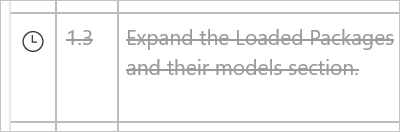

If you delete a pending step, it will retain its pending symbol until it is played. When it is played, it will be skipped. You can restore a pending step as long as it has not been played and skipped.

### Skipped step
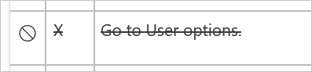

This symbol represents a step that was deleted while it was pending, and was skipped during playback. Skipped steps are not played and are not recorded. Because skipped steps are not recorded, they are not included when you save the recording. You cannot restore a skipped step.

### Error step
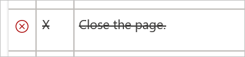

This symbol represents a step that was attempted by the playback system, but was not successful in being played. Error steps are not recorded, and are not included when you save the recording. You cannot restore an error step. Playback will automatically pause when an Error step is encountered. This gives you the opportunity to record replacement steps before continuing playback. An error step may occur for the following reasons:
<ul>
<li>The step could not play because the form or lookup needed by the step was not open.</li>
<li>The step could not play because the button or field needed by the step was disabled, not visible, or not present on the form.</li>
<li>The step could not play because the name of the form or name of the control has changed.</li>
<li>The step could not play because of a framework change to the control.</li>
</ul>

[!INCLUDE[footer-include](../../../includes/footer-banner.md)]
