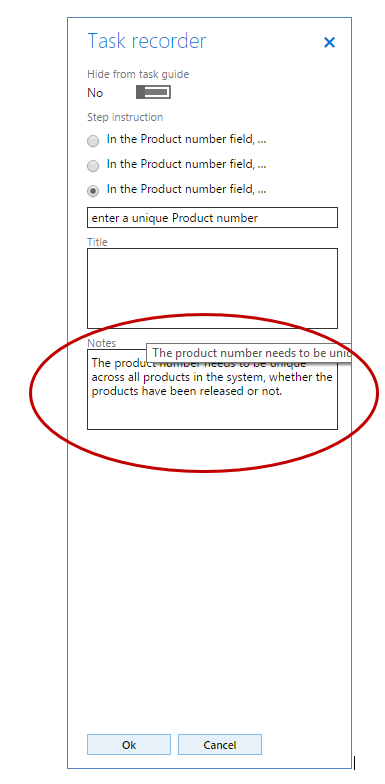

# Create documentation or training with Task Recorder

[!include [banner](../includes/banner.md)]

[!INCLUDE [PEAP](../../../includes/peap-3.md)]

This article explains what Task recorder and task guides are, how to create task recordings, and how to customize Microsoft task guides and include them in your Help.

> [!IMPORTANT]
> You can record your own task guides for Dynamics 365 Human Resources, but you won't be able to save them to a Business Process Modeler (BPM) library or open them from the Help pane at this time. You can save them locally or to a network location, and then open and replay them using Task recorder. 

## Learn about Task recorder

Task recorder is a tool that you can use to record actions that you take in the product user interface (UI). When you use Task recorder, all of the events that you perform in the UI that are executed against the server—including adding values, changing settings, removing data—are captured. The steps that you record are collectively called a *task recording*. Task recordings can be used in many ways:

-   **Task recordings can be played as task guides.** Task guides are an integral piece of the Help experience. A task guide is a controlled, guided, interactive experience through the steps of a business process. The user is instructed to complete each step by way of a pop-up prompt (or "bubble"), which will animate across the UI and point to the UI element that the user should interact with. The "bubble" also provides information about how to interact with the element, such as “Click here” or “In this field, enter a value.” A task guide runs against the user’s current data set and the data that is entered is saved in the user’s environment.
-   **Task recordings can be saved as Word documents.** This allows you to easily produce printable training guides.

You can create your own task recordings, play task recordings provided by Microsoft, or modify Microsoft-provided task recordings to reflect your configuration. For more information about Task recorder, see [Task recorder](task-recorder.md).

## Plan your task recording
Whether you’re creating a new task recording or basing your recording on a Microsoft task recording, keep the following information in mind.

-   Plan your recording like you would a video. Make all your decisions ahead of time.
-   Walk through the business process once or twice without recording it to understand the steps.
-   When you walk through the process before you record, notice where you use shortcut keys or the **Enter** key, so that you can avoid using them during the actual recording.
-   Identify the following:
    -   Do you want to group steps together into sub-tasks? Sub-tasks visually set apart sections of a process. For example, if you are creating a recording for "Creating and releasing a product," you may want to group together the steps that are required to create a product, and then group together the steps that are required to release the product. Sub-tasks also make longer processes easier to read.
    -   Do you want to add annotations, and if so, where? See "Understand the different types of annotations" below for more information.
    -   What values will you add in the various fields as you complete the steps of the business process? It is a good idea to know what you'll select or enter as you proceed so that you don't backtrack or fix mistakes as you're recording.

**Write your description and annotations ahead of time**

-   At the beginning of each task recording, there’s a description field that allows you to enter an introduction to the recording. It is a good idea to write and save the description ahead of time in a separate document so you can copy and paste it into the task recording when you are recording. That way, you can spend time refining the text when you aren't in the process of recording. Cutting and pasting the text makes the recording process go more quickly and smoothly.
-   For each step in a task recording, you can create annotations. During playback of a task guide, annotations appear in the "bubble" as notes above or below the text for the step. When viewed as text in the Help pane, annotations appear as text inline in the step. As with the description, it is a good idea to write and save your annotations in a separate document. When you’re recording the task recording, cut and paste the annotations in from that document.

**Understand the different types of annotations** All annotations are optional. Only add them when they’ll provide helpful information to the user.

-   **Title**: A title annotation will appear before the step text that task recorder automatically generates. In the task guide, the title annotation appears above the automatically generated text. Use this type of annotation to explain why the user is doing the step or to give additional context.

This is the editing pane that you see when you add an annotation as you create your recording. Enter a title annotation in the **Title** box. 

 

This is what the title annotation looks like in the "bubble" in the task guide. 

-   **Notes:** A notes annotation will appear after the step text that task recorder automatically generates. In the task guide it will only be visible if the user clicks the **Show more** link in the task guide bubble. Use this type of annotation to describe anything that a user needs to know to complete the step.

This is the editing pane that you see when you add an annotation as you create your recording. Enter a notes annotation in the **Notes** box. 

 

This is what the notes annotation looks like in the "bubble" in the task guide.

-   **Info step**: These annotations are created by right clicking on a control or anywhere on a form &lt; **Task recorder** &lt; **Add info step.** Info steps appear as a numbered step at whatever point you insert it, even though no action was recorded in the UI. You can add a form-level info step or an info step associated with a control. When an info step is associated with a form, the task guide “bubble” will appear someplace on the form, with no pointer, when the task guide is played. When an info step is associated with a control, the task guide “bubble” will point to the control when the task guide is played. In the Help pane, an info step annotation will appear as a numbered step with whatever text you entered. Use info steps to prepare the user for the next steps, to describe steps that need to be done outside of the application, or to refer to other recordings (although you cannot create hyperlinks in annotations).

**Determine how long to make your recording**

-   The user will generally either read or play the recording from start to finish, so don’t combine steps or tasks that are better done separately.
-   Try not to record a long scenario that spans multiple sub-processes. For example, “Operate in-store customer service desk” is too broad; break it up into shorter tasks such as “Accept returns” and “Add to gift card.”
-   If a task can be carried out as part of several different business processes, create a separate recording for it, and you can refer to it in the other recordings.
-   If the process involves multiple tasks that the person likely does all at once, you can keep the tasks in one recording, for example, “Set up and assign functionality profiles.”
-   If it is something someone does once (such as configuration) and then another task that they can do immediately afterward but may do repeatedly, and on its own, break them up into two task recordings.

**Decide where, in the UI, to start a recording** The page that you are on when you start recording a task recording affects which page the task guide is displayed for. For example, if you want your task recording to be listed in the Help pane when a user clicks Help on the General ledger parameters page, you must start your recording on the General ledger parameters page. **Save recordings as .axtr files** When you are done creating or editing a task recording, you are presented with several options for how you want to download, or save the recording. You can download the file as a task recording package (.axtr), download it as a raw recording file (.xml), download it as a Word document, or save the file to an LCS library. It is a good idea to always save your task recording as a task recording package file (.axtr). This will help make maintenance of the file easier if procedures or annotations need to change later. If you want to download the file as a Word document, also save it as a task recording package file.

## Create your task recording
For detailed walk-through steps, see [Task recorder resources](task-recorder.md).

## Copy and customize Microsoft's task recordings
You can download and edit Microsoft's task recordings to use them for your own Help documentation or training materials. To download a Microsoft task recording, follow these steps:

1.  Open Task recorder. Task recorder is located in the **Settings** menu.
2.  In the Task recorder pane, click **Maintain a recording.**
3.  Under **Where is the recording**, click **It is in an LCS library**.
4.  Click **Select the LCS library**.
5.  Select the Microsoft global library.
6.  In the tree, select the business process library node that the task recording is associated with.
7.  Click **OK**.
8.  Click **Start**.
9.  At this point, step through the recording, changing any steps as you go to re-record it. **Note**: If you only need to change the text of a recording, you can open the recording in **Edit a recording's annotations** mode, and then save it.
10. After the recording has played to the end, click **Stop** in the task recorder bar at the top of the screen.
11. Choose how you want to save the task recording.

## Additional resources

[Help system](../../fin-ops/get-started/help-overview.md)

[Connect the Help system](../../fin-ops/get-started/help-connect.md)

[Task Recorder](task-recorder.md)

[Create Rich Help Topics with Task Recorder (external link)](https://mbspartner.microsoft.com/AX/Videos/970)

[!INCLUDE[footer-include](../../../includes/footer-banner.md)]
