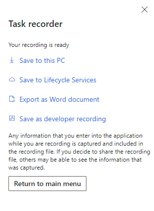

# Task recorder resources

[!include [banner](../includes/banner.md)]


[!INCLUDE [PEAP](../../../includes/peap-3.md)]

This article describes how to use Task recorder to record business processes.

## Overview

### Task recorder

Task recorder for finance and operations apps is a utility that lets users record business processes for several different use cases. Here are some examples: 
- Step-by-step guided tours of a specific business process in the application itself 
- Documentation of a business process as a Microsoft Word document that can optionally include screenshots
- Regression tests for a business process
- Automatic playback of a business process in the application

Task recorder for finance and operations apps boasts high responsiveness, a flexible extensibility application programming interface (API), and seamless integration with consumers of business process recordings. Task recorder is also integrated with the [Business process modeler (BPM)](https://bpm.lcs.dynamics.com) tool in Microsoft Dynamics Lifecycle Services (LCS), so that users can continue to organize their recordings. However, users can no longer produce business process diagrams from recordings.

Task recorder can automatically generate application regression tests from business process recordings and play back previously recorded processes. These features also include test-specific gestures that let users take full advantage of Task recorder.

### Architecture

Task recorder can record user actions in the client with exact fidelity, because every control is instrumented to notify Task recorder about the execution of user actions. The control notifies Task recorder that an event has occurred and passes all the relevant information about the corresponding user action in real time. From this information, Task recorder can capture the type of user action (for example, a button click, value entry, or navigation) and any data that is related to the user action (for example, the input data value and type, form context, or record context). Task recorder persists the information with enough detail to ensure that a playback of the recording can run the recorded actions exactly as they were performed by the user.

### Basic configuration

Task recorder is included with every finance and operations app, and lets users begin to record business processes immediately after they open the client for the first time.

> [!IMPORTANT]
> The **Task guides** tab is currently not available in Commerce or Human Resources. We are currently working to enable this functionality in a future release. Task guides in the Getting Started experience in Human Resources remain available to cover basic functionality. Procedural help is also available at [finance and operations application documentation](../../fin-ops/index.md) for both Commerce and Human Resources.

## Start a new recording
The following steps show how to use Task recorder to start a new recording.

1.  Open the product, and sign in. It's a good practice to refresh the browser before each new recording. A refresh creates a new user session and restarts Task recorder. Therefore, it provides the most stable recording experience.
2.  Select the company that you want to use while recording. If this is your first time using Task recorder, you can follow along as this tutorial creates a sample recording based on a Fleet Management business process. You will need to load the Fleet demo data to follow along:
    1.  Go to **Dashboard &gt; Fleet Management &gt; Fleet setup**.
    2.  Click **Load demo data**.
    3.  When the data is finished loading, click **Close**.
    4.  Go back to the **Dashboard** by clicking the product name in the navigation bar.

3.  Go to **Settings &gt; Task recorder**.
    
4.  The **Task recorder** pane is opened. You can click the **Close** button (**X**) in the upper-right corner to close the **Task recorder** pane before you begin a new recording. You can reopen the pane by following the previous steps.
        
5.  Click **Create recording**.
6.  Enter a name for the recording and click **Start**. Recording begins the moment **Start** is clicked. For the Fleet example in this tutorial, we'll use the name "Create a new rental reservation."

    While you're recording, you can click the **Close** button (**X**) in the upper-right corner to hide the **Task recorder** pane without stopping the recording. You can reopen the pane by clicking the **Task recorder** button that appears at the top of the page. This button appears only while recording is in progress. 

    > [!NOTE]
    > If the **[Saved views](../../fin-ops/get-started/saved-views.md)** feature is turned on, recordings should be created by using either published views or the standard view, to ensure that recordings work reliably for users. 

7.  Task recorder enters **recording mode**. The pane shows information and controls that are related to the process of recording.

Now you're ready to record a business process using Task recorder. If you're following this guide as a first-time user, you may complete the following Fleet Management scenario as an example. Otherwise, you can record your own application scenario.

### Record a Fleet Management scenario
1.  In the **Task recorder** pane, click **Start sub-task**.
2.  Set **Name** to "Create a new rental customer". Leave the **Comment** field blank.
3.  Click **OK**. The task is added to the step list. 
5.  Go to **Dashboard &gt; Fleet Management &gt; Reservation Management**.
6.  Go to **All customers** under the **Summary** tab.
7.  In the Action Pane, click **New**.
8.  Enter a first and last name for the customer.
9.  Click **Save**.
10. In the **Task recorder** pane, click **End sub-task**. 
11. Return to the **Reservation Management** workspace by clicking the browser back button twice.
12. In the **Task recorder** pane, click **Start sub-task**. Name the task "Rent a vehicle to the new customer". Click **OK**.
13. Click (**+**) **Rental** under **Summary**.
14. Under **Information**, select a "1975 Litware McKinley" as the vehicle.
15. Under **Information**, set the customer to the one just created.
16. Expand the **Discounts** section.
17. Click **Add** under **Discounts** and add the Frequent Customer discount. Click **OK**.
18. In the Action Pane, click **Start Rental**.
19. Set the return date to some date in the future.
20. Click **OK**.
21. In the **Task recorder** pane, click **End sub-task**.
22. Click **Stop** at the very top of the page.

## Recording a business process
After you've started your recording, you can perform your business process just as you would typically perform it by using the web client. As you interact with the product, new steps are added to the step list in the **Task recorder** pane. In this section, you will learn about other actions that you can perform while you're recording a business process, to take full advantage of Task recorder's capabilities. 

### Stop

**Stop** is used to end the recording session. Before you click **Stop**, you should make sure that the recording is completed, because this action isn't reversible. When you click **Stop**, you're taken to the download options screen.

[](./media/taskrecorderguide-taskrecordertoolbarstop.png)

### Start/End sub-task

**Start/End sub-task** lets a user specify the beginning and end of a set of grouped steps in a recording. Click the **Start sub-task** button to add a "Sub-task" step to the end of the current list of recorded steps. The sub-task will include all steps that you perform from this point until you click the **End sub-task** button. When you click the **End sub-task** button, an "End sub-task" step is also added to the list of recorded steps.

> [!NOTE]
> You must start a sub-task before you perform/record the steps that you want to include in the task. Then, after you've performed/recorded all the steps that you want to include in the task, you must end the sub-task.

Sub-tasks are purely an organization tool, and consumers of business process recordings can interpret the task groupings in useful ways. Because tasks can be nested inside other tasks, they provide the flexibility to organize very long and complex business processes. 

### Delete/Restore step

**Delete/Restore step** enables a user to remove steps from the recording, or undo the removal of a step from the recording. You must first select the step in the Steps list that you want to delete/restore, and then click the **Delete/Restore step** button.

> [!NOTE]
> The behavior of the **Delete** button changes when you play back a recording. In playback mode, a deleted step can't be restored after playback has passed the point where it would have run the deleted step. For example, you load a recording that contains three steps, and then you delete step 2 before you start playback. You can restore step 2 only as long as playback hasn't run step 3. After you start playback, and playback has "skipped" step 2 (because you deleted it) and run step 3, you won't be able to restore step 2. Because step 2 wasn't run and therefore wasn't recorded, it can't be retroactively added back into the recording at its previous position. 


### Add developer placeholder

**Add developer placeholder** lets the user add a placeholder step to the list of recorded steps. This placeholder step doesn't appear when the task guide is viewed, and it isn't run during maintenance of a recording. It's used only by the [Regression suite automation tool (RSAT)](../perf-test/rsat/rsat-overview.md) or the X++ code generator that enables an X++ test to be created from a task recording. When the code generator creates an X++ test, it automatically adds a method stub to the generated code. The developer can then add X++ code into this method stub. The automated code will call the validation when the generated test is run at the point in the recording where this placeholder was added.

## Enriching steps in a recording

There are various options for enriching a step in a recording. For example, you can adjust the text that is associated with a step and add information about a specific step. This section describes the step enrichment capabilities that are available. To access these options, click the **Edit step** button on a specific step of a recording. 

### Step instruction

The **Step instruction** is the primary text that is displayed for this step in the task guide. There are usually 2-3 alternative options for step instructions, and they appear in the following order when editing the annotation.

[](./media/taskrecorderguide-annotationlabels.png) 

This image shows the annotation options for changing a step.
- **Preferred value instruction** This type of instruction will direct the user to enter the same data that was used when the step was recorded. *Example*: In the First name field, enter 'John'.
- **Example value label** This type of instruction will direct the user to enter their own data, indicating that the data that was used when the step was recorded was only *Example* data. *Example*: In the First name field, enter a value.

   If users click the **See more** button on this step when they play the recording as a task guide, they will be able to see the data that was used when the step was recorded. This recorded data value will be labeled as an *Example* data value. 
   > [!NOTE]
   > Steps that are not related to fields, such as clicking buttons, opening forms, or selecting records from a lookup, do not set *Example value label* as an option when annotating.
   
- **User-supplied value label** This step instruction contains placeholder text, which the author can fill in with their own text. For steps which have an **Example value label** option, the placeholder allows substituting the text which normally specifies the data to enter. This is useful for scenarios where neither the **Preferred value label** nor the **Example value label** sufficiently express the data that should be used for this step.
  -   *Example label*: In the First name field, enter *{your example text}*.
  -   *Example label after supplying the placeholder text*: In the First name field, enter the customer's name.

  For steps which do not have an **Example value label** option, the placeholder allows substituting all of the label text. Steps associated with buttons, for example, do not have **Example value labels**, so you may replace the entire label text with your own text.
  -   *Example label before replacement*: Click Post.
  -   *Example label after replacement*: To post the order, click Post.

### Titles and notes

Titles and notes provide places for user-specified text to be associated with a step in a task guide.
- **Title** – The title lets you specify the text that appears above the step instruction for this step in the task guide. The title a good place to put text that you want users to read before they complete the action that is indicated by the step instruction.
- **Note** – You can use a note to specify text that appears in the expandable section of the pop-up for this step in the task guide. A note is a good place to put optional reading material or other information that might be useful to users, but that they aren't required to read to complete the action that is indicated by the step instruction.

### Change recorded values

Starting in version 10.0.12, you can adjust the values that are recorded in basic input controls (for example, simple text, numeric, date, and picklist fields), without having to re-record those steps. Note that lookup controls and reference groups aren't currently supported.  

### Hide from task guide

The **Hide this step** option lets the author prevent specific steps from appearing in the task guide. This option is useful for hiding steps that are required for the task recording to run in playback mode, but that should not be seen by users. Examples of these steps include copy steps, system-generated steps, and data clean-up steps. If you hide a sub-task, all the steps that are recorded inside that sub-task will also be hidden.

## Using control gestures

The basic recording capability lets a user record an end-to-end business process by using Task recorder, but without adding overhead to the process. In some circumstances, more advanced recording features can be used to create even richer business process recordings. Each of the following gestures is found under the **Task recorder** option on the shortcut menu (also known as a right-click menu or context menu) for a control and causes a step to be added to the recording. If the gesture isn't supported for a control, it won't appear on the shortcut menu for that control.

### Copy

The **Copy** gesture lets you copy the value for the current control to the Task recorder "clipboard." That value can then be used later as part of a **Paste** or **Validate** gesture. Because values from multiple controls might have to be pasted, the Task recorder clipboard maintains a list of all control values that have been copied in the recording.

### Paste

The **Paste** gesture lets you paste a value from a previous **Copy** gesture in the same recording. The Task recorder paste function works like the standard paste function that users might be familiar with, but it has an additional benefit when it's used during recordings. Because Task recorder will replay the recorded **Copy** and **Paste** commands during playback, if the copied control has a different value than it had during recording, Task recorder will paste the current value instead of the value that the copied control had during recording. This feature is useful in scenarios where the copied control has a value that can change between environments (for example, recID values or number sequences).

There is an additional benefit from using the **Copy** and **Paste** gestures when test code is generated. For any control where the value is set via the **Paste** command, Task recorder doesn't have to create a parameterized input variable for that control's value, because it's set based on another control's value. This feature can be very useful in scenarios where an entity such as a customer is created, and an identifier for that entity is frequently entered during the recording. Instead of manually re-entering the customer name or ID throughout the scenario, and causing Task recorder to generate a parameterized input variable for each entry, the user can copy the customer name or ID one time, and then repeatedly paste it. In this case, Task recorder will generate a single parameterized input variable to represent the customer name or ID. This feature can make it much easier to change the input data for a generated test.

###  Validate

The **Validate** gesture lets you insert a step that validates the value of the targeted control. This gesture always uses equality to validate the control value. *Validations aren't currently run during recording playback.* Instead, they are run only when the generated test code is run. Two kinds of validation are available:

-   **Current value validation** will capture the targeted control's value at the time of recording and use it to generate an assertion in the test code. In the list of validation options on the shortcut menu, **Current value** is always first.
-   **Reference value validation** will use the value of a previously copied control when generating an assertion in the test code. This allows creating assertions that are resilient to changes in the data, since the value is not hardcoded into the test code. In the list of validation options on the shortcut menu, **Reference value validation** follows the format \[AOT name of copied control: current copied value\].

Additional options are available in version 10.0.13 and later. Here are some examples:

- **Enabled**/**Disabled** validates that the targeted control's state is enabled (or disabled), and then uses that validation step to generate an assertion in the test code.
- **Read-only**/**Editable** validates that the targeted control's state is read-only (or editable), and then uses that validation step to generate an assertion in the test code.

### Add info step

The **Add info step** gesture lets you insert a step and supply your own text for it. This feature is useful primarily for creating task guides. An **informational step** (or **info step** for short) is a task guide step where the instruction text for the step is user-specified. Info steps are useful for describing actions that are a part of the scenario but must occur outside the client. For example, a scenario might require the user to search for item inventory or check an email for information.

You can specify where an info step should appear in the task guide. The info step can point to a control on the page, if the step is associated with the control. Alternatively, the info step can appear in the upper right of the page, if the step is external to the client, or if it's an explanation that applies to the whole page.

> [!NOTE]
> Because info steps are manually specified steps and are not automatically recorded by Task recorder when the user takes an action on a control, the info step does not have the capability to automatically progress when a user completes the step in the task guide. Because the info step is not associated with taking an action in the client, there is no action for a task guide to detect that the user has completed in order to automatically progress to the next step.

## Options after a recording is completed
After you click **Stop** to end your recording session, several options are shown so that you can save the files that are related to the completed recording. Select **Save to this PC**, and save the task recording package to your desktop. You will use this file later.

[](./media/taskrecorderguide-taskrecorderdownloadoptions.png)

### Save to this PC

One option after you finish your recording is to download the task recording package (an .axtr file) to your computer. This file can be loaded later via the **Task recorder** pane, so that the recording can be played as a task guide or edited.

### Save to Lifecycle Services (LCS) 

When you save your recording to an LCS library, it's published on the specified business process in a BPM library. If the selected LCS library is set as a Help library, you will be able to find the task guide for the recording by searching the **Help** menu. 

> [!NOTE]
> To be able to save a recording to an LCS library, the user must be in the Azure Active Directory (Azure AD) tenant that the environment was deployed from.  

### Export as Word document

The Microsoft Word document for your recording contains the recorded steps as well as any screenshots that were captured.

### Save as developer recording

The raw recording file (developer recording) is useful for developer scenarios, such as test code generation and scenarios where [RSAT](../perf-test/rsat/rsat-overview.md) is used.

## Playing back a recording 
The **playback** functionality of Task recorder can automatically run the steps of an existing recording by using the pages and values that were originally recorded. Playback mode can be used to update an existing recording if changes were made to the underlying application, and those changes altered the business process steps that are required for the scenario. It's important to remember that, in this mode, Task recorder simultaneously re-records the steps and plays them back. When the playback is completed, a new recording is produced that reflects both the steps that were run from the existing recording and any new steps that the user manually performed. Any steps that aren't run either by the user or automatically by Task recorder aren't included in this new recording. 

To play back an existing recording, follow these steps.
1. Refresh the browser tab. 
    > [!NOTE]
    > It's a good practice to refresh the browser before each new recording.
    
2. Open the **Task recorder** pane.
3. Click **Playback recording**.
4. Click **Open from this PC** to load a recording from a previously downloaded Task recorder package (.axtr file).
   -   If you're reading this guide for the first time and following along, choose the "Create a new rental reservation" file that you downloaded previously.

5. Click **Start**.

When you play back a recording, additional actions are available in the **Task recorder** pane.
### Play next pending step 

**Play next pending step** runs the next step in the recording. This action is useful because it gives you more control over the playback speed when you want to analyze the effects of a single step. This action has a side-effect that it's important to be aware of. When you click **Play next pending step**, any open lookups, drop-down dialog boxes, or Action Pane tabs might be dismissed, because this action removes focus from those elements. For these situations, we recommend that you use **Play all pending steps** instead.

### Play all pending steps

**Play all pending steps** begins sequential execution of the remaining steps in the recording, and continues until either playback is paused or all steps have been run. During playback, the **Play all pending steps** button is replaced by a **Pause** button that can be used to pause playback. If playback can't successfully run a step for any reason (for example, because it can't find a button that has been renamed), Task recorder will skip that step, and playback will automatically be paused. In this way, the user has an opportunity to replace the obsolete step by completing the new steps in the client. Task recorder will record the new steps and ignore the step that was skipped. The user can then click **Play all pending steps** to continue playback for the remaining steps. After the recording is completed, the user can download the updated recording. This recording will contain all the steps of the original recording, but will exclude any skipped steps and include any new steps.

### Play to selected step

**Play to selected step** behaves like **Play all pending steps**, but it lets you play only a subset of the steps instead of all the steps. In the list, select the step that you want playback to stop at, and then click **Play to selected step**. Task recorder will begin to run the steps in the list and will stop when it has run the step that you selected.

## Editing a recording
Although you can edit a recording through the playback functionality, there is also a mode that lets you make simple edits to a recording without having to replay the whole recording. To access this feature, click **Edit recording** after you open the **Task recorder** pane. You can use this feature to make the following edits:
- Insert steps into a recording without re-recording the whole file.
- Move steps under a sub-task without re-recording the whole file.
- Adjust the name and description of the recording.

### Insert steps without re-recording the entire file

You can add a step anywhere in a task recording without playing back or re-recording the whole file.

1.  Select the step after which you want the new step to be inserted. Make sure the step is highlighted.
 
    In order for task recorder to insert a step, you must have the correct page open. The correct page is the page on which the new step occurs. Task recorder has a mechanism that determines what the active page is, and will disable the functionality if the correct page isn't open. 

    [](./media/taskguide1.png)

    When you are on the correct page, **Insert step** becomes available.

    [](./media/taskguide2.png)

2.  Click **Insert step**.

    When you click **Insert step**, Task recorder switches to recording mode. Any action that is performed in the user interface (UI) will now be recorded and inserted into the recording as steps.
    
3.  Click **Stop**.

    Recording mode is stopped, and you can now continue to edit the recording. For example, you can repeat this process to insert steps in other places in the recording, or you can move sub-tasks as described in the next section.

4.  When you've finished editing the task recording, click **Done editing**, and then select one of the options to save or publish the recording.

### Move steps under a sub-task without re-recording the entire file

You can move steps under a sub-task without playing back or re-recording the entire file. You can also move the sub-task step or the end sub-task step if you want to group an existing block of steps.

1.  Select the step or sub-task step that you want to move. Make sure that the step is highlighted.

2.  Click **Move step after**. To access this command, you might have to select the ellipsis (**...**) button.

    [](./media/taskguide3.png)

3.  Select the step or sub-task step that you want to move the step or sub-task step after. Task recorder will move the step.

4.  To move the end sub-task step, select it, click **Move step after**, and then select the step that you want the end sub-task step to be after.

    If you want the first step in the task guide to be within a sub-task, create a sub-task step as the second step, and then move the first step into it. You can add or move as many steps or sub-tasks as needed.

5.  When you've finished editing the task recording, click **Done editing**, and then select one of the options to save or publish the recording.

### Adjust the recording name and description

You can adjust values of the **Recording name** and **Recording description** fields. If you want to see more steps in the Task recorder editing pane, you can also collapse the section that shows the recording name and description.

[](./media/taskguide4.png)

## Playing a task guide

A **task guide** is a user-focused experience that lets the user follow a guided step-by-step set of instructions to complete a business scenario by using a task recording. The user is instructed to complete each step through an animated pop-up prompt that will move across the page and point to the UI element that the user should interact with. The prompt will also tell the user how to interact with the element. For example, it might state, "Click here" or "In this field, enter data." Each step that the user is instructed to complete is based on a step that was originally recorded in the task recording. Because the task recording file contains the data that describes the step that was originally recorded, the task guide can automatically determine when the user has completed the step as expected. It then automatically moves on to the next step. 

> [!NOTE]
> One way that the task guide determines that a user has completed a step is by detecting when the value in a field has changed. Although the task guide doesn't require that a specific value be set, it does require that the field value be changed in order to determine that the step was completed. The user must change the field value, and then press the **Tab** key or click in an area outside the UI element. Only at that point does the client detect that the field value has changed, and it can then proceed to run any required application validation or business logic. Therefore, before the task guide can determine that the step was completed by the user, it relies on the client to detect that the field value has changed.

### What can a task guide allow a user to do?

When a user is completing a task guide, the client behaves in the same manner, with the same data, security, and validation rules as it does when the user is not completing a task guide. There is no difference of behavior in the client that would allow a user to take an action that they cannot otherwise take when they are not completing a task guide. When a user is completing a task guide:
-   Any data the user enters is subject to the same data validation rules as when not playing the task guide.
-   Any data the user enters may be saved, and the user may modify data according to the same restrictions and rules as when not playing the task guide.
-   Any security mechanisms the user encounters behave the same as when the user is not playing the task guide.
-   Any forms or controls the user accesses are subject to the same security and access mechanisms as when the user is not playing the task guide.

### The "On-rails" feature of task guides

By default, when a user begins a task guide, they are placed "on-rails". These "rails" prevent the user from *clicking* on elements other than the element the task guide is pointing to. When the user tries to click on something outside of the UI element that the task guide is pointing to, the task guide pop-up will animate to let the user know that they cannot progress until they complete the current step of the task guide. 

While a user is prohibited from *clicking* on other elements, the user is not prevented from tabbing through the other controls on the form, and the user is not prevented from using keyboard shortcuts. This is by design, as the "on-rails" feature is designed for and targeted at first-time users, who are expected to primarily use the mouse as they become familiar with the application. 

More advanced or experienced users can turn off the "on-rails" feature when they complete a task guide. At any point during the task guide, these users can turn off the rails by clicking the **Unlock** button that appears on the Task recorder toolbar at the top of the page. This button can also be used to restore the rails at any point during the task guide. In some situations, the task guide might automatically turn off the "on-rails" feature. When the rails are turned off, the user can click UI elements just as they do when the task guide isn't running. The "on-rails" feature might be automatically turned off in the following situations:

-   The user is being directed to go to a page by using the navigation pane or navigation search.
    -   Because the user can use either entry point, the task guide doesn't point to a specific entry point, and it doesn't prevent the user from using either entry point.
-   The task guide enters an error state (see the next section for a list of error states).
-   The task guide is showing an info step.

### Error detection

An *error state* occurs when the task guide is not able to point to the UI element that is associated with the current step because the UI element is not visible on the screen. When the task guide detects that the current step requires the user to interact with a UI element that is not visible, then the task guide pop-up will move to the upper-right side of the screen. These causes of an error state can be simplified into two categories.

#### The control is not visible on the form

*This error state usually occurs when the user has opened or closed the incorrect tab, FastTab, collapsible section, FactBox, or pop-out menu.*

Because the UI element that is needed for the current step is somewhere on the current form, but it is not visible on the screen, the task guide pop-up will simply move to the upper-right side of the screen while displaying the same instruction that informs the user of the action they need to take.

Because the task guide can't find the UI element on the screen, the user must manually determine what is causing the UI element to be hidden and then make the element visible on the screen. The task guide pop-up will automatically detect that the UI element is visible and will reposition itself so that it's pointing at the now-visible element.

#### The control is not on the form

*This error state usually occurs when the user has gone to the wrong form, either by navigating to the wrong form or by leaving the correct form.*

Because the UI element is not visible on the screen, the task guide pop-up will move to the upper-right side of the screen. In addition, when the task guide detects the user is on the wrong form, the task guide pop-up text will change to inform the user of the form they should navigate to.

In some cases, the task guide pop-up will not mention the form by name. This is because the user may need to navigate to a dynamic form. A dynamic form is a form that is not modeled, frequently known as a runtime-generated form. These sorts of forms do not have a proper name. Some examples of runtime-generated forms include simple and custom lookups. The way for a user to navigate to a lookup form is to re-open the lookup.

### Next step and Previous step

The **Next step** and **Previous step** buttons appear in the task guide pop-up and let a user manually control the flow of the task guide. When these buttons are clicked, the task guide will go to the next or previous step. The task guide doesn't verify that the user has completed a step before it goes to the next or previous step. 

The task guide **never** automatically completes any step for the user, even when the **Next step** and **Previous step** buttons are used. Use of these buttons can cause an error state if the previous or next step refers to a UI element that isn't on the current page. When the user is completing an info step, the only way to proceed is to use the **Next step** button. This action is required because an info step doesn't represent an action that was recorded on any UI element. Because no action was recorded in the task recording, the task guide doesn't have the necessary information to determine what action it should expect the user to complete.

### The See more button

When the **See more** button is clicked, the task guide pop-up expands to show additional information that is related to the step. The additional information is often optional reading material that isn't required for the user to successfully complete the step. The following information might be included:

-   An **Example** value
    -   The Example value is the value that was originally used when the task recording was created.
    -   Example values appear only for steps that use non-lookup fields. These fields include text fields, number fields, date fields, combo boxes, and check boxes.
-   A **Note**
    -   A Note may contain scenario-specific information that will help provide context to the user about the current step of the task guide.

## Taking screenshots in Task recorder

By using a **pre-release** Chromium browser extension that works for both the new (Chromium-based) Microsoft Edge browser and Google Chrome, Task recorder can take screenshots of the browser as a user records a business process. After the user completes the recording, Task recorder can use these screenshots to generate Microsoft Word documents. To turn on this functionality, follow these steps to install the pre-release Chromium extension that enables Task recorder to take screenshots during recording.

1.  Download the **FMLabTaskRecorderScreenshot** folder that contains the extension from GitHub, at <https://github.com/Microsoft/FMLab>.
2.  **On-premises deployments only:** Adjust the manifest for the extension so that it matches the following code. Replace \<hostname\> with the base URL for your environment.

    ```json
    ...
    "content_scripts": [
        {
            "matches": ["https://*.dynamics.com/*", "<hostname>"],
            "js": ["screenshot.js"]
        }
        ...
    ```

3.  **[21Vianet in China](../deployment/china-local-deployment.md) deployments only:** Adjust the manifest for the extension so that it matches the following code. Replace **.com** with **.cn**
    ```json
    ...
    "content_scripts": [
        {
            "matches": ["https://*.dynamics.cn/*"],
            "js": ["screenshot.js"]
        }
        ...
    ```
4.  **[US Government Community Cloud (GCC)](../deployment/us-gcc-deployment.md) deployments only:** Adjust the manifest for the extension so that it matches the following code. Replace **dynamics.com** with **microsoftdynamics.us**
    ```json
    ...
    "content_scripts": [
        {
            "matches": ["https://*.microsoftdynamics.us/*"],
            "js": ["screenshot.js"]
        }
        ...
    ```
4.  **Multiple deployments:** Add additional string values to the matches clause, separating them with a comma.
    ```json
    ...
    "content_scripts": [
        {
            "matches": ["https://*.dynamics.com/*", "https://*.microsoftdynamics.us/*"],
            "js": ["screenshot.js"]
        }
        ...
    ```
6.  Open the latest Microsoft Edge browser or Google Chrome.
7.  Select **Settings and more &gt; Extensions** in Microsoft Edge (or **Customize and control Google Chrome &gt; More tools &gt; Extensions** in Google Chrome).
8.  Select **Developer mode**.
9.  Click **Load unpacked extension**.
10.  Browse to the folder that contains the Task recorder extension by using the path **FMLab-master \> FMLab \> TaskRecorderScreenshot**, and then select **Select Folder**.
11.  Make sure that **Enabled** is selected so that extension is turned on.
12.  Restart the browser.

Task recorder will now take screenshots of the tab where the client is running. If needed, you can regenerate the screenshots by playing the task recording again.

Note that Task recorder **does not** capture screenshots from other tabs or of the user's desktop.

## Generating tests from a recording

After a business process recording has been completed by using Task recorder, a developer can import the raw developer recording file (.xml file) into Visual Studio to create an X++ test. The import tool generates a human-readable X++ test from the recording, and translates any control gestures, validations, or tasks into the appropriate test code. 

### Import a recorded test

1.  Open Visual Studio by using the finance and operations development tools.
2.  Go to **Dynamics 365 &gt; Addins &gt; Import task recording**.
3.  In the **Import task recording** menu, use the **Browse** button to locate a previously downloaded recording file.
4.  Optionally, choose to have the generated test code be added to the startup project. This requires that a solution containing a project is set as the startup project. This will place the generated X++ test into the same model as the project.
5.  If you're creating a new project, select the model for the project. The generated X++ test will be put in this model. For the generated test to be successfully built, the model must have references to the **TestEssentials** model.
6.  Click **Import**.

    [](./media/importnewproject_taskrecorderguide.png)

7.  In the **New Project** dialog box, provide a name for the project.
8.  After the project is created, the user can open and inspect the generated code.
9.  To run the test, build the project.
10. Go to **Test &gt; Windows &gt;Test Explorer**.

## Appendix

### Controls that are known to have incomplete support for Task recorder

-   Table
-   Filter pane, which is the filter that pops out from the left side
    -   When adding filters to the filter pane, the steps are delayed. The steps do not get recorded until the user clicks "Apply" on the Filter pane.
-   Enhanced previews
    -   No planned support for recording gestures inside of enhanced previews. While recording, enhanced previews will be disabled.
-   No extensible controls are supported out of the box, except Segmented Entry.
    -   Extensible control owners need to individually build support for Task recorder.

### Controls that can be recorded, but have limited support for the Copy/Paste/Validate gestures

-   Date/Time
    -   Doesn't support copy/pasting "Never" as a value.
-   Image
    -   No ability to copy/paste/validate an image value.
-   Filter pane
    -   Copy/Paste works, but the UI will not show the pasted data. You can proceed as if it pasted correctly.
-   Message box
    -   You cannot validate the text in the message box.

### Controls that are known to have incomplete support for being used in a task guide

- Quick Filter, which is the filter control that appears above lists
  -   Does not support displaying a "generic value" during the task guide. Currently displays the value that was used during recording.
- Filter pane, which is the filter that pops out from the left side
  -   The task guide does not point to the individual elements within the Filter pane that need to be clicked on.


[!INCLUDE[footer-include](../../../includes/footer-banner.md)]

