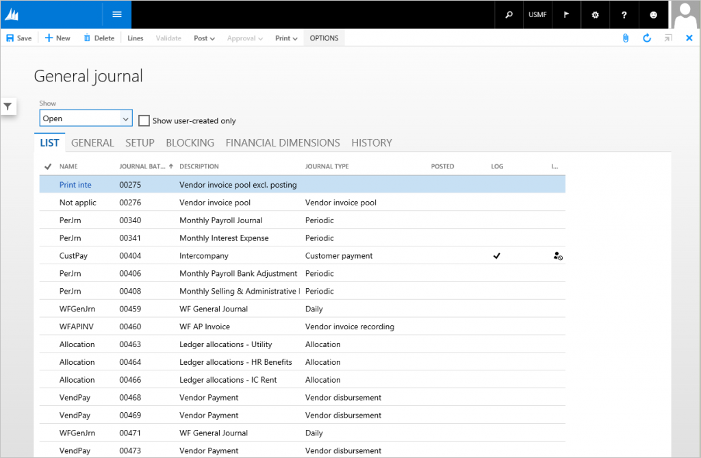
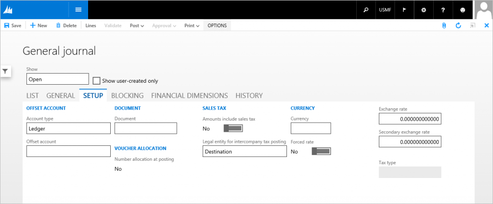

# Task Single form pattern

[!include [banner](../includes/banner.md)]

This article provides information about the Task Single form pattern. This pattern was previously used to present data that users would perceive as originating from a single data source that had multiple records.

## Usage

This type of form was used when you wanted to present data that users will perceive as originating from a single data source with multiple records. This isn't a recommended pattern for new forms. No new forms should be created that use this pattern. This pattern will provide structure and stability for legacy forms, and will also provide a migration path to more modern form patterns.

## Wireframe

## Pattern changes
Here are the main changes to this pattern since Microsoft Dynamics AX 2012:

-   The form opens in view mode.
-   Commands have been moved to the standard ActionPane from a Toolbar (ActionPane strips).
-   The **Overview** label on the first tab has been changed to **List**.
-   The content of the tab container uses dynamic columns for a responsive layout.

## Model
### High-level structure

- Design

    - ActionPane (Action Pane)
    - *CustomFilter (Group) \[Optional\]*
    - Tab (Tab)

        - Overview (TabPage)

            - Grid (Grid)
            - *RowExtension (Group) \[Optional\]*

        - General (TabPage, repeats 0..N)

    - *FooterGroup (Group) \[Optional\]*

### Core components

1.  Apply the TaskSingle pattern on **Form.Design**.
2.  Address BP Warnings:
    1.  **Design.Caption** isn't empty.
    2.  The form must be referenced by at least one menu item.
    3.  **TabPage.Caption** isn't empty.
    4.  **TabPage.DataSource** isn't empty.
    5.  **StaticText.Text** isn't empty.

### Related patterns

-   [Task Double](task-double-form-pattern.md)

### Commonly used subpatterns

-   [Custom Filter Group](custom-filter-group-subpattern.md)
-   [Fields and Field Groups](fields-field-groups-subpattern.md)
-   [Toolbar and List](toolbar-list-subpattern.md)
-   [Toolbar and Fields](toolbar-fields-subpattern.md)

## UX guidelines
The verification checklist shows you the steps for manually verifying that the form complies with UX guidelines. This checklist doesn't include any guidelines that will be enforced automatically through the development environment. Open the form in the browser, and walk through these steps. 

**Standard form guidelines:**

-   Standard form guidelines have been consolidated into the Microsoft Dynamics AX [General Form Guidelines](general-form-guidelines.md) document.

**Task Single guidelines:**

-   The **Overview** tab is the first tab and is active when the form is opened.
-   The **General** tab must be the second tab and must have the label **General**.

## Examples
Form: **LedgerJournalTable** 

 

## Appendix
### Frequently asked questions

This section will have answers to frequently asked questions that are related to this guideline/pattern.

### Open issues

-   None

### AX 2012 content

[!INCLUDE[footer-include](../../../includes/footer-banner.md)]
