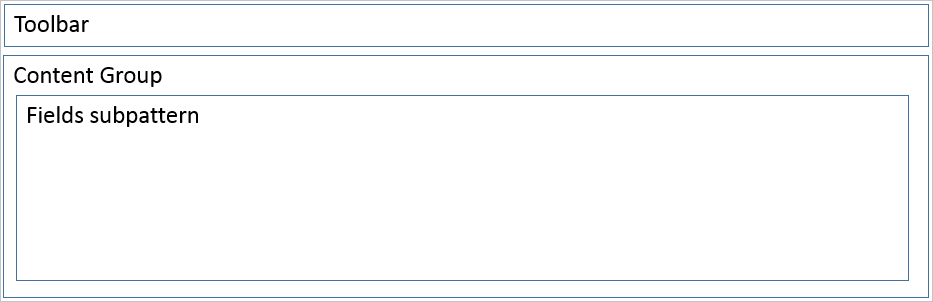
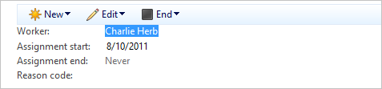

# Toolbar and Fields subpattern

[!include [banner](../includes/banner.md)]

This article provides information about the Toolbar and Fields subpattern. This container pattern is used to show actions above a subpattern of data fields. The toolbar should contain fewer than 10 actions.

## Usage

This container pattern is used to show actions above a subpattern of data fields. The toolbar should contain fewer than 10 actions.

## Wireframe

## Model
### High-level structure

- \[Container\]

    - Toolbar (ActionPane, Style=Strip)
    - ContentGroup (Group) – **Note:** A fields subpattern is used.

### Core components

-   Apply the ToolbarFields subpattern to the container control.
-   Address BP Warnings:
    -   No additional BP checks are required beyond the AX6.3 BP checks that were carried forward.

### Related patterns

-   [Toolbar and List](toolbar-list-subpattern.md)

### Commonly used subpatterns

-   [Fields and Field Groups](fields-field-groups-subpattern.md)
-   [Tabular Fields](tabular-fields-subpattern.md)
-   [Dimension Expression Builder](../financial/dimension-expression-builder-subpattern.md)

## UX guidelines
The verification checklist shows the steps for manually verifying that the form complies with UX guidelines. This checklist doesn't include any guidelines that will be enforced automatically through the development environment. Open the form in the browser, and walk through these steps. 

**Standard form guidelines:**

-   Standard form guidelines have been consolidated into the [General Form Guidelines](general-form-guidelines.md) document.

**Toolbar** **guidelines:**

-   Toolbar guidelines have been consolidated into the Dynamics AX [General Form Guidelines](general-form-guidelines.md) document.

## Examples
### Toolbar and Fields

Form: **HcmPosition** **(WorkerAssignmentTabPage)** 

## Resources
### Typically used by patterns

-   [Simple List and Details](simple-list-details-form-pattern.md)
-   [Table of Contents](table-of-contents-form-pattern.md)
-   [Details Master](details-master-form-pattern.md)
-   [Details Transaction](details-transaction-form-pattern.md)

## Appendix
### Frequently asked questions

This section will have answers to frequently asked questions that are related to this guideline/pattern.

### Open issues

-   **Should the ShowMoreLess group be part of the pattern, or should it be its own subpattern?**
    -   We will treat the **ShowMoreLess** group as a custom container pattern until there is enough demand to justify the addition of a new pattern.

### Microsoft Dynamics AX 2012 content

**HcmPosition** 

[!INCLUDE[footer-include](../../../includes/footer-banner.md)]
