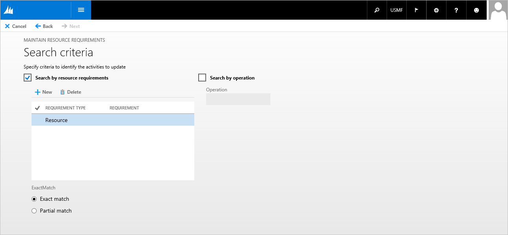

# Wizard form pattern

[!include [banner](../includes/banner.md)]

This article provides information about the Wizard form pattern. A wizard is a special form of user assistance that takes the user through a task by using an ordered series of tab pages.

## Usage

A wizard is a special form of user assistance that takes the user through a task by using an ordered series of tab pages. Wizards are especially useful for complex or infrequent tasks that the user might have difficulty learning or doing, or for tedious, frequently performed tasks.

## Wireframe

## Pattern changes
Here are the main changes to this pattern since Microsoft Dynamics AX 2012:

-   The secondary instruction for a wizard step was previously defined in the Help Text property of that step’s Tab Page. This instruction will now be modeled on the Tab Page as a Static Text control.

## Model
### High-level structure

- Design (Style=Wizard; Caption=&lt;wizard title&gt;)

    - WizardContent (Tab)

        - WizardContentPage (TabPage) *\[repeats 1..N times, can be named anything; Caption set to page title\]*

            - MainInstruction (StaticText)
            - Body (Group)

### Core components

1.  Apply the Wizard pattern on **Form.Design**.
2.  Address BP Warnings:
    1.  **Design.Caption** isn't empty.
    2.  The form must be referenced by at least one menu item.
    3.  **TabPage.Caption** isn't empty (for all wizard content pages).
    4.  **MainInstruction.Text** isn't empty (for all wizard content pages).

### Commonly used subpatterns

-   [Fields and Field Groups](fields-field-groups-subpattern.md)
-   [Toolbar and List](toolbar-list-subpattern.md)
-   [Toolbar and Fields](toolbar-fields-subpattern.md)
-   [List Panel](list-panel-subpattern.md)

## UX guidelines
The verification checklist shows the steps for manually verifying that the form complies with UX guidelines. This checklist doesn't include any guidelines that will be enforced automatically through the development environment. Open the form in the browser, and walk through these steps. 

**Standard form guidelines:**

-   Standard form guidelines have been consolidated into the Microsoft Dynamics AX [General Form Guidelines](general-form-guidelines.md) document.

**Wizard** **guidelines:**

-   Each tab page should have a title.
-   Each tab page should have a main instruction.
-   Content should be subdivided into logical groups per page.
-   A wizard should have **&lt;Next&gt;** and **&lt;Previous&gt;** buttons on the appropriate pages.
-   The user should also be able to cancel the wizard, and cancellation should return to the state that existed before the wizard was started.
-   Only one question should be asked per wizard page (tab page).
-   When a set of choices is presented to the user, radio buttons should be used to make the alternatives clear, even if a check box or combo box is otherwise acceptable.
-   Wizard forms must **not** have these elements:
    -   FactBoxes
    -   FastTabs

## Examples
Form: **WrkCtrBulkResReqEditWizard** 

## Appendix
### Frequently asked questions

This section will have answers to frequently asked questions that are related to this guideline/pattern.

### Open issues

-   None

### AX 2012 content

#### AX 2012 links

-   [MSDN Wizards in Microsoft Dynamics AX \[AX 2012\]](/dynamicsax-2012/developer/wizards-in-microsoft-dynamics-ax)
-   [MSDN Guidelines for Wizard Development \[AX 2012\]](/dynamicsax-2012/developer/guidelines-for-wizard-development)

#### AX 2012 example

[!INCLUDE[footer-include](../../../includes/footer-banner.md)]
