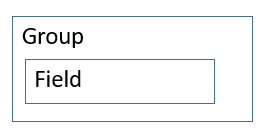
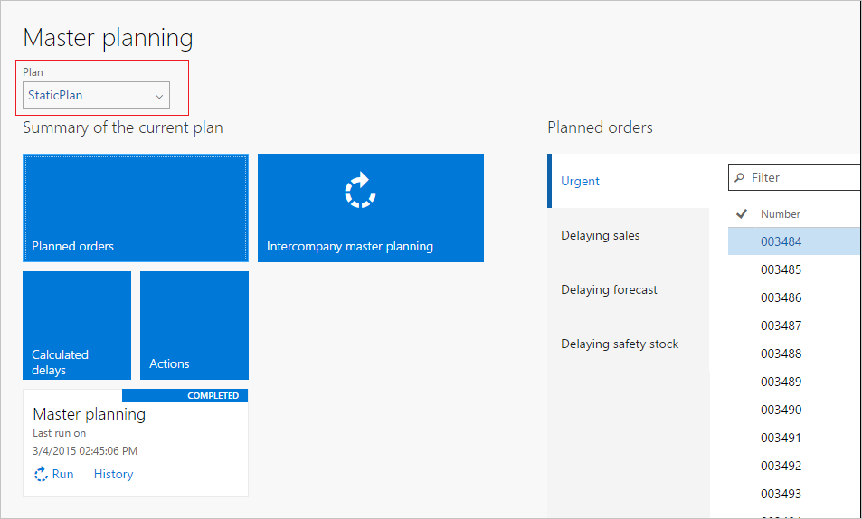

# Workspace Page Filter Group subpattern

[!include [banner](../includes/banner.md)]

This article provides information about the Workspace Page Filter Group subpattern. This subpattern is used as part of the Operational Workspace pattern when a workspace must expose a single workspace-wide filter on the form.

## Usage

The Workspace Page Filter Group subpattern is used as part of the Operational Workspace pattern, specifically when a workspace must expose a single workspace-wide filter on the form.

## Wireframe

## Pattern changes for Microsoft Dynamics AX
This pattern didn't exist in Microsoft Dynamics AX 2012.

## Model
### High-level structure

- Group

    - Field ($Field)

### Core components

Apply Workspace Page Filter Group to the appropriate group in an (operational) workspace.

### Related container patterns

-   [Custom Filter Group](custom-filter-group-subpattern.md)
-   [Operational workspace](workspace-form-pattern.md)

## UX guidelines
The verification checklist shows the steps for manually verifying that the form complies with UX guidelines. This checklist doesn't include any guidelines that will be enforced automatically through the development environment. Open the form in the browser, and walk through these steps.

-   The filter field should have a drop-down that contains the list of available values.
-   The expectation is that the filter field will be modified multiple times per day by the target user. If the filter field is modified less often or is primarily static, it should be put in a configuration dialog.
-   If more filter fields are needed, they should be put in a configuration dialog (up to five filter fields).

## Examples
Form: **ReqCreatePlanWorkspace** (**All workspaces** &gt; **Master Planning**) 

## Appendix
### Frequently asked questions

This section will have answers to frequently asked questions that are related to this guideline/pattern.

### Open issues

None

[!INCLUDE[footer-include](../../../includes/footer-banner.md)]
