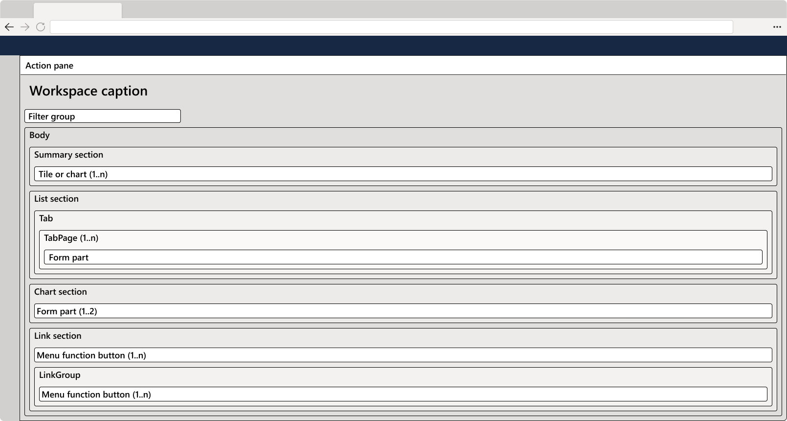
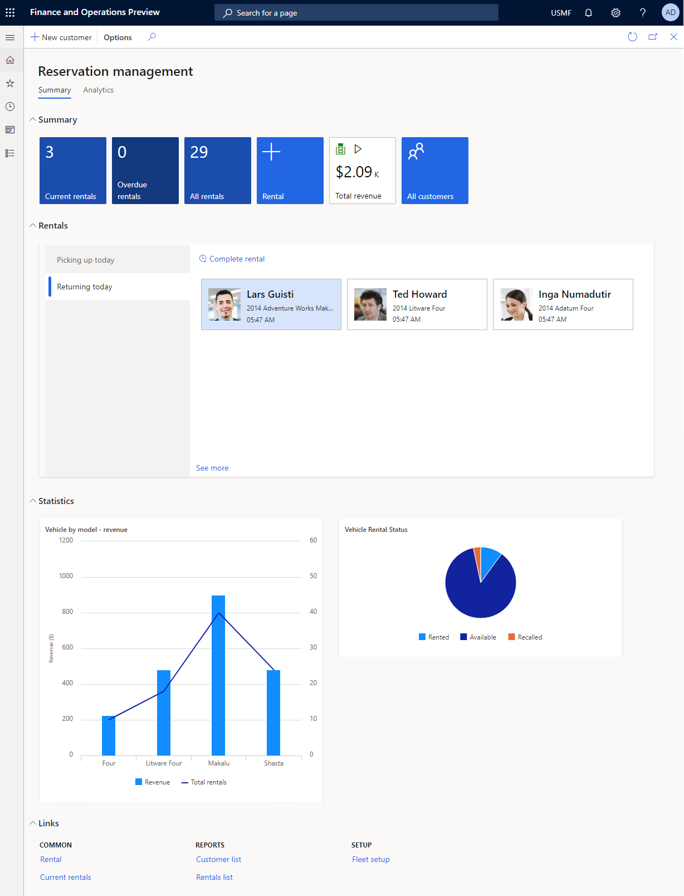
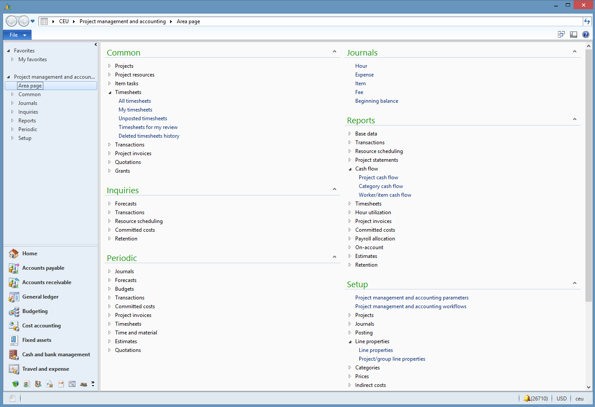

# Workspace form pattern

[!include [banner](../includes/banner.md)]

This article discusses workspace form patterns. Workspaces are the primary way that users navigate to tasks and specific pages. A workspace should be created for every significant business activity that is supported.  

## Usage

Workspaces are intended to be the primary way that users navigate to tasks and specific pages. A workspace should be created for every significant business "activity" that you want to support. An "activity" is less granular than a task but more granular than a legacy "area page." A workspace is intended to provide a one-page overview of the activity and to help users understand the current status, upcoming workload, and performance of the process or user. Users should be able to start the most typical tasks for the activity directly from the workspace. If possible, users should also be able to complete tasks directly in the workspace, based on the overview that is surfaced on the page. Currently, there are three workspace patterns:

- **Operational workspace** – This pattern is the standard pattern that is currently used for workspace development. Because of the set of components that it permits, this pattern has superior performance over the deprecated "workspace" pattern. For this reason, and to ensure visual and behavioral consistency with the other workspaces in the system, we recommend that you use this pattern. As of version 10.0.25, this pattern has been updated so that it no longer uses panorama controls and no longer scrolls horizontally. Forms that use this pattern now scroll vertically and use restyled FastTabs for the content sections.  

    - **Operational workspace w/Tabs** – This variant of the **Operational workspace** pattern is available as of version 10.0.25. It uses standard tabs at the highest level to organize the workspace into different sections. Each standard tab can include a standard Operational workspace layout, a links section, or more custom content, such as embedded Power BI reports.  

- (Deprecated) **Tabbed workspace** – This pattern was initially created to facilitate embedded Power BI reports and a more vertical orientation of workspaces. It's now deprecated and should be replaced by the **Operational workspace w/Tabs** pattern wherever possible.
- (Obsolete) **Workspace** – This pattern is mentioned only for the sake of completeness and can't be used after version 10.0.25. We recommend that any remaining uses of this pattern be migrated to one of the other patterns.

The rest of this article will focus on the **Operational workspace** patterns.

## Wireframe

### Operational workspace

## Pattern changes for finance and operations apps
The Microsoft Dynamics AX 2012 Role Center has been replaced by multiple activity-focused workspaces.

## Model

### Operational workspace – High-level structure

- Design

    - *Action pane (ActionPane) \[Optional\]*
    - *Workspace page filter group (Group) \[Optional\]* – This must use the [Workspace Page Filter Group](workspace-filter-group-subpattern.md) subpattern.
    - FastTabs (Tab)

        - Section summary tiles (TabPage) – This must use the [Section Tiles](section-tiles-subpattern.md) subpattern.
        - Section tabbed list (TabPage) – This must use the [Section Tabbed List](section-tabbed-list-subpattern.md) subpattern.
        - *Section charts (TabPage) \[Optional\]* – This must use the [Section Stacked Chart](section-stacked-chart-subpattern.md) subpattern.
        - *Section PowerBI (TabPage) \[Optional\]* – This must use the [Section PowerBI](section-powerbi-subpattern.md) subpattern.
        - Section related links (TabPage) – This must use the [Section Related Links](section-related-links-subpattern.md) subpattern.

### Operational workspace w/Tabs – High-level structure

- Design

    - *Action pane (ActionPane) \[Optional\]*
    - *Workspace page filter group (Group) \[Optional\]* – This must use the [Workspace Page Filter Group](workspace-filter-group-subpattern.md) subpattern.
    - StandardTab (Tab)
        
        - Operational workspace content
        - Other content (0..N) 

## Core components

-   Apply the appropriate Workspace pattern on **Form.Design**.
-   Address BP Warnings:
    -   **Form** must be referenced by at least one menu item.
    -   **TabPage.Caption** isn't empty (for all content sections).

## Commonly used subpatterns

- [Workspace Page Filter Group ](workspace-filter-group-subpattern.md)
- [Section Tiles](section-tiles-subpattern.md)
- [Section Tabbed List ](section-tabbed-list-subpattern.md)
- [Section Stacked Chart](section-stacked-chart-subpattern.md)
- [Section PowerBI](section-powerbi-subpattern.md)
- [Section Related Links](section-related-links-subpattern.md)

## Related patterns

- [Form Part Section List](section-list-form-pattern.md)
- [Section Chart](section-chart-form-pattern.md)

## UX guidelines
The verification checklist shows the steps for manually verifying that the form complies with UX guidelines. This checklist doesn't include any guidelines that will be enforced automatically through the development environment. Open the form in the browser, and walk through these steps.

-   Standard form guidelines
    -   Standard form guidelines have been consolidated into the [General Form Guidelines](general-form-guidelines.md) document.
-   Workspace form guidelines
    -   Use a noun phase for the page title, and avoid general words. The page title should not duplicate the title of an area page.
    -   The page title should begin with the noun that users would have in mind.
    -   All sections must have a title.
    -   A section typically spans the width of two to four standard tiles.
    -   Any section that uses a FormPartControl to display content should have **HeightMode** set to **SizeToAvailable** on the FormPartControl.
-   Actions
    -   Include only frequently used commands.
    -   Actions on the Action Pane should be related to the whole workspace (not a specific section of it).
        -   **Exception:** A single "New" action can be put as a tile in the **Summary** section if it's very frequently used.
    -   Group variations of the same command on drop-down menus.
        -   **Examples:** New sales quote, New sales order, New return order
-   Filters
    -   Zero to five filter fields are allowed on a workspace.
        -   Only a single field can be put under the page title
        -   The remaining filters must be in a workspace configuration dialog.

## Example

### Operational workspace

Form: **FMClerkWorkspace** 

## Migration of workspaces to be vertical
As of version 10.0.25, the workspace form patterns and related subpatterns have been adjusted so that content sections are stacked vertically and are collapsible. The out-of-box workspaces were migrated to the latest visuals. However, for other workspaces, you must follow the steps in this section to change the orientation to vertical and maintain visual consistency with the rest of the application.

### Mass update forms to follow the latest pattern
For forms that follow the **Operational workspace** form pattern and its related subpatterns, the fastest way to migrate your workspaces and associated subforms is to follow these two steps.

1. Run the BP fixer tool from the command line to ensure that all forms in the targeted model/module are using the latest pattern version.

    `c:\AOSService\PackagesLocalDirectory\bin\xppbp.exe -m=<metadataPath> -mu=<moduleName> -me=<modelName> -rules=BPUpgradeMetadataFormPatternVersionNotActive -x=<logFilePath> form:* -packagesRoot=<packagePath> -runfixers`

    Here is an example of the command for the Application Suite model.

    `c:\AOSService\PackagesLocalDirectory\bin\xppbp.exe -m=<metadataPath> -mu=ApplicationSuite -me=Foundation -rules=BPUpgradeMetadataFormPatternVersionNotActive -x=c:\users\<user>\downloads\bplog.txt form:* -packagesRoot=c:\AOSService\PackagesLocalDirectory -runfixers`

    > [!NOTE]
    > If you must run this command on multiple models, consider writing a Windows PowerShell script to iterate over a list of your models/modules.

2. After the BP fixer tool has finished running, a small number of properties must currently be set manually.

    - For any **Group** control in the link sections of the workspace, set the **FrameOptionButton** property to **None** to suppress the ability to collapse the section. This setting also removes the visual line under that section.
    - For any **FormPartControl** control in the list sections of the workspace, set the **Width mode** property to **SizeToAvailable**. This setting enables the subform to span the full width of the page.

3. Perform a [fit and finish review](#fit-and-finish-reviews) of the workspace to optimize it for a vertical orientation.

### Manually update a form 
If you have workspaces that don't use a pattern or that use other workspace patterns, you must manually migrate them so that they are vertical in orientation. You can also use this manual approach if you have a small number of workspaces that follow the **Operational workspace** pattern.

To manually migrate a workspace, follow these steps.

1. If a form is using the deprecated **Workspace** pattern, remove this pattern, and apply the **Operational workspace** pattern instead. Because the **Operational workspace** pattern uses a different set of subpatterns, you must remove the current subpatterns and replace them with their counterparts. (For example, replace the **HubTiles** subpattern with **SectionTiles** and the **HubPartLinks** subpattern with **SectionRelatedLinks**.) If a move to the **Operational workspace** pattern isn't possible, you might have to use a custom pattern.
2. Ensure that all workspace-related patterns are up to date. This step applies both to the form pattern and subpatterns on the workspace form itself and also to any forms that are referenced by Form Part controls on the workspace form. You should also consider migrating any subforms that use the **HubPartGrid** pattern, so that they use the **FormPartSectionList** pattern instead. To ensure that a pattern or subpattern is using the latest version, remove the pattern from the container, and then reapply it.
3. For forms that don't follow the **Operational workspace** pattern, make the following manual metadata adjustments to any tab control where the **Style** property is set to **Panorama** on the workspace form.

    - Adjust the **Style** property to **FastTabs**.
    - Set the **ExtendedStyle** property to **tab_simpleFastTab**. This setting will give the correct visual styling and hide any summary fields. Note that this extended style can be used only on forms where the **Style** property is set to **Workspace**.
    - For each child tab page, adjust the setting of the **FastTabExpanded** property to **Yes**.
 
4. Make the same metadata adjustments that are noted in step 2 in the [Mass update forms to follow the latest pattern](#mass-update-forms-to-follow-the-latest-pattern) section.
5. If you have tile or link sections that aren't using the prescribed patterns, you night have to make additional metadata adjustments to simulate the changes in those patterns.

### Update form extensions
Any form extension that adds content to a workspace might also require minor adjustments. If the base workspace has been moved to a newer version of a pattern, the controls that were added to the related form extensions won't automatically get the metadata changes that are set by the new version of the pattern. If compilation errors occur for this reason, just open the form extension, and save it. Additionally, if your form extension adds new lists to the workspace via form parts, or if it adds groups of links in the links section of the workspace, you must manually adjust the metadata properties in the form extension as described in step 2 in the [Mass update forms to follow the latest pattern](#mass-update-forms-to-follow-the-latest-pattern) section.

### Fit and finish reviews
After you've completed the metadata migration to a vertical workspace, you will want to do a fit and finish review of the workspace to optimize it for a vertical orientation. Here are the primary areas of focus:

- **Tiles** – In the new workspace layout, tiles are laid out horizontally from left to right and will wrap automatically when there isn't enough space for another tile. This layout means that a mixture of tiles (or other elements) of various sizes might result in less than ideal visuals. Therefore, we recommend that all your tiles have the same height. Ideally, they all should be the same size.
    -  Starting in version 10.0.26, the **Allow users to select and change tile sizes** feature enables users to modify the size of non-KPI tiles to one of four available sizes via personalization. Users adding new tiles to a workspace will also be able to choose the desired tile size from the **Configure tile** dialog.    
- **Simple lists** – Because list grids don't use the full width of the page, they aren't ideal for a vertical layout. When list grids appear by themselves in the list section, you should consider switching them to either a tabular grid (in which case you might have to add more columns to the grid) or a card list (which can be laid out horizontally and make more optimal use of the page space).
- **Card lists** – Card lists can be adjusted so that they flow horizontally and make better use of the page space in a vertical layout. To change a card list so that it flows horizontally and wraps to a new line as required, make the following adjustments to the form that includes the card list:

    1. Opt the form out of the new grid control, because only card lists that use the legacy grid support a horizontal flow. This opt-out will apply to all grids on the form. However, because most lists in a workspace are on a dedicated form part, the opt-out will typically affect only the desired card list. For detailed instructions, see [Opting out individual pages from using the new grid](../../fin-ops/get-started/grid-capabilities.md#developer-opting-out-individual-pages-from-using-the-new-grid).
    2. For the Grid control control, ensure that **Style=List**, **ExtendedStyle=cardList**, **VisibleColumnsMode=Fixed**, and **VisibleColumns=0**. Note that you might have to temporarily change the grid style to **Auto** to change the settings for the visible column properties.

## Frequently asked questions

This section will have answers to frequently asked questions that are related to this guideline/pattern.

## Open issues

-   None

## AX 2012 content

### AX 2012 links

-   [MSDN Role Center Page Reference \[AX 2012\]](/dynamicsax-2012/developer/role-center-page-reference)
-   [MSDN Role Center User Experience Guidelines \[AX 2012\]](/dynamicsax-2012/developer/role-center-user-experience-guidelines)

### AX 2012 example

[!INCLUDE[footer-include](../../../includes/footer-banner.md)]

