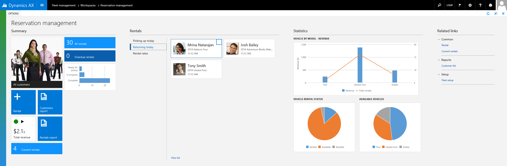

---
# required metadata

title: Workspace form pattern
description: This topic discusses workspace form patterns. Workspaces are the primary way that users navigate to tasks and specific pages.
author: jasongre
ms.date: 05/23/2017
ms.topic: article
ms.prod: 
ms.technology: 

# optional metadata

# ms.search.form: 
# ROBOTS: 
audience: Developer
# ms.devlang: 
ms.reviewer: tfehr
# ms.tgt_pltfrm: 
ms.custom: 29151
ms.assetid: 4ca77c08-1c8f-4b0c-af55-ca89a7e8982b
ms.search.region: Global
# ms.search.industry: 
ms.author: jasongre
ms.search.validFrom: 2016-02-28
ms.dyn365.ops.version: AX 7.0.0

---

# Workspace form pattern

[!include [banner](../includes/banner.md)]

This topic discusses workspace form patterns. Workspaces are the primary way that users navigate to tasks and specific pages. A workspace should be created for every significant business activity that is supported.  

## Usage

Workspaces are meant to be the primary way that users navigate to tasks and specific pages. A workspace should be created for every significant business “activity” that you want to support. An “activity” is less granular than a task and more granular than a legacy “area page.” A workspace is intended to provide a one-page overview of the activity and to help users understand the current status, upcoming workload, and performance of the process or user. Users should be able to start the most typical tasks for the activity directly from the workspace. If possible, users should also be able to complete tasks directly in the workspace based on the overview surfaced on the page. Currently, there are three workspace patterns:

-   **Operational workspace**: This is the standard pattern currently used for workspace development. Because of the set of components permitted by it, this pattern has superior performance over the deprecated "workspace" pattern. For this reason and to ensure visual and behavioral consistency with the other workspaces in the system, we recommend that you use this pattern. Starting in 10.0.25, this pattern has been updated to no longer utilize panorama controls and be horizontally scrolling; forms using this pattern now scroll vertically and utilize restyled fast tabs for the content sections.  
    -   **Operational workspace w/Tabs**: This variant of the Operational workspace pattern is available starting with version 10.0.25 and uses standard tabs at the highest level for organizing the workspace into different sections. Within each standard tab can be a standard Operational workspace layout, a links section, or more custom content like embedded Power BI reports.  
-   (Deprecated) **Tabbed workspace**: This pattern was initially created as an early to facilitate embedded Power BI reports and a more vertical orientation of workspaces. This pattern is now deprecated and should be replaced by the Operational workspace w/Tabs pattern where possible.
-   (Obsolete) **Workspace**: This pattern is only mentioned for the sake of completeness and cannot be used after version 10.0.25. It is recommended that any remaining usages of this pattern be migrated to one of the other patterns.

The rest of this topic will focus on the Operational workspace patterns.

## Wireframe

### Operational workspace

[](./media/verticalOperationalWorkspace.png)

## Pattern changes for Finance and Operations
The Microsoft Dynamics AX 2012 Role Center has been replaced by multiple activity-focused workspaces.

## Model

### Operational workspace – High-level structure

- Design

    - *Action pane (ActionPane) \[Optional\]*
    - *Workspace page filter group (Group) \[Optional\]* – This must use the [Workspace Page Filter Group](workspace-filter-group-subpattern.md) subpattern.
    - FastTabs (Tab)

        - Section summary tiles (TabPage) – This must use the [Section Tiles](section-tiles-subpattern.md) subpattern.
        - Section tabbed list (TabPage) – This must use the [Section Tabbed List](section-tabbed-list-subpattern.md) subpattern.
        - *Section charts (TabPage) \[Optional\]* – This must use the [Section Stacked Chart](section-stacked-chart-subpattern.md) subpattern.
        - *Section PowerBI (TabPage) \[Optional\]* – This must use the [Section PowerBI](section-powerbi-subpattern.md) subpattern.
        - Section related links (TabPage) – This must use the [Section Related Links](section-related-links-subpattern.md) subpattern.

### Operational workspace w/Tabs – High-level structure

- Design

    - *Action pane (ActionPane) \[Optional\]*
    - *Workspace page filter group (Group) \[Optional\]* – This must use the [Workspace Page Filter Group](workspace-filter-group-subpattern.md) subpattern.
    - StandardTab (Tab)
        
        - Operatonal workspace content
        - Other content (0..N) 

## Core components

-   Apply the appropriate Workspace pattern on **Form.Design**.
-   Address BP Warnings:
    -   **Form** must be referenced by at least one menu item.
    -   **TabPage.Caption** isn't empty (for all content sections).

## Commonly used subpatterns

- [Workspace Page Filter Group ](workspace-filter-group-subpattern.md)
- [Section Tiles](section-tiles-subpattern.md)
- [Section Tabbed List ](section-tabbed-list-subpattern.md)
- [Section Stacked Chart](section-stacked-chart-subpattern.md)
- [Section PowerBI](section-powerbi-subpattern.md)
- [Section Related Links](section-related-links-subpattern.md)

## Related patterns

- [Form Part Section List](section-list-form-pattern.md)
- [Section Chart](section-chart-form-pattern.md)

## UX guidelines
The verification checklist shows the steps for manually verifying that the form complies with UX guidelines. This checklist doesn't include any guidelines that will be enforced automatically through the development environment. Open the form in the browser, and walk through these steps.

-   Standard form guidelines
    -   Standard form guidelines have been consolidated into the [General Form Guidelines](general-form-guidelines.md) document.
-   Workspace form guidelines
    -   Use a noun phase for the page title, and avoid general words. The page title should not duplicate the title of an area page.
    -   The page title should begin with the noun that users would have in mind.
    -   All sections must have a title.
    -   A section typically spans the width of two to four standard tiles.
    -   Any section that uses a FormPartControl to display content should have **HeightMode** set to **SizeToAvailable** on the FormPartControl.
-   Actions
    -   Include only frequently used commands.
    -   Actions on the Action Pane should be related to the whole workspace (not a specific section of it).
        -   **Exception:** A single "New" action can be put as a tile in the **Summary** section if it's very frequently used.
    -   Group variations of the same command on drop-down menus.
        -   **Examples:** New sales quote, New sales order, New return order
-   Filters
    -   Zero to five filter fields are allowed on a workspace.
        -   Only a single field can be put under the page title
        -   The remaining filters must be in a workspace configuration dialog.

## Example

### Operational workspace

Form: **FMClerkWorkspace** 

[](./media/workspace3.png)

## Migration of workspaces to be vertical 
Starting with version 10.0.25, the workspace form patterns and related subpatterns have been adjusted so that content sections stack vertically and are collapsible. The out-of-the-box workspaces were migrated to the latest visuals; however, other workspaces will need to follow these steps to change to a vertical orientation and maintain visual consistency with the rest of the application.  

### Mass updating forms to follow the latest pattern
For forms that are following the **Operational workspace** form pattern and its related subpatterns, the fastest way to migrate your workspaces and associated subforms is to perform the following two steps: 

1.  Run the BP fixer tool from the command line to ensure all forms in the targeted model/module are on the latest pattern version.  

    ```c:\AOSService\PackagesLocalDirectory\bin\xppbp.exe -m=<metadataPath> -mu=<moduleName> -me=<modelName> -rules=BPUpgradeMetadataFormPatternVersionNotActive -x=<logFilePath> form:* -packagesRoot=<packagePath> -runfixers```

    As an example, for the Application Suite model, the command would be similar to this: 

    ```c:\AOSService\PackagesLocalDirectory\bin\xppbp.exe -m=<metadataPath> -mu=ApplicationSuite -me=Foundation -rules=BPUpgradeMetadataFormPatternVersionNotActive -x=c:\users\<user>\downloads\bplog.txt form:* -packagesRoot=c:\AOSService\PackagesLocalDirectory -runfixers```

    > [!NOTE]
    > If you need to run this on multiple models, you may consider writing a PowerShell script to iterate over a list of your models/modules

2.  After the BP fixer tool completes, there are a small number of properties that currently need to be set manually. 
    -  For any **Group** control in the link section(s) of the workspace, set the **FrameOptionButton** property to **Hide** to suppress the ability to collapse the section. This will also remove the visual line under that section. 
    -  For any **FormPartControl** control in the list section(s) of the workspace, set the **Width mode** property to **SizeToAvailable**. This will allow the subform to span the full width of the page.  

3.  Perform a [fit and finish review](#fit-and-finish-reviews) of the workspace to optimize it for a vertical orientation

### Manually updating a form 
If you have workspaces that don't use a pattern or they utilize other workspace patterns, you will need manually migrate these workspaces to be vertical in nature. You can also choose this manual option if you have a small number of workspaces that follow the Operational workspace pattern.  

To manually migrate a workspace, follow these steps: 

1.  If a form is using the deprecated **Workspace** pattern, remove this pattern and apply the **Operational workspace** pattern instead. Because the Operational workspace pattern uses a different set of subpatterns, you will need to remove the currently used subpatterns and replace them with their counterparts (i.e. replace **HubTiles** with the **SectionTiles** subpattern, replace **HubPartLinks** with the **SectionRelatedLinks** subpattern). If moving to the Operational workspace pattern is not possible, you may need to opt for a Custom pattern

2.  Ensure all workspace related patterns are up-to-date. This applies both to the form pattern and subpatterns on the workspace form itself and also any forms referenced by Form Part controls on the workspace form. You should also consider migrating any subforms using the **HubPartGrid** pattern to instead use the **FormPartSectionList** pattern. To ensure a pattern or subpattern is using the latest version, remove the pattern from the container and then reapply it.   

3.  For forms not following the Operational workspace pattern, make the following manual metadata adjustments to any tab control with a Style of **Panorama** on the workspace form, 
    -  Adjust the **Style** property to **FastTabs**
    -  Set the **ExtendedStyle** property to **tab_simpleFastTab**. This will give the proper visual styling and will hide any summary fields. Note that this extended style can only be used on forms with a style of Workspace.
    -  For each child tab page, adjust the **FastTabExpanded** property to **Yes**. 
 
4.  Perform the same metadata adjustments noted in step #2 of the [Mass updating forms to follow the latest pattern](#mass-updating-forms-to-follow-the-latest-pattern) section.  
5.  If you have tile or link sections that aren't using the prescribed patterns, you may need to make additional metadata adjustments to simulate the changes in those patterns.  

### Updating form extensions
Any form extension that adds content into a workspace may also need to be minorly tweaked. If the base workspace has moved to a newer version of a pattern, the controls added to the related form extensions will not automatically get the metadata changes set by the new version of the pattern. If compilation errors occur for this reason, simply open the form extension and save it. Additionally, if your form extension is adding new lists via form parts to the workspace or groups of links in the links section of the workspace, you will need to manually adjust the metadata properties in the form extension as described in step #2 of the [Mass updating forms to follow the latest pattern](#mass-updating-forms-to-follow-the-latest-pattern) section)

### Fit and finish reviews
After performing the metadata migration to a vertical workspace, you will want to do a fit and finish review of the workspace to optimize it for a vertical orientation. The primary areas of focus are the following: 
 
-  **Tiles**: With the new workspace layout, tiles now lay out horizontally from left to right and will wrap automatically when there is not enough space for another tile. This layout means that mixing tiles (or other elements) of various sizes may result in less than ideal visuals. The recommendation is to make all your tiles have the same height, and ideally all utilize the same size.  

-  **Simple lists**: List grids do not utilize the full width of the page and so will not be ideal for a vertical layout. When these appear by themselves in the list section, you should consider switching these to be a tabular grid (in which case more columns may need to be added to the grid) or a card list (which can layout horizontally and utilize the page space more optimally).

-  **Card lists**: Card lists can be adjusted to flow horizontally to better utilize the screen space in a vertical layout. To change a card list to flow horizontally and wrap to a new line as needed, the following adjustments should be made to the form with the card list:  
    1.  Opt the form out of the new grid control, since only card lists with the legacy grid support a horizontal flow. This opt out will apply to all grids on the form; however, as most lists in a workspace are on a dedicated form part, this will typically only impact the desired card list. See the [Opting out individual pages from using the new grid](../../fin-ops/get-started/grid-capabilities.md#developer-opting-out-individual-pages-from-using-the-new-grid) section for detailed instructions.
    2.  Ensure the Grid control control sets **Style=List**, **ExtendedStyle=cardList**, **VisibleColumnsMode=Fixed**, and **VisibleColumns=0**. Note you may have to change the grid style to Auto temporarily to make the modifications for the Visible columns properties. 

## Frequently asked questions

This section will have answers to frequently asked questions that are related to this guideline/pattern.

## Open issues

-   None

## AX 2012 content

### AX 2012 links

-   [MSDN Role Center Page Reference \[AX 2012\]](/dynamicsax-2012/developer/role-center-page-reference)
-   [MSDN Role Center User Experience Guidelines \[AX 2012\]](/dynamicsax-2012/developer/role-center-user-experience-guidelines)

### AX 2012 example

[](./media/workspace5.png)


[!INCLUDE[footer-include](../../../includes/footer-banner.md)]
