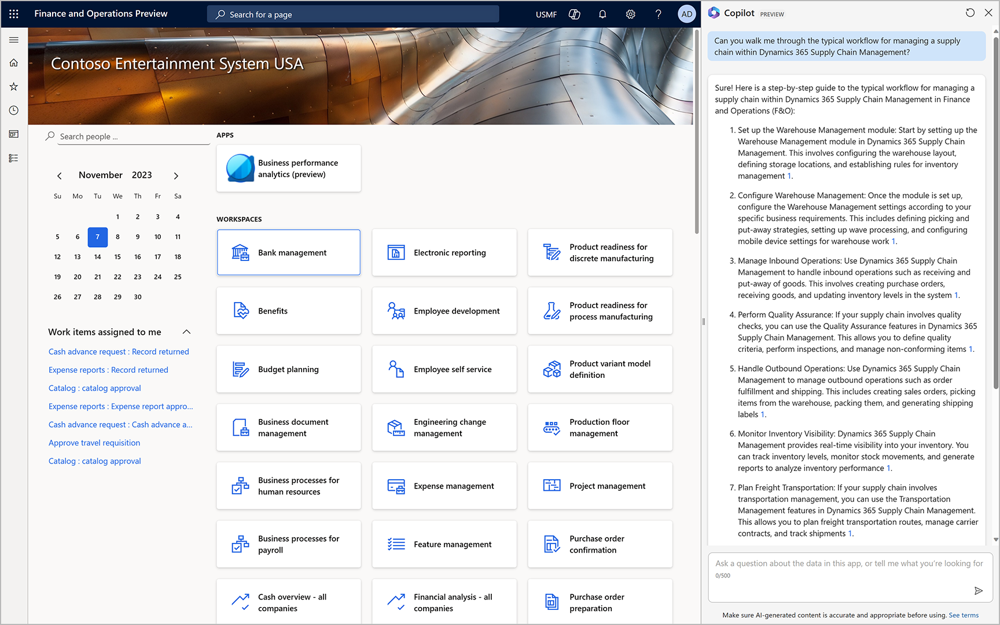
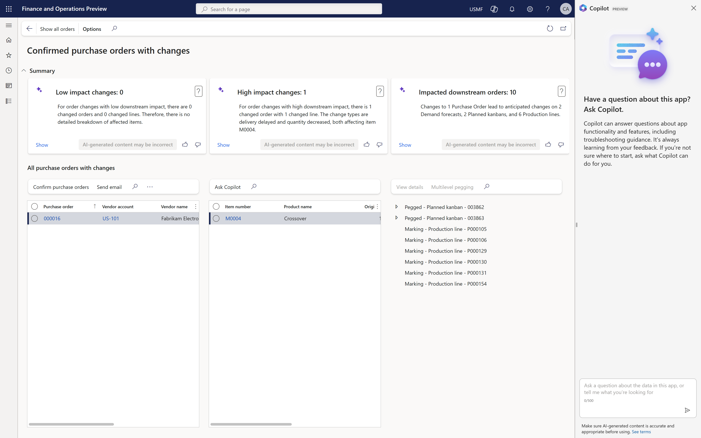

# Generative help and guidance with Copilot

[!include [banner](../includes/banner.md)]

Copilot provides in-app help and guidance that uses the power of generative AI to give contextual support to users. Copilot accesses the full range of public documentation to offer precise assistance and streamline the navigation through the extensive capabilities of finance and operations apps.

## How Copilot works for in-app help and guidance

Copilot transforms the support experience by introducing a conversational sidecar in finance and operations apps. Therefore, users can enter questions or express their needs directly in the app. The system is effective at interpreting the context of user queries, and provides relevant, tailored information to help with task completion. Future enhancements are expected to expand the system's capabilities so that they include direct navigation and proactive action suggestions.

When generative help and guidance with Copilot is enabled for your system, users can open the Copilot sidecar by using the **Copilot** button :::image type="icon" source="media/copilot-icon.png" border="false"::: at the top of each page.

## Powered by generative AI

Copilot uses state-of-the-art generative AI to dynamically interpret user inquiries and compose responses in real time. This process involves a sophisticated mechanism where the AI first rephrases the user's question for clarity, then searches the indexed public documentation, and finally synthesizes the information into a coherent, actionable answer.

## Keep conversations going with Copilot follow-up questions (preview)

[!INCLUDE [preview-banner-section](~/../shared-content/shared/preview-includes/preview-banner-section.md)]
<!-- KFM: Preview until further notice -->

Copilot can generate and display up to three follow-up questions that you can select to keep the conversation going. Each question is generated based on the existing conversation so far and represents something that Copilot thinks you're likely to want to ask next. This feature makes it fast and easy to post follow-up questions and get answers from Copilot. It's designed to provide a diversity of follow-up questions, and avoids repeating questions you've already asked.

For more information about this feature, see [Responsible AI FAQ for Follow-up questions in the Copilot sidecar](faq-copilot-suggested-questions.md).

[!INCLUDE [preview-note](~/../shared-content/shared/preview-includes/preview-note-d365.md)]

## Grounded in public documentation

Copilot in-app help and guidance is deeply grounded in the official public documentation for Microsoft finance and operations apps. This grounding ensures that the AI has a comprehensive understanding of the system and can generate responses that are both accurate and aligned with the latest features and best practices that Microsoft has established.

## Add custom and/or general content to generative help and guidance

Administrators can extend Copilot's knowledge by adding new knowledge to it in Copilot Studio. For example, you can add individual document files (in file formats such as PDF, RTF, or Word) or link to other information sources (such as SharePoint).

Administrators can also add the capability for Copilot to answer general questions. This content includes information that is part of the language model that is used, web content that is identified through Bing Search, and information from other sources. Copilot uses this information after it exhausts the information from your custom knowledge sources.

For more information about how to add these capabilities to your environment, see [Add knowledge to generative help and guidance with Copilot](../../dev-itpro/copilot/extend-copilot-generative-help.md).

## Process for generating guidance with large language models

The workflow for generating a response through Copilot can be broken down into the following steps.

1. **Query rewrite** – Copilot reformulates the initial question to optimize understanding and search efficacy.
1. **Document search** – Copilot uses the Bing search index to find the most relevant documents in the learn.microsoft.com domain.
1. **Response generation** – After it has the relevant documentation, Copilot uses a large language model to construct a comprehensive answer that includes citations from the source material.

## Responsible AI

Microsoft is committed to applying [responsible AI practices](../../dev-itpro/responsible-ai/responsible-ai-overview.md) with Copilot. We ensure user privacy through stringent data protection measures and oversee content generation to maintain relevance and safety.

## See also

- For administrators: [Enable generative help and guidance with Copilot](../../dev-itpro/copilot/enable-copilot-generative-help.md)
- For administrators: [Add knowledge to generative help and guidance with Copilot](../../dev-itpro/copilot/extend-copilot-generative-help.md)
- [Responsible AI FAQ for Generative help and guidance with Copilot in finance and operations apps](faq-copilot-generative-help.md)
- [Responsible AI FAQ for Follow-up questions in the Copilot sidecar (preview)](../../fin-ops/copilot/faq-copilot-suggested-questions.md)
