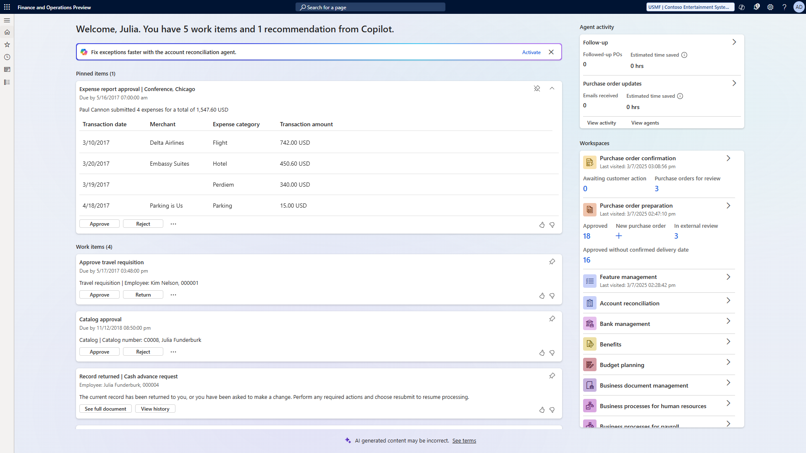

# Immersive Home (preview)

[!include [preview-banner](../includes/preview-banner.md)]

This articles describes the Immersive Home, how it helps you work hand in hand with AI agents and stay focused on the most important work items assigned to you.

The **Immersive Home** is aiming to become the  modern, AI-first landing page that adapts to user’s most important work, aids the decision making, and reduces the need to navigate elsewhere to complete common tasks. It is a modern option for the [initial page](../../fin-ops/organization-administration/tasks/set-users-initial-page.md) in finance and operations apps, which gives access to enabling, monitoring, teaching and interacting with AI agents.

## The components of Immersive Home

The Immersive Home is composed using a new library of controls for adaptive experiences in Dynamics 365 business applications following the Fluent design patterns. Adaptive experiences aim not only to modernize user experiences but also to bring dynamic approaches that move away from static forms towards experiences that bring relevant work to the user.

The first release of Immersive Home features Greeting and work summary, recommendations related to AI agents, and a center focus on work items. It also includes Agent activity overviews and a ranked view of spaces, initially the classic Workspaces in Finance and Operations.

## Greeting and summary

The greeting at the top of the page welcomes the user by name and provides a concise summary of relevant work items and recommendations to address. This helps the user to get a quick overview of the immediate tasks at hand.  

## Recommendation area

The recommendation area presents relevant callouts to the users, such as taking an agent skill into service in a specific user task or provide additional instructions to make the agent's service in a task more beneficial.

Each recommendation typically provides an action that guides the user to follow the recommendation and take the necessary steps.

## The Work items area

The Work items area hosts a list of priority-ranked activity cards. Each card reflects a step that is part of an action plan to complete a task. Multiple similar work items can be collapsed into one activity card, allowing the user to move the action plan forward for multiple tasks of the same kind.
Examples include expense approvals, catalog requests that need approval, cash forward requests awaiting approval, and other workflow-generated work items.

Other examples include activities from agent-generated action plans, such as when an agent has prepared a reminder email to vendors asking them to confirm POs, and the user needs to review it before sending. Or when an agent has identified and matched emails from vendors as responses to POs and presents the confirmation or change request to users for their review.

In most cases, the activity card will allow the user to complete the action without navigating away from the Immersive Home. To achieve this, action cards aim to show relevant information to the user that allows commencing an informed action, which the user may expand as needed. Alternatively the user may navigate to the activity specific task experience for more complex tasks.  

For activities that users like to work on for some time and track until completion, the activities area allow pinning of select activities to the topPinned items.

Once an activity has been completed, it will disappear from the Immersive Home.

Activity cards show:

- The type of activity as the title
- A description summary with relevant information
- Action buttons to complete the activity
- Navigation link to the activity-related task or workspace

## The Agent Activity area

The agent activity area will be shown only if the use of AI agents has been enabled in the environment. For each activated agent it shows a section where the agent presents its key activity metrics. This could be the number of cases processed, email sent, or metrics such as estimated time saved for the user.

Typically agents provide a dedicated task space, where the user can go into more detail on what the agent has been doing, work hand in hand with the agent, and configure or teach the agent. The chevron at the top right of each agent activity card navigates to the specific agent task space.

At the bottom of the Agent Activity area navigate to agent life cycle management related views. The **View activity** link navigates to the holistic tracing list of all agent activities. The **View agents** link opens the repository of all currently running agents and the library of all agents available to the user for activation.

## The Workspaces area

The workspaces section shows a list of ranked tiles for each workspace. The ranking takes into account the recency of the last use by the user. Favorit workspaces will rank at the top.  

Workspace tiles will highlight the information that have been pinned to the dashboard. To pin information to the dashboard open the Workspace and right click on a blue tile in the workspace, select **Personalize:...** and the **Pin to dashboard**.