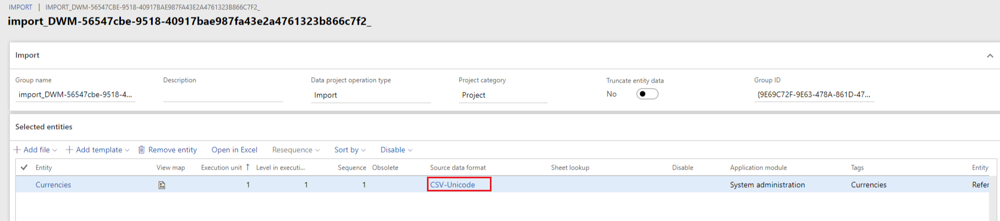

# Synchronize date and time in import jobs

[!include [banner](../../../finance/includes/banner.md)]

It's important to set the time zone for your import job to Coordinated Universal Time (UTC). You might see unexpected dates and times in your imported data if you use a different setting. Without the correct setting, the import process converts the UTC date to the local format, and then system settings converts it again.

This dual conversion causes dates to change between applications. For example, the dual conversion could cause an employee's start date to be different between Dynamics 365 Human Resources and Dynamics 365 Finance due to differences in local time zones. Setting the import job to UTC resolves this problem.

1. In Dynamics 365 finance and operations, select **Data management**.

2. Select **Import projects**, and then select the project.

3. Under **Source date format**, select **CSV-Unicode**.

   <!--  -->

4. Change **Timezone** to **Coordinated Universal Timezone**, and change **Language** to **En-US**.

[!INCLUDE[footer-include](../../../includes/footer-banner.md)]

