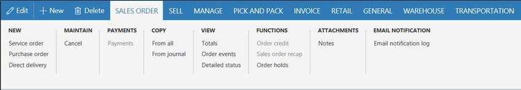
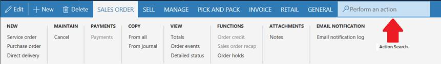
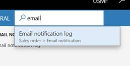
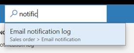
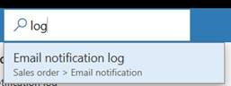

# Accessibility features

[!include [banner](../includes/banner.md)]

[!INCLUDE [PEAP](../../../includes/peap-3.md)]

This article describes the functionality that is designed to help users who have various disabilities use this app. For example, there are features for people who use sight-assistive technologies such as Microsoft Windows Narrator.

## Windows Narrator and keyboard-only access

Every field and control has a label and a description of applicable shortcuts. A screen reader can read the label and description.

## Shortcuts for the most frequently performed actions

For most users, everyday system use involves lots of data entry and keyboard interaction. To enhance the user experience, we have created shortcuts to help you "jump" around the screen and shortcuts for specialized actions. For more information, see [Keyboard shortcuts](shortcut-keys.md).

## Navigation search

Any page that is accessed by using the Navigation pane menu, the left-most pane, is also available from the **Search** box. Press Alt+G to move focus to the **Search** box, and then type the name or description of the page.

For more information, see [Navigation search](navigation-search.md).

> [!NOTE]
> You can navigate directly to top-level pages only. Secondary pages rely on information or context from their parent page.

## Action search for keyboard-only users or for heads-down data entry

Every action that is provided on a page can be accessed from a keyboard, via the tab sequence. Information about the tab sequence is provided later in this article. To run actions more directly, you can use the action search functionality.

### Example

You want to run the **Email notification log** action that appears in the **Email notification** group on the **Sales order** tab on the Action Pane.

One option is to use your keyboard. Press Ctrl+F6 to move focus to the Action Pane, and then press Tab repeatedly to move through all the tabs and actions, until the **Email notification log** action has focus.

However, you can also run the action more directly. From anywhere on the page, press Ctrl+Apostrophe (') to show the search box for actions.

In the search box, type words that describe the action. The action is made available to you, and you can run it directly. For example, by typing **email**, **notific** (a partial word), or **log**, you can "jump" to the Email notification log functionality.

When you've finished, you can press Ctrl+Apostrophe again to return focus to the field that you were working with before you ran the action search.

For more information, see [Action search](action-search.md).

## Tab sequence

In everyday system use, not every field is required in order to perform typical tasks. Therefore, by default, the tab sequence is "optimized." Tab stops are set only on those fields that are essential for typical scenarios.

However, you might find that some fields that you often use to perform tasks aren't included in the default tab sequence. In this case, if you use Windows Narrator, you can use Windows Narrator's keyboard actions to access those fields and inspect their content. Alternatively, you can turn on the **Enhanced tab sequence** option on the **Options** page. This option makes all editable and read-only fields part of the tab sequence. You can then use page personalization to create a custom tab sequence and omit fields that don't have to be part of the tab sequence. For more information about personalization, see [Personalize the user experience](personalize-user-experience.md).

## Form patterns

Almost 90 percent of the pages in the app are based on a small set of patterns. These patterns are referred to as *form patterns*. Each form pattern is used to provide the actions that are most often performed on the page. A form pattern helps guarantee familiarity and ease of understanding, because frequently used actions and data are always presented in the same location on different pages. Because of the small number of form patterns, users can easily learn the system, regardless of the number of pages in it, and can confidently use it after they recognize the form patterns.

To learn more about form patterns, see [Form styles and patterns](../../dev-itpro/user-interface/form-styles-patterns.md).

## Responsive layout

The product is designed to work on various devices and form factors, from the smallest screens to large screens that have the highest resolution. Our responsive layout engine lets users zoom in to a magnification level of 200 percent (or, in some scenarios, more than 200 percent).

On smartphones and other small screens, the controls and the form layout will responsively adapt to ensure that the core data is favored. These responsive behaviors can also include reducing the number of columns in groups and tabs to a single column, hiding shell elements, and collapsing the Action Pane.

## Guidance to help developers and customers incorporate accessible thinking in their customizations

To learn more about Microsoft best practices for enabling accessibility, see [Accessibility in forms, products, and controls](../../dev-itpro/user-interface/enable-accessibility.md).

[!INCLUDE[footer-include](../../../includes/footer-banner.md)]
