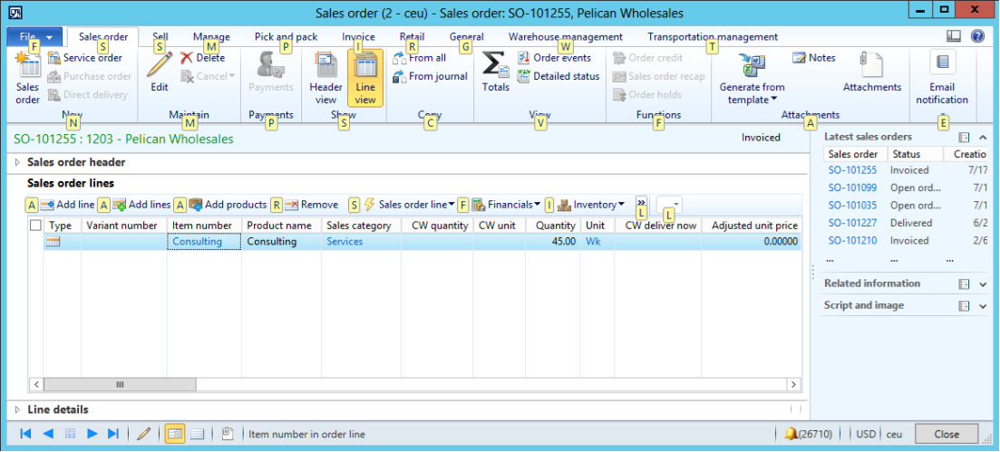
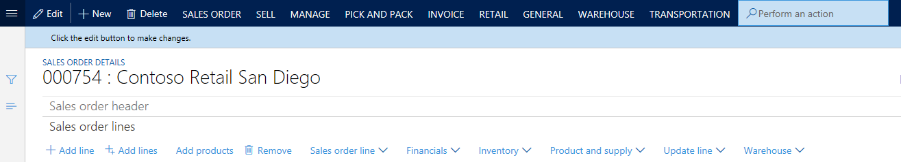

---
# required metadata

title: Action search
description: This article describes the action search functionality. Action search will help you find and run actions on a page.
author: jasongre
ms.date: 03/09/2020
ms.topic: article
ms.prod: 
ms.technology: 

# optional metadata

# ms.search.form: 
# ROBOTS: 
audience: Application User
# ms.devlang: 
ms.reviewer: sericks
# ms.tgt_pltfrm: 
ms.assetid: 62c70de0-fdde-4417-8e08-0583fb095a40
ms.search.region: Global
# ms.search.industry: 
ms.author: jasongre
ms.search.validFrom: 2016-02-28
ms.dyn365.ops.version: AX 7.0.0

---

# Action search

[!include [banner](../includes/banner.md)]

[!INCLUDE [PEAP](../../../includes/peap-1.md)]

This article describes the action search functionality. Action search will help you find and run actions on a page.

## Introduction

Pages primarily expose commands on Action Panes, both the standard Action Pane that appears at the top of a page and the toolbars that appear in various sections of the page. In previous versions, a Key Tips feature let you quickly access any button on an Action Pane by pressing the Alt key and then a series of letters.

The action search feature replaces Key Tips, which are no longer available. This new feature lets you quickly search for and run a button from any visible Action Pane.

## Using action search

To use the action search feature, follow these steps.

1. On the Action Pane, click in the **action search** field. (The **action search** field contains a magnifying glass icon.)
2. Type all or part of the name of the button that you want to run. You can also search by using words from the button's "path." (For more information, see the next section of this article.) Typically, a button will appear near the top of the results list after you've typed two to four characters.
3. Find and run the button in the results list (by using your mouse or keyboard).

After the button is run, the focus is returned to your last position on the page, so that you can continue to work.

You can also start action search by pressing Ctrl+/ or Alt+Q. Press the keyboard shortcut again to return the focus to your last position on the page.

## Understanding the results list

Often, you must know both the location and the context of a button to fully understand the purpose of that button. Therefore, the results list shows additional information to help you understand exactly which buttons appear in the list. In particular, the "path" of the button is shown. This path might include the labels of the following UI elements, as relevant:

- Action Pane tab
- Button group
- Menu button (if the button is inside a menu button)
- Menu separator (if the button is inside a named group inside a menu button)
- Group or tab on the page (for example, the name of a FastTab)

For example, you typed **tot** in the **action search** field and are now examining the results list. The first entry, for a button that is named **Totals**, is highlighted. A button path of **Sales order** &gt; **View** is also shown. The **Sales order** part of the path corresponds to the **Sales order** tab on the Action Pane, and the **View** part of the path corresponds to the **View** group on that tab. Similarly, the path of the **Total discount** button (**Sell** &gt; **Calculate**) informs you that this button is located in the **Calculate** group on the **Sell** tab of the Action Pane. Therefore, this information helps you understand exactly which button will be triggered by action search (if you select that button in the results list).

In the previous example, action search showed results from the standard Action Pane at the top of a page. However, action search also shows results from visible toolbars that are in other places on the page. For example, you're searching for the **On-hand inventory** button that is on the **Sales order lines** FastTab. In this case, the button path in the results list (**Sales order lines** &gt; **Inventory** &gt; **View**) informs you that this button is under the **View** heading on the **Inventory** menu button on the **Sales order lines** FastTab.

> [!NOTE]
> There are some buttons that do not show up in Action search. These include drop dialog buttons and buttons from subforms. 

## Action search vs. Navigation search

Whereas action search is intended to find and run actions on a page, there is a separate search mechanism for finding and navigating to pages. For more information about that feature, see the [Navigation search](navigation-search.md) article.

[!INCLUDE[footer-include](../../../includes/footer-banner.md)]