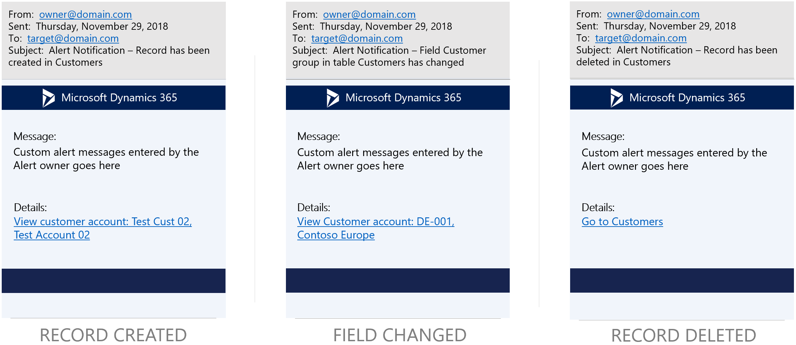

# Client alert notifications by email

[!include [banner](../includes/banner.md)]

You can define custom alert rules that monitor filtered views of data and automatically send email notifications when predefined events occur. The option to send email notifications is available for all supported alert types and you can also turn them on for existing alert rules.

You can use built-in controls to create alert rules that monitor the filtered views of system batch jobs. By monitoring the value of the **Status** field, you can also configure alert rules that send email when a batch job fails. After you create these alert rules, you no longer have to check reports for changes to business data. Instead, you can let the intelligent change detection service do the monitoring for you.

Client alerts depend on the email subsystem that is provided through integration with Microsoft Office. We recommend that you use the Simple Mail Transfer Protocol (SMTP) provider, so that email distribution doesn't have to rely on a local mail client.

To send notifications by email, customers must configure integrated email services. Email notifications are sent to recipients on behalf of alert owners.

For more information about how to configure email, see [Configure and send email](../organization-administration/configure-email.md).

The following image shows the **Create alert rule** dialog box, which now includes a **Send email** option.

> [!NOTE]
> When the **Send email** option is set to **Yes**, alert notifications will continue to be delivered from the Action Center.

## Alert notification email templates

The service sends email notifications by using predefined email templates that deliver the basic details of the alert notification.

The following image shows the structure of the alert notifications when they are received by email.

[!INCLUDE[footer-include](../../../includes/footer-banner.md)]