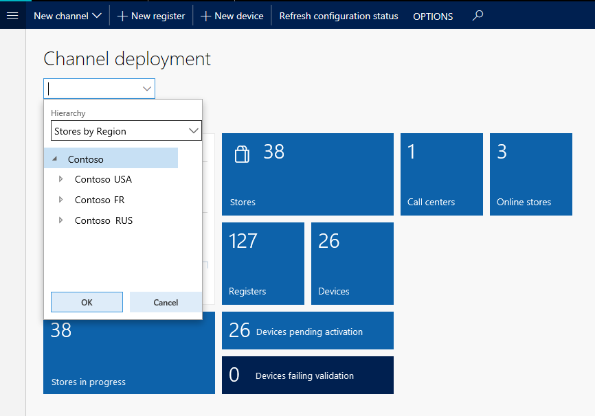

---
# required metadata

title: Configure and filter workspaces
description: This article provides an overview about how to configure and filter workspaces.
author: jasongre
ms.date: 06/20/2017
ms.topic: article
ms.prod: 
ms.technology: 

# optional metadata

ms.search.form: BankTreasurerWorkspace, HcmBenefitWorkspace, BudgetPlanningWorkspace, BusinessProcessGenericWorkspace, RetailCatalogManagementWorkspace, RetailCategoryAndProductWorkspace, RetailChannelManagementWorkspace, HcmCompensationWorkspace, CAMCostAccountingLedgerAdminWorkspace, CostAdminWorkspace, CostAnalysisWorkspace, CAMCostControlWorkspace, CustomerCollectionManagerWorkspace, CustomerInvoiceWorkspace, CustPaymentWorkspace, DataManagementWorkspace, DataValidationWorkspace, ERWorkspace, LedgerPeriodCloseProjectWorkspace, AssetWorkspace, GeneralJournalEntryWorkspace, VendVendorPortalInvoiceWorkspace, BudgetTrackingWorkspace, ReqCreatePlanWorkspace, BusinessProcessGenericOwnerWorkspace, SelfHealingWorkspace, WHSOutboundWorkMonitoringWorkspace, WHSWavePlanningWorkspace, PayrollWorkspace, HcmWorkforceWorkspace, RetailDiscountPricingWorkspace, EcoResProductDiscreteManufacturingWorkspace, KanbanPrepareProductForLeanWorkspace, EcoResProductProcessManufacturingWorkspace, EcoResProductVariantMaintainWorkspace, JmgShopSupervisorWorkspace, ProjProjectManagementWorkspace, VendVendorPortalWorkspace, PurchOrderMaintainWorkspace, PurchOrderProcessReceiptsWorkspace, HcmRecruitmentWorkspace, EcoResProductMaintainWorkspace, FMClerkWorkspace, OpResLifecycleManagementWorkspace, RetailITWorkspace, RetailChannelOperationsWorkspace, RetailStoreManagementWorkspace, SalesOrderProcessingWorkspace, SalesReturnWorkspace, SystemAdministrationWorkspaceForm, VendVendorRequestForQuotationsWorkspace, VendVendorProfileManagementWorkspace, VendInvoiceWorkspace, VendPaymentWorkspace
# ROBOTS: 
audience: Application User
# ms.devlang: 
ms.reviewer: twheeloc
# ms.tgt_pltfrm: 
ms.assetid: 541e6012-4680-4684-8494-e9b5ca4684ee
ms.search.region: Global
# ms.search.industry: 
ms.author: jasongre
ms.search.validFrom: 2016-02-28
ms.dyn365.ops.version: AX 7.0.0

---

# Configure and filter workspaces

[!include [banner](../includes/banner.md)]

[!INCLUDE [PEAP](../../../includes/peap-3.md)]

This article provides an overview about how to configure and filter workspaces.

## Configuring a workspace

You can change the appearance and behavior of some workspaces by updating settings that apply to the whole workspace. When a workspace can be configured, the Action Pane includes a button that instructs you to click it to make configuration changes. For example, in the following illustration, the button is named **Configure my workspace**.

When you click the button, a dialog appears, where you can modify the predefined settings for the workspace. The specific settings that you see in this dialog vary by workspace, and depend on the specific controls and business data that are available in the workspace.

## Filtering a workspace

Many workspaces let you filter the content that appears in them. The controls that are available might let you filter all the content in the workspace or only the content in a specific section of the workspace. The filters on workspaces can be lookups, combo boxes, free-form text fields, or other types of controls. However, every type of filter has the same effects, as described in the following sections.

### Workspace-wide filters

You can filter the whole workspace by using a workspace-wide filter. A workspace-wide filter appears in the upper-left corner of the workspace. When you select a specific value in the drop-down list, the contents of the workspace are filtered based on that selection.

When you click to open the filter, you're presented with several options.

Select an option to filter the workspace based on that option.

### Workspace section filters

If individual sections of the workspace have filters, you can filter each section separately. In the following illustration, the filter (the field that contains the text "Filter") is an example of a free-form text field filter.

As with a workspace-wide filter, select or enter a value in the field to filter the contents of the section.

[!INCLUDE[footer-include](../../../includes/footer-banner.md)]
