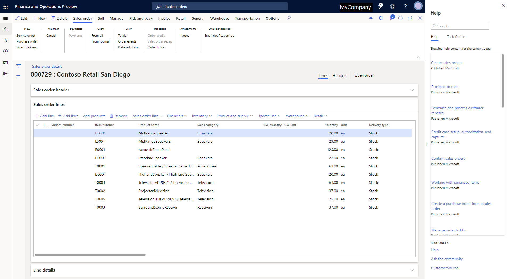
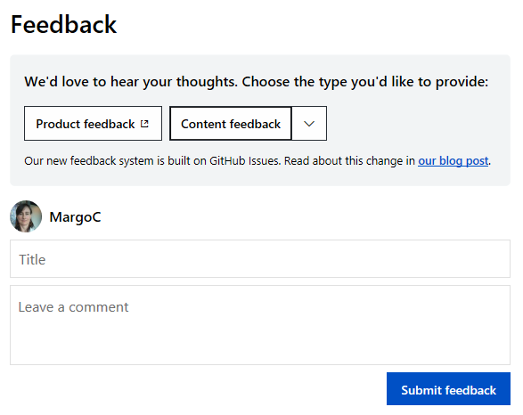
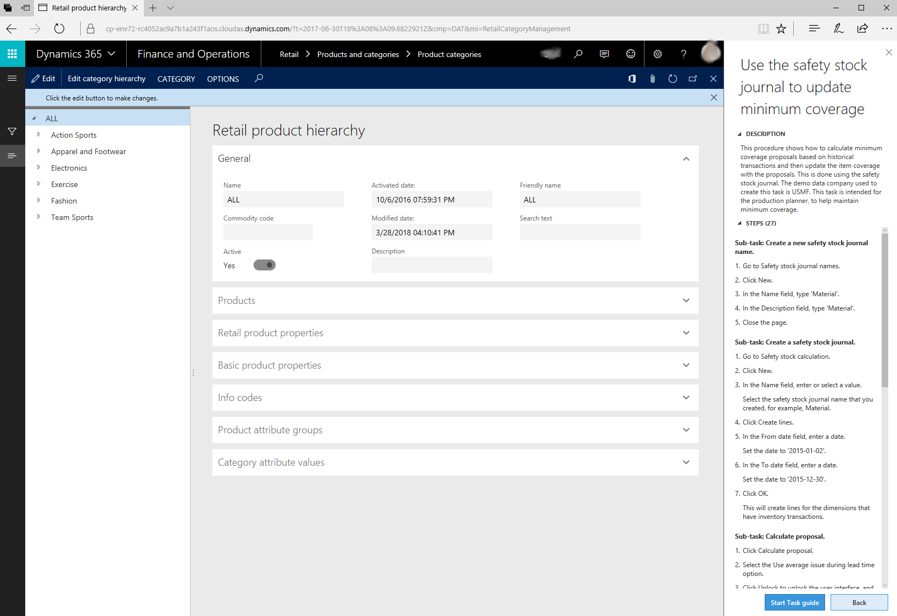
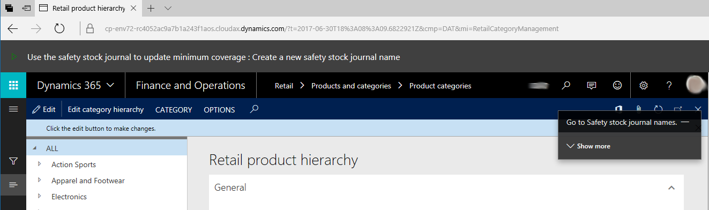
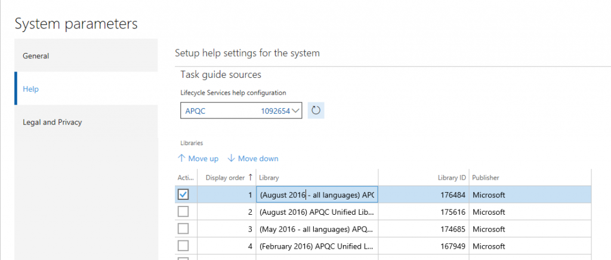
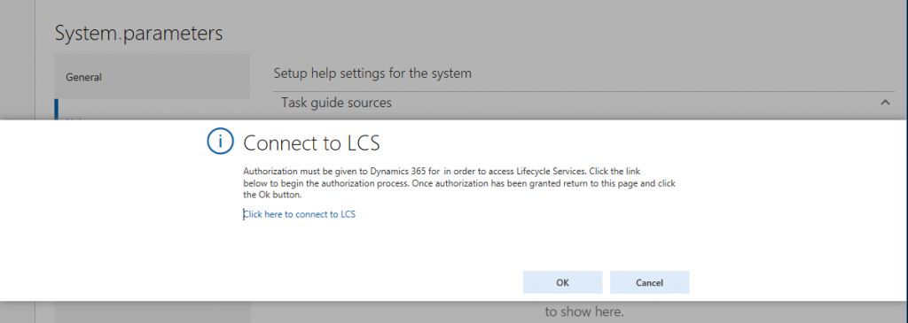

# Help system

[!include [banner](../includes/banner.md)]

[!INCLUDE [PEAP](../../../includes/peap-1.md)]

Users of the following apps can access context-sensitive Help and other content that is based on the same Help system:

- Dynamics 365 Commerce
- Dynamics 365 Finance
- Dynamics 365 Human Resources
- Dynamics 365 Supply Chain Management

In all these apps, you can access product-specific Help from the **Help** pane.

## Help on Microsoft Learn

The ([Microsoft Dynamics 365 documentation](/dynamics365/)) on Microsoft Learn is the default source for product documentation for the previously listed apps. This site offers the following features:

- **Access to the most up-to-date content** – The site gives Microsoft a faster and more flexible way to create, deliver, and update product documentation. Therefore, you have easy access to the latest technical information.
- **Content that is written by experts** – Content on the site is open to contributions by community members both inside and outside Microsoft.

You can find content on Microsoft Learn by using any search engine. For the best results, we recommend that you use a site search, such as **site:learn.microsoft.com dynamics 365 "search term"**.

## Get notified about changes through an RSS feed

To subscribe to an RSS feed of all updates made to the content on Microsoft technical documentation across the finance and operations apps, use the following link:

[RSS feed](/api/search/rss?$filter=scopes%2fany(t%3A%20t%20eq%20%27dynamics365-finops%27)&locale=en-us)

> [!NOTE]
> The RSS feed returns a list of the 100 topics most recently updated. The list is sorted by date, but it can take up to a week before the most recently updated articles make it to the list.  

Alternatively, you can subscribe to an RSS feed by app:

- [Commerce](/api/search/rss?$filter=scopes%2fany(t%3A%20t%20eq%20%27dynamics365-commerce%27)&locale=en-us)  
- [Finance](/api/search/rss?$filter=scopes%2fany(t%3A%20t%20eq%20%27dynamics365-finance%27)&locale=en-us)  
- [Human Resources](/api/search/rss?$filter=scopes%2fany(t%3A%20t%20eq%20%27dynamics365-hr%27)&locale=en-us)  
- [Supply Chain](/api/search/rss?$filter=scopes%2fany(t%3A%20t%20eq%20%27dynamics365-supplychain%27)&locale=en-us)  
- [Talent](/api/search/rss?$filter=scopes%2fany(t%3A%20t%20eq%20%27dynamics365-talent%27)&locale=en-us)  

### Leave us feedback

On the *learn.microsoft.com* website, each documentation article encourages you to provide feedback. We've changed the mechanism a couple of times based on, well, feedback. Currently, we ask you to choose the **Feedback** action below the article's title. You can give the article a rating, and write a comment if you want to. The feedback goes straight to the article's author and the team that owns the docs.  

<!--If you have feedback or questions about a article, leave us a comment at the bottom of the page.

1. Select **Feedback** to get to the comments at the bottom of the page. Then, select either **Product feedback** or **Sign in to give documentation feedback**.

2. Start typing your comments, and then select **Submit feedback**.

    

> [!NOTE]
> If you want to submit documentation feedback, you must sign in by using a GitHub account. For more information, see [Setting up and managing your GitHub profile](https://help.github.com/github/setting-up-and-managing-your-github-profile).-->

## Contribute to the documentation

You can contribute and make edits to the documentation. To get started, select the **Edit** button (pencil symbol) on a article. The following video shows how you can contribute to our documentation.

> [!VIDEO https://www.microsoft.com/videoplayer/embed/RE36liB]

The [How to contribute to the Microsoft Dynamics 365 documentation](https://youtu.be/m5djioozRbg) video (shown above) is included in the Microsoft Dynamics 365 channel on YouTube.

For more information, see the [Microsoft Learn contributor guide](/contribute), which is published by the team that built the Microsoft Learn site.

> [!NOTE]
> We only accept contributions to our English content at this time.

## Task guides

A task guide is a controlled, guided, interactive experience that leads you through the steps of a task, or business process. You can open (play) a task guide from the **Help** pane. When you first select a task guide, the **Help** pane will show the step-by-step instructions for the task. Localized task guides are available.

Microsoft released task guide libraries for product versions through the December 2017 release of Dynamics 365 Finance and Operations. The [Accessing task guides from the Help pane](#accessing-task-guides-from-the-help-pane) section of this article explains how to find the correct task guides for your product.

To begin the guided, interactive experience, select **Start task guide** at the bottom of the **Help** pane. A black pointer shows you where to go first. Follow the instructions that appear in the user interface (UI), and enter data as directed.

> [!IMPORTANT]
> The data that you enter when you play a task guide is real. If you're in a production environment, the data will be entered in the company that you're currently using.

You can use Task recorder to create your own custom task guides. For more information, see [Create documentation or training with Task Recorder](../../dev-itpro/user-interface/task-recorder-training-docs.md).

## In-product Help

Some fields have field descriptions to help users get unblocked when they are uncertain about the data that the field contains, for example. Additionally, the in-product **Help** pane provides context-sensitive access to content that can help users get started, get unblocked, and learn more.

To access Help content, select the **Help** button (**?**), and then select **Help**. Alternatively, press **Ctrl+Shift+?**. In both cases, the **Help** pane appears. From the **Help** pane, you can access conceptual topics or task guides that are relevant to the area of the product that you're currently in.

### Accessing Help topics from the Help pane

From the **Help** pane, you can access topics that apply to the client. When you first open the **Help** pane, the **Help** tab shows the topics that apply to the page that you're currently on. If no topics are found, you can enter keywords to refine your search. When you select a article in the **Help** pane, it's opened on a new tab in your browser.

> [!IMPORTANT]
> This section does not apply to Dynamics 365 Human Resources. The Help system for Human Resources is automatically connected to task guides for the product. Also, you cannot create custom task guides for Human Resources.

### Accessing task guides from the Help pane

Before you can access task guides from the **Help** pane, a system admin must configure some settings on the **System parameters** page in Finance, Supply Chain Management, or Commerce. For more information, see [Adding task guides](help-connect.md#adding-task-guides).

<!-- > [!NOTE]
> - In order to configure Help, you must be signed in with an account in the same tenant as the tenant in which the app is deployed.
> - It is not possible to connect to an LCS library from an instance of the app running in a local virtual hard drive (VHD).

On the **System parameters** page, follow these steps:

1. **Important:** The first time that you open the Help tab, you must connect to Lifecycle Services. Be sure to select the link in the middle of the form, wait for the connection, close the dialog box, and then select **OK** to get to the parameters form.

    

2. Select the Lifecycle Services project to connect to.
3. Select BPM libraries (within the selected project) to retrieve task recordings from.
4. Set the display order of the BPM libraries. This setting determines the order in which task recordings from the libraries will appear in the Help pane.-->

After a System administrator has completed these steps, you can open the **Help** pane and select the **Task guides** tab. You'll now see the task guides that apply to the page that you're currently on. If no task guides are found, you can enter keywords to refine your search. After you select a task guide in the **Help** pane, the **Help** pane shows the step-by-step instructions, and you can play the task guide.

### Where are the translated task guides for Microsoft libraries?

Translated task guides are released in libraries that have "All languages" in the title. To view localized task guide Help, make sure that you're connected to an appropriate library. Each user can change the language that a task guide appears in by changing the language settings under **Options** &gt; **Preferences**.

- If a task guide has been translated, when you open that task guide all the text of the task guide will appear in your selected language.
- If a task guide has not yet been translated, when you open it, only the text of the controls will appear in your chosen language.

## Creating custom Help

You can create Help for your users by creating custom task guides or connecting your own website to the **Help** pane. For more information, see the following topics:

- [Task recorder resources](../../dev-itpro/user-interface/task-recorder.md)
- [Custom Help overview](../../dev-itpro/help/custom-help-overview.md)

## Additional resources

The following table lists our websites. Sites that have an asterisk (\*) next to the name require that you sign in by using an account that is associated with a service plan.

| Site | Description |
|------|-------------|
| [Microsoft Dynamics 365 documentation](/dynamics365/) | This site hosts or links to all product documentation for Dynamics 365. |
| [Microsoft Learn training](/training/) | This site is the free Microsoft eLearning site. |
| [Microsoft Dynamics Lifecycle Services (LCS)](https://lcs.dynamics.com/)\* | This site provides a cloud-based collaborative workspace that customers and partners can use to manage projects from pre-sales to implementation and operations. It's useful in all phases of an implementation. |
| [Support blog](https://aka.ms/AXSupportBlog) | This site provides tips and tricks that are posted by the Support team. |
| [Previous versions](/previous-versions/dynamics/) | This site hosts content from previous releases. |
| [Dynamics Community](https://community.dynamics.com/) | This site hosts blogs, forums, and videos. |
| [Microsoft.com/dynamics365](https://www.microsoft.com/dynamics365/home) | This site provides evaluation and sales information. |

[!INCLUDE[footer-include](../../../includes/footer-banner.md)]
