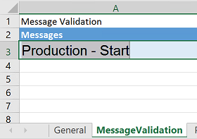

---
# required metadata

title: Use the Regression suite automation tool tutorial
description: This topic shows how to use Regression suite automation tool (RSAT). It describes various features and provides examples that use advanced scripting. 
author: kfend
manager: AnnBe
ms.date: 06/09/2019
ms.topic: article
ms.prod: 
ms.service: dynamics-ax-platform
ms.technology: 

# optional metadata

# ms.search.form:
# ROBOTS: 
audience: Application User, Developer, IT Pro
# ms.devlang: 
ms.reviewer: sericks
ms.search.scope: Core, Operations
# ms.tgt_pltfrm: 
ms.custom: 21761
ms.search.region: Global
# ms.search.industry: 
ms.author: kfend
ms.search.validFrom: 2017-06-30
ms.dyn365.ops.version: AX 7.0.0, Operations

---

# Use the Regression suite automation tool tutorial

[!include [banner](../includes/banner.md)]

> [!NOTE]
> Use your internet browser tools to download and save this page in pdf format. 

This tutorial walks through some of the advanced features of the Regression suite automation tool (RSAT), includes a demo assignment, and describes strategy and key learning points.

## Features of RSAT/Task recorder

### Validate a field value

For information about this feature, see the [Create a new task recording that has a Validate function](./hol-set-up-regression-suite-automation-tool.md#create-a-new-task-recording-that-has-a-validate-function).

### Saved variable

For information about this feature, see the [Modify an existing task recording to create a saved variable](./hol-set-up-regression-suite-automation-tool.md#modify-an-existing-task-recording-to-create-a-saved-variable).

### Derived test case

1. Open Regression suite automation tool (RSAT), and select both the test cases that you created in [Set up and install Regression suite automation tool tutorial](./hol-set-up-regression-suite-automation-tool.md).
2. Select **New \> Create derived test case**.

    

3. You receive a message that states that a derived test case will be created for each selected test case in the current test suite, and that each derived test case will have its own copy of the Excel parameter file. Select **OK**.

    > [!NOTE]
    > When you run a derived test case, it uses the task recording of its parent test case and its own copy of the Excel parameter file. In this way, you can run the same test with different parameters, without having to maintain more than one task recording. A derived test case doesn't have to be part of the same test suite as its parent test case.

    

    Two additional derived test cases are created, and the **Derived?** check box is selected for them.

    

    A derived test case is automatically created in Azure DevOps. It's a child item of the **Create a new product** test case and is tagged with a special keyword: **RSAT:DerivedTestSteps**. These test cases are also automatically added to the test plan in Azure DevOps.

    

    > [!NOTE]
    > If, for any reason, the derived test cases that are created aren't in the correct order, go to Azure DevOps, and reorder the test cases in the test suite, so that RSAT can run them in the correct order.

4. Select the derived test cases, and then select **Edit** to open the corresponding Excel parameter files.
5. Edit these Excel parameter files in the same way that you edited the parent files. In other words, make sure that the product ID is set so that it's automatically generated. Also make sure that the saved variable is copied to the relevant fields.
6. On the **General** tab of both Excel parameter files, update the value of the **Company** field to **USSI**, so that the derived test cases will be run against a different legal entity than the parent test case. To run the test cases against a specific user (or the role that is associated with a specific user), you can update the value of the **Test User** field.
7. Select **Run**, and validate that the product is created in both the USMF legal entity and the USSI legal entity.

### Validate notifications

This feature can be used to validate whether an action occurred. For example, when a production order is created, estimated, and then started, the app shows a "Production – Start" message to notify you that the production order has been started.


You can validate this message through RSAT by entering the message text on the **MessageValidation** tab of the Excel parameter file for the appropriate recording.



After the test case is run, the message in the Excel parameter file is compared to the message that is shown. If the messages don't match, the test case will fail.

> [!NOTE]
> You can enter more than one message on the **MessageValidation** tab in the Excel parameter file. The messages also can be error or warning messages instead of informational messages.

### Validate values by using operators

In previous versions of RSAT, you could validate values only if a control value equaled an expected value. The new feature lets you validate that a variable isn't equal to, is less than, or is more than a specified value.

- To use this feature, open the **Microsoft.Dynamics.RegressionSuite.WindowsApp.exe.config** file under the RSAT installation folder (for example, **C:\\Program Files (x86)\\Regression Suite Automation Tool**), and change the value in the following element from **false** to **true**.

    ```xml
    <add key="AddOperatorFieldsToExcelValidation" value="false" />
    ```

    In the Excel parameter file, a new **Operator** field appears.

    > [!NOTE]
    > If you've been using an older version of RSAT, you must generate new Excel parameter files.

    

The following example shows how you can use this feature to validate whether the on-hand inventory is more than 0 (zero).

1. In the demo data in the **USMF** company, create a task recording that has the following steps:

    1. Go to **Product information management \> Products \> Released products**.
    2. Use the Quick Filter to find records. For example, filter on a value of **1000** for the **Item number** field.
    3. Select **On-hand inventory**.
    4. Use the Quick Filter to find records. For example, filter on a value of **1** for the **Site** field.
    5. In the list, mark the selected row.
    6. Validate that the value of the **Total available** field is **411.0000000000000000**.

2. Save the task recording to the BPM library in LCS, and sync it to Azure DevOps.
3. Add the test case to the test plan, and load the test case into RSAT.
4. Open the Excel parameter file. On the **InventOnhandItem** tab, you will see a **Validate InventOnhandItem** section that includes an **Operator** field.

    

5. To validate whether the inventory on-hand will always be more than 0, change the value of the **Value** field from **411** to **0** and the value of the **Operator** field from an equal sign (**=**) to a greater than sign (**\>**).

    

6. Save and close the Excel parameter file.
7. Select **Upload** to save the changes that you made to the Excel parameter file to Azure DevOps.

Now, if the value of the **Total Available** field for the specified item in inventory is more than 0 (zero), tests will pass, regardless of the actual on-hand inventory value.

### Generator logs

This feature creates a folder that contains the logs of the test cases that have been run.

- To use this feature, open the **Microsoft.Dynamics.RegressionSuite.WindowsApp.exe.config** file under the RSAT installation folder (for example, **C:\\Program Files (x86)\\Regression Suite Automation Tool**), and change the value in the following element from **false** to **true**.

    ```xml
    <add key="LogGeneration" value="false" />
    ```

After the test cases are run, you can find the log files under **C:\\Users\\\<Username\>\\AppData\\Roaming\\regressionTool\\generatorLogs**.


> [!NOTE]
> If there were existing test cases before you changed the value in the .config file, logs won't be generated for those test cases until you generate new test execution files.
> 
> 

### Snapshot

This feature takes screenshots of the steps that were performed during task recording.

- To use this feature, open the **Microsoft.Dynamics.RegressionSuite.WindowsApp.exe.config** file under the RSAT installation folder (for example, **C:\\Program Files (x86)\\Regression Suite Automation Tool**), and change the value of the following element from **false** to **true**.

    ```xml
    <add key="VerboseSnapshotsEnabled" value="false" />
    ```

Under **C:\\Users\\\<Username\>\\AppData\\Roaming\\regressionTool\\playback**, a separate folder is created for each test case that is run.


In each of these folders, you can find snapshots of the steps that were performed while the test cases were run.


## Assignment

### Scenario

1. The product designer creates a new released product.
2. The production manager initiates a production order to bring the stock level to two pieces.
3. Manufacturing starts and ends the production order, and verifies that the on-hand quantity is two pieces.
4. The sales team receives an order for four pieces of the new product. Therefore, the sales team updates the net requirements via the dynamic plan. Because no additional capacity is available, the default order policy is set to "buy instead of make." Therefore, a planned purchase order is created.
5. The buyer adds a vendor, firms the planned purchase order, and then confirms the purchase order.
6. When the goods that were purchased arrive at the store, the store operator searches the related purchase order and receives the goods. Because the order is now completed, goods can be picked and packed against the sales order.
7. Finance posts the purchase invoice and sales invoice.

The following illustration shows the flow for this scenario.


The following illustration shows the business processes for this scenario in RSAT.


## Strategy – Key learning

### Data

- Make sure that you have representative data volumes (a copy of production/golden configuration data plus migrated data).
- When you generate new data via Task recorder, create test names that won't conflict with existing names (for example, use a prefix such as **RSATxxx**).
- Use Azure Point-In-Time restore to rerun tests in non-Tier 1 environments.
- Although you can use the **RANDOM** and **NOW** Excel functions to generate a unique combination, the effort is considerably high. Here is an example.

    ```Excel
    product = "AT" &TEXT(NOW(),"yyymmddhhmm")
    ```

### Task recorder

- Define scenarios before you start recording. A well-managed project has predefined test scenarios. To build a test case, consider how predictable the outcome of those test scenarios is.
- Split recordings if they are performed by different roles, or if there is waiting time or an external event before the next step.
- Avoid selecting values in lists. Instead, use text formats, such as **FIFO**, **AudioRM**, and **SiteWH**. When you select in a list, the position of the value in the list is recorded, not the value itself. If items are added to that list, the position of the value can change. Therefore, your recording will use a different parameter, and the rest of the scenario might be affected.
- Think about multi-user behavior. For example, don't assume that your newly created sales order will always be automatically selected. Instead, always use the filter to find the correct order.
- Use the Copy function in Task recorder to save the name of a newly created product so it can be used in chained test cases.
- Use the Validate function in Task recorder to set checkpoints that verify that steps have been run correctly.

### RSAT

- To run the test in another company, you can change the company on the **General** tab of the Excel parameter file. Make sure that settings and data are available in the newly selected company.
- You can change the test user on the **General** tab of the Excel parameter file. Specify the email ID of the user who will run the test case. In this way, the test case can be run by using the security permissions of the specified user.
- To wait before the test is started, you can define a pause on the **General** tab of the Excel parameter file. This pause can be used in a batch job (for example, if a workflow must be run before the next step can be performed.)

## Advanced scripting

### Command line

RSAT can be called from a **Command Prompt** window.

> [!NOTE]
> Verify that the **TestRoot** environment variable is set to the RSAT installation path. (In Microsoft Windows, open **Control Panel**, select **System and Security \> System \> Advanced system settings**, and then select **Environment Variables**.)

1. Open a **Command Prompt** window as an admin.
2. Run the tool from the installation directory.

    ```Console
    cd "c:\Program Files (x86)\Regression Suite Automation Tool\"
    ```

3. List all commands.

    ```Console
    C:\Program Files (x86)\Regression Suite Automation Tool>Microsoft.Dynamics.RegressionSuite.ConsoleApp.exe help

    Usage:
        Microsoft.Dynamics.RegressionSuite.ConsoleApp.exe command
        or
        Microsoft.Dynamics.RegressionSuite.ConsoleApp.exe /settings "C:\Path to\file.settings" command

    Available commands:
        list
        listtestsuite suite_name
        download test_case_id output_dir
        generate test_case_id output_dir
        generatederived parent_test_case_id test_plan_id test_suite_id
        generatetestonly test_case_id output_dir
        edit excel_file
        playback excel_file
        playbackmany excel_file1 [excel_file2 [.. excel_fileN]]
        playbackbyid test_case_id1 [test_case_id2 [.. test_case_idN]]
        playbacksuite suite_name
        clear
        help
        about
        quit
    ```

### Windows PowerShell examples

#### Run a test case in a loop

You have a test script that creates a new customer. Via scripting, this test case can be run in a loop by randomizing the following data before each iteration is run:

- Customer ID
- Customer name
- Customer address

The customer ID will be in the format *ATCUS\<number\>*, where \<number\> is a value between **000000001** and **999999999**.

The following example uses one parameter, **start**, to define the first number that is used. Is uses a second parameter, **nr**, to define the number of customers that must be created. For each iteration, the parameters in the Excel parameter file are changed by using an UpdateCustomer function. Then the RSAT command line is called in a RunTestCase function.

Open Microsoft Windows PowerShell Integrated Scripting Environment (ISE) in admin mode, and paste the following code into the window that is named **Untitled1.ps1**.

```powershell
param ( [int]$start = 1, [int]$nr = 1 )
function UpdateCustomer
{
    param ([string]$paramFilename, [string]$sheetName, [string]$CustId)
    $xl = New-Object -COM "Excel.Application"
    $xl.Visible = $false
    $wb = $xl.Workbooks.Open($paramFilename)
    $ws = $wb.Sheets.Item($sheetName)
    $ws.Cells.Item(3, 2).Value = "ATCUS" + $CustId
    $ws.Cells.Item(4, 2).Value = "Automated Test Customer " + $CustId
    $ws.Cells.Item(8, 2).Value = "Automated Test Street " + $CustId
    $wb.Save()
    $wb.Close()
    $xl.Quit()
    [System.Runtime.Interopservices.Marshal]::ReleaseComObject($xl)
}
function RunTestCase
{
    param ( [string]$filename )
    $cmd = "cd c:\Program Files (x86)\Regression Suite Automation Tool\ &&  "
    $cmd = $cmd + "Microsoft.Dynamics.RegressionSuite.ConsoleApp.exe playback "
    $cmd = $cmd + $filename
    cmd /c $cmd
}
$excelFilename = "full path to excel file parameter file"
l$sheetName = "DirPartyQuickCreateForm"
for ($i = $start; $i -lt $start + $nr; $i++ )
{
    $CustomerId = $i.ToString("000000000")
    Write-Host "customer : " $CustomerId
    UpdateCustomer $excelFilename $sheetName $CustomerId
    RunTestCase $excelFilename
```

#### Run a script that depends on data in Microsoft Dynamics 365

The following example uses an Open Data Protocol (OData) call to find the order status of a purchase order. If the status isn't **invoiced**, you can, for example, call an RSAT test case that posts the invoice.

```xpp
function Odata_Get
{
    Param ( [string] $environment, [string] $cmd )
    [Net.ServicePointManager]::SecurityProtocol = [Net.SecurityProtocolType]::Tls12
    $tenant = "your tenant"
    $creds = @{
        grant_type = "client_credentials"
        client_id = "your client application Id"
        client_secret = "your client secret"
        resource = $environment
    }
    $headers = $null
    $bearer = Invoke-RestMethod https://login.microsoftonline.com/$tenant/oauth2/token -Method Post -Body $creds -Headers $headers;
    $headers = @{
        Authorization = "Bearer " + $bearer.access_token
    }
    $Odata_cmd = $environment + '/data/' + $cmd
    return (Invoke-RestMethod -Uri $Odata_cmd -Method Get -Headers $headers -ContentType application/json )
}
function PurchaseOrderStatus
{
    Param ( [string] $environment, [string] $purchaseOrderNumber )
    $cmd = 'PurchaseOrderHeaders?$filter=PurchaseOrderNumber eq '
    $cmd = $cmd + "'" + $purchaseOrderNumber + "'"
    $response = Odata_Get -environment $environment -cmd $cmd
    return $response.value.PurchaseOrderStatus
}
$environment = "https://your environment"
$orderStatus = PurchaseOrderStatus -environment $environment -purchaseOrderNumber '000003'
if ($orderStatus -eq $null) {   write-host 'doesn''t exist'}
elseif ($orderStatus -ne 'invoiced') { RunTestCase "PostInvoice" }
```
