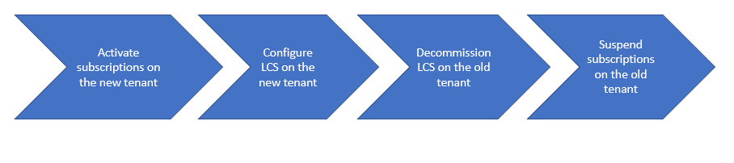

---
# required metadata

title: Move Lifecycle Services implementation projects to different Azure AD tenants
description: This article explains how to move your subscriptions and Lifecycle Services Implementation project to a different Azure AD tenant.
author: RicardoCaeiroPro
ms.date: 07/18/2023
ms.topic: article
ms.prod: 
ms.technology: 

# optional metadata

# ms.search.form:  
audience: IT Pro
# ms.devlang: 
ms.reviewer: twheeloc
# ms.tgt_pltfrm: 
# ms.custom: 
ms.search.region: Global
# ms.search.industry: 
ms.author: v-ricaei
ms.search.validFrom: 2018-05-30 
ms.dyn365.ops.version: AX 7.0
---

# Move Lifecycle Services implementation projects to different Azure AD tenants

[!include [banner](../includes/banner.md)]

You can move your subscriptions and your Microsoft Dynamics Lifecycle Services Implementation project to a different Microsoft Azure Active Directory (Azure AD) tenant. Here are some scenarios where this move might be required:

- Subscriptions were accidentally purchased against the incorrect Azure AD tenant.

    > [!NOTE]
    > If you're a cloud service provider, and you sell subscriptions for finance and operations apps to an existing customer, you must request a reseller relationship with that customer to put the subscriptions on the customer's existing Azure AD tenant. If you create a new customer record for the customer in Microsoft Partner Center, you create a new Azure AD tenant for the customer.

- The customer changes the structure of the Azure AD tenant after the subscription is purchased.

The process for moving your subscriptions and all related artifacts has four main steps, as shown in the following illustration.



## Activate subscriptions on the new tenant

Work with your cloud service provider or volume license reseller to activate the subscriptions against the new Azure AD tenant. All subscriptions for users, and for add-on environments, must be activated.

### Cloud service provider

If you're licensed through a Microsoft Cloud Solution Provider (CSP) agreement, purchase the required subscriptions against the new tenant from your cloud service provider. If the new tenant already exists, the cloud service provider must request a reseller relationship. Alternatively, in Partner Center, the cloud service provider must create a new customer that has the desired default domain name, **\*.onmicrosoft.com** (for example, **contoso.onmicrosoft.com**).

Ask the cloud service provider not to suspend the existing subscriptions at this time.

### Volume Licensing

If you're licensed through a Microsoft Volume Licensing agreement, you must call the [Volume Licensing support center](https://www.microsoft.com/Licensing/servicecenter/Help/Contact.aspx) and ask that the subscriptions be remapped from the old tenant to the new tenant. You can contact Volume Licensing Support through Microsoft 365 admin center. Request a grace period, when the subscriptions will be active on both tenants. Because of customer privacy concerns, this request must be made by the customer. You should have the following information available:

- Public customer number.
- Enrollment number.
- The current tenant domain that the subscriptions are currently provisioned on.
- The destination tenant domain that the customer wants the subscriptions provisioned under.
- A detailed explanation of why the customer must have its Volume Licensing subscriptions migrated to a different tenant.
- The total number of paid subscriptions that must be moved to the new tenant, together with the subscription type and seat count.

> [!IMPORTANT]
> It's crucial that the subscriptions be active on both tenants in parallel for a few weeks, until you've finished decommissioning Lifecycle Services on the old tenant.

## Configure Lifecycle Services on the new tenant

On the new tenant, you will get a new Lifecycle Services project that you must initiate and set up.

1. Complete the Project Onboarding wizard. For more information, see [Lifecycle Services project onboarding](../../dev-itpro/lifecycle-services/project-onboarding.md). When completing the wizard, you must indicate on the **Project Overview** page that you're **Moving existing Lifecycle Services project from another tenant** and provide the source Lifecycle Services project ID.
2. Fully configure Lifecycle Services. As part of this configuration, you must:
	1. Upload and activate a subscription estimator. If you're already live in the source Lifecycle Services project, you need to ensure that the estimates match.
	2. Add your deployable package to the asset library.
	3. Update your Business process modeler (BPM) library.

> [!IMPORTANT]
> During this period, you'll have two parallel Lifecycle Services projects. You can verify the name and ID of the Azure AD tenant that is associated with an Lifecycle Services project on the **Subscriptions available** page in Lifecycle Services.

## Move your sandbox environments to the new tenant
1. Deploy the nonproduction environments in the new Lifecycle Services project.
2. Apply the required code packages to the environments. Make sure that the target is running the same application version as the source. We recommend using [All-in-one deployable packages](../../dev-itpro/dev-tools/aio-deployable-packages.md) and include any ISV licenses, if applicable.
3. Upload data to the environments. You can move the data through data packages or by restoring the database. If you restore the database, more steps are required in order to remap some properties to the new tenant.
4. Update your user information.
	1. Remove all user accounts except the admin user.
	2. Fix the admin user record in USERINFO.
	
	```sql
        UPDATE USERINFO
        SET SID='mysid', NETWORKALIAS='myalias/email', NETWORKDOMAIN='https://sts.windows.net'
        WHERE ID = 'Admin'
        ```
5. Reimport all other users that have the correct security identifier (SID) and identity provider.
6. Run the following commands to update the tenant ID in the appropriate tables. You can verify the Azure AD tenant ID that is associated with an Lifecycle Services project on the **Subscriptions available** page in Lifecycle Services.
	
	```sql
	Update POWERBICONFIG set TENANTID = 'newtenantid' where TENANTID = 'oldtenantid'
	Update PROVISIONINGMESSAGETABLE set TENANTID = 'newtenantid' where TENANTID = 'oldtenantid'
	Update B2BINVITATIONCONFIG set TENANTID = 'newtenantid' where TENANTID = 'oldtenantid'
	Update RETAILSHAREDPARAMETERS set TENANTID = 'newtenantid' where TENANTID = 'oldtenantid'
	```

7. Fully configure the environments. As part of this step, configure the integration endpoints.
8. Perform smoke tests on the user acceptance testing (UAT) environment in the new Lifecycle Services project. These tests should focus on user sign-in, integrations, workflows, printing, reporting, and similar processes that depend on configuration and user information.

Depending on your solution and scope, you might have to perform more steps on the new Azure AD tenant. These steps might include registering applications (for recurring integrations and warehouse management), adding domains, and setting up directory synchronization to enable single sign-on (SSO).

Calls to web services are allowed only from the **home** tenant for the environment. For example, the original tenant was companya.com, and integration ran as `services\@companya.com`. In this case, when you switch tenants to companyb.com, you can no longer use `services\@companya.com` for web service calls, even if you update **userInfo.networkdomain** to `https://sts.windows.net/companyb.com`.

> [!IMPORTANT]
> On your sandbox environments, you'll lose any document handling attachments that are stored in Azure Blob storage. Blob storage will be moved by Microsoft only for production environments.

## Move your production environment to the new tenant

If you don't have a production environment deployed already on the old tenant, you can skip this section.

> [!IMPORTANT]
> Tenant migration can be done only if the **source and target Production environments are in the same region**. If the source is in a different region, it's required to move this environment to the same region where the target is. For more information about moving an environment, see [Finance and operations apps environment migration](/dynamics365/fin-ops-core/dev-itpro/deployment/environment-migration-process).

If you already had a production environment deployed on the old tenant, Microsoft will move your database and Azure Blob storage from your old production environment to the new one. As a prerequisite, you must complete the additional steps below after you've finished moving all the sandbox environments and completed UAT. The process of moving a production environment to a new tenant requires a downtime of up to 48 hours.

Before requesting the production environment, ensure that all prerequisites are completed:

1. Get all required licenses that are needed to correctly license all users on the production environment.
2. When the licenses are in place, upload a subscription estimator to the new Lifecycle Services project. It should match the subscription estimator that is active in the source Lifecycle Services project, and it must correctly reflect peak transaction volumes.
3. Send an email to Dynamics 365 FO Go-Live (d365fogl\@microsoft.com) stating that your new Lifecycle Services project is ready for Microsoft to move your production database and Azure Blob Storage. To ensure that the process will run smoothly, provide the following details in the email. We suggest that copy the following list to your email, and then answer all of the information line by line.

  **Lifecycle Services**
  - Provide the Lifecycle Services IDs (number in the Lifecycle Services project URL) for source and target Lifecycle Services project.
  - Confirm that the go-live date is set correctly in the target Lifecycle Services project.
  - Confirm that the update schedules are set in the target Lifecycle Services project (**Lifecycle Services > Menu > Project settings > Update settings**).
  - Confirm if you're using Azure Blob Storage for document attachments.
  - Confirm that your project is identified as a tenant move in the Project Onboarding wizard.
  - Confirm that your deployable package is marked as a release candidate in the target Lifecycle Services project.
  
  **Environment region**
  - Confirm that the target Production environment will be deployed to the same region whether the source Production environment is deployed.
   	  
  > [!IMPORTANT]
  > Tenant migration can be done only if the **source and target Production environments are in the same region**. If the source is in a different region, it's required to move this environment to the same region where the target is. For more information about moving an environment, see [Finance and operations apps environment migration](/dynamics365/fin-ops-core/dev-itpro/deployment/environment-migration-process).

  **Testing**
  - Confirm that the smoke testing is completed on the sandbox environment (Tier-2 or higher) in the target Lifecycle Services project.

  **Code Management**
  - Share which environment version you plan to deploy your new production environment.
  - List the ISV solutions you're using.
  - Confirm which version your old production environment is running on.
  - Confirm that nonstandard code to be applied in the new production environment will be exactly the same as the nonstandard code present in the old production environment in order to prevent database copy issues.
  - Confirm if there were any non-typical actions taken on your old production environment, which need to be considered on the new production environment, like installation of a custom font or environment upscale.

  **Cutover and timeline**
  - Describe how you'll conduct your cut over.
  - Confirm the dates when the source Lifecycle Services environments and project will be deallocated and deleted.
	
5. The Dynamics 365 FO Go-Live team will reply to you within two business days and a FastTrack team will work with you on the assessment of the project readiness for production deployment.
6. When the tenant move assessment is successfully completed, the FastTrack team will enable Production environment slot in Lifecycle Services.
7. Deploy Production environment in Lifecycle Services.

  - It's not possible to select the same name for the new production environment, as it's in use for your old production environment. You need to choose a new environment name so that a new URL is generated.
  - Make sure you select the same application version that is used by your current production environment.
  - In the Production configuration wizard, select a generic user account, not a named user, as Environment Administrator.

8. After the production environment has been deployed, verify that source and target environments have exactly the same code, otherwise migration will fail. If necessary, deployable packages must be installed on the target production environment.
9. Request to copy database and blob storage from the old production environment to the new production environment. Submit a **support ticket** requesting a copy of the database and blob storage, if applicable, from the old production environment to the new production environment. Be sure to include Lifecycle Services IDs and environment IDs from source and target projects in the support ticket.
	 
  - This process requires interaction between Microsoft and the implementing project team. Ensure that you follow the email notifications or notifications directly in the service request.
  - After Microsoft has completed the tenant migration activity and informed you to continue with the next steps, you need to reimport all users from the new Azure Active Directory tenant. 
  - You need to validate the new production environment to ensure that all business processes are successful. 
  - If you encounter an issue after the migration, file a support ticket.

## Tear down the Lifecycle Services project on the old tenant

After the new Lifecycle Services project on the new Azure AD tenant is fully functional, you must stop, deallocate, and delete the environments on the old Lifecycle Services project. When you've finished, the **Configure** button becomes available for each environment. If you already had a production environment on the old tenant, you must file a support ticket to have it deleted.

You should save any remaining artifacts from the Asset library that you might require later.

After all environments have been deleted and all artifacts saved, an Organization Administrator on the old tenant must delete the Lifecycle Services project.
Microsoft reserves the right to disable the customer's account and delete the customer data after the service has been suspended for an extended period.

## Suspend subscriptions on the old tenant

After all the environments have been deleted, and you've saved the Lifecycle Services artifacts that you require, work with your cloud service provider or Volume Licensing Support to suspend all the licenses on the old Azure AD tenant.

- **Cloud service provider** - Suspend the existing subscriptions against the old tenant.
- **Volume Licensing Support** - Call Volume Licensing Support to confirm that you've completed the work and that the subscriptions can now be suspended against the old tenant.


[!INCLUDE[footer-include](../../../includes/footer-banner.md)]
