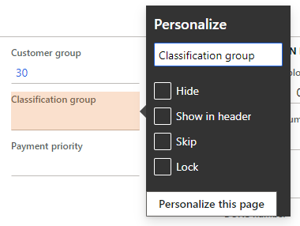
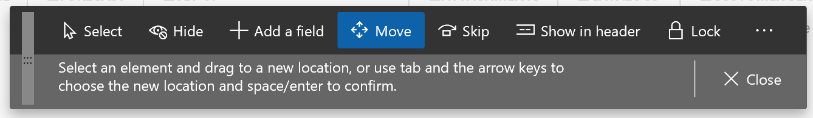
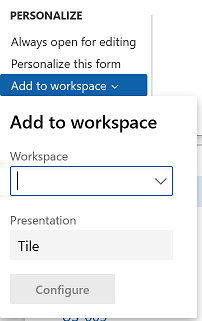

---
# required metadata

title: Personalize the user experience
description: This article explains how you can personalize the app.
author: jasongre
ms.date: 06/03/2022
ms.topic: article
ms.prod: 
ms.technology: 

# optional metadata

ms.search.form: SysUserSetup, DefaultDashboard
# ROBOTS: 
audience: Application User, IT Pro
# ms.devlang: 
ms.reviewer: twheeloc
# ms.tgt_pltfrm: 
ms.assetid: 57b445d7-3e9e-4228-8728-f63b9dbd77a3
ms.search.region: Global
# ms.search.industry: 
ms.author: jasongre
ms.search.validFrom: 2016-02-28
ms.dyn365.ops.version: AX 7.0.0

---

# Personalize the user experience

[!include [banner](../includes/banner.md)]

[!INCLUDE [PEAP](../../../includes/peap-3.md)]

This article explains how you can personalize the app and covers the following subjects: 

- **System-wide options** – These personalization options are made on a setup page and are available to all users. Examples include the color theme and time zone. 
- **Restricted personalization access** – At this access level, user actions that are associated with typical page usage are automatically saved by the app and restored the next time that you visit the page. For example, the app stores the width of grid columns if you adjust them, and the expanded or collapsed state of FastTabs. 
- **Full personalization access** – At this access level, users have access to all personalization capabilities in the app. In particular, they have access to the **Personalization** toolbar. 
- **Sharing personalizations** – Users who have full personalization access can export their page personalizations and share them with other users.
- **Administration of personalizations** – Privileged users can access the **Personalization** administration page to manage all personalizations at an organizational level. 

## System-wide options for the current user

The **User options** page contains several system-wide settings for the current user. These options are available to all users, even users who haven't been given any access to personalization. To open the **User options** page, select the **Settings** button on the navigation bar, and then select **User options**. The **User options** page has four tabs that contain various user settings:

- **Visual** – Select a color theme and the default size of elements on pages.
- **Preferences** – Select default values that are used every time that you open the system. These values include the default company, the initial page, and the default view/edit mode. (The view/edit mode determines whether a page is locked for viewing or opened for editing every time that you open it.) This tab also includes options for the language, the time zone, and date, time, and number formats. Finally, this tab includes several miscellaneous preferences that vary from release to release.
- **Account** – View or adjust your user name and other account-related options.
- **Workflow** – Select workflow-related options.

In addition to changing your user settings, you can also view and delete your usage data and personalizations from the **User options** page. To see your usage data, select **Usage data** on the Action Pane. On the **Personalization** tab, you can view and manage the personal changes that you've made to pages in the system. On this tab, you can also reset feature callouts (that is, the pop-up windows that introduce new system features). You will then be alerted again about previously encountered features.

> [!NOTE]
> If the [Saved views](saved-views.md) feature is turned on, you can view and manage your personalizations by selecting **Personalization** on Action Pane on the **User options** page.

## Restricted personalization access (formerly implicit personalizations)

At the **restricted personalization access** level, user actions that are associated with typical page usage are automatically saved by the app and restored the next time that you visit the page. No explicit save action is required. 

Here is a list of the actions that fall under typical page usage and are covered by restricted personalization access: 

- **Grid column widths** – You can adjust the width of a column in a grid by selecting the sizing bar to the left or right of the column header, and then sliding it left or right until the column is the desired width. The app stores the width that you set for a column. Then, the next time that you open that page, the column will be resized to that width.
- **Grid footer and column totals** – *(Available only when the new grid control is turned on)* You can decide whether a total should be shown at the bottom of any numeric column in a grid, and whether the grid footer should be visible. The app stores these preferences and applies them the next time that you open the page. For more information, see [Grid capabilities](grid-capabilities.md). 
- **FastTabs** – Some pages have expandable sections that are known as *FastTabs*. The app stores information about the FastTabs that you've expanded or collapsed. The next time that you open the page, the same FastTabs will be either expanded or collapsed, based on your last interaction with the page. In some cases, you can help improve system performance by collapsing a FastTab, because the app doesn't have to retrieve the information for FastTabs until they are expanded. As is explained later in this article, you can also change the order of the FastTabs on a page.
- **FactBoxes** – Some pages have a **Related information** pane that shows read-only information that is related to the current subject of the page. Each section in the **Related information** pane is known as a *FactBox*. You can expand or collapse the **Related information** pane, and you can also expand or collapse individual FactBoxes. The app stores these preferences. The next time that you open the page, the **Related information** pane and the individual FactBoxes will be either expanded or collapsed, based on your last interaction with the page. In some cases, you can help improve system performance by collapsing the **Related information** Pane or a FactBox, because the app doesn't have to retrieve the information for FactBoxes until they are expanded.
- **Action Panes** – An *Action Pane* appears near the top of most pages. The Action Pane contains buttons for many of the actions that you can perform on the current page. These buttons are often organized on tabs. You can *pin* the whole Action Pane open, or you can have it collapsed by default. The next time that you open the page, the Action Pane will be either open or collapsed, based on your last interaction with the page. If you pinned the Action Pane open, the last tab that you were using will be shown.
- **QuickFilters** – A *QuickFilter* appears above many grids. The QuickFilter lets you filter the grid based on a single column that you select. The app stores the column that you filtered on. Then, the next time that you open that page, the grid will use that same column for filtering by default. However, you can still select a different column to filter the grid on.
- **Column header filters** – When you filter a grid by using *column header filters*, you can change the filter operator as you require to find the data that you want. For example, you can change the operator from **begins with** to **is exactly**. Every time that you use a column header filter and change the filter operator, the app stores the change. Then, the next time that you filter on that column, the filter operator will be restored.
- **Navigation pane** – You can open the *navigation pane* by selecting the **Expand the navigation pane** button in the upper left of any page. (This button is sometimes referred to as the _**Menu** button_, *hamburger*, *hamburger menu*, or *hamburger button*.) You can pin the navigation pane open, or you can have it collapsed by default. After you pin the navigation pane open, the app will keep it open until you collapse it.

## Full personalization access (formerly explicit personalizations)

At the **full personalization access** level, users have access to all the personalization capabilities that the app provides. Because different people and companies have different needs when they interact with the app, especially in terms of utilized fields, personalization provides tools that let users and organizations tailor the way that information is ordered and interacted with in the app. These capabilities are key to providing simplified, optimized experiences in the app that are tailored to you and your organization. 

If the [Saved views](saved-views.md) feature is turned on, an explicit save is required to persist these changes to the user experience for a specific view. When the **Saved views** feature is turned off, these changes are automatically saved.

The following sections cover the extent of personalization capabilities that are available to users at the **full personalization access** level. Here are some of these capabilities:

- Shortcut menu options
- The **Personalization** toolbar
- Adding tiles, lists, and links to workspaces
- Adding a summary from a workspace to a dashboard
- Personalizing the dashboard

### Shortcut menu options

Shortcut menus provide one way to change a page's interface so that it better meets your requirements or the requirements of your organization. (A shortcut menu is also known as a *right-click menu* or a *context menu*.)

Some of the most typical and important changes that can be made to a page are available directly as options on a shortcut menu. For example, if you want to add or hide columns in a grid, just right-click a column header, and then select **Insert columns** or **Hide this column**.

Additionally, the most basic types of personalizations are available by right-clicking an element and then selecting **Personalize**. (Note that not all elements on your page can be personalized.) When you use this personalization method, the element's *property window* appears.

You can use the property window to personalize an element in the following ways:

- Change the element's label.
- Hide the element so that it isn't shown on the page. The data in the field isn't deleted or modified. The information just isn't shown on the page any longer.
- Include the information in the FastTab's summary section (if the element is on a FastTab).
- Skip the field so that it never receives focus when you tab through the page.
- Prevent data in the field from being edited (for any record).
- Designate a field to be required for data entry. If no value has been entered in this field, it will appear with a red border and an asterisk to indicate this state. This option is only available starting in version 10.0.11 when the [Saved views](saved-views.md) and **Designate fields as required using personalization** features are turned on.

The property window might include other personalization capabilities, depending on the element. For example, the property window for a tile might let you promote that tile to a dashboard, and property windows for elements on the default dashboard might let you create a new custom workspace.

### Personalization toolbar

If you want to make multiple changes to a page, or changes that aren't available through other mechanisms (for example, if you want to reorder elements), you can use the **Personalization** toolbar. To open the **Personalization** toolbar, follow one of these steps:

- Select **Ctrl+Shift+P** from any element on the page.
- Select **Personalize this page** in an element's property window.
- Select **Personalize this page** in the **Personalize** group on the **Options** tab of any page's Action Pane.
- Select the **Settings** button (the gear symbol) on the navigation bar, and then select **Personalize**.

#### Navigating the page

When the **Personalization** toolbar is open, the underlying page is read-only (in other words, you can't edit data), but it's still interactive. Specifically, you can expand or collapse the **Related information** pane, switch tabs, and expand or collapse sections, just as you would usually perform those actions on the page. To apply a personalization to a collapsible section or tab (for example, to hide a FastTab), you just have to select the button that appears next to that section or tab when it gains keyboard focus or when you hover over it.

#### Personalization tools

The following tools are available on the **Personalization** toolbar:

- Use the **Select** tool to select and change the properties of an element. To use this tool, select the **Select** button on the toolbar, and then select the desired element. The element's property window appears, where you can change any of the properties of that element. You can repeat the process for other elements that can be personalized on the page. Note that some personalization properties might not be available in some scenarios. For example, you can't lock a field that is required.
- Use the **Hide** tool to hide an element on the page. To use this tool, select the **Hide** button on the toolbar, and then select the element to hide. When you use the **Hide** tool, all elements that are currently hidden are made visible, but they are shown in a shaded container. You can then make an element visible by selecting it. To see how the page will look when elements are hidden, switch to another personalization tool or close the personalization toolbar.
- Use the **Add fields** tool to add fields to your page. When you use this tool, you can only add fields that are part of the page definition. For information about how to create new fields that aren't part of the current page definition, see [Create and work with custom fields](user-defined-fields.md). After you select the **Add fields** button on the toolbar, you must first select the grid or section where you want to add a field. A dialog box will show the list of fields that are related to the selected grid or section. In the dialog box, select one or more fields to add from either the **Recommended fields** or **All fields** list. After choosing the desired fields, select **Update**. To remove a field that you previously added, repeat the process, but clear the selection of the field in the dialog box.

    The **Recommended fields** list shows fields that have been previously added by other users in your organization. This list of fields is updated based on the recurrence frequency of the **Recommendation batch job**. A similar experience exists when adding new filter fields using the Filter pane on a page.

- Use the **Move** tool to move an element to a different location in the current group of elements. Note that you can't move an element outside its parent group. To use this tool, select the **Move** button on the toolbar, and then select the element to move. When you select an element, the app determines the locations where the element is allowed to be moved. These locations are known as *drop zones*. As you drag the element around in the current group, each drop zone is shown as a colored, bold line next to the area where the element can be dropped.
- Use the **Skip** tool to remove an element from the page's keyboard tab sequence. When you select the **Skip** button on the toolbar, all elements that are currently skipped are shown in a shaded container. You can interactively remove or add fields to the tab sequence.
- Use the **Show in header** tool when you want a field to appear in the FastTab's summary section. When you select the **Show in header** button on the toolbar, all fields that have been selected as summary fields are shown in a shaded container. You can interactively add fields to the FastTab summary and remove fields from the summary by selecting the fields.
- Use the **Require** tool to designate an element as required for data entry. When you select the **Require** button on the toolbar, all elements that have been personalized to make them required are shown in a shaded container. You can then make them not required again. This option is available in version 10.0.12 and later when the **Designate fields as required using personalization** feature is turned on.
- Use the **Lock** tool to mark an element as either editable or noneditable. When you select the **Lock** button on the toolbar, all elements that are currently noneditable are shown in a shaded container. You can then make them editable again. Note that some fields are required and can't be made noneditable. A padlock symbol appears next to those fields.
- Use the **Add an app from Power Apps** tool to embed an app that was created by using Microsoft Power Apps into the page. For detailed information about how to embed an app from Power Apps into a page, see [Embed apps from Power Apps](embed-power-apps.md). This option is available only when the [Saved views](saved-views.md) feature is turned off.
- Use the **Add an app** button to embed an app, either one created from Microsoft Power Apps or a third-party, into the page. This option is only available when the [Saved views](saved-views.md) feature is turned on. 
- Use the **Clear** tool to reset the page to its default, installed state. All personalizations on the current page will be cleared. You can't undo this action. Therefore, use this tool only if you're sure that you want to reset the page. When the **Saved views** feature is turned on, this tool clears the personalizations for the current view.
- Use the **Import** tool to load a personalization from a file that you or someone else previously created. 

    - When the **Saved views** feature is turned off, you can choose whether to add or replace your existing personalizations with the personalizations that are being imported for the page. You can't undo this action. Therefore, after you import personalizations, you must manually clear or undo any changes that you don't want.
    - When the **Saved views** feature is turned on, the imported personalizations will become a view on the page. If the view already exists, you will have the option to skip the import, replace the current view that has the same name, or rename the imported view.

- Use the **Export** tool to save your personalizations for the page to a file. You can then share your personalizations with other users. Those users just have to import the file that contains your personalizations for the page. When the **Saved views** feature is turned on, this tool saves your current view to a file for sharing.
- Select the **Close** button to close the **Personalization** toolbar and return the page to its previous interactive state.

Traditionally, when the **Personalization** toolbar is used, your personalizations take effect as soon as you make them. However, if the [Saved views](saved-views.md) feature is turned on, you must explicitly save personalizations to a view that you choose.

In some cases, when you select a tool, a padlock symbol appears next to an element. This symbol indicates that you can't modify the element properties that are related to the selected tool, because changes to those properties will prevent the page from working correctly.

### Adding tiles, lists, and links to a workspace

For some pages that include lists, the **Add to workspace** personalization feature is available in the **Personalize** group on the **Options** tab of the Action Pane. This feature lets you push relevant information from the current list to a specific workspace. The information that appears in the workspace can be based on either the whole list, or a filtered and sorted version of the list. You can also specify whether the information appears in the workspace as a list, a summary tile that can show the number of items in the list, or a link.

> [!NOTE]
> If the [Saved views](saved-views.md) feature is turned on, the content that you push to a workspace is directly linked to a view. The view's query is used to retrieve data into the workspace, and the corresponding tile or link in the workspace opens the page to that view, so that the view's query and personalizations are applied to it. If the view is updated, the corresponding workspace elements will be adjusted to the new view definition.

- To add a list to a workspace, first sort or filter the list on the page so that it shows the information as you want it to appear in the workspace. (If the **Saved views** feature is turned on, you can't continue until you save a view that has these conditions.) Then select **Add to workspace**. Select a workspace, and then, in the **Presentation** field, select **List**. After you select **Configure**, a dialog box appears, where you can select the columns that should appear in the list in the workspace. You can also specify the label that is used for the list in the workspace.
- To add a tile to a workspace, first filter the list on the page so that it shows the data that should be summarized or that you want quick access to. (If the **Saved views** feature is turned on, you can't continue until you save a view that has these conditions.) Then select **Add to workspace**. Select a workspace, and then, in the **Presentation** field, select **Tile**. After you select **Configure**, a dialog box appears, where you can specify the label that should be used for the tile in the workspace. You can also specify whether the tile should show a count. After the tile is added to the workspace, you can select it to open the current page from the workspace. You can then view the filtered list that is associated with the tile.
    - Starting in version 10.0.26, if the **Allow users to select and change tile sizes** feature is enabled, you can select one of four available **Tile sizes** for your new tile in the **Configure tile** dialog. This feature also allows you to adjust the tile size after it's created directly from the workspace.   
- To add a link to a workspace, first filter the list on the page so that it shows the data that you're interested in. (If the **Saved views** feature is turned on, you can't continue until you save a view that has these conditions.) Then select **Add to workspace**. Select a workspace, and then, in the **Presentation** field, select **Link**. After you select **Configure**, a dialog box appears, where you can specify the label that should be used for the link. You can also optionally specify a label for the section where this link can be placed. If that section doesn't exist, a new section will be created.

> [!NOTE]
> As of version 10.0.25, when you configure your list, tile, or link, you might also have to select the workspace views that you want to add the element to if the **(Preview) Saved views support for workspaces** feature is enabled. The available workspace views will appear in the **Workspace options** section of each **Configure** dialog box. 

After you've added a list, tile, or link to a workspace, you can open that workspace and rearrange the elements in it as you want.

### Adding a summary from a workspace to a dashboard

Some workspaces contain count tiles (that is, tiles that have numbers on them), and you might want those tiles to appear on your dashboard too. In a workspace, right-click a count tile, select **Personalize**, and then, in the tile's property window, select **Pin to dashboard**. The next time that you open and refresh the dashboard, the count will appear below the navigation tile for that workspace. You can select that count to go directly to the data that it represents.

### Changing the size of a tile
Starting in version 10.0.26, the **Allow users to select and change tile sizes** feature allows users to modify the size of any non-KPI tile via personalization. In a workspace, right-click a tile, and then select **Personalize**. In the tile's property window, select the desired size from the **Tile size** options. The tile size will adjust immediately. If the **(Preview) Saved views support for workspaces** feature is enabled, you can save this personalization to a workspace view.  

### Personalizing your dashboard

The dashboard is often the first page that you see when you open the app. It can be personalized like any other page in the system, by using the same mechanisms that are described earlier in this article. 

> [!WARNING]
> Currently, when you hide content on the dashboard, it's important that you directly target a tile, not the space around it. If you hide the group around a tile, there could be unexpected results if more tiles are added later, or if the system is switched to a different language.

One unique personalization capability that is available on the dashboard is the ability to add tiles. 

- If the **Full-page apps** feature is turned off, you add a new tile by right-clicking an element on the dashboard and then selecting **Add a workspace**. A new workspace tile is created at the bottom of the dashboard. You can rename this new workspace tile as you want. You can also add lists, tiles, and links to the workspace, as described in the [Adding tiles, lists, and links to a workspace](personalize-user-experience.md#adding-tiles-lists-and-links-to-a-workspace) section of this article.
- If the **Full-page apps** feature is turned on, you add a new tile by right-clicking an element on the dashboard and then selecting **Add an app**. In the dialog box, select whether you want to add a tile for a new workspace or a tile that has content from Power Apps or a website. Then follow the steps to configure the option that you selected. A new tile is created at the bottom of the dashboard. For more information about how to add, edit, delete, and share these embedded apps, see [Embed canvas apps from Power Apps](embed-power-apps.md) and [Embed third-party apps](embed-website.md).

## Sharing personalizations

After you personalize a page, there are a few methods that you can use to share your personalizations with other users. In the following list, the methods are arranged in order from most recommended to least recommended.

1. Publish views to users.
2. Copy views or personalizations to users.
3. Export and import views or personalizations.

### Publish views to users

If the [Saved views](saved-views.md) feature is turned on, and if the page supports views, the best way to share personalizations with other users is to publish the view to users who have one or more security roles. For more information, see [Publishing views](saved-views.md#publishing-views).

### Copy views or personalizations to users

If the [Saved views](saved-views.md) feature is turned off, or if the page doesn't support views, the recommended way to share personalizations is to copy them between users. This method is available only to privileged users (for example, system admins). However, admins can look up a specific user's personalization in the system (including the user's personal view if saved views are enabled) and copy the configuration to other users.

If saved views are enabled, follow these steps to copy personalizations.

1. Go **System administration \> Setup \> Personalization**.
2. Follow these steps to copy personal views:

    1. Select **Personal views**.
    2. Select the desired views in the list.
    3. Select **Copy to users**.
    4. Select the users to distribute the views to.

    Follow these steps to copy personalizations on pages that don't support views:

    1. Select **User settings**.
    2. Select the user who has the personalization that you want to distribute.
    3. Select **Manage all personalizations**.
    4. Select the desired personalizations in the list.
    5. Select **Copy to users**.
    6. Select the users to distribute the personalizations to.

If saved views aren't enabled, follow these steps to copy a personalization.

1. Go **System administration \> Setup \> Personalization**.
2. Select **Apply**.
3. Select the users to distribute the personalization to.
4. Select **Select existing personalization**.
5. Find and select the (single) personalization that you're interested in.
6. Select **OK**.

### Export and import views or personalizations

Another way to share personalizations is via export and import. Individual users, or an admin who acts on their behalf, can use this method to export their personalizations or views, and then give the exported file to other users to import. Alternatively, users can give their exported personalizations to a user who has admin privileges, and that user can then use the **Personalization** administration page to apply the personalization file to many users at the same time.

> [!IMPORTANT]
> As personalizations persist across updates, re-importing all personalizations after a service update or at any other time is unnecessary and highly discouraged.

#### Export

In general, you can export one of your own views or personalizations by opening the appropriate page, opening the **Personalization** toolbar, and then selecting **Export**. For more information about the toolbar, see the [Personalization toolbar](#personalization-toolbar) section earlier in this article. Alternatively, if [saved views](saved-views.md) are enabled, you can go to **Settings \> User options \> Personalization** to view a list of all your personalizations in the system. From there, you can select the views or personalizations to export, and then select **Export**.

Additionally, admins can export other users' personalizations by following these steps.

1. Go to **System administration \> Setup \> Personalization**.
2. On the **Users** tab, select the desired user.
3. Find and select the view or personalization that you're interested in.
4. Select **Export**.

#### Import

To import a view or personalization, you can just open the **Personalization** toolbar and select **Import**. Additionally, admins can import a file and immediately give it to one or more users.

If saved views are enabled, follow these steps.

1. Go to **System administration \> Setup \> Personalization**.
2. On the Action Pane, select **Import views \> User views**.
3. Select the import mode:

    - **Select specific users** – Give the view or personalization to selected users.
    - **Import as-is** – Import the view or personalization to the same user who exported it.

4. Select **Browse**, and find and select the personalization to import.
5. Select **Next**.
6. If you selected **Select specific users** in step 3, select the users to import the personalization to.
7. Select **Import**.
8. Resolve conflicts as required.

If saved views aren't enabled, follow these steps.

1. Go to **System administration \> Setup \> Personalization**.
2. Select **Apply**.
3. Select the users to distribute the personalization to.
4. Select **Import personalizations from a file**.
5. Select **Browse**, and find and select the personalization to import.
6. Select **OK**.

## Administration of personalizations

The **Personalization** page is the central hub for managing personalizations at an organizational level. The content and capabilities on this page depend on whether the **Saved views** feature has been turned on.

For customers who have turned on the **Saved views** feature, see the "Managing views globally" section in the [Saved views](saved-views.md) article.

For customers who haven't yet turned on the [Saved views](saved-views.md) feature, this page has four tabs:

- **Apply** – You can import or select a personalization for one or more users. To apply a personalization to one or more users, first select a role and users who have that role. Then either select an existing personalization to apply to the selected users, or import a personalization file. The personalization is validated and will be applied to all the selected users the next time that they open the selected page.
- **Clear** – You can clear all personalizations for a page or workspace for one or more users. First select a page or workspace to see a list of the users who have personalized it. Then select the users who should have personalizations for that page or workspace cleared, and select **Clear**. All personalizations that the selected users have applied to the selected page or workspace are deleted. This action can't be undone. However, if a personalization was saved for the page or workspace, that personalization can be reimported.
- **Users** – Select a user to see a list of the pages that the user has personalized. You can then turn that user's ability to use personalizations for specific pages, or for the whole system, on or off. You can also import, export, or clear a personalization for the user. In addition, you can reset feature callouts for the user. In this case, if the user previously dismissed any pop-up windows that introduce new features, they will appear again the next time that the user encounters those features.
- **System** – You can temporarily turn off personalization for all users in the system. In this case, all personalizations are deleted for all users, and all pages are reset to their default state. If you turn personalization back on later, all personalizations are reapplied. You can also permanently delete all personalizations for all users in the system. Personalizations that have been deleted can't be recovered. Therefore, before you perform this task, be sure to export any personalizations that you might want later.

### Service updates and personalization
Personalization data does not need to be cleared or reset when moving to a new version of the product. Personalizations and saved views data will continue to work across updates. Exceptions to this would include changes to the form itself that invalidate a personalization (such as a removed control) or changes to the form's base query that changes its data source subtree so that it no longer matches the data source subtree associated with the view query.

## Personalizing inventory dimensions

When you personalize the setup of inventory dimensions on a page, consider the settings that have been created by using the **Display dimension** option. For example, you use personalization to hide a column for the Batch number inventory dimension, but the column appears the next time that the page is opened. This behavior occurs because the **Dimension display** settings control the inventory dimension columns that are shown. The **Dimension display** settings apply across all pages and override any personalized setup of inventory dimension fields on individual pages.

Therefore, in the preceding example, if you don't want the column for the Batch number inventory dimension to appear on a page, you must clear that dimension as part of the **Display dimensions** option for that page.

[!INCLUDE[footer-include](../../../includes/footer-banner.md)]
