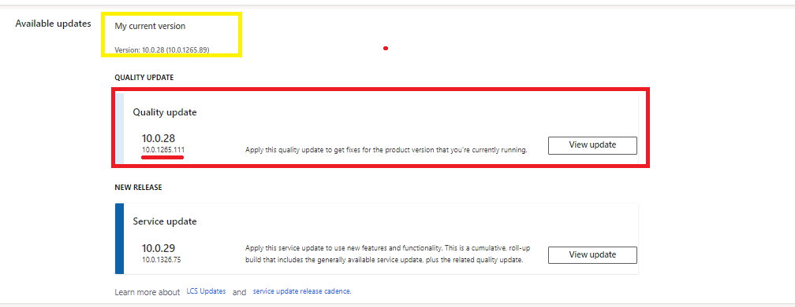

---
# required metadata

title: Proactive quality updates
description: This article provides information about proactive delivery of quality updates.
author: rashmansur
ms.date: 11/07/2022
ms.topic: article
audience: Application User, Developer, IT Pro
ms.reviewer: johnmichalak
ms.search.region: Global
ms.author: rashmim
ms.search.validFrom: 2022-08-19
ms.search.form:
ms.dyn365.ops.version: 10.0.29
---

# Proactive quality updates

[!include[banner](../includes/banner.md)]

Over the last several years, Microsoft has made continuous progress on what we refer to as [One Version](../../dev-itpro/lifecycle-services/oneversion-overview.md). The premise of One Version is simple: the closer that we can get to having all customers on the same software version, the higher the quality that we can deliver. We find and fix issues once, and we get those solutions into the hands of more customers more quickly.

This premise is confirmed by the results: lower incident counts across our products. When customers aren't on the same version, we consistently see that they are affected by issues that a solution is already available for. We've already made great progress with Dynamics 365 Finance, Dynamics 365 Supply Chain, Dynamics 365 Project Operations, and Dynamics 365 Commerce, and thanks to recent technical advances, it's now possible to take the next step. The following information lays out what we're going to do, what we've already done to set the stage, and how and when we will introduce the new capabilities without disruption.

## What you need to know

- Proactive quality updates (PQU) are applied on a monthly basis.
- Exceptions for proactive quality updates are allowed for customers that are regulated by the US Food and Drug Administration (FDA) only.
- Proactive quality updates will never downgrade the environment or automatically upgrade from one service update version to another. 
- Microsoft is determining how proactive quality updates will be managed for regulated environments, and for sovereign and government cloud customers.
- Notifications that are related to proactive quality updates are posted in the [Message center - Microsoft 365 Message Center](https://admin.microsoft.com/AdminPortal/#/MessageCenter) and search for Finance.
- Customers are notified at least five days before a proactive quality update is applied to an environment.
- Customers can't cancel or postpone proactive quality updates.
- Proactive quality updates are installed during the region-specific [planned maintenance window](../../dev-itpro/deployment/plannedmaintenance-selfservice.md#windows).
- Quality updates are engineered to have a low risk of issues or regressions, and this is supported by Microsoft data.
- Microsoft recommends targeted testing for specific issues or specific hotfixes that are related to a proactive quality update.
- ALL sandboxes, except those that have a time bound exception due to regulatory reasons, will be onboarded by January 7th 2023.
- Production onboarding for Proactive Quality updates will begin from January 21, 2023. 
- Production onboarding will only start for Lifecycle Services projects that have sandbox(es) onboarded and so far receiving proactive quality updates at a regular cadence for all supported service update versions. This is only applicable to customer environments who have not been provided any exceptions due to regulatory or other legal reasons.
- For a full schedule of proactive quality updates for sandbox and production environments over the course of 2023, see below.
- Every service update has at least one PQU release train ongoing or slated to begin. Once your environments are onboarded to the PQU process, you may receive a pre-scheduled proactive quality update on all of them when you move to a newer version service update. Please check the schedule to determine when a PQU for a service update is scheduled if you plan to upgrade to a newer version service update. 

> [!IMPORTANT]
> Production environments receive PQUs on weekends during dark hours. If a Service Update is scheduled within seven days of a PQU, then the scheduled PQU gets skipped. For example, if a PQU is scheduled on January 28, 2023 for a production environment, and a Service update is scheduled on February 4, 2023 for the same env, PQU on January 28, 2023 will be skipped. 

> [!Note]
> 1. Standard performance test (tier4) and Premium performance test (tier5) sandboxes will receive PQUs on weekends along with production environments of their region. 
> 2. If a PQU of production environment, Standard performance test (tier4) or Premium performance test (tier5) sandboxes didn't complete on the scheduled weekend then the operation gets rescheduled to the next weekend. 

## Focus on quality updates

We currently provide seven [service updates](public-preview-releases.md) per year. For example, version 10.0.29 is a service update. Until recently, there were eight updates per year. However, we dropped one update in response to customer feedback that revealed a desire to avoid changes near the end of the calendar year.

We won't be changing the cadence of the service updates. Instead, our next step forward in the One Version journey is focused on *quality updates*. Quality updates are cumulative builds of hotfixes. They don't include new features. At any given time, our entire community of customers is spread between the three or four most recent service updates. However, for any given service update, dozens of different quality update versions can be used within the group, depending on the dates when people deployed. In our next step, we will proactively broadcast quality updates. We already use this model for our Dataverse-based applications and have seen the expected results of improved quality and decreased support incidents.

Of course, a reduction in defects could reduce or completely eliminate the need for quality updates. We have multiple initiatives in flight to reduce the defects that require quality updates. Even when payloads are reduced in the quality update, consistency across the customer base will improve supportability, get improvements to customers more quickly, and reduce the frequency of customers encountering issues that solutions already exist for.

## Making proactive distribution possible

Multiple advances have already been deployed that enable proactive delivery of quality updates:

- **Near-zero downtime updating** – To push more frequent environments, it's essential that the impact to environment availability be reduced to preserve Dynamics 365 Service Level Agreements (SLAs). Near-zero downtime updating was originally introduced to help improve monthly operating system patching by using a cluster failover to activate the updated image with minimal disruption. The mechanism for applying updates is being enhanced so that it's even less disruptive, and it will cover both operating system patching and quality update deployment.

    For interactive users, an active session might be interrupted, and the retry will go to the now-updated environment. With the introduction of [priority-based batch scheduling](../../dev-itpro/sysadmin/priority-based-batch-scheduling.md), batch scheduling and processing recovers and resumes immediately after the update. Priority-based batch scheduling will be in place for customers before they start to participate in proactive distribution of quality updates for their production environments.

- **Dark hours** – Dark hours are defined for each Azure region, and near-zero downtime updates will occur during the dark hour period.

## The proactive update process

Deployment of proactive quality updates will follow a safe deployment process (SDP). The specifics of the SDP will evolve, but quality updates will initially be deployed to sandbox environments. As the percentage of successfully deployed sandboxes increases, deployment to production environments will begin. Listening systems will monitor system telemetry and Livesite incidents, and will stop the rollout of a specific version if any regression is detected. Customers will still be able to pull the quality updates ahead of proactive deployment if they want.

Current release management data shows that less than 3 percent of regressions are introduced in quality updates. With increased focus on eliminating regression and an enhanced SDP, the potential impact of regressions will be dramatically lower than the quality gains that are achieved by more quickly getting fixes deployed to customers broadly.

## Process changes

A set of process changes is being implemented ahead of the activation of proactive quality update deployment:

- **Schema** – Tooling will ensure that quality update builds include only schema changes that can be applied while the service is online. This approach will help preserve the ability to apply the update with near-zero downtime.
- **Increased change scrutiny** – Currently, there is already an extra process step to approve changes for inclusion in a quality update. The scrutiny in the extra step will be increased to help reduce the potential for regressions. Breaking changes aren't allowed in quality updates, and the increased change scrutiny will help ensure that we meet this target.
- **Visibility** – Notifications are sent through the admin center, Lifecycle Services, and other available channels for upcoming proactive quality updates. In addition, support teams and incident leads will have visibility into where quality updates have been proactively deployed.

    > [!NOTE]
    > The Microsoft Communications team is investigating an ongoing degradation of the email tooling which is preventing the delivery of email notifications. Please continue to monitor the Microsoft 365 Message Center for onboarding and notification related messages.

- **Fail Safe via flighting** – Flighting will be used to guard code changes wherever applicable in a quality update bug fix or use the existing feature flighting relevant to the fix. If a fallback or turning a change off change is required after a proactive deployment, it can be done through the flighting system to avoid further failures.
- **Sandbox sync designation** – Staggered update to an isolated sandbox of choosing along with production is not supported at this time. All tier-2 and tier-3 sandboxes will receive proactive updates atleast 7 days prior to production environment in an Lifecycle Services project. Again, this is only applicable to customer environments that are not provided any exceptions due to regulatory or other legal reasons.

## What is the rollout roadmap for quality updates?

Distribution of proactive quality updates for sandbox environments began in September 2022 for Azure public cloud customers. By January 1, 2023, we will be completing onboarding 99% of sandboxes to proactive quality updates.

Exceptions to the proactive updated distribution process are allowed only for FDA-regulated customers. We're still working out how regulated environments and sovereign and government cloud customers will be managed. 

Because customers will regularly receive smaller payloads, we expect the process of staying current to become simpler. We will adjust the frequency of update deployment as we demonstrate the ability to run the process without disruption. This process is already working effectively for our Dataverse platform and applications and is delivering the anticipated improvements in service quality. We are taking the same step forward for finance and operations applications.

## When will quality updates start for production environments?
Over the first few months of 2023, beginning Jan 15th - we will begin onboarding production environments to proactive updates and gradually increase the percentage of production environments that receive proactive updates. We will only target a production environment in an Lifecycle Services project that has the sandbox environments already onboarded to receive proactive updates. Before an update, customers with the production environments being onboarded will be notified through message center or Lifecycle Services banner. For a full schedule of proactive quality updates for sandbox and production environments over the course of 2023, see below.

## What is the schedule for sandbox proactive quality updates?
For information on the dark hours for each region, see [What are the planned maintenance windows by region?](../../dev-itpro/deployment/plannedmaintenance-selfservice.md#windows).

###  Proactive quality update Calendar year 2023 schedule

####  Stations to Region Mapping

| Stations | Regions |
|---|---|
| Station 1 | TBD |
| Station 2 | Canada Central, Canada East, France Central, India Central, Norway East, Switzerland West |
| Station 3 | France South, India South, Norway West, Switzerland North, South Africa North, Australia East, UK South, UAE North, Japan East, Australia South East, South East Asia |
| Station 4 | East Asia, UK West, Japan West, Brazil South, North Europe, East US, UAE Central |
| Station 5 | West Europe, Central US, West US |
| Station 6 | DoD, Government Community Cloud, China |

> [!IMPORTANT]
> This is a high level schedule for the year 2023. For a more concrete schedule see the sample below for January 10.0.32 Release-1. The exact schedule and app version will be updated 7 days prior to the start of a quality update train.

> [!Note]
> Only the onboarded productions environments will receive the updates, onboarded environments will receive explicit communication.

| Quality Update train | Release cut | Train duration | Status
|---|---|---|---|
| 10.0.30 Release-2 | December 16th 2022 | January 2 to January 29 2023 | Completed |
| 10.0.30 Release-3 | January 13th 2023 | January 30 to February 26 2023 | Completed |
| 10.0.30 Release-4 | February 24, 2023 | March 6 to April 9, 2023 | In-Progress |
| 10.0.31 Release-1 | February 3, 2023 | February 13, 2023 to March 19, 2023| Completed |
| 10.0.31 Release-2 | March 3, 2023 | March 13, 2023 to April 16, 2023| In-Progres |
| 10.0.31 Release-3 | April 14, 2023 | April 24, 2023 to May 28, 2023| Not Started |
| 10.0.32 Release-1 | March 31, 2023 | April 10, 2023 to May 14, 2023| Not Started |
| 10.0.32 Release-2 | April 28, 2023 | May 8, 2023 to June 11, 2023| Not Started |
| 10.0.32 Release-3 | May 26, 2023 | June 5, 2023 to July 9, 2023| Not Started |
| 10.0.33 Release-1 | April 28, 2023 | May 8, 2023 to June 11, 2023| Not Started |
| 10.0.33 Release-2 | May 26, 2023 | June 5, 2023 to July 9, 2023| Not Started |
| 10.0.33 Release-3 | July 14, 2023 | July 24, 2023 to August 27, 2023| Not Started |
| 10.0.34 Release-1 | June 23, 2023 | July 3, 2023 to August 6, 2023| Not Started |
| 10.0.34 Release-2 | July 21, 2023 | July 31, 2023 to September 3, 2023| Not Started |
| 10.0.34 Release-3 | September 1, 2023 | September 11, 2023 to October 15, 2023| Not Started |
| 10.0.35 Release-1 | July 28, 2023 | August 7, 2023 to September 10, 2023| Not Started |
| 10.0.35 Release-2 | August 25, 2023 | September 4, 2023 to October 8, 2023| Not Started |
| 10.0.35 Release-3 | October 20, 2023 | October 30, 2023 to December 17, 2023| Not Started |
| 10.0.36 Release-1 | September 29, 2023 | October 9, 2023 to November 12, 2023| Not Started |
| 10.0.36 Release-2 | October 27, 2023 | November 6, 2023 to December 17, 2023| Not Started |
| 10.0.36 Release-3 | January 12, 2024 | January 22, 2023 to February 25, 2024| Not Started |
| 10.0.37 Release-1 | November 3, 2023 | November 13, 2023 to January 7, 2024| Not Started |
| 10.0.37 Release-2 | December 30, 2023 | Janurary 8, 2024 to February 11, 2024| Not Started |
| 10.0.37 Release-3 | January 27, 2024 | February 5, 2024 to March 10, 2024| Not Started |
| 10.0.37 Release-4 | February 23, 2024 | March 4, 2024 to April 7, 2024| Not Started |

###  Proactive quality update upcoming 10.0.30 Release-4 train schedule

**App version: 10.0.1362.150**

| Stations | Upcoming Sandbox Schedule | Upcoming production Schedule |
|---|---|---|
| Station 1 | NA | NA |
| Station 2 | March 13 to March 16, 2023 | March 25 to March 26, 2023 |
| Station 3 | March 14 to March 17, 2023 | March 25 to March 26, 2023 |
| Station 4 | March 20 to March 23, 2023 | April 1 to April 2, 2023 |
| Station 5 | March 27 to March 30, 2023 | April 8 to April 9, 2023 |
| Station 6 | NA | NA |

###  Proactive quality update upcoming 10.0.31 Release-2 train schedule

**App version: 10.0.1406.139**

| Stations | Upcoming Sandbox Schedule | Upcoming production Schedule |
|---|---|---|
| Station 1 | NA | NA |
| Station 2 | March 20 to March 23, 2023 | April 1 to April 2, 2023 |
| Station 3 | March 21 to March 24, 2023 | April 1 to April 2, 2023 |
| Station 4 | March 27 to April 2, 2023 | April 8 to April 9, 2023 |
| Station 5 | April 3 to April 6, 2023 | April 15 to April 16, 2023 |
| Station 6 | NA | NA |

###  Proactive quality update upcoming 10.0.32 Release-1 train schedule

**App version: 10.0.1515.78**

| Stations | Upcoming Sandbox Schedule | Upcoming production Schedule |
|---|---|---|
| Station 1 | NA | NA |
| Station 2 | April 17 to April 20, 2023 | April 29 to April 30, 2023 |
| Station 3 | April 18 to April 21, 2023 | April 29 to April 30, 2023 |
| Station 4 | April 24 to April 27, 2023 | May 6 to May 7, 2023 |
| Station 5 | May 1 to May 4, 2023 | May 13 to May 14, 2023 |
| Station 6 | May 2 to May 5, 2023 | May 13 to May 14, 2023 |

> [!IMPORTANT] 
> At least five days in advance, Microsoft will update the preceding schedule and send a notification for the set of environments that are scheduled to receive these quality updates. The preceding schedule is applicable only to environments that have been notified about an upcoming update. For information on the dark hours for each region, see [What are the planned maintenance windows by region?](../../dev-itpro/deployment/plannedmaintenance-selfservice.md#windows).
>
> For each region group, or *station*, where a quality update is currently scheduled to be rolled out, the schedule shows a range of four days. Quality updates will start with only sandbox environments. Then, as the percentage of successfully deployed sandboxes increases, deployment to production environments will begin with advance notifications to customers.
> 
> Quality updates will always occur in a rolling manner that enables us to target a set of environments per schedule and complete all the sets by the end of the fourth day for a station. However, this doesn't mean that an environment update will span four days. It just means that we can't pre-determine which set of environments will be updated on a given day within the four-day range. All updates will be done during dark hours, with near-zero downtime. Updates will definitively end within the dark-hour window of a given region.

## How are the dark hours handled for customers that have one finance and operations apps instance but are active in multiple time zones? 
There are no special schedules outside of the dark hours where a finance and operations apps instance exists, as we plan to roll out quality updates in a minimally disruptive manner with [nZDT](../../dev-itpro/deployment/plannedmaintenance-selfservice.md#what-does-near-zero-downtime-maintenance-mean).

## What is the current rollout cadence for proactive quality updates?
Proactive quality updates (PQUs) are currently shipped once a month for each supported version of a Service Update. Only one update per month is being pushed for select sandbox environments unless customers move to a new service update version. In that case, they may get a pre-scheduled PQU as part of an existing train for the new service update. After the worldwide rollout is completed in 2023, the frequency of these updates will increase. You will always receive at least one month's notice whenever there is a change to the shipping cadence.

## How will Microsoft ensure the quality of these updates?
Microsoft strives to keep the release pipeline efficient enough to deliver small payloads to keep the validation cost low. Every fix in a quality update goes through a rigorous and safe deployment process which helps improve quality and reliability, thereby reducing customer impact. Deployment will happen in stages on sandbox environments first, followed by production. Staged deployments allow for proper monitoring to determine if further deployment is safe. We will stop the rollout if issues are detected with each group of customers deployed and ensure that each step in the rollout has enough time for issues to surface. For every upcoming quality update, we will provide visibility into the schedule through updates to public documentation and emails, so customers can plan ahead.

## Can customers delay, reschedule, or pause a quality update?
No. The main objective of quality updates is to ensure fundamentals like security, privacy, reliability, availability, and performance are continuously improving for our customers. By delaying or pausing an update, security, availability, and reliability will be at risk.

## How do I know what set of changes went into a quality update payload?
Follow the steps below to identify the list of changes that go into a quality update payload. 

Use 10.0.28 Quality Update train and the related App version 10.0.1265.89.

1. In Lifecycle Services, open the **Environment details** page for your sandbox. 
2. In the **Available Updates** section, select **View Update** for the latest Quality Update build. 
3. Export the build into a CSV or Microsoft Excel file.
4. In the exported file, filter and select the **Build version** that is less than or equal to build number 10.0.1265.89. You should now be able to see the delta payload.
 
> [!NOTE]
> The export to a CSV or Excel file must happen before the environment is updated. Otherwise, you can use an environment with a similar configuration that doesn't have the update installed and follow the steps above.

## What is the process if a critical issue is found after a quality update?
A critical issue or regression is one or more events that typically cause multiple customers to have a degraded experience with one or more of our services. These issues can cause unplanned downtime including unavailability, performance degradation, and interference with service management. If there is a broad customer impact due to such regressions, we will stop the rollout of a quality update until we can communicate and fix the issue. Typically, the next quality update will have the necessary fix to resume rollout.

If a single customer environment is affected, contact Microsoft support to open a ticket. Based on the justification, we will stop the quality update rollout to all other environments in that project until the issue is mitigated.

## Can customers still manually apply hotfix updates from Lifecycle Services?
Yes. To ensure ongoing parity with how hotfixes work, hotfix updates can still be applied to customer environments in Lifecycle Services. However, it's important to note that hotfixes that are deployed as part of a quality update go through the standard SDP before the update is deployed. This reduces the risk of regressions due to higher quality. We recommend that you choose a quality update over manually applying hotfixes for increased reliability.

## Can customers proactively install a quality update build ahead of the schedule?
Yes. You can install a quality update proactively. Microsoft will skip the update if the environment's current build version is equal or higher than the quality update in question.

## If an environment has an upcoming scheduled monthly service update within a week, will it still receive quality updates?
- Quality updates aren't applied to production environments if there's an impending service update scheduled within a week from when the quality update is scheduled to happen.
- If a sandbox environment has the same or higher build version than the impending quality update, it will be skipped.
- If a production environment has the same or higher build version than the impending quality update, it will be skipped.
- If a sandbox has the same or higher build version because of a quality update or a manual update to the production, the production will still get the scheduled version of the monthly service update. If you don't want the scheduled production environment to be updated to the service update version, you can pause the service update from Lifecycle Services. 
- We recommend you utilize the latest quality update build to test your changes for an upcoming service update for better stability and results.

## If an environment has an upcoming scheduled action and a scheduled quality update in the same maintenance window, will it still receive the quality update?
If there is any contention with a pre-scheduled action, for example a Point In Time Restore (PITR), the quality update will be rescheduled to the next available maintenance window within the four-day window. For more details on the schedule, see [What is the schedule for proactive quality updates?](#schedule). 

## Can an environment be brought back to its previous state if there are issues after a quality update is applied?
After a quality update is applied, there is no rollback under any circumstances. There are only patch forward options available to mitigate issues.

## What about FDA regulation and GxP?
The plan for customers subject to FDA validation and regulation is still evolving. Expect more updates in this space soon. For now, all such customers are exempt from quality updates. To ensure a customer falls under FDA regulations, please visit [Microsoft Azure GxP Offering](/azure/compliance/offerings/offering-gxp).

## What versions of service updates are supported for these quality updates?
Customers on all supported version of service updates qualify for quality updates. 

## Finance and operations apps deployments with Retail components typically require additional work in addition to having to redeploy MPOS. How will these quality updates impact the Retail SDK? 
Because the nature of the hotfix itself doesn't change in the quality updates payload, we don't anticipate any additional impact specifically related to Retail components at this time.

## Is there any impact to Cloud Hosted Environments (CHE)? 
CHE environments are out of scope for quality updates because they are outside the purview of Microsoft.

## Are there any integration issues with Microsoft Dataverse? 
There are no known integration issues for quality updates with Dataverse.

