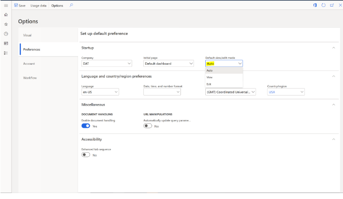

# Data agnostic testing using the Regression Suite Automation Tool

[!include [banner](../includes/banner.md)]

While the functional validation of an ERP application can’t be fully data agnostic, there are multiple phases and approaches for testing. These testing phases include:  

- SysTest framework
- ATL frameowrk
- Regression Suite Automation Tool (RSAT)

## Overview
-	**SysTest framework** – The SysTest framework is reliable for writing unit tests. Because unit tests are generally testing a method or function, they should always be data agnostic and dependent only on the input data that is provided as part of the test.
-	**ATL framework** – Microsoft has an ATL framework that is an abstraction on the SysTest framework and makes functional test writing much more simple and reliable. This framework should be used for writing component tests or simple integration tests.
-	**RSAT** – The RSAT is used for integration tests and business cycle tests. The business cycle tests, also called the regression validation tests, are dependent on existing data. However, these tests can become data agnostic if you consider additional factors. 

    - o	Where unit tests and component tests are low level and can fully be data agnostic (not dependent on existing dataset), the business cycle or regression validation tests are dependent on some existing data. This data includes setup, configuration settings (parameters), and master data (customer, vendors, items, etc.), but never transaction data. Make sure that during the test, if any of these are being changed, that they are reverted back as part of the final test.
    - Select master data based on certain criteria instead of selecting a particular record. For example, if you want to select an item based on its dimension values and stock availability, filter the product list with those values, select the first item, and copy the number to be used for future tests. If it’s a simple master data line such as customer, vendor, or item, it can be created as part of the automation and used in future tests through chaining. 
    - o	Enter the unique identifiers, such as invoice numbers, through the number sequence or by using Microsoft Excel functions such as =TEXT(NOW(),"yyyymmddhhmm"). This function will provide a unique number every minute, which allows you to track when the action happened. This can be used for variables such as product receipt numbers and vendor invoice numbers. These tests continue to work on the same database again and again, without requiring any restoration.
    - Always set the **Edit mode** of the environment to **Read** or **Edit** as the first test case because the default option is **Auto**. The **Auto** options always uses the previous setting and can cause unreliable tests. 
 
    
 
    - Only validate after you filter on a particular transaction instead of generic validation. For example, for the number of records, filter for the transaction number or the transaction date so that the validation excludes all other transactions. 
    - If you are checking a customer balance or budget check, save the value first and then add your transaction value to validate the expected result instead of validating a fixed expected value. 
 

[!INCLUDE[footer-include](../../../includes/footer-banner.md)]
