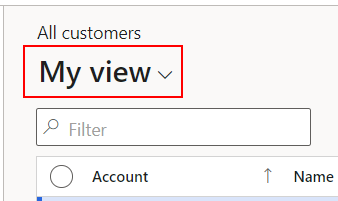
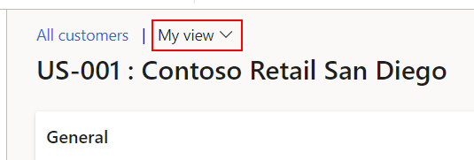
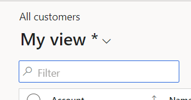

---
# required metadata

title: Saved views
description: This article describes how to use the saved views features.
author: jasongre
ms.date: 11/21/2022
ms.topic: article
ms.prod: 
ms.technology: 

# optional metadata

ms.search.form: DefaultDashboard
audience: Application User, IT Pro
# ms.devlang: 
ms.reviewer: sericks
# ms.tgt_pltfrm: 
# ms.custom: 
ms.search.region: Global
# ms.search.industry: 
ms.author: jasongre
ms.search.validFrom: 2019-07-31
ms.dyn365.ops.version: Platform update 28

---

# Saved views

[!include [banner](../includes/banner.md)]
[!include [preview banner](../includes/preview-banner.md)]

[!INCLUDE [PEAP](../../../includes/peap-1.md)]

## Introduction

Personalization plays an important role in allowing users and organizations to optimize the user experience to meet their needs. For more details on personalization, see [Personalize the user experience](personalize-user-experience.md).

Traditional personalization lets users have only one set of personalizations per page. The **Saved views** feature expands on personalization in several important ways:

- Views permit users to have multiple named sets of personalizations per form, which they can quickly switch between as needed. This allows a user to create multiple optimized views of a page, where each view has been tailored to fit the needs of performing a particular business task. 
- Views created for particular page types can also include user-added filters or sorts, which allows users to quickly return to commonly filtered datasets. See the [What pages support views](saved-views.md#what-pages-support-views) section for more details. 
- Views can be published to users in specific security roles and specific legal entities. Therefore, any user who has a specified role and access to a specified legal entity can access and use that view, even if that user doesn't have permission to personalize. This publish capability lets organizations define corporate, standard views that are optimized for their business. For more information, see the [Managing personalizations at an organizational level with views](saved-views.md#managing-personalizations-at-an-organizational-level-with-views) section.
- Unlike traditional personalization, views aren't automatically saved when a user performs personalizations or filters a list. Explicit saves are required to give users the flexibility to create a view before or after the changes that are associated with that view have been made. This requirement also ensures that view definitions aren't unintentionally changed by filters or personalizations that aren't intended for long-term use. Items that the system automatically stores as part of typical page usage (for example, column widths, or the expanded or collapsed state of sections) will be saved per view.
- Views can be added to workspaces as tiles, lists, or links. Therefore, a filtered data set can be surfaced in a workspace, and users can associate a set of personalizations that is relevant to that data set with a tile or link.

## Switching between views

After views have been made available for an environment, the top of any page that supports views will include a collapsed view selector control that shows the name of the current view.

There are two size variations to the view selector: 

- **Large view selectors** – Pages that prominently feature a list will have a larger view selector for a few reasons. Most importantly, the larger view selector indicates the pages where the view can include user-defined filters and sorts. Because filters and sorts are included in the views, the larger selector size is also warranted as the view names will often be the best description of the data shown on the screen and the expectation is that users will switch between views more often on these page types. Grouping in a grid can also be saved to views on a page with large view selectors. 
    
    

- **Small view selectors** – All other full-screen pages (except workspaces and the dashboard) have a smaller view selector that appears next to the page caption. Views on these pages include only personalizations, not user-defined filters. On these pages, the caption or record title is often the most important information at the top of the page. The smaller size of the view selector also reflects the lower frequency of view switching that is expected on these pages. 
    
    
 
If you select the view name, the view selector is opened and shows the list of available views for the page.

If the **Improved legal entity support for saved views** feature is turned on, the view selector shows the available views in two sections. The first section shows any views that are specific to the current legal entity, and the second shows views that are available to all legal entities. The first section is visible only if there are legal entity–specific views for the page.

- **Standard view** – The **Standard** view is the out-of-box view of the page, where no personalizations are applied.
- **Personal views** – The views without padlocks represent your personal views. These are views that either you have created or that an administrator has given to you.
- **Locked views** – Some views (such as the **Standard** view and any views that are published to your role) have a padlock symbol next to them in the view selector. This symbol indicates that you can't edit those views. However, changes that reflect page usage are automatically saved. These changes include changes to the width of a grid column, and changes to the expanded or collapsed state of a FastTab. Nevertheless, if you have personalization privileges, you can use the **Save as** action to make a personal view that is based on a locked view.
- **New views** – Published views that haven't yet been opened have a spark symbol to the left of the view name.

To switch to a different view, first open the view selector and then select the view that you want to load. 

## Creating and modifying views

Unlike traditional personalization, views aren't automatically saved when a user personalizes the page, or when a user applies a filter to a list or sorts it. An explicit action is required to save these changes to a view. This requirement gives users the flexibility to create a view before or after the changes that are associated with that view have been made. It also ensures that view definitions aren't unintentionally changed by one-time filters or personalizations. Note that typical page usage items (for example, column widths, or the expanded or collapsed state of sections) are automatically saved to the current view, even for locked views.

To ensure that the current state of the view is known, when you start to change a view by personalizing or filtering it, an asterisk (\*) appears next to the current view name. This symbol indicates that you're looking at an unsaved, modified version of that view.

If you want to save those changes, follow these steps.

1. Select the view name to open the view selector.
2. To modify the existing view, select **Save**. Note that this action isn't available for locked views. 
3. To create a new view:

    1. Select **Save as**. 
    2. In the **Save view as** pane, enter a name and, optionally, a description for the view.
    3. If you want this view to be your default view, select **Pin as default**. For more information about default views see the [Changing the default view](#changing-the-default-view) section that follows. 
    4. If the **Improved legal entity support for saved views** feature is turned on, you can select whether you want this view to be available for all legal entities or just a subset of them.
    5. Select **Save**.

## Changing the default view

The default view is the view that the system tries to open when you first open the page. You should set the default view to the view that you expect to use most often. 

> [!NOTE]
> - In the base **Saved views** feature, there is a single, global default view across legal entities. If you change the default view, that view will be opened by default, regardless of the legal entity that you're currently in.
> - When the **Improved legal entity support for saved views** feature is turned on, each legal entity can have its own default view per page.

To change the default view for a page, follow these steps:

1. Switch to the view that you use as the default. 
2. Select the view name to open the view selector. 
3. Select **More** and then **Pin as default**.

Alternatively, when you create a new view (by using the **Save as** action), you can make that new view the default view by setting the **Pin as default** option before you save the view.

> [!WARNING]
> In some cases, the query that is associated with the default view isn't run when you first open a page. For example, if you open the page through a tile, the tile's query will be run, regardless of the query that is associated with the default view. Additionally, if you open a page that has a **standard** view that already has a defined query, the original query will be run instead of the default view's query. In this case, you will receive an informational message when the view is loaded with an embedded action that lets you load the default view's query directly. If you switch views after the page has been loaded, the view query should be able to be run as expected. 

## Managing personal views

The **Manage my views** dialog box gives you basic maintenance capabilities over your personal views and the order of views in the view selector. To open this page, select the view name to open the view selector drop-down menu, select **More**, and then select **Manage my views**.

If the **Improved legal entity support for saved views** feature is turned on, the **My views** section of the **Manage my views** dialog box shows the available views for the page in sections. Any views that are specific to the current legal entity are shown in their own section. The **Global views** section is always shown, so that you can manage the views that are available for the page in all legal entities. 

For a list of available views for that page, the following set of actions are available.

- **Change the default view** – Use the **Pin as default** action to make the currently selected view the default view for this page. If the **Import legal entity support for saved views** feature is turned on, the **Global views** section lets you make a view the default view for either the current legal entity or all legal entities.
- **Reorder your views** – Use the **Move up** and **Move down** actions to rearrange your views in a specific order.
- **Rename a view** – Use the **Rename** action to change the name of the currently selected personal view. This action is turned off for locked views. 
- **Delete a view** – Use the **Delete** action to permanently delete the currently selected view from the page. There is no way to recover a view after you remove it.

Any changes made in this dialog box will take effect after you select the **Update** button.

## Managing personalizations at an organizational level with views

To help you understand how saved views help improve management of personalizations at an organizational level, this section describes some differences in personalization management with and without the **Saved views** feature.

Without views, administrators would apply a set of personalizations for a page to a user or a group of users via the Personalization page. If those users had personalization rights, the personalizations would be applied to that page. However, there was no ability to prevent users from further personalizing the page, which meant the organization could not ensure that its users had a consistent user interface. If any of those users didn't have personalization rights, the personalizations given to them by an administrator were not loaded. Further, if new users were hired into an organization, administrators needed to manually load a set of personalizations for the user. There was no automatic mechanism for specifying that a certain set of personalizations should be available for users in that role.

The **Saved views** feature makes organizational management of personalizations much easier, primarily because views can be published to groups of users. After a view has been published, any user who has one of the defined security roles and access to one of the specified legal entities can see and use the view, even if that user doesn't have access to personalization. Although every user has a copy of the published view, where page usage items are automatically applied, no user can save personalizations or query updates to a published view. In other words, published views are locked. Additionally, if new users are assigned to roles in legal entities that views were published to, they will automatically see the views that are associated with their roles and legal entities. No additional action is required by the admin. Likewise, if users change roles in an organization or are given access to different legal entities, they might no longer be able to access the views that were previously published to them. Again, no additional action is required by the admin.

Updates to a published view can easily be distributed to users by republishing the view to the appropriate security roles and legal entities.

The publish capability allows organizations to define corporate standard views that are optimized for their business, targeted at users in specific security roles.

## Publishing views

During the publishing process, views can be assigned to one or more security roles for one or more legal entities. Therefore, any user who has access to a legal entity and is assigned to one of those roles can access and use the views. However, the user can't edit the views. By default, system admins have access to the **Publish** action in the view selector drop-down menu. However, other trusted users in your organization can also be given access to view publishing via the new **Saved views administrator** role.

To publish a view, follow these steps:

1. Create and save a personal copy of the view that you want to publish. 
2. With that view currently loaded, select the view name to open the view selector drop-down menu. 
3. Select the **More** button and then select **Publish**. The **Publish** dialog box will open.
4. Enter a name for the view. The name that you enter is the name that users who receive this view will see in their view selectors. The names of published views for a page must be unique. No duplicate names are allowed, even if the list of roles or legal entities that the views are applied to differ.
5. If the **Translation support for organization views** feature is turned on, you can add translations for your view name in as many languages as your organization requires by selecting the **Translations** button next to the **Name** field. The view name will then be shown to users in their current language. You can also set the default language to specify the translation that will be shown to users who are running languages that no translation is defined for.
5. Optional: Enter a description for the view, so that users who receive this view can better understand its purpose. 
6. Determine whether the view should be published as the default view for the selected users. When a view is made the default view, users will see it the next time that they open the target page. The single, global default view of every targeted user will be changed. However, users can still change their default view after publishing has occurred.

    > [!NOTE]
    > Be aware of the following behavior when you publish a view as the default view:
    >
    > - If you publish a view as the default view to some or all legal entities, the following behavior occurs:
    >
    >    - If only the base **Saved views** feature is turned on, the single, global default view will be changed for every targeted user. 
    >    - ** If the **Improved legal entity support for saved views** feature is turned on, and you publish the view to a subset of legal entities, the default view for those legal entities will be changed for every targeted user.
    >
    > - If a user has roles where multiple views are published as the default view, the last view that was published will be used as the user's default view. 
    > - Publishing will not work for role assignments made using AAD groups. 

8. Add the security roles that correspond to the users who are being targeted by this view. 
9. Determine whether you want to publish the view to the child roles of each security role that is selected. If you do, select the **Include child roles** check box in the row for the appropriate security roles. Note that this check box isn't available for roles that don't have child roles.
10. Add the legal entities that this view should be available for. 

    > [!NOTE]
    > Be aware of the following behavior if you publish a view to a specific legal entity, but you don't publish that view as the default view:
    >
    > - If only the base **Saved views** feature is turned on, the user's view selector for the page initially shows the view only for the specified legal entities. However, after the view is loaded for the first time, the view selector for the page will always show it, regardless of the legal entity.
    > - If the **Improved legal entity support for saved views** feature is turned on, the view selector will only ever show the view for the specified legal entities.

11. Select **Publish**.

Note that in some environments, it may take some time (up to an hour) before users see the published view.

## Modifying a published view

After you publish a view, you might find that you want to change it. Although you can't make live changes to a published view, because these views are locked for editing for all users (including publishers), you can republish a view to update it.

If the changes that you want to make to a published view only involve the publish parameters (the name and description of the view, or the security roles the view is published to), do the following:

1. Switch to the published view for the parameters that you want to update. 
2. On the view selector drop-down menu, select **Republish**. If you're using version 10.0.12 or earlier, you must select **Publish** and then **Yes** to update the existing view.
3. Update the name, description, security roles, and legal entities for the view. 
4. Select **Publish**. If you originally selected this published view as the default view, it will be the default view for users again after you republish it. 

If the changes to the published view involve modifications of the personalizations or filters that are associated with the view, follow these steps.

1. Load the published view that you want to change. 
2. Make the required changes to the local draft.
3. On the view selector drop-down menu, select **Republish**.
4. Select **Yes** to indicate that you want to publish the view together with its unsaved changes. 
5. Adjust any publishing parameters that require adjustment, and then select **Publish**. 

## Managing published views

Like managing personal views, the **Manage my views** dialog box gives users with publish privileges basic maintenance capabilities over that page's published views (in addition to their own personal views). To open this page, select the view name to open the view selector drop-down menu, select **More**, and then select **Manage my views**.

Although all users have a **My views** tab that shows their personal views, users who have publish privileges also have an **Organization views** tab that shows all the published and unpublished views for that page. Because several users might be publishing views, it's important that you be able to manage the full list of published views, even if you aren't the user who published a given view.

For the list of all published views for the page, the following set of actions are available. 

- **Republish** – Use the **Republish** action to republish a view after publishing parameters (name, description, security roles, or legal entities) are changed.
- **Publish** – Use the **Publish** action to publish a view that is currently unpublished. 
- **Unpublish** – Use the **Unpublish** action to make a view inactive. The view will still be available in the system, but users won't see it in the view selector until the view is published again.
- **Save as personal** – Use the **Save as personal** action to create a personal draft copy of the published view. This capability can help you understand the contents of a view that wasn't published to you or that hasn't yet been published. You can also use it to edit and then republish a view.
- **Delete** – Use the **Delete** action to permanently delete a published or unpublished view. This action also removes the view for all users in the system. The removal of published views takes effect after the **Save** button is selected. After a view is deleted, it can't be recovered. 

## Managing views globally

Although some management capabilities are surfaced on every page, as indicated in this article, **system administrators** and **saved view administrators** can manage views more holistically for the system via the **Personalization** page. In particular, this page has the following sections and capabilities: 

- **Published views** – This section lists all views that have been published for your organization. From here, you can republish a view after you adjust the security roles or legal entities that the view targets. You can also export, delete, or unpublish views. You can use the **Save as personal** action to create a personal copy of a view, so that you can update the view or gain a better understanding of its contents. 
- **Unpublished views** – This section lists all the organization views in your system that aren't currently published. These views most often come into the system through the import capability. You can publish, export, or delete these views. The **Quick publish** action that was added in version 10.0.12 enables multiple views from this section to be published in one action, by using the existing security role and legal entity configurations. You can use the **Save as personal** action to create personal copies of these views, so that you can gain a better understanding of their contents.
- **Personal views** – This section lists all views that have been created by users in the system. From here, you can publish a personal view to the organization, or copy one or more of these views to other users. You can also export or delete these views as required.
- **User settings** – Select a user to view, or adjust the user's ability to use personalization either for the whole system or for specific pages that the user has visited. You can view and interact with the user's personalizations in the system. You can also delete all personalizations for that user or reset feature callouts for the user. If feature callouts are reset, any pop-up windows that introduced new features and that the user previously dismissed will appear again the next time that the user encounters those features.
- **System settings** – You can temporarily turn off personalization for all users in the system. In this case, no personalizations are applied for any user, and all pages are reset to their default state. If you turn personalization back on later, all personalizations are reapplied. You can also permanently delete all personalizations for all users in the system. Personalizations that have been deleted can't be recovered. Therefore, before you perform this task, be sure to export any personalizations that you might want later.

Users who have access to the **Personalization** page can also import personal or organization views by using the **Import views** button on the Action Pane. For organization views, you can select **Publish immediately** to make the views available to users without an additional explicit publish.

## Frequently asked questions

### What pages support views? 

Views are available on most but not all pages. Specifically, views are currently available on all full-screen pages except dashboards. View support for workspaces is available through the **Saved views support for workspaces** feature. Most non-full-screen pages, which include drop-down dialog boxes, lookups, and enhanced previews, don't currently support views. View support for dialog boxes is available through the **Saved views support for dialogs** feature.

### Who is allowed to publish views?

Only system admins and users who have been assigned to the **Saved views administrator** role have the rights to publish views. 

### Why am I not able to save filters with this view? 

There are a few reasons why a filter may not appear to save with a view: 

- The page may not support saving filters as part of the view definition. Note that only pages with large view selectors allow personalizations and query modifications to be saved as a view. See the **Switching views** section for more information. 
- The page in question may not properly support views, as it may ignore the view query completely or may operate on a temporary table whose data is not persistent. 

### What data will I see when I visit a page?

For pages that have small view selectors (only personalizations can be saved to the view), you will see the same data as you always have when you visit the page. 

For pages that have large view selectors (both personalizations and queries can be saved to the view), you will typically see the data that is linked to the query that is associated with your default view. There are two main exceptions:

- If you navigate to a page from a tile, the tile query will execute regardless of the query associated with the default view. If you created that tile after views have been enabled, selecting a tile will open the page with the view associated with that tile.
- If you navigate to a page and that entry point includes a query, the original query will execute originally in place of the default view's query. You should be alerted when this occurs via an informational message when the view is loading. You can also confirm by switching to this view after the page loads, as that should allow the view query to execute regardless.

### Why is a view that was published for a specific legal entity visible in all legal entities?

If you publish a view to a specific legal entity, but you don't publish that view as the default view, the following behavior occurs:

- If only the base **Saved views** feature is turned on, the user's view selector for the page initially shows the view only for the specified legal entities. However, after the view is loaded for the first time, the view selector for the page will always show it, regardless of the legal entity. This behavior occurs because users get their own personal copy of the published view when it's loaded, and personal views are global.
- If the **Improved legal entity support for saved views** feature is turned on, the view selector will only ever show the view for the specified legal entities. This behavior occurs because the feature enables views (including personal views) to be linked to specific legal entities.

[!INCLUDE[footer-include](../../../includes/footer-banner.md)]

