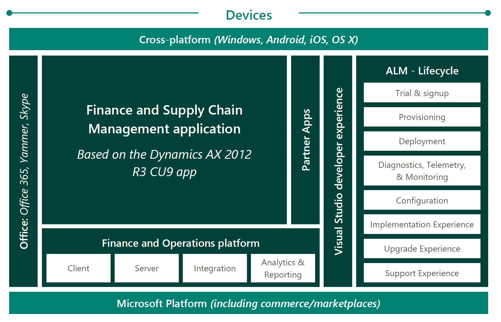
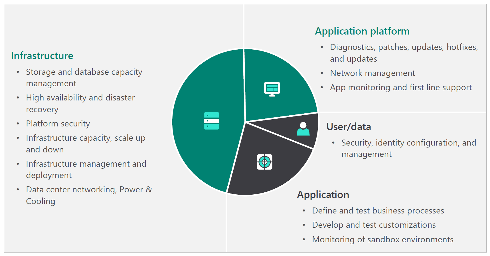
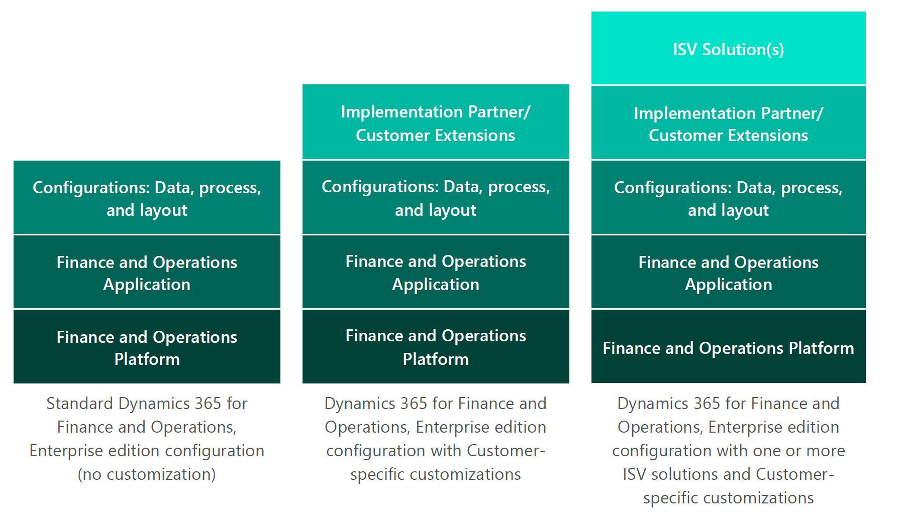
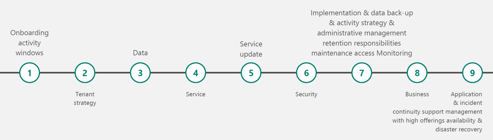

---
# required metadata

title: Service description for Dynamics 365 Finance and Dynamics 365 Supply Chain Management apps
description: This topic provides the service description for Dynamics 365 Finance and Dynamics 365 Supply Chain Management.
author: shellybakke
manager: AnnBe
ms.date: 03/17/2021
ms.topic: article
ms.prod:
ms.service: dynamics-ax-applications
ms.technology: 

# optional metadata

# ms.search.form:
audience: Application User, Developer, IT Pro
# ms.devlang: 
ms.reviewer: sericks
# ms.tgt_pltfrm: 
# ms.custom: NotInTOC
ms.search.region: Global
# ms.search.industry:
ms.author: sericks
ms.search.validFrom: 2021-03-31
ms.dyn365.ops.version: 10.0.18
---

# Service description for Dynamics 365 Finance and Dynamics 365 Supply Chain Management

[!include[banner](../includes/banner.md)]

## Overview

Microsoft Dynamics 365 Finance and Supply Chain Management is a cloud Enterprise Resource 
Planning (ERP) service for enterprises, built on and for Microsoft Azure. It provides organizations with ERP functionality that supports their unique requirements and helps them adjust to constantly changing business environments, without managing infrastructure. Finance and Supply Chain Management brings together a set of ERP, business intelligence, infrastructure, compute, and database services in a single offering that enables organizations to run industry-specific and operational business processes that are extendable with specific solutions from Independent Software Vendors (ISV) (see Microsoft AppSource). Organizations can match their business growth by easily adding users and business processes with a simple, transparent subscription model.  

- [Microsoft AppSource](https://appsource.microsoft.com/partners)
- [Licensing Guide](https://go.microsoft.com/fwlink/?LinkId=866544)

The Finance and Supply Chain Management cloud service is comprised of the components illustrated below.

## Operating model

The operating model of Finance and Supply Chain Management distinguishes specific roles and responsibilities for Customer, Implementation Partner, and Microsoft throughout the lifecycle of the service. 

Microsoft maintains the Finance and Supply Chain Management service by deploying, actively monitoring, and servicing the Customer’s production tenants.  This includes allocating the required system infrastructure to run the service and proactive communication to Customers about the service’s health. 

With the support of their Implementation Partner, Customers determine the configuration of the business application logic in Finance and Supply Chain Management to match their unique business processes. Customers can extend Finance and Supply Chain Management with ISV solutions of their choice, unique customizations, or a combination of these. Customers typically choose one of the following configuration scenarios: 

-	**Solution 1:** Standard Finance and Supply Chain Management configuration (no extension) 
-	**Solution 2:** Finance and Supply Chain Management configuration with Customer-specific extensions 
-	**Solution 3:** Finance and Supply Chain Management configuration with one or more ISV solutions and Customer-specific extensions 

For any of these scenarios, the Customer defines, develops, and tests any modifications using Microsoft Dynamics Lifecycle Services (LCS) and tools. 

## System configuration

Finance and Operations scales with transaction volume and User load. Each Customer implementation of Finance and Operations produces a unique solution due to the following variables: 

-	**Data composition:** A unique set of parameters that control behavior, layout of the organization, structure of master data (such as financial and inventory dimensions), and granularity of transaction tracking. 
-	**Extension and configuration:** Extension mechanisms of Finance and Supply Chain Management with code extensions, ISV solutions, and unique configurations including workflows, integrations, and report configurations. 
-	**Usage patterns:** A unique combination of online and batch usage combined with the ability to integrate with upstream and downstream systems for unified data flow and the ability to differentiate based on the information views used by Customers in their business processes. 

Microsoft configures and sizes production environments to handle the transaction volumes and user concurrency. Microsoft is responsible for: 

-	Proper allocation of resources of production environments, based on the Customer’s profiling information in the LCS Subscription Estimator. 
-	Continually monitoring and diagnosing service availability of production environments. 
-	Analyzing and troubleshooting system performance issues with Finance and Supply Chain Management. 

To ensure that an implementation is configured for high performance, Customers must:

-	Provide accurate usage information for the Finance and Supply Chain Management implementation through the LCS Subscription Estimator. 
- Build and test extensions for performance and scale in a performance Sandbox environment. 
-	Test data configurations appropriately for performance, also in a performance Sandbox environment. 

## Service operations

Service operations reflect various aspects of provisioning and use of Finance and Supply Chain Management, from onboarding and implementation to updates and monitoring. For each successful implementation of Finance and Supply Chain Management, Microsoft, the Customer, and Implementation Partners or ISVs (when applicable) have specific roles and responsibilities. 

### Onboarding and implementation

Typical onboarding and implementation events and the expected responsibilities for each party are provided in the following table.

| Request | Expected Microsoft action  | Expected Customer/Implementation Partner action |
|-------------------------|-------------------------|-------------------------|
| Initial offer purchase | LCS project is created after the purchase of the offer. | Go through EA or CSP onboarding process. Partner creates tenant for Customer, if applicable. |
| Add-On purchase | Grant Customer access to Add-On selected during the implementation. | Not applicable. |
| Implementation planning and analysis | Provide relevant tools in LCS, such as Business Process Modeler and interoperability with Visual Studio Online. |Project planning, Visual Studio Team Services, System onboarding and admin account setup.|

For more information about the onboarding process, see [Onboard an implementation project](../imp-lifecycle/onboard.md).

### Environment and data management 

Typical environment and data management events for the Service and the responsibilities for each party are described are described in the following tables.

#### Environment and data management events for Production Instances

| Customer's request  | Customer's responsibility  | Microsoft's responsibility  | Microsoft's lead time  |Microsoft's estimated maintenance downtime  |
|-------------------------|-------------------------|-------------------------|-------------------------|-------------------------|
| Deploy a new Production Instance |<ul><li>Submit Production Environment service request in LCS.  </li> <li>Accurately complete the sizing questionnaire in the LCS Subscription Estimator before requesting a Production Instance. </li> <li>Complete all implementation tasks specified in the LCS checklists. | <ul><li>Complete Go live health check from Microsoft Fasttrack Services. </li> <li>Deploy a Production Instance only after Customer has completed all LCS checklists and notify Customer of the provisioned environment through email.  |  2 business days </blockquote> |  N/A </blockquote> |
| Copy a Sandbox database to a Production Instance.  *(Note: Performed when ready to do a mock go-live or an actual go-live cutover)* | <ul><li>Run the Move Database option in LCS. |N/A | N/A | N/A|
| Maintenance mode | <ul><li>Place AOS in maintenance mode through LCS. </li> <li>Complete necessary maintenance. </li> <li>Place AOS back in to active mode.  | N/A | N/A| N/A |

#### Environment and data management events for Non-Production Instances

LCS provides provisioning and database movement operations that are used by Customers as described in the following table.

| Customer's request  | Customer's responsibility  | Microsoft's responsibility | Microsoft's lead time  | Microsoft's estimated maintenance downtime  |
|-------------------------|-------------------------|-------------------------|-------------------------|-------------------------|
| Deploy a new sandbox instance |<ul><li>Ensure that all required instances have been planned and that the applicable Add-On offers have been purchased. </li> <li>Run the deployment process in LCS. </li> <li>Complete all tasks specified in the LCS checklists. </li> <li>A Tier1 Sandbox instance (also known as a Development Environment) is a VM deployed to the Customer's Azure Subscription and is Customer managed. A Tier-2 (or higher) environment is a multibox environment closer in topology to a production environment, deployed to Finance and Supply Chain Subscription and is Microsoft managed. | N/A | N/A|N/A|
| Copy golden configuration database from Dev/Test to Sandbox before go-live | <ul><li>Validation and sign-off. </li> <li>Prepare and export the database from a development environment (Tier 1). </li> <li>Trigger the import operation through LCS and update the database to a sandbox environment (Tier 2 or higher). |N/A|N/A|N/A|
| Restore a Production Point-in-Time backup to a Non-Production Instance  | Initiate the operation through LCS.  <ul><li>Post-copy: Delete or obfuscate sensitive data, adjust environment specific application configuration (such as integration endpoints) and enable or add users.</li> <li>Customer should make these changes by applying a data package.</li> </ul> | N/A |N/A| N/A|
| Non-Production Instance database point in time restore |Accept that process cannot be undone.  <ul><li>Initiate the point in time restore operation through Lifecycle Services.| N/A | N/A | N/A |
| Copy Tier 2 Sandbox database to a Tier 1 Sandbox for troubleshooting and debugging  | Initiate database export operation through LCS on the sandbox environment.  <ul><li>Import and update the database in Tier 1 environment. | N/A | N/A| N/A|

### Data back-up and retention 

Databases for Microsoft-managed environments are protected by automatic back-ups. Automatic back-ups are retained for 28 days for Production environments (unless Microsoft performs a rollback) and 14 days for Sandbox (Tier2+) environments. A rollback of Production may be performed in the event a failure occurs during any planned maintenance update specified in [Planned maintenance responsibilities](service-description.md#planned-maintenance-responsibilities).

For more information about automatic back-ups, see [Automated backups - Azure SQL Database & SQL Managed Instance](https://docs.microsoft.com/azure/azure-sql/database/automated-backups-overview?tabs=single-database).

### Service activity responsibilities 

The following table describes some typical scenarios and activities for the service along with the responsibilities of Microsoft, Customer, or both concerning such activities.

| Activity  | Responsibility of Microsoft  | Responsibility of Customer |
|-------------------------|-------------------------|------|
| **Provisioning initial tenants**  |  |   |
| Size projected load in LCS using the Subscription Estimator tool and request specific environment(s) to be provisioned |  | X |
| Provision all Production Instances and Non-Production Instances | X |   |
| Validate the deployed Production Instances and Non-Production Instances |  | X  |
| **Service updates**  |  |
| Microsoft applies service updates to designated Non-Production and Production Instances | X  | X  |
| Download update from LCS and define, develop, and test the update, and provide code update package back to LCS |  | X  |
| Request extension updates to be applied to the Production Instance |  | X |
| Create code and data backup for Production Instance before applying any updates | X  |   |
| In case of any failure, roll back Production instance to code and data backup | X  |    |
| **Data management (Backup, restore, and update)**|  |   |
| Backup database | X  |   |
| Determine HA and disaster recovery plan | X  |    |
| Monitor Production Instance database performance | X   | X  |
| Tuning the Production Instance database for performance | X  | X  |
| Initiate copy of Production Instance database to Non-Production Instance |  | X  |
| **Update infrastructure**  |  |  |
| Schedule regular infrastructure updates | X |    |
| **Scale up and down (Users, storage, instances)**|  |   |
| Purchase additional users and Non-Production add-ons |  |  X |
| Changes in usage updated in the LCS Subscription Estimator tool |  | X |
| Report any significant performance issues impacting usage of the Service |  | X |
| Proactively manage the resources needed for the applicable Service | X |   |
| Investigate and troubleshoot Incidents | X | X |
| **Security (User access)**|  |   |
| Provide user access to the Service |  |  X |
| Provide LCS project access for managing and operating instances deployed through LCS |  | X |
| **Monitor Production Instance**|  |  |
| Monitor Production Instances 24x7 | X |   |
| Notify Customer proactively of incidents with the Production Instance | X |   |
| **Manage and Monitor Non-Production Instances** |  |   |
| Manage Non-Production Instances with LCS |  | X  |
| Monitor Non-Production Instances |  | X  |

### Service update strategy and maintenance windows 

Customers must stay current on the latest service updates in accordance with the [software lifecycle policy](https://docs.microsoft.com/dynamics365/unified-operations/dev-itpro/migration-upgrade/versions-update-policy). All versions of Finance and Supply Chain Management follow the Microsoft Modern Lifecycle Policy. The Modern Lifecycle covers products that are serviced and supported continuously.

[Service updates](https://docs.microsoft.com/dynamics365/unified-operations/dev-itpro/lifecycle-services/oneversion-overview) to the Finance and Supply Chain Management application and platform are handled as follows:

- **Customers on version 8.1 and higher:** Application and the platform components are released as a single cumulative update, known as a deployable package, for customers to uptake. Microsoft notifies the customer when a new service update is made available. As of April 2019, Microsoft updates customer environments to the latest released update within the maintenance window configured in the customer's LCS project. Unless the service update is paused, the environment will be updated to the latest release. Customers have the option to take the update outside of the scheduled maintenance window. We recommend customers stay current for a better service experience.

- **Customers on version 8.0 and lower:** Application updates are released as granular X++ updates while the platform is released as a cumulative binary update. Microsoft requires each customer to be current on the latest Finance and Supply Chain Management platform update. As of April 2018, Microsoft updates customer environments to the latest release of the platform within the maintenance window configured in the customer's LCS project. Customers can also get the service update via LCS and can apply it to their environments on their own prior to Microsoft initiating the service update.

  X++ updates must be applied on a development environment before they can be deployed on a sandbox, staging, or production environment. Binary updates can be applied directly on any environment but must be validated on the Customer's sandbox environment before being promoted to a production environment. Refer to the table in [Planned maintenance responsibilities](service-description.md#planned-maintenance-responsibilities) for more detailed instructions.

  Please note that some service updates may be mandatory and require no consent. To help protect our Customers and the service, Microsoft may apply critical security updates directly to a Customer's Finance and Supply Chain production environment.

#### Planned maintenance responsibilities 

Microsoft provides Customers with the types of updates to Finance and Supply Chain Management set forth in the table below. These updates may require downtime on the production environment. The downtime window can be categorized as Microsoft Planned Maintenance (initiated by Microsoft) or Customer Planned Maintenance (initiated by the Customer). Updates are initiated or scheduled by the Customer via LCS.

The responsibilities of Microsoft, the Implementation Partner, and the Customer are reflected in the table for each update type.

| Type of update | Expected action from Microsoft | Expected action from Customer/Implementation Partner | Maintenance window  *(Microsoft's estimated maintenance downtime)*|
|-------------------------|-------------------------|-------------------------|------|
| Customers on version 8.1 and higher |  |  |  |
| **Service updates** *Service updates are collections of quality updates and new features for the application and the platform, provided as a deployable package. They are backward compatible* | Initiate updates to the application within the configured maintenance window. | Customer must always stay current on the latest version of the application. | Microsoft initiated maintenance window *(30 minutes – 4 hours*)*|
| **Critical update** *Update that solves a critical issue.* | <ul><li>Notify Customer of the critical update.  <li>Initiate update within the specified timeline. | Apply the critical update.| Microsoft initiated maintenance window *(30 minutes – 4 hours)* |
| **Extensions** *Change to the standard business application logic.* | No action required. | Validate extensions in Customer's Non-Production Instances then promote them to Customer's Production Instance.| Customer initiated maintenance window *(1 – 4 hours)* |
| Customers on version 8.0 and lower |  |  |  |
| **Platform updates** *Platform updates are collections of hot fixes and new features for the platform, provided as a deployable package. They are backward compatible. They are also backward compatible with the last major release of the applicable Service.* | Initiate updates to the platform within the configured maintenance window.| Customer must always stay current on the latest version of the platform. | Microsoft initiated maintenance window *(30 minutes – 4 hours**)* |
| **Major releases** *Major releases for the Service include new functionality. The last major update is 8.1.* | Make the new major release available and publish to LCS. | Prepare for the upgrade according to the LCS instructions and best practices.| Customer initiated maintenance window *(5 – 8 hours)* |
| **Infrastructure updates** *Infrastructure updates are updates made to the underlying infrastructure like OS updates. These are done monthly.* | Initiate updates within the Microsoft planned maintenance window. | No action needed. | Microsoft initiated maintenance window *(1 – 4 hours)*  |
| **Dynamics 365 for Finance and Supply Chain Management** *IP address whitelisting - Securing access from Customer's corpnet to Supply Chain Management.* | Finance and Operations is an Azure Service and uses Azure IP address range. | Customers need to whitelist the Azure datacenter ranges for both their Primary and Geo-DR datacenters.  Link to doc for IP address ranges for Azure. | N/A |
| **Security** *Secure Infrastructure.* | Microsoft installs anti-malware, uses SSL, rotate secrets, and adheres strictly to SOC/ISO standards.|Refer to the [Microsoft Trust Center](https://www.microsoft.com/trustcenter/security/dynamics365-security)or more details on Security. | N/A |
| Customers on version 8.0 and lower ||  |  |
| **Network Security Groups (NSG)** *Within the Azure Portal, customers can configure Network Security Group rules to restrict RDP access to their Tier1 sandbox VMs deployed to their own Azure subscription through LCS.* | Microsoft prohibits Remote Desktop access to any Tier2+ Sandbox environment.  For self-service deployments, RDP is enabled only for the Tier1 sandbox. | Customers need to whitelist their IP Address ranges via the Azure Portal to enable RDP access to their Tier1 sandbox environments. Refer to [Cloud deployment overview](https://docs.microsoft.com/dynamics365/unified-operations/dev-itpro/deployment/cloud-deployment-overview#features-of-the-finance-and-operations-production-instance) for more information. | N/A|
| **ExpressRoute** *Dedicated connection to Finance and Supply Chain Management.*| Finance and Supply Chain enabled ExpressRoute over public peering. | Customers must work with their Azure ExpressRoute service provider to acquire a dedicated connection to Finance and Supply Chain Management. | N/A |

\*\*Promoting an update to a Customer's production environment is a service request to Microsoft that must be initiated from LCS. This is within the Customer planned maintenance window. Request is planned to be executed within two business days. Generally, 95% of updates are applied in less than an hour.

#### Microsoft planned maintenance schedule and communication 

Scheduled downtime means periods of downtime related to network, hardware, or Service maintenance or updates. Microsoft will publish notice or notify Customers at least **five days** prior to the commencement of such downtime. The default downtime window as listed below are scheduled on weekends in time windows defined per region to minimize the impact to the Customers' business.

Microsoft's planned maintenance schedule:

- **NAM:** 2 AM to 10 AM
- **EMEA:** 10 PM to 6 AM
- **APAC:** 12 PM to 9 PM

### Security and administrative access 

Administrative access to a Finance and Supply Chain Management production environment is strictly controlled and logged. Customer Data is handled in accordance with the Microsoft Online Services Terms. Customer's tenant administrator can access Production Instances or Non-Production Instances as described in the following table.

For more information, see [Licensing Terms and Documentation](https://www.microsoft.com/licensing/product-licensing/products).

#### Customer's administrative access

| Environment type | Purpose  | Level of Customer access  |
|-------------------------|-------------------------|-------------------------|
| **Non-Production Instance** Sandbox Tier 1: Developer Instance | A Non-Production Instance that Customer can use for development or to customize any Service and unit test Customer changes. | A Tier 1 Sandbox is deployed as a VM to a Customer's own Azure Subscription via LCS. Because it is a VM in Customer's own Azure Subscription, Customer has full administrator access to development environment. Customer will continue to have full administrative access to the SQL server installed in the environment. These environments are fully managed by the customer and available to deploy via Cloud Hosted Environments. |
| **Non-Production Instance** Sandbox Tier 2: Standard Acceptance Testing Instance (or any Sandbox Tier Add-on)| Non-Production Instance that Customer can use for user acceptance testing, integration testing, and training of any Service. | Customer will not have remote desktop access or access to the SQL server associated with the Non-Production Instance. Customer can connect as an administrator to the database.  These environments are managed by Microsoft. |
| **Production Instance** | Use to go-live with any Service. | All access is only through the Finance and Supply Chain browser client, service endpoints, or through LCS. These environments are managed by Microsoft.|

#### Microsoft's administrator access

The following table details the different levels of access for different Microsoft administrators.

| Administrator | Customer data  |
|-------------------------|-------------------------|
| Operations responses team (Limited to key personnel only) |Yes, granted by support ticket. Access is audited and limited to the duration of the support activity. |
| Microsoft Customer Support Services | No direct access. Customer may use screen sharing to work with support staff to debug issues. |
| Engineering | No direct access. Operations response team may use screen sharing to work with engineering to debug issues. |
| Others in Microsoft | No access.|

### Monitoring and incident management 

#### Monitoring 

Microsoft has invested in an extensive toolset to monitor and diagnose Customers' production instances. Microsoft monitors Customers' production environments 24 hours a day, 7 days a week. Customer must monitor its Production Instances for application configurations and application errors as described in the following table.

| Microsoft's responsibilities | Customer's responsibilities |
|-------------------------|-------------------------|
|<ul><li>Availability monitoring of the service.  <li>Continuous monitoring and alerts through health metrics and watchdogs for critical components such as AOS, Batch, DIXF, Retail, and Management Reporter.  <li>Monitoring for performance degradation caused by infrastructure services (AAD, Azure SQL, etc.).  <li>In the event Microsoft determines that a single process or batch job is causing aberrations, these processes will be thwarted after communication with the Customer.|<ul><li>Monitor changes to application configurations and extensions that can cause functional and performance issues.  <li>Application errors need to be diagnosed using the monitoring tools. Diagnose user reported performance aberrations using these tools. <li>Inform Microsoft in the event that there is expected load on the system beyond projected peak usage. <li>In the event the applicable Service is unavailable in the Production Instance, Customer can create a "Production down" customer support request using LCS. |

#### Incident management 

Microsoft responds to and resolves Incidents based on the severity levels set forth in the following tables. Microsoft's Incident severity levels can be changed during initial assessment of the Incident and as more information about the impact and scope becomes available. If the Incident is mitigated, then the Incident severity remains unchanged.

##### Severity level description

| Classification | Description |
|-------------------------|-------------------------|
| **Severity 0 (Sev-0)** Catastrophic | <ul><li>Catastrophic event in which all functions of a service in a region are down or inaccessible.  **Note:** Sev-0 Incidents normally start as Sev-1, then get upgraded with management approval based on assessment of impact type/scope. |
| **Severity 1 (Sev-1)** Critical | <ul><li>Severe outage of a Service caused by confirmed systemic problem, resulting in a broad scope of impact, requiring a Technical Control Bridge and engagement from applicable engineering teams.</li> <li>Suspected breach of a security or privacy boundary. |
|**Severity 2 (Sev-2)** Urgent| <ul><li>Service outage with narrow scope of impact (&gt; 25% customers). <li>Degradation of customer experience caused by confirmed systemic event with broad scope (&gt; 25% customers). <li>Service outage with limited scope of impact (single organization or subset of users). |
|**Severity 3 (Sev-3)** Moderate | <ul><li> Degradation of customer experience caused by confirmed systemic event with narrow scope. |
|**Severity 4 (Sev-4)** Non-SLA Impacting | <ul><li>Monitoring or Customer reported incidents requiring action to avoid potential service impact. <li>General maintenance events with no Customer impact. <li>Standard service change requests.|

##### Incident scope and severity level impact

| Incident impact | Entire geo  -OR-  less than 25% of global footprint | One customer  -OR-  subset of users belonging to one customer |
|-------------------------|-------------------------|-------------------------|
| Service is unavailable | Sev-1 | Sev-2 |
| Service is usable only through a workaround or critical subset feature is malfunctioning | Sev-2 | Sev-3 |
| Degradation of performance, or non critical subset feature is malfunctioning | Sev-3 | Sev-4 |
| Incidents requiring action to avoid potential impact or service disruption | Sev-3 | Sev-4 |

### Business continuity with high availability and disaster recovery 

Customer's Production Instances include High Availability (HA) and Disaster Recovery (DR) features.

- **High Availability**: HA functionality provides ways to prevent downtime caused by the failure of a single node within an Azure datacenter. Each Service's cloud architecture uses Azure availability sets for the compute tier to prevent single-point-of-failure events. HA for databases is provided through Azure SQL (a platform-as-a-service (PaaS) offering from Microsoft).

- **Disaster Recovery**: DR features protect each Service against outages broadly impacting an entire Azure datacenter and include the following:
  - Azure SQL active-geo replication for primary database (business database), with a Recovery Point Objective (RPO) estimate of ≤ 5 seconds.
  - Geo-redundant copies of Azure blob storage (containing document attachments) in other Azure regions.
  - Same secondary region for the Azure SQL and Azure blob storage replications.

The primary data stores are supported for replication. This means that components for each Service, such Management Reporter and Entity Store, use transformed data from the primary database, which need to be generated after the recovery site has been setup and service started. Customer code artifacts and recovered data stores is used to re-deploy the site, with a Recovery Time Objective (RTO) of up to 10 hours. This will enable state replication of the compute nodes along with networking and other components to set up the secondary site using the recovered data stores. In the event DR is utilize to recover Customer's Production Instance, each of Microsoft and Customer will perform the responsibilities in [Incident management](service-description.md#incident-management).

| Microsoft's responsibilities  | Customer's responsibilities |
|-------------------------|-------------------------|
| Microsoft provisions a secondary environment in the Azure paired datacenter at the time of deployment of the primary Production Instance.  See the [Business continuity and disaster recovery (BCDR): Azure Paired Regions](https://docs.microsoft.com/azure/best-practices-availability-paired-regions) for details. | None |
| Microsoft enables Geo Redundancy of SQL and Azure Storage at the time of deployment of the primary Production Instance. | None|
| Microsoft enables automatic backup on the Azure SQL databases. |None |
| On outage, Microsoft determines if a failover needs to be executed for Customer and if there will be a data loss. Data loss can be up to 5 sec. For details, see [Azure SQL Database Geo-Restore]https://azure.microsoft.com/blog/azure-sql-database-geo-restore).  In the event of a data loss, Microsoft will send a request to Customer asking for its sign-off on a failover. | Customer may need to provide written sign-off to trigger the failover in the event of data loss.|
| The applicable Service will be operated in limited mode on failover. Update maintenance cannot be triggered in failover mode. | Customer cannot request package deployments or other regular maintenance requests in failover mode. |
| Microsoft fails back to the Production Instance in the primary Azure region when the datacenter becomes operational. Normal operations are resumed. | Customer may need to sign-off on fail back to the Production Instance in the primary Azure region.|

### Application support offerings 

Microsoft offers VL customers three support plans: Premier, Professional Direct, and the support included in the subscription. The level of support differs per plan and highlights are provided in the following table.

| Service feature | Premier | Professional direct  | Subscription |
|-----------------|-------------|-----------------|--------------|
| Unlimited break/fix incidents | N/A | N/A | N/A |
| 24x7 support | N/A | N/A | Local business hours |
| Fastest response times | &lt;1 hour | &lt;1 hour | Next business day |
| Advisory hours | Pools acquired per agreement | N/A | N/A |
| Dedicated Support Account Manager | Yes | N/A | N/A |

#### Process to engage support 

In case of incidents with Finance and Supply Chain, Customers can submit support tickets to Microsoft through LCS. CSS will handle incidents depending on the Customer's support plan and severity of the incident as designated by CSS.

### Service Level Agreement 

Microsoft is committed to an availability of 99.9% per month of the Service. If Microsoft does not achieve and maintain the service level for the applicable Service described in the SLA, then Customer may be eligible for a credit towards a portion of its monthly service fees for the applicable Service. See the "Claims" section of the [SLA](https://www.microsoft.com/licensing/product-licensing/products?lc=1033) for details on how to initiate a service credit. 

## Important resources

- [Trust Center](https://www.microsoft.com/trust-center): Information on where your Finance and Supply Chain Management data is stored, plus additional information on privacy, compliance, and security procedures.

- [Licensing terms and documentation](https://www.microsoftvolumelicensing.com/): Quickly access licensing terms, conditions, and supplemental information relevant to the use of products and services licensed through Microsoft Volume Licensing programs.

- [Licensing terms](https://www.microsoft.com/licensing/product-licensing/): The licensing terms resources on this page define the terms and conditions for the software and online services products you purchase through Microsoft Commercial Licensing programs.

- [Microsoft Lifecycle Policy](https://docs.microsoft.com/lifecycle/): Provides consistent and predictable guidelines for the availability of support throughout the life of a product.

- [Licensing guide](https://go.microsoft.com/fwlink/?LinkId=866544)

- [Customer support](https://dynamics.microsoft.com/support/): Get industry-leading support for your Microsoft Dynamics 365 applications.

- [Dynamics Lifecycle Services](https://lcs.dynamics.com/): Manage your application lifecycle and move towards predictable, repeatable, high quality implementations.

## Definitions

### Azure region
A geographical region where one or more Azure datacenters exist; for example, US and Europe.

### Business Process Manager (BPM)
A tool in LCS to help complete a fit-gap analysis for a given implementation using business process definitions as defined in APQC and their support within Finance and Operations.

### Cloud Solution Provider (CSP) 
Partners who are part of Microsoft's CSP program and provide Customers with value-added cloud services, Customer support, one invoice, and Customer management at scale.

### Customer 
A business entity that consumes Finance and Operations and is represented by a tenant in Microsoft Office 365.

### Development environment
Also known as a Tier 1 Sandbox. An environment used for developing extensions.

### Downtime 
Any period of time when end users are unable to login or access to their Active Tenant, due to a failure in the unexpired Platform or the Service Infrastructure as Microsoft determines from automated health monitoring and system logs. Downtime does not include Scheduled Downtime, the unavailability of Service add-on features, the inability to access the Service due to your modifications of the Service, or periods where the Scale Unit capacity is exceeded.

### Implementation Partner 
The partner that Customer choses to customize, configure, implement, and manage its Finance and Supply Chain solution.

### Microsoft Dynamics Lifecycle Services (LCS) 
The Administrative portal for lifecycle management of Finance and Supply Chain from trial to implementation to post-production management and support.

### Microsoft Customer support 
Microsoft's support team dedicated to providing quality service for Finance and Supply Chain.

### Non-Production Instance 
Any of the following instances of a Service that are used by Customer for validating extensions and other development tasks:

- **Sandbox Tier 1:** Developer Instance (Customer Managed) 

- **Sandbox Tier 2:** Standard Acceptance Testing Instance (Microsoft Managed)

- **Sandbox Tiers 3-5:** Add-on Sandboxes (Microsoft Managed) [Details for each Tier](https://docs.microsoft.com/en-us/dynamics365/fin-ops-core/fin-ops/imp-lifecycle/environment-planning?toc=/dynamics365/finance/toc.json#selecting-the-correct-tier-2-or-higher-environment)

### Production Instance 
Instance of Finance and Supply Chain Management used by Customer for managing its "live" daily transactions.

### Sandbox/staging environment 
Instance of Finance and Supply Chain Management used by Customer for validating extensions and other development tasks.

### Service 
The core services included in Microsoft Dynamics 365 for Finance, Supply Chain Management, or both.

### Service Level Agreement for Microsoft Online Services (SLA) 
The SLA applies to Microsoft's Online Services, including Finance and Supply Chain Management.

### Incident 
An issue with the Finance and Supply Chain Management that Customer encounters while using the service.

### Update request
Request raised to Microsoft for specific update.

### User
A single person consuming Finance and Supply Chain, associated with a Customer's tenant.
