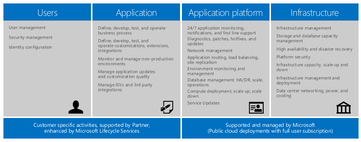
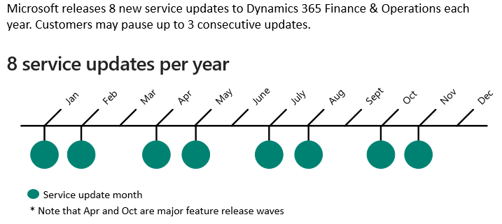

---
# required metadata

title: Service description for Dynamics 365 Finance and Dynamics 365 Supply Chain Management apps
description: This topic provides the service description for Dynamics 365 Finance and Dynamics 365 Supply Chain Management.
author: shellybakke
manager: AnnBe
ms.date: 03/29/2021
ms.topic: article
ms.prod:
ms.service: dynamics-ax-applications
ms.technology: 

# optional metadata

# ms.search.form:
audience: Application User, Developer, IT Pro
# ms.devlang: 
ms.reviewer: sericks
# ms.tgt_pltfrm: 
# ms.custom: NotInTOC
ms.search.region: Global
# ms.search.industry:
ms.author: sericks
ms.search.validFrom: 2021-03-31
ms.dyn365.ops.version: 10.0.18
---

# Service Description for Dynamics 365 Finance and Operations

[!include[banner](../includes/banner.md)]

## Overview

Microsoft Dynamics 365 Finance and Operations is an Enterprise Resource Planning (ERP) SaaS that is built on and for the Microsoft Azure Cloud. The service provides organizations with the ERP functionality to support their unique requirements and help them adjust to constantly changing business environments, without managing infrastructure. Finance and Operations can include one or more of the following solution areas: 

- [Finance](https://docs.microsoft.com/en-us/dynamics365/finance/)
- [Human Resources](https://docs.microsoft.com/en-us/dynamics365/human-resources/)
- [Supply Chain Management](https://docs.microsoft.com/en-us/dynamics365/supply-chain/)
- [Commerce](https://docs.microsoft.com/en-us/dynamics365/commerce/)
- [Project Operations](https://docs.microsoft.com/en-us/dynamics365/project-operations/)

The SaaS brings together these applications, plus business intelligence, infrastructure, compute, and database services, and enables organizations to run industry-specific and operational business processes. With the support of their Implementation Partner, Customers determine the configuration of the business application logic in Finance and Operations to match their unique business processes. Functionality and Business Processes can be augmented or extended with one or any combination of the following:

- Low-Code [Microsoft Power Platform](https://docs.microsoft.com/en-us/dynamics365/fin-ops-core/dev-itpro/power-platform/overview) Tools
- Pro Developer [Microsoft Visual Studio](https://visualstudio.microsoft.com) and [Azure DevOps](https://dev.azure.com)
- Independent Software Vendor (ISV) solutions from [Microsoft AppSource](https://appsource.microsoft.com/partners)

Based on requirements, Customers choose their solution approach. Working with their Implementation Partner, Customers define, develop, and test their solution using the tools and best practices that are provided in [Microsoft Dynamics Lifecycle Services (LCS)](https://docs.microsoft.com/en-us/dynamics365/fin-ops-core/dev-itpro/lifecycle-services/lcs). The following illustrates three common scenarios: 

-	**Solution 1:** Standard Finance and Operations configuration (no extension) 
-	**Solution 2:** Finance and Operations configuration with customer-specific extensions 
-	**Solution 3:** Finance and Operations configuration with customer-specific extensions and one or more ISV solution  

Organizations can match their business growth by easily adding users and business processes with a simple, transparent subscription model. Refer to the [Dynamics 365 Licensing Guide](https://www.microsoft.com/licensing/docs/view/Microsoft-Dynamics-365) for more details.

## Operating model

The operating model of Finance and Operations defines specific roles and responsibilities for the Customer, Implementation Partner, and Microsoft throughout the lifecycle of the service. 

Microsoft manages the Finance and Operations service by deploying, actively monitoring, and servicing customer sandbox and production environments within the Microsoft SaaS subscription. This includes allocating the required system infrastructure to run the service and proactive communication to customers about the service’s health. 

For more information, see [Cloud Operations and Servicing](https://docs.microsoft.com/en-us/dynamics365/fin-ops-core/dev-itpro/lifecycle-services/cloud-operations-servicing)

## System configuration

Finance and Operations scales with transaction volume and user load. Each Customer implementation of Finance and Operations produces a unique solution comprised of the following: 

-	**Data composition:** A unique set of parameters that control behavior, layout of the organization, structure of master data (such as financial and inventory dimensions), and granularity of transaction tracking. 
-	**Extension and configuration:** Extension mechanisms of Finance and Operations with code extensions, ISV solutions, and unique configurations including workflows, integrations, and report configurations. 
-	**Usage patterns:** A unique combination of online and batch usage combined with the ability to integrate with upstream and downstream systems for unified data flow and the ability to differentiate based on the information views used by customers in their business processes. 

Microsoft configures customer production environments that are sized to handle the transaction volumes and user concurrency. Microsoft is responsible for: 

-	Proper allocation of resources of production environments, based on the Customer’s profiling information in the [LCS Subscription Estimator](https://docs.microsoft.com/en-us/dynamics365/fin-ops-core/dev-itpro/lifecycle-services/subscription-estimator) 
-	Continually monitoring and diagnosing service availability of production environments 
-	Analyzing and troubleshooting system performance issues with Finance and Operations 

To ensure that an implementation is configured for high performance, customers must:

-	Provide accurate usage information for the Finance and Operations implementation in the [LCS Subscription Estimator](https://docs.microsoft.com/en-us/dynamics365/fin-ops-core/dev-itpro/lifecycle-services/subscription-estimator) 
- Build and test extensions for performance and scale 
-	Test data configurations appropriately for performance 

### Onboarding and implementation

Typical onboarding and implementation events are as follows:

| Request | Expected Microsoft action  | Expected Customer/Implementation Partner action |
|-------------------------|-------------------------|-------------------------|
| Initial offer purchase | LCS project is created after the purchase of the offer based on event triggered by the customer. | Go through EA or CSP [commercial process](https://docs.microsoft.com/en-us/dynamics365/fin-ops-core/fin-ops/get-started/before-you-buy). Partner creates tenant for customer, if applicable. |
| Add-on purchase | Grant customer access to add-on selected during the implementation. | Not applicable. |
| Implementation planning and analysis | Provide relevant tools in LCS, such as [Business Process Modeler](https://docs.microsoft.com/en-us/dynamics365/fin-ops-core/dev-itpro/lifecycle-services/bpm-overview) and [interoperability with Azure DevOps](https://docs.microsoft.com/en-us/dynamics365/fin-ops-core/dev-itpro/lifecycle-services/synchronize-bpm-vsts). |Project planning, Azure DevOps, System onboarding and admin account setup.|

For more information, see [Onboarding an implementation project](../imp-lifecycle/onboard.md).

### Globalization

Finance and Operations is served from a number of Azure Regions worldwide. Finance and Operations provides functionality to support different country/regions as well as native language. For more details, refer to [Localization and Regulatory Features](https://docs.microsoft.com/en-us/dynamics365/fin-ops-core/dev-itpro/lcs-solutions/country-region?toc=/dynamics365/finance/toc.json#localization-and-regulatory-features) 

Customers in regulated industry or commercial organizations that do business with entities in France that require local data residency should review [Finance and Operations in France](https://docs.microsoft.com/en-us/dynamics365/fin-ops-core/dev-itpro/deployment/france-local-deployment)

Customers with operations in China should review [Finance and Operations operated by 21Vianet in China](https://docs.microsoft.com/en-us/dynamics365/fin-ops-core/dev-itpro/deployment/china-local-deployment)

### Environment and data management 

Typical environment and data management events performed in the service include the following:

#### Environment and data management events for production instances

**Event:** [Requesting a production instance](https://docs.microsoft.com/dynamics365/fin-ops-core/fin-ops/imp-lifecycle/prepare-go-live?toc=/dynamics365/finance/toc.json#requesting-the-production-environment) 
- Complete and submit the [Go-live checklist](https://docs.microsoft.com/en-us/dynamics365/fin-ops-core/fin-ops/imp-lifecycle/prepare-go-live?toc=/dynamics365/finance/toc.json#fasttrack-go-live-assessment) to the [Microsoft FastTrack](https://docs.microsoft.com/en-us/dynamics365/fasttrack/) team.
- Complete the [LCS Subscription Estimator](https://docs.microsoft.com/en-us/dynamics365/fin-ops-core/dev-itpro/lifecycle-services/subscription-estimator) before requesting a production instance.
- Complete all implementation tasks specified in the [LCS methodology](https://docs.microsoft.com/en-us/dynamics365/fin-ops-core/dev-itpro/lifecycle-services/create-methodology). 
 
**Event:** [Copy a sandbox database to a production instance](https://docs.microsoft.com/dynamics365/fin-ops-core/dev-itpro/database/dbmovement-scenario-goldenconfig).
- Note that this is performed when ready to do a mock go-live or an actual go-live cutover.

**Event:** [Maintenance mode](https://docs.microsoft.com/en-us/dynamics365/fin-ops-core/dev-itpro/sysadmin/maintenance-mode)
- Turn on maintenance mode in LCS.
- Complete necessary maintenance.
- Turn off maintenance mode in LCS.

#### Environment and data management events for non-production instances

LCS provides [self-service provisioning](https://docs.microsoft.com/en-us/dynamics365/fin-ops-core/dev-itpro/deployment/infrastructure-stack) and [database movement operations](https://docs.microsoft.com/dynamics365/fin-ops-core/dev-itpro/database/dbmovement-operations) that are used for performing environment and data management tasks. These include the following:

**Event:** [Deploy a new sandbox instance](https://docs.microsoft.com/dynamics365/fin-ops-core/dev-itpro/deployment/deployenvironment-newinfrastructure)
- Ensure that all required instances have been [planned](https://docs.microsoft.com/en-us/dynamics365/fin-ops-core/fin-ops/imp-lifecycle/environment-planning?toc=/dynamics365/finance/toc.json) and that the applicable add-on offers have been purchased.
- Run the deployment process in LCS.
- Complete all tasks specified in the LCS checklists.
- A Development environment is a VM [deployed to the customer's Azure subscription](https://docs.microsoft.com/dynamics365/fin-ops-core/dev-itpro/dev-tools/access-instances) and is customer-managed.

**Event:** [Copy golden configuration database from sandbox to production](https://docs.microsoft.com/dynamics365/fin-ops-core/dev-itpro/database/dbmovement-scenario-goldenconfig).
- Note that this is performed when ready to do a mock go-live or an actual go-live cutover.

**Event:** [Restore a production point-in-time backup to a mon-production instance](https://docs.microsoft.com/dynamics365/fin-ops-core/dev-itpro/database/database-pitr-prod-sandbox)
- Run the [Refresh Database](https://docs.microsoft.com/en-us/dynamics365/fin-ops-core/dev-itpro/database/database-refresh) option in LCS.
- Post-copy: Delete or obfuscate sensitive data, adjust environment specific application configurations (such as integration endpoints), and enable or add users. Note that these changes are made by applying a [data package](https://docs.microsoft.com/en-us/dynamics365/fin-ops-core/dev-itpro/data-entities/data-entities-data-packages#import-a-data-package).

**Event:** [Non-production instance database point-in-time restore](https://docs.microsoft.com/dynamics365/fin-ops-core/dev-itpro/database/database-point-in-time-restore)
Accept that the process cannot be undone.
Run the point-in-time restore operation in LCS.

**Event:** Copy Tier 2 sandbox database to a development sandbox for troubleshooting and [debugging](https://docs.microsoft.com/dynamics365/fin-ops-core/dev-itpro/database/dbmovement-scenario-debugdiag)  
- Run database export operation in LCS on the Tier 2 sandbox environment.
- Import and update the database in the development environment.

### Data back-up and retention 

Databases for Finance and Operations environments in the SaaS subscription are protected by automatic back-ups. Automatic back-ups are retained for 28 days for production environments (unless Microsoft performs a rollback) and 7 days for sandbox (Tier 2+) environments. A rollback of production may be performed in the event a failure occurs during any planned maintenance update specified in [planned maintenance responsibilities](service-description.md#planned-maintenance-responsibilities).

For more information about automatic back-ups, see [Automated backups - Azure SQL Database & SQL Managed Instance](https://docs.microsoft.com/azure/azure-sql/database/automated-backups-overview?tabs=single-database).

### Service activity responsibilities 

The following table describes some typical scenarios and activities for the service along with the responsibilities of Microsoft, the customer, or both concerning such activities.

| Activity  | Responsibility of Microsoft  | Responsibility of the customer |
|-------------------------|-------------------------|------|
| **Provisioning initial tenants**  |  |   |
| Size projected load in LCS using the Subscription Estimator tool and request specific environment(s) to be provisioned |  | X |
| Provision all production instances and non-production instances | X |   |
| Validate the deployed production instances and non-production instances |  | X  |
| **Service updates**  |  |
| Microsoft applies service updates to designated non-production and production instances | X  | X  |
| Download update from LCS and define, develop, and test the update, and provide code update package back to LCS |  | X  |
| Request extension updates to be applied to the production instance |  | X |
| Create code and data backup for production instance before applying any updates | X  |   |
| In case of any failure, roll back production instance to code and data backup | X  |    |
| **Data management (Backup, restore, and update)**|  |   |
| Backup database | X  |   |
| Determine HA and disaster recovery plan | X  |    |
| Monitor production instance database performance | X   | X  |
| Tuning the production instance database for performance | X  | X  |
| Initiate copy of production instance database to non-production instance |  | X  |
| **Update infrastructure**  |  |  |
| Schedule regular infrastructure updates | X |    |
| **Scale up and down (Users, storage, instances)**|  |   |
| Purchase additional users and non-production add-ons |  |  X |
| Changes in usage updated in the LCS Subscription Estimator tool |  | X |
| Report any significant performance issues impacting usage of the service |  | X |
| Proactively manage the resources needed for the applicable service | X |   |
| Investigate and troubleshoot incidents | X | X |
| **Security (user access)**|  |   |
| Provide user access to the service |  |  X |
| Provide LCS project access for managing and operating instances deployed through LCS |  | X |
| **Monitor production instance**|  |  |
| Monitor production instances 24x7 | X |   |
| Notify the customer proactively of incidents with the production instance | X |   |
| **Manage and monitor non-production instances** |  |   |
| Manage non-production instances with LCS |  | X  |
| Monitor non-production instances |  | X  |

### Service update strategy and maintenance windows 

Customers must stay current on the latest service updates in accordance with the [software lifecycle policy](https://docs.microsoft.com/dynamics365/unified-operations/dev-itpro/migration-upgrade/versions-update-policy). Finance and Operations follows the Microsoft [Modern Lifecycle Policy](https://docs.microsoft.com/en-us/dynamics365/fin-ops-core/dev-itpro/migration-upgrade/versions-update-policy#modern-lifecycle-policy), which covers products that are serviced and supported continuously. The following illustrates the process:
 

For more details refer to [One Version Service updates](https://docs.microsoft.com/dynamics365/unified-operations/dev-itpro/lifecycle-services/oneversion-overview).

### Security and administrative access 

Administrative access to a Finance and Operations production environment is strictly controlled and logged. Customer data is handled in accordance with the Microsoft Online Services Terms. Customer's tenant administrator can access production instances or non-production instances as described in the following table.

For more information, see [Licensing terms and documentation](https://www.microsoft.com/licensing/product-licensing/products).

#### Customer's administrative access

| Environment type | Purpose  | Level of customer access  |
|-------------------------|-------------------------|-------------------------|
| **Non-production instance** Sandbox Tier 1: Developer instance | A non-production instance that the customer can use for development or to customize any service and unit tests that the customer changes. | A Tier 1 sandbox is deployed as a VM to a customer's own Azure subscription via LCS. Because it is a VM in the customer's own Azure subscription, the customer has full administrator access to development environment. Customer will continue to have full administrative access to the SQL Server installed in the environment. These environments are fully managed by the customer and available to deploy via Cloud Hosted Environments. |
| **Non-production instance** Sandbox Tier 2: Standard Acceptance Testing instance (or any sandbox Tier add-on)| Non-production instance that customer can use for user acceptance testing, integration testing, and training of any service. | Remote desktop access is not available. Access to the SQL Server associated with the non-production instance is granted via [just-in-time access](https://docs.microsoft.com/en-us/dynamics365/fin-ops-core/dev-itpro/database/database-just-in-time-jit-access).|
| **Production instance** | Use to go-live with any service. | All access is only through the Finance and Operations browser client, service endpoints, or through LCS. These environments are managed by Microsoft.|

#### Microsoft's administrator access

The following table details the different levels of access for different Microsoft administrators.

| Administrator | Customer data  |
|-------------------------|-------------------------|
| Operations responses team (Limited to key personnel only) |Yes, granted by support ticket. Access is audited and limited to the duration of the support activity. |
| Microsoft Customer Support Services | No direct access. Customer may use screen sharing to work with support staff to debug issues. |
| Engineering | No direct access. Operations response team may use screen sharing to work with engineering to debug issues. |
| Others in Microsoft | No access.|

### Monitoring and incident management 

#### Monitoring 

Microsoft has invested in an extensive toolset to monitor and diagnose Customers' production instances. Microsoft monitors Customers' production environments 24 hours a day, 7 days a week. For more details see [Production support and monitoring](https://docs.microsoft.com/en-us/dynamics365/fin-ops-core/fin-ops/imp-lifecycle/production-support-monitoring).

| Microsoft's responsibilities | Customer's responsibilities |
|-------------------------|-------------------------|
|<ul><li>Availability monitoring of the service.  <li>Continuous monitoring and alerts through health metrics and watchdogs for critical components such as AOS, Batch, DIXF, Commerce, and Management Reporter.  <li>Monitoring for performance degradation caused by infrastructure services (AAD, Azure SQL, etc.).  <li>In the event Microsoft determines that a single process or batch job is causing aberrations, these processes will be thwarted after communication with the customer.|<ul><li>Monitor changes to application configurations and extensions that can cause functional and performance issues.  <li>Application errors need to be diagnosed using the monitoring tools. Diagnose user reported performance aberrations using these tools. <li>Inform Microsoft in the event that there is expected load on the system beyond projected peak usage. <li>In the event the applicable service is unavailable in the production instance, the customer can report a [Production Outage](https://docs.microsoft.com/en-us/dynamics365/fin-ops-core/dev-itpro/lifecycle-services/report-production-outage) using LCS.|

Submitting support requests online, via LCS allows Microsoft to deliver fast and deep technical expertise in the most effective and efficient manner possible. A phone option is available, but should only be used if online is not avaialble. For more details refer to [Phone Support Options](https://docs.microsoft.com/en-us/power-platform/admin/support-overview?toc=/dynamics365/fin-ops-core/dev-itpro/toc.json&bc=/dynamics365/breadcrumb/toc.json#is-there-a-phone-number-i-can-call-to-contact-support)
 
#### Incident management 

Microsoft responds to and resolves incidents based on the severity levels set forth in the following tables. Microsoft's incident severity levels can be changed during initial assessment of the incident and as more information about the impact and scope becomes available. If the incident is mitigated, then the incident severity remains unchanged.

##### Severity level description

| Classification | Description |
|-------------------------|-------------------------|
| **Severity 0 (Sev-0)** Catastrophic | <ul><li>Catastrophic event in which all functions of a service in a region are down or inaccessible.  **Note:** Sev-0 incidents normally start as Sev-1, then get upgraded with management approval based on assessment of impact type/scope. |
| **Severity 1 (Sev-1)** Critical | <ul><li>Severe outage of a service caused by confirmed systemic problem, resulting in a broad scope of impact, requiring a Technical Control Bridge and engagement from applicable engineering teams.</li> <li>Suspected breach of a security or privacy boundary. |
|**Severity 2 (Sev-2)** Urgent| <ul><li>Service outage with narrow scope of impact (&gt; 25% customers). <li>Degradation of customer experience caused by confirmed systemic event with broad scope (&gt; 25% customers). <li>Service outage with limited scope of impact (single organization or subset of users). |
|**Severity 3 (Sev-3)** Moderate | <ul><li> Degradation of customer experience caused by confirmed systemic event with narrow scope. |
|**Severity 4 (Sev-4)** Non-SLA impacting | <ul><li>Monitoring or customer-reported incidents requiring action to avoid potential service impact. <li>General maintenance events with no customer impact. <li>Standard service change requests.|

##### Incident scope and severity level impact

| Incident impact | Entire geo  -OR-  less than 25% of global footprint | One customer  -OR-  subset of users belonging to one customer |
|-------------------------|-------------------------|-------------------------|
| Service is unavailable | Sev-1 | Sev-2 |
| Service is usable only through a workaround or critical subset feature is malfunctioning | Sev-2 | Sev-3 |
| Degradation of performance, or non critical subset feature is malfunctioning | Sev-3 | Sev-4 |
| Incidents requiring action to avoid potential impact or service disruption | Sev-3 | Sev-4 |

### Business continuity with high availability and disaster recovery 

Microsoft provides business continuity and disaster recovery for production instances of Finance and Operations if a Microsoft Azure region-wide outage occurs. See [Business continuity and disaster recovery](https://docs.microsoft.com/en-us/dynamics365/fin-ops-core/dev-itpro/sysadmin/business-continuity-disaster-recovery) for more details.

- **High Availability**: HA functionality provides ways to prevent downtime caused by the failure of a single node within an Azure datacenter. Each service's cloud architecture uses Azure availability sets for the compute tier to prevent single-point-of-failure events. HA for databases is provided through Azure SQL (a platform-as-a-service (PaaS) offering from Microsoft).

- **Disaster Recovery**: DR features protect each service against outages broadly impacting an entire Azure datacenter and include the following:
  - Azure SQL active-geo replication for primary database (business database), with a Recovery Point Objective (RPO) estimate of ≤ 5 seconds.
  - Geo-redundant copies of Azure blob storage (containing document attachments) in other Azure regions.
  - Same secondary region for the Azure SQL and Azure blob storage replications.

The primary data stores are supported for replication. This means that components for each service, such Management Reporter and entity store, use transformed data from the primary database, which need to be generated after the recovery site has been setup and service started. Customer code artifacts and recovered data stores are used to re-deploy the site, with a Recovery Time Objective (RTO) of up to 10 hours. This will enable state replication of the compute nodes along with networking and other components to set up the secondary site using the recovered data stores. In the event DR is utilized to recover the customer's production instance, Microsoft and customer will perform the responsibilities in [Incident management](service-description.md#incident-management).

| Microsoft's responsibilities  | Customer's responsibilities |
|-------------------------|-------------------------|
| Microsoft provisions a secondary environment in the Azure paired datacenter at the time of deployment of the primary production instance.  See the [Business continuity and disaster recovery (BCDR): Azure Paired Regions](https://docs.microsoft.com/azure/best-practices-availability-paired-regions) for details. | None |
| Microsoft enables Geo Redundancy of SQL and Azure Storage at the time of deployment of the primary production instance. | None|
| Microsoft enables automatic backup on the Azure SQL databases. |None |
| On outage, Microsoft determines if a failover needs to be executed for the customer and if there will be a data loss. Data loss can be up to 5 sec. For details, see [Azure SQL Database Geo-Restore]https://azure.microsoft.com/blog/azure-sql-database-geo-restore).  In the event of a data loss, Microsoft will send a request to the customer asking for its sign-off on a failover. | Customer may need to provide written sign-off to trigger the failover in the event of data loss.|
| The applicable Service will be operated in limited mode on failover. Update maintenance cannot be triggered in failover mode. | Customer cannot request package deployments or other regular maintenance requests in failover mode. |
| Microsoft fails back to the production instance in the primary Azure region when the datacenter becomes operational. Normal operations are resumed. | Customer may need to sign-off on fail back to the production instance in the primary Azure region.|

### Application support offerings 

Technical Support is available in markets where Dynamics 365 Finance and Operations services are offered. [Support experiences](https://docs.microsoft.com/en-us/dynamics365/fin-ops-core/dev-itpro/lifecycle-services/lcs-support) are provided within Lifecycle Services or Finance and Operations. These include the following:

 - [Issue Search](https://docs.microsoft.com/en-us/dynamics365/fin-ops-core/dev-itpro/lifecycle-services/issue-search-lcs) in Lifecycle Services
 - [Integrated technical](https://docs.microsoft.com/en-us/dynamics365/fin-ops-core/dev-itpro/lifecycle-services/support-experience) support within Finance and Operations
 - LCS [Cloud Powered Support](https://docs.microsoft.com/en-us/dynamics365/fin-ops-core/dev-itpro/lifecycle-services/cloud-powered-support-lcs)

Microsoft offers VL customers three support plans: Premier, Professional Direct, and the support included in the subscription. The level of support differs per plan and highlights are provided in the following table.

| Service feature | Premier | Professional direct  | Subscription |
|-----------------|-------------|-----------------|--------------|
| Unlimited break/fix incidents | N/A | N/A | N/A |
| 24x7 support | N/A | N/A | Local business hours |
| Fastest response times | &lt;1 hour | &lt;1 hour | Next business day |
| Advisory hours | Pools acquired per agreement | N/A | N/A |
| Dedicated Support Account Manager | Yes | N/A | N/A |

For more details, refer to [Support Overview](https://docs.microsoft.com/en-us/power-platform/admin/support-overview)

#### Process to engage support 

In case of incidents with Finance and Supply Chain Management, customers can submit support tickets to Microsoft through LCS. CSS will handle incidents depending on the customer's support plan and severity of the incident as designated by CSS.

### Service Level Agreement 

Microsoft is committed to an availability of 99.9% per month of the service. If Microsoft does not achieve and maintain the service level for the applicable Service described in the SLA, then the customer may be eligible for a credit towards a portion of its monthly service fees for the applicable Service. See the "Claims" section of the [SLA](https://www.microsoft.com/licensing/docs/view/Service-Level-Agreements-SLA-for-Online-Services) for details on how to initiate a service credit. 

## Important resources

- [Trust Center](https://www.microsoft.com/trust-center): Information on where your Finance and Supply Chain Management data is stored, plus additional information on privacy, compliance, and security procedures.

- [Licensing terms and documentation](https://www.microsoftvolumelicensing.com/): Quickly access licensing terms, conditions, and supplemental information relevant to the use of products and services licensed through Microsoft Volume Licensing programs.

- [Licensing terms](https://www.microsoft.com/licensing/product-licensing/): The licensing terms resources on this page define the terms and conditions for the software and online services products you purchase through Microsoft Commercial Licensing programs.

- [Microsoft Lifecycle Policy](https://docs.microsoft.com/lifecycle/): Provides consistent and predictable guidelines for the availability of support throughout the life of a product.

- [Licensing guide](https://www.microsoft.com/licensing/docs/view/Microsoft-Dynamics-365): Use this guide to improve your understanding of how to license Dynamics 365.

- [Customer support](https://dynamics.microsoft.com/support/): Get industry-leading support for your Dynamics 365 applications.

- [Dynamics Lifecycle Services](https://lcs.dynamics.com/): Manage your application lifecycle and move towards predictable, repeatable, high quality implementations.

## Definitions

### [Azure region](https://docs.microsoft.com/en-us/azure/availability-zones/az-overview#regions)
A geographical region where one or more Azure datacenters exist; for example, US and Europe.

### [Business Process Modeler (BPM)](https://docs.microsoft.com/en-us/dynamics365/fin-ops-core/dev-itpro/lifecycle-services/bpm-overview)
A tool in LCS to help complete a fit-gap analysis for a given implementation using business process definitions as defined in APQC and their support within Finance and Operations apps.

### Cloud Solution Provider (CSP) 
Partners who are part of Microsoft's CSP program and provide customers with value-added cloud services, support, one invoice, and customer management at scale.

### Customer 
A business entity that consumes Finance and Operations apps and is represented by a tenant in Microsoft Office 365.

### Development environment
Also known as a [Tier 1 sandbox](https://docs.microsoft.com/en-us/dynamics365/fin-ops-core/fin-ops/imp-lifecycle/environment-planning?toc=/dynamics365/finance/toc.json#tier-1-vs-tier-2-and-higher). An environment used for developing extensions.

### Downtime 
Any period of time when end users are unable to login or access to their active tenant, due to a failure in the unexpired platform or the service infrastructure as Microsoft determines from automated health monitoring and system logs. Downtime does not include scheduled downtime, the unavailability of service add-on features, the inability to access the service due to your modifications of the service, or periods where the scale unit capacity is exceeded.

### Implementation partner 
The partner that the customer choses to customize, configure, implement, and manage its Finance and Supply Chain solutions.

### [Microsoft Dynamics Lifecycle Services (LCS)](https://docs.microsoft.com/en-us/dynamics365/fin-ops-core/dev-itpro/lifecycle-services/lcs-works-lcs) 
The administrative portal for lifecycle management of Finance and Operations from trial to implementation to post-production management and support.

### Microsoft customer support 
Microsoft's support team dedicated to providing quality service for Finance and Supply Chain Management.

### Non-production instance 
Any of the following instances of a service that are used by the customer for validating extensions and other development tasks:

- **Sandbox Tier 1:** Developer instance (customer-hosted) 

- **Sandbox Tier 2:** Standard Acceptance Testing instance 

- **Sandbox Tiers 3-5:** Add-on aandboxes [Details for each Tier](https://docs.microsoft.com/dynamics365/fin-ops-core/fin-ops/imp-lifecycle/environment-planning?toc=/dynamics365/finance/toc.json#selecting-the-correct-tier-2-or-higher-environment)

### Production instance 
Instance of Finance and Supply Chain Management used by the customer for managing its "live" daily transactions.

### Sandbox/staging environment 
Instance of Finance and Supply Chain Management used by the customer for validating extensions and other development tasks.

### Service 
The core services included in Dynamics 365 for Finance and Operations.

### Service Level Agreement for Microsoft Online Services [(SLA)](https://www.microsoft.com/licensing/docs/view/Service-Level-Agreements-SLA-for-Online-Services) 
The SLA applies to Microsoft's Online Services, including Finance and Operations.

### Incident 
An issue with Finance and Operations that the customer encounters while using the service.

### Update request
Request raised to Microsoft for specific update.

### User
A single person consuming Finance and Operations environments, associated with a customer's tenant.
