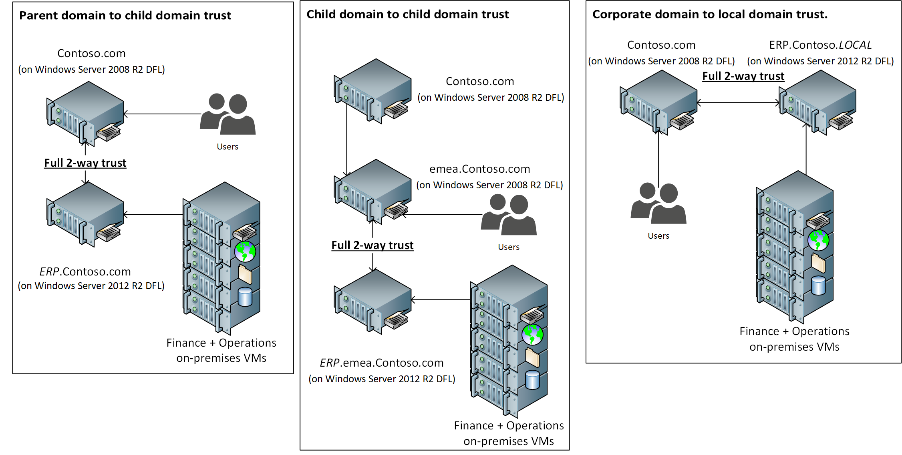
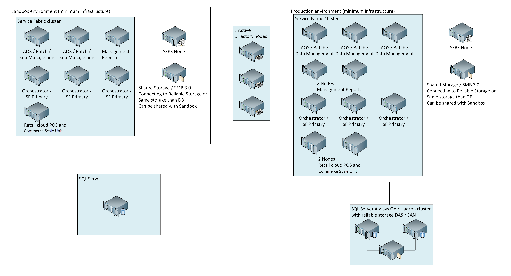

---
# required metadata

title: System requirements for on-premises deployments
description: This article lists the system requirements for on-premises deployments.
author: PeterRFriis
ms.date: 02/08/2022
ms.topic: article
ms.prod: dynamics-365
ms.service:
ms.technology: 

# optional metadata

# ms.search.form: 
# ROBOTS: 
audience: Developer, IT Pro
# ms.devlang: 
ms.reviewer: sericks
# ms.tgt_pltfrm: 
ms.assetid: 
ms.search.region: Global
# ms.search.industry: 
ms.author: peterfriis
ms.search.validFrom: 2016-08-30
ms.dyn365.ops.version: Platform update 8
search.app:
  - financeandoperationsonprem-docs
---

# System requirements for on-premises deployments

[!include [banner](../includes/banner.md)]

This article lists the system requirements for the current version of Microsoft Dynamics 365 Finance + Operations (on-premises) deployments. Verify that the system that you're working with meets or exceeds the minimum network, hardware, and software requirements.

> [!IMPORTANT]
> Dynamics 365 Finance + Operations (on-premises) is not supported on any public cloud infrastructure, including Microsoft Azure Cloud services. However, it is supported to run on [Microsoft Azure Stack HCI](https://azure.microsoft.com/products/azure-stack/hci/) and [Microsoft Azure Stack Hub](https://azure.microsoft.com/products/azure-stack/hub/).

## Network requirements

Dynamics 365 Finance + Operations (on-premises) can work on networks that use Internet Protocol Version 4 (IPv4) or Internet Protocol Version 6 (IPv6). Consider the network environment when you plan your system, and use the following guidelines.

### Network response time

The following table lists the minimum network requirements for the connection between the web browser and Application Object Server (AOS), and for the connection between AOS and the database in an on-premises system.

| Value     | Web browser to AOS                      | AOS to database                                                                            |
|-----------|-----------------------------------------|--------------------------------------------------------------------------------------------|
| Bandwidth | 50 kilobytes per second (KBps) per user | 100 megabytes per second (MBps)                                                            |
| Latency   | Less than 250–300 milliseconds (ms)     | Less than 1 ms (local area network \[LAN\] only). AOS and the database must be co-located. |

- Finance + Operations is designed for networks that have a latency of 250–300 milliseconds (ms) or less. This latency is the latency from a browser client to the datacenter that hosts Finance + Operations.
- Bandwidth requirements depend on your scenario. Typical scenarios require a bandwidth of more than 50 KBps between the browser and the server. However, we recommend higher bandwidth for scenarios that have high payload requirements, such as scenarios that involve workspaces or extensive customization. The specific amount of bandwidth depends on use.

Deployments where AOS and the Microsoft SQL Server database are in different datacenters aren't supported. AOS and the SQL Server database must be co-located.

In general, Finance + Operations is optimized to reduce browser-to-server round trips. The number of round trips from a browser client to the datacenter is either zero or one for each user interaction, and the payload is compressed.

> [!WARNING]
> Don't calculate bandwidth requirements from a client location by multiplying the number of users by the minimum bandwidth requirements. The concurrent usage of a given location is very difficult to calculate. We recommend that you use a real-life simulation against a non-production environment as the best gauge of performance for your specific case.

### LAN environments

In LAN environments, Microsoft Remote Desktop in Microsoft Windows Server isn't required in order to connect to Finance + Operations. However, Remote Desktop might be required for servicing operations on the virtual machines (VMs) that make up the server deployments.

### WAN environments

In wide area network (WAN) environments, Remote Desktop in Windows Server isn't required in order to connect to Finance + Operations.

### Internet connectivity requirements

Finance + Operations doesn't require internet connectivity from user workstations. However, some features won't be available if there is no internet connectivity.

<table>
<tbody>
<tr>
<td><strong>Browser client</strong></td>
<td>An intranet scenario without internet connectivity is a design point for the on-premises deployment option. Some features that require cloud services won't be available, such as Help and Task guide libraries in Microsoft Dynamics Lifecycle Services (LCS).</td>
</tr>
<tr>
<td><strong>Server</strong></td>
<td>The orchestrator node types must be able to communicate with LCS for deployment and servicing operations. The on-premises browser-based client doesn't require internet access.</td>
</tr>
<tr>
<td><strong>Telemetry</strong></td>
<td>Telemetry data might be lost if there are long interruptions in connectivity. Interruptions in connectivity to LCS don't affect the on-premises application functionality.</td>
</tr>
</tbody>
</table>

## Telemetry data transfer to the cloud

Most telemetry data is stored locally and can be accessed by using Event Viewer in Microsoft Windows. A small subset of telemetry events is transferred to the Microsoft telemetry pipeline in the cloud for diagnostics. Customer data and user-identifiable data aren't part of the telemetry data that is sent to Microsoft. VM names are sent to Microsoft to help with environment management and diagnostics from the LCS portal.

## Domain requirements

Consider the following domain requirements when you install Finance + Operations:

- VMs that host Finance + Operations components must belong to an Active Directory domain. Active Directory Domain Services (AD DS) must be configured in native mode.
- VMs that run Finance + Operations components must have access to each other. This access is configured in AD DS.
- The domain controller must be Microsoft Windows Server 2012 R2 or later, and the domain functional level must be 2012 R2 or more.

### Full 2-way trust

For compatibility with corporate domain controllers on Windows Server 2008 R2 domain functional level (DFL), a full 2-way trust between the Windows Server 2008 R2 DFL user domain and the Windows Server 2012 R2 DFL Finance + Operations service domain is supported in Platform update 33 and later.

This means that users of the Finance + Operations (on-premises) application will come from the Windows Server 2008 R2 DFL domain, and the resources and service accounts hosting the Finance + Operations (on-premises) infrastructure and services will come from the Windows Server 2012 R2 DFL domain.

Examples for a full 2-way trust setup could be.

#### Known limitations with using the full 2-way trust setup

* Import of security groups from the Windows Server 2008 R2 user domain is not supported.

## Hardware requirements

This section describes the hardware that is required in order to run Finance + Operations.

The actual hardware requirements vary, based on the system configuration, the data composition, and the features that you decide to use. Here are some of the factors that can affect the choice of appropriate hardware:

- The number of transactions per hour
- The number of concurrent users

## Minimum infrastructure requirements

Finance + Operations uses Service Fabric to host the AOS, Batch, Data management, Management reporter, and Environment orchestrator services.

SQL Server must have a high-availability HADRON setup that has at least two nodes for production use.

The following illustration shows the minimum number of nodes that is recommended for your Service Fabric cluster.

## Processor and RAM requirements

The following tables list the number of processors and the amount of random-access memory (RAM) that are required for each role that is required in order to run this deployment option. For more information, see the recommended minimum requirements for a Service Fabric standalone cluster in [Plan and prepare your Service Fabric cluster](/azure/service-fabric/service-fabric-cluster-standalone-deployment-preparation).

> [!NOTE]
> If other Microsoft software is installed on the same computer, the system must also comply with the hardware requirements for that software. If other server applications are installed on the same computer as AOS, we recommend that you limit those server applications 1 gigabyte (GB) of RAM.

**Sizing by role and topology type**

| Topology   | Role (node type)              | Recommended processor cores | Recommended memory (GB) |
|------------|-------------------------------|-----------------------------|-------------------------|
| Production | AOS, Data management, Batch   | 8                           | 24                      |
|            | Management Reporter           | 4                           | 16                      |
|            | SQL Server Reporting Services | 4                           | 16                      |
|            | Orchestrator                  | 4                           | 16                      |
|            | SQL Server                    | 8                           | 32                      |
| Sandbox    | AOS, Data management, Batch   | 4                           | 24                      |
|            | Management Reporter           | 4                           | 16                      |
|            | SQL Server Reporting Services | 4                           | 16                      |
|            | Orchestrator                  | 4                           | 16                      |
|            | SQL Server                    | 8                           | 32                      |

**Minimum sizing estimates for production and sandbox deployments**

| Topology                                        | Role                          | Number of instances |
|-------------------------------------------------|-------------------------------|---------------------|
| Production                                      | AOS (Data management, Batch)  | 3                   |
|                                                 | Management Reporter           | 2                   |
|                                                 | SQL Server Reporting Services | 1                   |
|                                                 | Orchestrator\*\*              | 3                   |
|                                                 | SQL Server                    | 2                   |
| Sandbox                                         | AOS, Data management, Batch   | 2                   |
|                                                 | Management Reporter           | 1                   |
|                                                 | SQL Server Reporting Services | 1                   |
|                                                 | Orchestrator                  | 3                   |
|                                                 | SQL Server                    | 1                   |
| *Summary for production and sandbox topologies* |                               | *19*                |

\* The numbers in this table are being validated by our preview customers and might be adjusted based on the feedback from those customers.

\*\* Orchestrator is designated as the primary node type and will also be used to run the Service Fabric services.

**Initial estimates for the back-end SQL Server and AD DS**

<table>
<thead>
<tr>
<th></th>
<th>Role</th>
<th>VMs/instances</th>
<th>Cores</th>
<th>Total cores</th>
<th>Memory per instance (GB)</th>
<th>Total memory (GB)</th>
</tr>
</thead>
<tbody>
<tr>
<td rowspan="3"><strong>Shared infrastructure</strong></td>
<td>SQL Server*</td>
<td>2</td>
<td>8</td>
<td>16</td>
<td>32</td>
<td>64</td>
</tr>
<tr>
<td>File server/Storage area network/Highly available storage</td>
<td colspan="5">The back-end storage must be based on solid-state drives (SSDs) on a runtime storage area network (SAN).

Size and input/output operations per second (IOPS) throughput is based on the size of the workload.

</td>
</tr>
<tr>
<td>Active Directory</td>
<td>3</td>
<td>4</td>
<td>12</td>
<td>16</td>
<td>48</td>
</tr>
<tr>
<td><em>Summary for shared infrastructure</em></td>
<td></td>
<td><em>5</em></td>
<td></td>
<td><em>28</em></td>
<td></td>
<td><em>112</em></td>
</tr>
</tbody>
</table>

\* SQL Server sizes are highly dependent on workloads. For more information, see [Hardware sizing requirements for on-premises environments](hardware-sizing-on-premises-environments.md). Separate SQL Server machines for sandbox and production environments must be used. However, SQL Server can be shared in all sandbox environments.

## Storage

- **AOS** – Finance + Operations uses a Server Message Block (SMB) 3.0 share to store unstructured data. For more information, see [Storage Spaces Direct in Windows Server 2016](/windows-server/storage/storage-spaces/storage-spaces-direct-overview).
- **SQL** – The following options are viable:

    - A highly available SSD setup
    - A SAN that is optimized for online transaction processing (OLTP) throughputs
    - High-performance direct-attached storage (DAS)

- **SQL Server and data management IOPS** – The storage for both data management and SQL Server should have at least 2,000 IOPS. Production IOPS depends on many factors. For more information, see [Hardware sizing requirements for on-premises environments](hardware-sizing-on-premises-environments.md).
- **VM IOPS** – Each VM should have at least 100 write IOPS.

## Virtual host requirements

When you set up the virtual hosts for an environment, see the guidelines in [Plan and prepare your Service Fabric cluster](/azure/service-fabric/service-fabric-cluster-standalone-deployment-preparation) and [Describing a service fabric cluster](/azure/service-fabric/service-fabric-cluster-resource-manager-cluster-description). Each virtual host should have enough cores for the infrastructure that is being sized. Multiple advanced configurations are possible, where SQL Server resides on physical hardware but everything else is virtualized. If SQL Server is virtualized, the disk subsystem should be a fast SAN or the equivalent. In all cases, make sure that the basic setup of the virtual host is highly available and redundant. In all cases, when virtualization is used, no VM snapshots should be taken.

> [!IMPORTANT]
> Do not use Dynamic Memory for your virtual hosts.

Finance + Operations falls under Microsoft's standard support policy regarding operation on non-Microsoft virtualization platforms – specifically VMWare. For more information, read [Support policy for Microsoft software](https://support.microsoft.com/help/897615/support-policy-for-microsoft-software-that-runs-on-non-microsoft-hardw). In short, we support our products in this environment, but if we are asked to investigate an issue, we may ask the customer to first reproduce the problem without the virtualization platform or on the Microsoft virtualization platform.

## Software requirements for all server computers

The following software must be present on a computer before any Finance + Operations components can be installed:

- The Microsoft .NET Framework. See [Deployment setup](../../dev-itpro/deployment/setup-deploy-on-premises-pu41.md#prerequisites) for version information.
- Service Fabric

For more information about Service Fabric, see [Plan and prepare your Service Fabric cluster](/azure/service-fabric/service-fabric-cluster-standalone-deployment-preparation).

> [!NOTE]
> For supported versions, see [Microsoft Dynamics 365 Finance + Operations (on-premises) supported software](../../dev-itpro/deployment/onprem-compatibility.md).

### Software requirements for database servers

For the hardware requirements for SQL Server, see [Hardware and Software Requirements for Installing SQL Server](/sql/sql-server/install/hardware-and-software-requirements-for-installing-sql-server). |

- Only 64-bit versions of SQL Server are supported.
- Only **SQL\_Latin1\_General\_CP1\_CI\_AS** is valid for the server and database collation. For more information about how to select a collation for a SQL Server database, see the [SQL Server documentation](/sql/sql-server/sql-server-technical-documentation).
- In a production environment, we recommend that you install the latest cumulative update (CU) for the version of SQL Server that you're using.

### Software requirements for Application Object Server (AOS)

- SQL Server Integration Services (SSIS)

### Software requirements for Reporting Server (BI)

- SQL Server Reporting Services (SSRS)

## Software requirements for client computers

Users can access Finance + Operations by using the most recent versions of these popular browsers:

- Microsoft Edge (recommended: [Chromium-based Edge](https://support.microsoft.com/microsoft-edge/download-the-new-microsoft-edge-based-on-chromium-0f4a3dd7-55df-60f5-739f-00010dba52cf))
- Google Chrome
- Apple Safari
- Internet Explorer 11 (deprecated, not recommended)

> [!NOTE]
> For optimal performance and an optimal experience, we recommend that you use the latest version of a modern browser, especially Microsoft Edge. 
> 
> **Version 10.0.21 and later:** Users of old versions of Microsoft Edge and Google Chrome (version 83 and earlier) will receive prompts to update their browser to the latest version. 

### Internet Explorer deprecation

Support for Internet Explorer 11 was deprecated in December 2020, with end of support for the browser occurring in August 2021. For more information, see [Internet Explorer deprecation announcement](../../dev-itpro/get-started/removed-deprecated-features-platform-updates.md#platform-updates-for-version-10015-of-finance-and-operations-apps).

Starting in version 10.0.20, users accessing finance and operations apps with Internet Explorer will start seeing notifications about the end of support for that browser. Before August 17, 2021, Internet Explorer users will see an informational message that Internet Explorer support is soon ending. After that date, Internet Explorer users will see a warning that support has officially ended. Organizations are encouraged to keep these notifications on unless Internet Explorer is mandated for your users, in which case you can choose to suppress these notifications by disabling the **Internet Explorer end-of-support notifications** feature and relying on internal processes for migrating your user base to Microsoft Edge or another modern browser. 

Starting in version 10.0.25, the use of Internet Explorer 11 will be blocked in finance and operations apps. If your organization wants to block Internet Explorer earlier, and you're using version 10.0.21 or later, contact Microsoft Support. 

To prepare organizations and users for the upcoming block of Internet Explorer, in January 2022, Internet Explorer users will start to receive a non-dismissible error message that states that Internet Explorer support will soon be blocked. This error message is **not** controlled by the **Internet Explorer end-of-support notifications** feature. Customers will have to contact Microsoft Support if this message must be suppressed for their organization.

### Special considerations

- To enable Task Recorder to capture screenshots and include them in Microsoft Word documents that are generated, you must install a pre-release Chrome extension.
- The Workflow Editor and Report Designer for Financial reporting are started as ClickOnce applications. They require a 64-bit-compatible operating system. Only Microsoft Edge and Internet Explorer (on a supported version of Microsoft Windows) support ClickOnce applications out of the box. If you're using Chrome, you must install a ClickOnce extension, such as [Meta4](https://chrome.google.com/webstore/detail/meta4-clickonce-launcher/jkncabbipkgbconhaajbapbhokpbgkdc) to use ClickOnce applications. If you use Chrome in incognito mode, make sure that the ClickOnce extension is also enabled for incognito mode.
- To preview PDF files, we recommend that you use browsers such as Microsoft Edge (latest publicly available version) on Windows 10, or Google Chrome (latest publicly available version) on Windows 10, Windows 8.1, Windows 8, Windows 7, or Google Nexus 10 tablet.

## Software requirements for Active Directory Federation Services

Active Directory Federation Services (AD FS) on Windows Server is required.

The domain controller must be Windows Server 2012 R2 or later, and the domain functional level must be 2012 R2 or more. For more information about domain functional levels, see the following pages:

- [What Are Active Directory Functional Levels](/previous-versions/windows/it-pro/windows-server-2003/cc787290(v=ws.10))
- [Understanding Active Directory Domain Services Functional Levels](/previous-versions/windows/it-pro/windows-server-2008-R2-and-2008/cc754918(v=ws.10))
- [Full 2-way trust](../../fin-ops/get-started/system-requirements-on-prem.md#full-2-way-trust)

## Supported Microsoft Office applications

The following Microsoft Office applications are supported in on-premises deployments:

- To run the Microsoft Excel and Microsoft Word add-ins, you must have Microsoft Office 2016 for Windows (or newer) installed. For more information about version requirements, see [Troubleshoot the Office integration](../../dev-itpro/office-integration/office-integration-troubleshooting.md).
- To view documents that are generated by the Export to Excel or Export to Word functionality, you must have Microsoft Office 2007 or later installed.

## Hardware and software requirements for Commerce components

Currently, Finance + Operations doesn't include the Commerce components.

[!INCLUDE[footer-include](../../../includes/footer-banner.md)]

