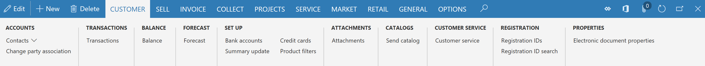
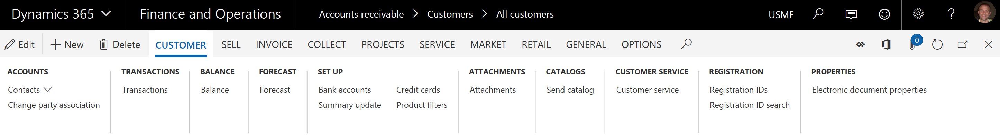
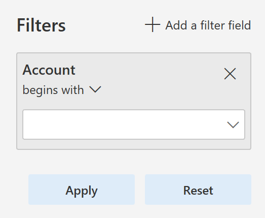

# What's new or changed in Dynamics 365 for Finance and Operations platform update 20 (September 2018)

[!include [banner](../includes/banner.md)]

This article describes features that are either new or changed in Dynamics 365 for Finance and Operations platform update 20. This version was released in September 2018 has a build number of 7.0.5030.

> [!NOTE]
> This platform release is cumulative. It contains new or changed features from Platform update 16, Platform update 17, Platform update 18, Platform update 19, and Platform update 20, as well as all earlier updates.

### Announcing the Dynamics 365 October '18 release notes

Wondering about upcoming and recently released capabilities in any of our business apps or platform?

[Check out the October '18 release notes](/dynamics365/release-plans/). We've captured all the details, end to end, top to bottom, in a single document that you can use for planning.

### Platform update 20 bug fixes

For information about the bug fixes included in each of the updates that are part of Platform update 20, sign in to Lifecycle Services (LCS) and use the following links:

- [Platform update 20 KB article](https://go.microsoft.com/fwlink/?linkid=2022870&clcid=0x409)
- Platform update 19 was not released for General Availability, no KB article
- [Platform update 18 KB article](https://go.microsoft.com/fwlink/?linkid=2025682&clcid=0x409)
- [Platform update 17 KB article](https://go.microsoft.com/fwlink/?linkid=875608&clcid=0x409)
- Platform update 16 was not released for General Availability, no KB article

## Restyled web client 

The Finance and Operations web client has started its journey of aligning to Microsoft Fluent Design. As a result, users on Platform update 20 will see several restyled elements in the product including the following restyled elements: 

-  **General form styling** - Small but effective styling changes have been made to several page elements. FastTabs and grids now have box shadows that give the appearance of these controls being lifted off the page. This same treatment was also applied when hovering over input fields. Record context fields and FastTab headers have smaller but bolder fonts to maintain their importance but remove extra whitespace. 

-  **Dashboard** - Workspace cards on the dashboard now have a more tile-like appearance, with a white background color and box shadow to make them stand out more from the page background. The font size and weight have also been adjusted to allow more room for workspace titles. 

    The following image shows how workspce cards appeared on the dashboard before Platform update 20:

    
  
    The following image shows how workspace cards appear in Platform update 20 and later:

    

-  **Action pane** - Action panes no longer display with a theme-inspired background color; instead, the Action pane has a gray background color. This was done not only to align with Fluent, but also to address some usability issues where users were not associating the Action pane with the rest of the page because of the stark difference in background color.

    The following image shows how the Action pane appeared before Platform update 20:

    

    The following image shows how the Action pane appears in Platform update 20 and later:

    

-  **Filter pane** - The Filter pane has been completely restyled with a lighter background color, a pill-like appearance to filter fields, and repositioning of the "Add a filter field" button to the top of the pane.

    The following image shows how the Filter pane appeared before Platform update 20:

    

    The following image shows how the Filter pane appears in Platform update 20 and later:

    

-  **FactBox pane** - The FactBox pane has also gotten a facelift. The pane now appears to span the full height of the page when open, and most importantly, the collapsed version is more discoverable and shows as a **Related information** blade along the right edge of the screen, instead of being an easily overlooed icon on the right.  

    The following image shows how the FactBox pane appeared before Platform update 20:

    
  
    The following image shows how the FactBox pane appears in Platform update 20 and later:  

    

## Adding and removing columns in a grid is easier

Some of the most typical changes that a user makes to a grid are adding, removing, resizing, and reordering columns. In this update, we've made adding and removing columns easier by promoting the **Add columns** and **Hide this column** actions directly into the grid column header context menus.

## Improved behavior of non-replacing lookups

Some lookups in Finance and Operations are *non-replacing*, meaning that when a value is selected from the lookup, it doesn't replace what was already in the field, but instead it appends the selected value into the field. As an example, the lookups in the **Advanced filter/sort** dialog box are non-replacing by default.

The behavior of non-replacing lookups has been improved in the following ways:

- Type-ahead behavior has been turned off for non-replacing lookups.
- Only characters typed after the lookup has been opened are used to position in the lookup grid.
- The selected value from the lookup is appended to what was in the field before the lookup was opened (that is, any characters typed while the lookup was open are replaced when appending the selected value from the lookup).
- A new icon now appears on non-replacing lookups to visually differentiate them from regular lookups.

These adjustments make it easier for users to filter data using the **Advanced filter/sort** dialog box.

## Suppressing hyperlinks

Developers are able to suppress hyperlinks on form controls by setting the **EnableFormRef** property to **No**. This property can be set on both forms and form extensions. When a hyperlink is suppressed, the corresponding **View details** option in the right-click context menu is also suppressed.

Currently when users click on some hyperlinks, it results in an attempted navigation and then an error message, as there is no target form to open. Suppressing hyperlinks in these scenarios will improve the user experience by removing these confusing hyperlinks.

## Chain of Command on nested types

In this release, we've enabled Chain of Command on nested types within forms including data sources and controls. This allows Chain of Command to be used for a much wider range of extension scenarios involving forms. For more information, see [Class extension - Method wrapping and Chain of Command](../../dev-itpro/extensibility/method-wrapping-coc.md#methods-on-types-nested-within-forms-can-be-wrapped-in-platform-update-16-and-later). Methods on types nested within forms can be wrapped in Platform update 16 or later

## Change form patterns to custom using form extensions

With this update, you can change a form's pattern to custom by using a form extension. This allows for more flexibility in the structure of the form that you are extending. However, the basic structure should remain the same so that form updates in the future don't conflict with your customizations.

## Client internet connection

Client internet connectivity options allow an administrator to manually turn off the external connections that the client makes even when internet connectivity is available. These can be used for troubleshooting issues or to see what the client will look like when internet connectivity is not available. For more information, see [Client internet connectivity](../../dev-itpro/user-interface/client-disconnected.md).

## Data management updates

Platform update 20 fixes an issue related to data being truncated during export when using text qualifiers. Using a text qualifier means that the system pads the data value with the text qualifier character, which increases the total length of the data value. The issue was that the logic was not handling the increased length correctly, resulting in truncation.

This update also fixes an issue when exporting empty composite entities in non-batch mode. To improve the performance of loading the data management workspace, a non-unique index made up of a **partitionID** and **DefinitionGroup** has been added.

Previously, when a file was used to import data and there was a column with the same name as a column in the staging table and the columns were not mapped, the import would fail if the column in the staging table was configured to default a value in the mapping details for the data project. This has been fixed.

When an entity's child artifact had the configuration key disabled, the entire entity was not available in the OData flow which affected the Excel-add in use cases. The logic has been fixed to honor the configuration keys in a manner consistent with DIXF.

After updating to Platform update 15, some environments never completed an entity list refresh, which made certain entities unusable. Now the logic for all entities is available by default, which means that an entity is no longer enabled if the config key checks fail.

Under certain circumstances, data jobs used to fail if they were executed when the entity list refresh was still in progress. This occurred if there were mapping errors resulting from the entity refresh. This has been addressed by adding validations to check for mapping errors in the flow and providing appropriate messages to the user. For batch and integration jobs, the messages are now logged to help investigate failures.

Previously, when taking API out of the queue, in cases when there was no file uploaded to the blob, the API still returned a URL in its response. This has been fixed so that the URL returned will be NULL along with the reason why it is NULL.

OData flows also used to excessively check for user security privileges. This has been fixed so that the number of times the check is made during an OData call processing is optimized.

## Data task automation

Data task automation in Microsoft Dynamics 365 for Finance and Operations lets you easily repeat many types of data tasks and validate the outcome of each task. Data task automation is very useful for projects that are in the implementation phase. For example, you can automate the creation and configuration of data projects. You can also configure and trigger the execution of import/export operations, such as the setup of demo data and golden configuration data, and other tasks that are related to data migration. You can also create automated testing of data entities by using task outcome validation.

For more information, see [Data task automation](../../dev-itpro/data-entities/data-task-automation.md).

## Extensibility enhancements

Platform update 20 includes the following extensibility enhancements:

- Enable changing a form to use a custom pattern that includes a form extension. This allows ISVs to add tabs and other form parts that don't fit the original pattern. Developers now have actions to **Set pattern to custom** and **Restore original pattern**.
- Allow an extension to change **TableField.AssetClassification** so that data classification information can be provided to comply with various privacy laws and regulations.
- Enable form extension methods to call methods and controls that are added by using other extensions. For example, now when a form has a button and methods added by extension, future extensions to that form will be able to call the new button and methods.
- Add query object support for set-based update statements by using an update\_recordset method.
- Allow a query extension to add a root data source to a union query.
- Enable the addition of ranges into a view using an extension.
- Enable setting **SupportsSetBasedSqlOperations** on data entity view extensions. **Yes** can only be set if all extensions have are set to **Yes**, including the base element. If any extension or the base element has the value set to **No**, then the runtime result will be **No**.
- Allow a form extension to add workflow to a form by editing **WorkflowEnabled**, **WorkflowDataSource**, and **WorkflowType**.
- Enable Chain of Command for form methods. This allows an extension to add workflow to a form by overriding the **canSubmitToWorkflow** method. Note that if the targeted form method is a kernel method without an X++ override, then you will need to recompile the target form.
- Enable Chain of Command for data entities.
- Enable Chain of Command on nested types within forms, including data sources and controls.

For more information about all the extensibility capabilities, see the [Extensibility home page](../../dev-itpro/extensibility/extensibility-home-page.md).

## Performance improvement in the Visual Studio development environment

This update includes fixes that improve your experience while using the X++ code editor and metadata properties window. This includes:

- When hovering the mouse pointer over a label ID in the X++ code editor, Visual Studio used to "freeze" in some cases. This bug has been resolved.
- Opening the X++ code editor is faster, especially when working with large files. We have optimized the process of loading referenced assemblies.
- Opening the EDT property lookup from the properties window is significantly faster. In some cases, time was reduced from 8 seconds to 0.03 seconds.

## Performance improvements in the web client that may affect test automation code

With this update, data that is bound to controls that are not visible to the end user will not be sent over from the server until the control becomes visible. If you use test automation that uses form adaptors or the SysTest framework, you may need to make changes to your test code. For more details, refer to the [Performance improvements that may affect test automation code](https://community.dynamics.com/365/financeandoperations/b/newdynamicsax/archive/2018/05/08/performance-improvements-that-may-break-automated-test-code) blog post.

## Personalization tools

On the **Personalization** toolbar, you can now hide required fields and sections that contain required fields. This allows you to create a simplified experience where required fields that are defaulted by business logic are not shown. Hidden required fields are also temporarily made visible if they are empty when a save is attempted.

If the **Personalization** toolbar is open, the page is still read-only but is now much more interactive. Specifically, you can expand or collapse the FactBox pane, switch tabs, and expand or collapse sections while the **Personalization** toolbar is open in the same manner as you typically would on the page. To apply a personalization change to a collapsible section or tab (such as to hide a FastTab), you will trigger the button that appears beside the collapsible section or tab when it gains keyboard focus or when you hover over it.

For more information about personalization, see [Personalize the user experience](personalize-user-experience.md).

## Batch manager security role

Before Platform update 20, users needed to be assigned to the system admin or IT admin security role to manage batch jobs. With the release of Platform update 20 there is a more targeted role, Batch manager. With this security role, a user now has permission to copy batch jobs, change who will execute jobs, and specify the time ranges during which jobs can execute. The Batch maintain security privilege is part of the Batch manager security role, this allows a user to create an ad hoc batch job and grant privileges to other users.

For more information, see [Batch manager security role](../../dev-itpro/sysadmin/runby.md).

## Copy batch job

You can now create a copy of the same batch jobs for different legal entities, and then you can use the copy batch job functionality to copy an existing batch job and the batch tasks, including recurrences.

You can simultaneously set the description, company, schedule start date and time, recurrence, and the run by account. When you copy the batch job, any alerts and dependencies from the source job will also be copied.

For more information, see [Copy a batch job](../../dev-itpro/sysadmin/copy-batch-job.md).

[!INCLUDE[footer-include](../../../includes/footer-banner.md)]
