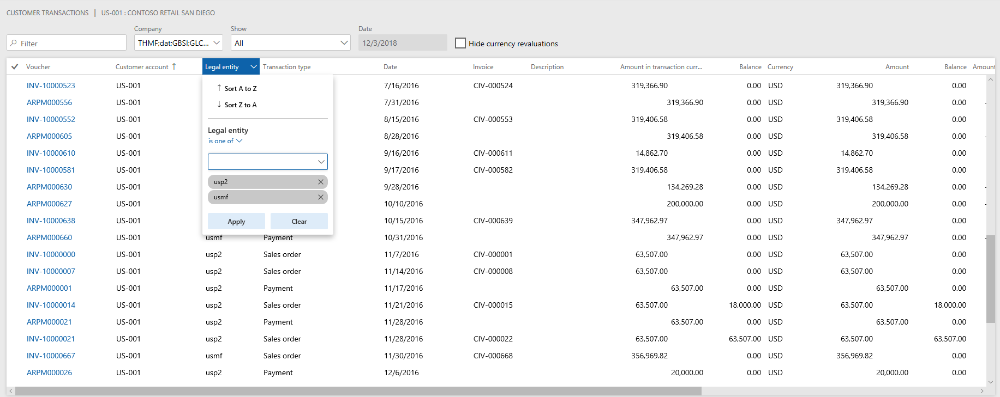

---
# required metadata

title: What's new or changed in Dynamics 365 for Finance and Operations platform update 23 (January 2019)
description: This topic describes features that are either new or changed in Dynamics 365 for Finance and Operation platform update 23 (January 2019). 
author: tonyafehr
ms.date: 11/20/2020
ms.topic: article
ms.prod: 
ms.technology: 

# optional metadata

# ms.search.form: 
# ROBOTS: 
audience: Developer, IT Pro
# ms.devlang: 
ms.reviewer: josaw
# ms.tgt_pltfrm: 
ms.custom: 
ms.assetid:
ms.search.region: Global
# ms.search.industry: 
ms.author: tfehr
ms.search.validFrom: 2018-12-31 
ms.dyn365.ops.version: Platform 23

---
# What's new or changed in Dynamics 365 for Finance and Operations platform update 23 (January 2019)

[!include [banner](../includes/banner.md)]

This topic describes features that are either new or changed in Dynamics 365 for Finance and Operations platform update 23. This version has a build number of 7.0.5126.

### Dynamics 365 October '18 release notes

Wondering about upcoming and recently released capabilities in any of our business apps or platform?

[Check out the October '18 release notes](/dynamics365/release-plans/). We've captured all the details, end to end, top to bottom, in a single document that you can use for planning.

### Platform update 23 bug fixes

For information about the bug fixes included in each of the updates that are part of Platform update 23, sign in to Lifecycle Services (LCS) and view this [KB article](https://go.microsoft.com/fwlink/?linkid=2049368).

## Legal entity filtering using grid column headers

Starting in Platform update 23, for grids with cross-company queries, users are able to filter the *Legal entity* column using the column drop-down menu, similar to other columns in the grid. For example, if users are looking at the global transactions for a specific customer, they might want to find the transactions within a small subset of companies. Prior to this feature, users would have had to filter using the Customer range tab on the Advanced filter or sort dialog box, or utilize page-specific custom filters.



## Export to Excel

In Platform update 22, the Export to Excel feature was improved to allow users to export up to 1 million rows from a grid in Finance and Operations, a substantial increase from the previous 10,000-row limit.

In Platform update 23, we've continued to enhance this feature. After the export completes, users will now receive a notification in the Action center alerting them that the export has finished. The notification includes a link to download the Excel file containing the exported data. The link and notification are accessible for approximately three days after the export completes.

## Manage access to network printers across legal entities

Platform update 23 includes the **System network printers management** form that System Administrators can use, along with the Document Routing Agent (DRA) to register network printers with Dynamics 365 for Finance and Operations.

After you have enabled this feature, a **Preview** link will appear on the **System network printers** form (**Organization administration** \> **Setup** \> **Network printers** and click **System network printers**).

After you register the network printers with the service using the DRA, you will see the configuration information for each legal entity in the organization.

## Enabling index hints in X++ again

Microsoft Dynamics AX 2009 and earlier versions supported INDEX HINTS from X++. However, this was deprecated when Dynamics AX 2012 was released. For more information, see [Deprecated: X++ index hint clause](/dynamicsax-2012/appuser-itpro/deprecated-x-index-hint-clause).

One of the main reasons this was deprecated was because a misguided index hit could damage the queries and little could be done until the query is fixed. Now, after seeing thousands of queries in hundreds of tenants and seeing SQL come up with less optimal plans for some simple queries, Finance and Operations has brought back X++ hints. However, X++ hints should only be used with extreme caution.

We have added a new API on common **allowIndexHint** with a default behavior of **False**. This allows developers to opt-in and explicitly enable index hint. The old syntax on the select statement for specifying index hint is reused.

If there is an existing X++ code that specifies index hint, there is no change to the current behavior until the new API is invoked. See the following example for details.

```xpp
public void testIndexHintRegularTable()
{
    SysDataAccessDBLogTestTable tbl1;
    tbl1.allowIndexHint(true);
    select generateonly tbl1 index hint PrimaryKeyIdx where tbl1.description == ''; // Send index hint to SQL server
    ...
}
```

> [!NOTE]
> Index hints should be used sparingly, and only when you can ensure that it causes more benefit than harm. With the new API, knowledgeable power developers are empowered to pass the right hints when needed. Power developers should use this new feature with caution. When in doubt, avoid using index hints.

## Automated refresh of Entity store (opt-in)
You can let the system manage Entity store refresh instead of scheduling the refresh yourself. When enabled, you can choose a refresh pattern (hourly, twice a day, daily, or weekly). When specified, the system keeps the entity store updated for the selected pattern. The system will also switch to the new update form, where you will be notified with a status and possible refresh issues. For more information, see [Automated Entity store refresh](../../dev-itpro/analytics/automated-entity-store-refresh.md).

## Entity store as a Data Lake (private preview)
In Platform update 23, you can select to use Entity store as a Data Lake. When this feature is turned on, Entity store data isn't populated in the relational Entity store database in the Microsoft subscription. Instead, it's populated in an Azure Data Lake Storage Gen2 account in your own subscription. You can use the full capabilities of PowerBI.com and other Azure tools to work with Entity store. To preview and use this functionality, join the [Insider program](https://experience.dynamics.com/insider).

## Extensibility enhancements
The [fourth wave of platform extensibility enhancements](/business-applications-release-notes/October18/dynamics365-finance-operations/platform-extensibility4), included in Platform update 23, are documented in the October 2018 Release notes. There are six enhancements detailed, with one of the highlights being that we now allow adding new relations to query datasources.


[!INCLUDE[footer-include](../../../includes/footer-banner.md)]