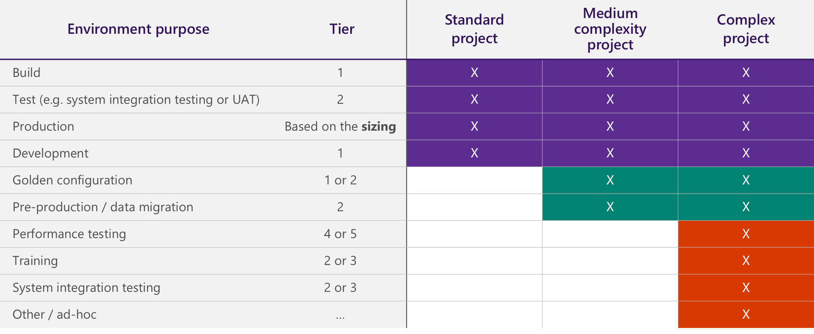
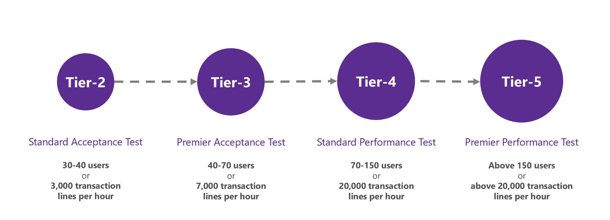

---
# required metadata

title: Environment planning
description: This article provides an overview of various aspects that you must consider while you plan for your project's environment.
author: skaue-ms
ms.date: 11/04/2022
ms.topic: article
ms.prod: 
ms.technology: 

# optional metadata

# ms.search.form:  
# ROBOTS:
audience: IT Pro
# ms.devlang: 
ms.reviewer: sericks
# ms.tgt_pltfrm: 
ms.custom: 
ms.assetid: 
ms.search.region: Global
# ms.search.industry: 
ms.author: toskaue
ms.search.validFrom: 2018-08-01
ms.dyn365.ops.version: Finance and operations

---

# Environment planning

[!include[banner](../includes/banner.md)]

This article provides an overview of various aspects that you must consider while you plan for your project's environment. To help guarantee a successful cloud implementation, it's important that you discuss and plan your environment early in the project.

## Environment planning overview

To begin, here are a few important concepts:

- **Environment purpose** – The reasons why the environment exists. Examples include development, system testing, user acceptance testing (UAT), and operations.
- **Environment topology** – The composition of the environment and the purpose. Examples include **Develop** and **Build and Test** for Tier-1 environments.
- **Environment tier** – The type or category of the environment. Examples include Tier-1 environments and Tier-2 environments.

For more information, about the various environments and tiers, see [Cloud deployment overview](../../dev-itpro/deployment/cloud-deployment-overview.md) and download the latest *Microsoft Dynamics 365 Licensing Guide* from [Dynamics 365 pricing](https://dynamics.microsoft.com/pricing/).

### Environment types

You can use the following environment types for your project:

- **Standard** – This environment is included in the standard offer and is managed by Microsoft in a Microsoft subscription. Standard environments include the production environment and a Tier-2 Standard Acceptance Test environment.
- **Add-on** – The add-on environments are in a Microsoft-managed subscription that the customer has purchased in addition to the standard offer. For example, an add-on environment might be an additional Tier-4 environment for performance testing.
- **Cloud-hosted** – Cloud-hosted environments are additional environments that are managed by the customer or partner in a customer or partner Microsoft Azure subscription. A cloud-hosted environment can include a Tier-1 demo environment, or it can be used for Development and Build. See [Deploy and use a continuous build and test automation environment](../../dev-itpro/perf-test/continuous-build-test-automation.md).
- **Environment image (VHD)** – These additional Tier-1 environments are hosted on-premises by using a virtual hard disk (VHD) that can be downloaded from [Microsoft Dynamics Lifecycle Services (LCS)](https://lcs.dynamics.com/v2).

> [!IMPORTANT]
> In a *customer or partner Azure subscription*, the customer or partner brings its own Azure subscription, and deploys environments to that subscription for evaluation and development purposes only. The customer or partner pays for the resources that are deployed to its Azure subscription. The amount that the customer or partner pays is based on the Azure price list. By contrast, in a *Microsoft subscription*, the customer purchases licenses that allow the customer to deploy environments to an Azure subscription that is managed by Microsoft. Therefore, the customer has no separate Azure billing.

### Tier-1 vs. Tier-2 and higher

| Tier-1 | Tier-2 and higher |
|--------|-------------------|
| Single-box environment | Multi-box environment |
| All components are installed on the same server. These components include Application Object Server (AOS), the database, Dynamics 365 Commerce, and Management Reporter. | Components are installed on multiple servers. |
| Microsoft SQL Server is used. | [Azure SQL Database](/azure/sql-database/) is used. |
| The architecture differs from the architecture of the production environment to maximize efficiency and cost of the development team. | The architecture is the same as the architecture of the production environment, even though this type of environment has a different sizing and isn't enabled for disaster recovery. |
| The environment can be cloud-hosted, or it can be deployed as an environment image (VHD). | The environment can be deployed only as a standard environment or an add-on environment. It can't be cloud-hosted. |
| The environment isn't suitable for UAT or performance testing. | The environment is suitable for UAT and performance testing. |

## Standard cloud offer

The standard cloud offer includes two environments:

- **Tier-2 environment: Standard Acceptance Testing** – One Standard Acceptance Testing (UAT) instance is provided for the duration of the subscription. This instance is a non-production multi-box instance that customers can use for UAT, integration testing, and training. Additional sandbox/staging instances can be purchased separately as an optional add-on.
- **Production environment** – One production instance is provided per tenant. The production multi-box instance includes disaster recovery and high availability. It will be provisioned when the implementation approaches the Operate phase, after the required activities in the Microsoft Dynamics Lifecycle Services (LCS) methodology and a successful go-live assessment are completed. Additionally, some file storage and database storage are included in the offer:

    - **File storage:** Every customer receives a certain amount of file/Azure blob cloud storage for files and binary data. Additional file/blob storage can be purchased.
    - **Database storage:** Every subscription includes a certain amount of Azure SQL Database storage per customer at no additional charge. Additional storage capacity is provided at no charge as an organization increases the number of user and device service licenses. For more information about the various environments and the various types of storage, as well as the currently included free file and storage capacity, download the latest *Microsoft Dynamics 365 Licensing Guide* from [Dynamics 365 pricing](https://dynamics.microsoft.com/pricing/).
    
> [!IMPORTANT]
> Microsoft promises service and data high availability as well as minimal servicing downtime guarantees as part of the Dynamics 365 software license agreement (SLA) for production environments. The SLA goals do not apply to non-production environments.

### Provisioning of standard environments

The standard environments are provisioned at different times. The following table shows the suggested timing for the environments in the standard cloud offer.

| Environment                     | When does provisioning occur? | Is it self-service? |
|---------------------------------|-------------------------------|---------------------|
| Tier-2 Standard Acceptance Test | Immediately after project onboarding has been completed in LCS | Yes |
| Production                      | At production system readiness | A Go-live assessment must be completed prior to configuring the production deployment request in LCS.|

> [!IMPORTANT]
> Always deploy environments by using an **unnamed** account. This account must be from the customer domain, such as `dynadmin@customer.com` or `dynadmin@customer.onmicrosoft.com`. We strongly recommend using the same dedicated environment admin account on all environments.  ISV licenses must be issued to the domain of the account used for environment deployment, therefore using both `dynadmin@customer.com` and `dynadmin@customer.onmicrosoft.com` on different environments can lead to problems with ISV licenses. 

### Production system readiness

The production environment can be deployed when the project is ready for the initial go-live. For more information, see [Prepare for go-live](prepare-go-live.md).

Production system readiness includes, but isn't limited to, the following conditions:

- An up-to-date subscription estimate is activated, as described in [Subscription estimator in Lifecycle Services (LCS)](../../dev-itpro/lifecycle-services/subscription-estimator.md).
- Code, configuration, and data are ready for cutover.
- An engineering process is in place to manage critical fixes.
- The customer has signed off on the solution and UAT.
- A cutover plan is in place.

Customers should use the production environment to **operate** the solution, not build it. The production environment is sized to run your business. The sizing is based on the subscription estimate and diagnostic data from performance testing. After deployment, customers can and should do a mock cutover and a final round of validation on the production environment. Before the final cutover, customers can request a Point in time restore to restore the production environment to a clean snapshot (maximum 28 days in the past).

To select the appropriate data center for the production environment, consider the latency from the geographic locations where the business operates. Use tools such as [PsPing](/sysinternals/downloads/psping) and [Azure Speed Test](https://azurespeedtest.azurewebsites.net/) to test latency to Azure data centers.

The following illustrations shows the environment planning process.

## Additional environments

Additional environments can be purchased as add-ons, or they can be deployed as cloud-hosted environments. The following illustration shows a *sample* overview of standard and additional environments, based on the complexity of the implementation.

> [!IMPORTANT]
> Always deploy environments by using an **unnamed** account, such as `dynadmin@customer.com`. Assign the environments an owner who will be responsible for their status and maintenance. We strongly recommend using the same dedicated environment admin account on all environments. After go-live, if you plan to work on new releases, get an additional Tier-2 or higher environment to support production.

### Deployment considerations for development environments

For development environments, there are two deployment options:

- **Cloud-hosted** – The environments are managed by the customer/partner in a customer/partner Azure subscription.
- **Environment image (downloadable VHD)** – The environments are hosted on-premises.

> [!NOTE]
> You must allocate one development environment per developer.

The following table compares the deployment options.

| Capability                            | Cloud-hosted | Environment image |
|---------------------------------------|--------------|-------------------|
| Public URL                            | ✓ | Not supported |
| Integration development               | ✓ | Extra setup is required. (For example, run the admin user provisioning tool.) |
| Azure DevOps                          | ✓ | Extra setup is required. (For example, rename the computer.) |
| Applying deployable packages from LCS | Automated | Command line runbooks (AxUpdateInstaller.exe tool) |
| Deploying data packages from LCS      | ✓ | Not supported |
| Maintenance                           | Managed by the customer/partner | Managed by the customer/partner |
| Cost model                            | Pay as you go (If the environment is on for eight hours, you pay for eight hours.). Cost is based on selected Virtual Machine size, disk size and settings, and premium storage settings | Hardware-related |
| Limitations                           | None. You have full control over VM specs, disk size and storage settings. You have administrator access to the VM. | None |

### Selecting the correct Tier-2 or higher environment

It's important that you select the correct Tier-2 or higher environment, depending on the purpose of the environment. 

> [!IMPORTANT]
> The provided values are for reference only. You must work with your implementation partner to adjust this guidance based on your specific business scenarios and factors such as type of users, complexity, and volumes.

The [LCS Subscription estimator](../../dev-itpro/lifecycle-services/subscription-estimator.md) could be leveraged to get an indication of the transaction lines per hour in LCS for a volume check, as shown in the following illustration.

### Purchasing add-on environments

If you want to purchase add-on environments, we recommend that you work closely with your Cloud Solution Provider or License Service Reseller. Consider the potential lead time that occurs between the time when the order is placed and the time when the environment is deployed.

The following illustration shows the process for purchasing add-on environments.

> [!IMPORTANT]
> If you have a Microsoft Volume Licensing agreement, you can subscribe to add-on environments on a monthly basis through the Microsoft Products and Services Agreement (MPSA) licensing program. Alternatively, you can subscribe to them through the Microsoft Cloud Solution Provider (CSP) program. For more information about the various environments and tiers, download the latest *Microsoft Dynamics 365 Licensing Guide* from [Dynamics 365 pricing](https://dynamics.microsoft.com/pricing/).

## Environments plan

Create the environments plan early in your implementation.

1. Identify the project activities that require an environment. These activities include, but aren't limited to, development of customizations and maintenance of golden configuration data.
2. Determine the *activities lifecycle* to determine the *environments lifecycle*. Here are some examples of the questions that you should ask during this step:

    - When and for how long do you require the environment?
    - Do you require the environment before or after go-live?

3. Determine the type and topology of the required environments.
4. Summarize the list of required environments in a matrix.

After you've identified the environments, the environments plan can be used to structure the Application Lifecycle Management (ALM) flows. For example, after you finalize your environments plan, you can define the flows for building and moving the code and the data across environments.

[!INCLUDE[footer-include](../../../includes/footer-banner.md)]

