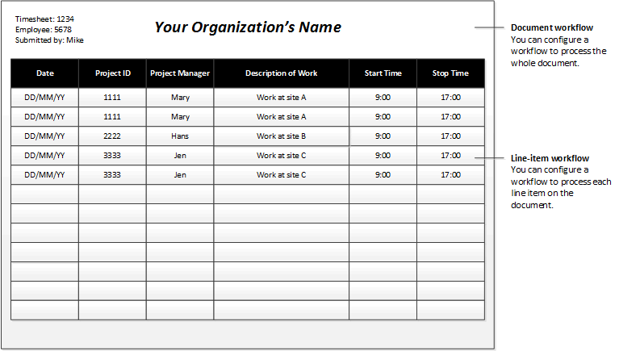

---
# required metadata

title: Workflow elements
description: This article describes the various elements that make up a workflow.
author: ChrisGarty
ms.date: 11/03/2017
ms.topic: article
ms.prod: 
ms.technology: 

# optional metadata

# ms.search.form: 
# ROBOTS: 
audience: Application User, IT Pro
# ms.devlang: 
ms.reviewer: sericks
# ms.tgt_pltfrm: 
ms.assetid: de740262-6ffd-42b9-a325-540eae5cec94
ms.search.region: Global
# ms.search.industry: 
ms.author: cgarty
ms.search.validFrom: 2016-02-28
ms.dyn365.ops.version: AX 7.0.0

---

# Workflow elements

[!include [banner](../includes/banner.md)]

[!INCLUDE [PEAP](../../../includes/peap-1.md)]

This article describes the various elements that make up a workflow.

A workflow consists of elements. The sections that follow describe each type of element.

## Tasks

A *task* is a unit of work that must be performed. Two types of tasks can be added to a workflow: manual tasks and automated tasks.

### Manual task

A *manual task* is a unit of work that must be performed by a user. For example, an expense report workflow can have manual tasks that require the assigned users to complete the following actions:

- Review the receipts that are submitted together with an expense report.
- Call an employee's manager.

### Automated task

An *automated task* is a unit of work that must be performed by the system. No human interaction is required. For example, a sales order workflow can have automated tasks that require the system to complete the following actions:

- Perform a credit check.
- Create a customer record for the customer, if a record doesn't already exist.

## Approval processes

An *approval process* is a process that consists of separate steps. At each approval step, the user can perform the following actions:

- Approve the document.
- Reject the document.
- Request a change to the document.
- Assign the document to another user for approval.

## Line-item workflow elements

A workflow can be created to process either documents or the line items on a document. For example, you've created an approval workflow for timesheets. (We will refer to this workflow as the *document workflow*.) You can add a *line-item workflow* element to that document workflow. When the line-item element is run, each line item on the document is submitted for processing. You might want all the line items to be processed by the same line-item workflow, or you might want each line item to be processed by a different line-item workflow. Imagine that an employee has submitted a timesheet that resembles the following figure.

In this scenario, you might want to create the following line-item workflows:

- **Line-item workflow 1** – This workflow is used to process line items where the project ID is 1111.
- **Line-item workflow 2** – This workflow is used to process line items where the project ID is 2222.
- **Line-item workflow 3** – This workflow is used to process line items where the project ID is 3333.

## Flow-control elements

The following elements let you design workflows that have alternate branches or branches that run at the same time.

### Manual decision

A *manual decision* is a point where a workflow divides into two branches. A user must make a decision, and this decision determines which branch is used to process the document that was submitted.

### Conditional decision

A *conditional decision* is also a point where a workflow divides into two branches. However, the system decides which branch is used to process the document that was submitted. To make this decision, the system evaluates the document to determine whether it meets specified conditions.

### Parallel activity

A *parallel activity* is a workflow element that includes two or more workflow branches that run at the same time.

### Subworkflow

A *subworkflow* is a workflow that runs in the context of another workflow.

[!INCLUDE[footer-include](../../../includes/footer-banner.md)]