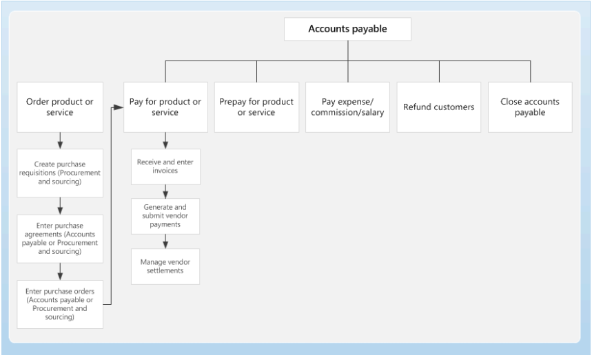

---
# required metadata

title: Accounts payable home page
description: This article provides an overview of Accounts payable.
author: sunfzam
ms.date: 02/15/2019
ms.topic: index-page
ms.prod: 
ms.technology: 

# optional metadata

ms.search.form: VendInvoiceWorkspace 
# ROBOTS: 
audience: Application User
# ms.devlang: 
ms.reviewer: twheeloc
# ms.tgt_pltfrm: 
ms.collection: get-started
ms.assetid: 1e4c2ac4-077b-4678-8733-5cec8f6ff659
ms.search.region: Global
# ms.search.industry: 
ms.author: twheeloc
ms.search.validFrom: 2016-05-31
ms.dyn365.ops.version: AX 7.0.1

---

# Accounts payable home page

[!include [banner](../includes/banner.md)]

This article provides an overview of Accounts payable. 

You can enter vendor invoices manually or receive them electronically through a data entity. After the invoices are entered or received, you can review and approve the invoices by using an invoice approval journal or the **Vendor invoice** page. You can use invoice matching, vendor invoice policies, and workflow to automate the review process so that invoices that meet certain criteria are automatically approved, and the remaining invoices are flagged for review by an authorized user.

**Business processes**

## Set up Accounts payable

Set up vendor groups, vendors, posting profiles, various payment options, and parameters regarding vendors, charges, 
deliveries and destinations, promissory notes, and other types of Accounts payable information. 

[Configure Accounts payable overview](accounts-payable-overview.md)

[Accounting distributions and subledger journal entries for vendor invoices](accounting-distributions-subledger-journal-entries-vendor-invoices.md) 

[Foreign currency revaluation for Accounts payable and Accounts receivable](../cash-bank-management/foreign-currency-revaluation-accounts-payable-accounts-receivable.md)

## Configure vendor invoices

Use Accounts payable to track invoices and outgoing expenditures to vendors.

[Accounts payable invoice matching overview](accounts-payable-invoice-matching.md)

[Vendor posting profiles](vendor-posting-profiles.md)

[Set up Accounts payable invoice matching validation](tasks/set-up-accounts-payable-invoice-matching-validation.md)

[Three-way matching policies](three-way-matching-policies.md)

[Invoice matching and intercompany purchase orders](invoice-matching-intercompany-purchase-orders.md)

[Resolve discrepancies during invoice totals matching overview](resolve-invoice-totals-invoice-matching-discrepancies.md)

[Default offset accounts for vendor invoice journals and invoice approval journals](default-offset-accounts-vendor-invoice-journals.md)

[Mobile invoice approvals](mobile-invoice-approvals.md)

[Vendor collaboration invoicing workspace](vendor-portal-invoicing-workspace.md)

[Vendor invoice automation](vendor-invoice-automation.md)

## Configure vendor payments 

Assign a system-defined payment type, such as check, electronic payment, or promissory note, to any user-defined method of payment. 
Payment types are optional, but they are useful when you validate electronic payments and want to be able to quickly determine which payment type a payment uses. 

[Vendor payments workspace](vendor-payments-workspace.md)

[Define vendor payment fees](tasks/define-vendor-payment-fees.md)

[Define vendor payment terms](tasks/define-vendor-payment-terms.md)

[Positive pay overview](positive-pay-overview.md)

[Set up and generate positive pay files](set-up-generate-positive-pay-files.md)

[Create vendor payments by using a payment proposal](create-vendor-payments-payment-proposal.md)

[Vendor payments for a partial amount](vendor-payments-partial-amount.md)

[Take a discount that is more than the calculated discount for a vendor payment](take-discount-more-calculated-discount-vendor-payment.md)

[Take a cash discount outside the cash discount period](take-cash-discount-outside-cash-discount-timeframe.md)

[Electronic reporting sample vendor checks](electronic-reporting-sample-vendor-checks.md)

[Reverse a vendor payment](reverse-vendor-payment.md)

[Prepayment invoices vs. prepayments](prepayments-invoices-vs-prepayments.md)

[Centralized payments for Accounts payable](centralized-payments-accounts-payable.md)

## Settlements

The following topics provide information about settlements. Settlement is the process of settling payments with invoices. 

[Configure settlement](../cash-bank-management/configure-settlement.md)

[Settle a partial vendor payment before the discount date with a final payment after the discount date](settle-partial-vendor-payment-before-discount-or-final-payment-after.md)

[Settle a partial vendor payment that has discounts on vendor credit notes](settle-partial-vendor-payment-discounts-vendor-credit-notes.md)

[Settle a partial vendor payment that has multiple discount periods](settle-partial-vendor-payment-multiple-discount-periods.md)

[Settle a partial vendor payment and the final payment in full before the discount date](settle-partial-vendor-payment-or-final-payment-before-discount.md)

[Single voucher with multiple customer or vendor records](single-voucher-multiple-customer-vendor-records.md)

### Additional resources

#### What's new and in development

Go to the [Microsoft Dynamics 365 release plans](/dynamics365/release-plans/) to see what new features are planned. 

#### Blogs

You can find opinions, news, and other information about Accounts payable and other solutions on the [Microsoft Dynamics 365 blog](https://community.dynamics.com/b/msftdynamicsblog?c=Enterprise)and the [Microsoft Dynamics 365 Finance - Financials blog](https://community.dynamics.com/365/financeandoperations/b/financials).

The [Microsoft Dynamics Operations Partner Community Blog](https://community.dynamics.com/partner/b/operationspartnercommunityblog) gives Microsoft Dynamics Partners a single resource where they can learn what is new and trending in Dynamics 365.

#### Community blogs

[How to manage payables in Dynamics 365 Finance](https://financefunction.tech/2019/02/15/how-to-manage-payables-in-dynamics-365-for-finance-and-operations)

#### Task guides
Additional help is available as task guides inside the application. To access task guides, click the Help button on any page.

#### Videos

Check out the how-to videos that are now available on the [Microsoft Dynamics 365 YouTube Channel](https://www.youtube.com/channel/UCJGCg4rB3QSs8y_1FquelBQ).

[!INCLUDE[footer-include](../../includes/footer-banner.md)]
