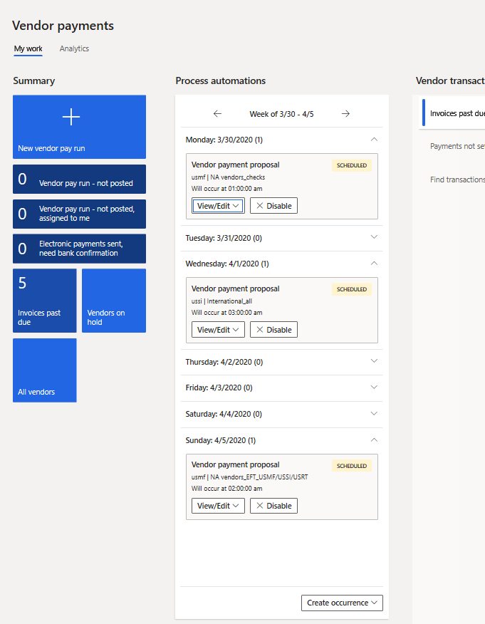
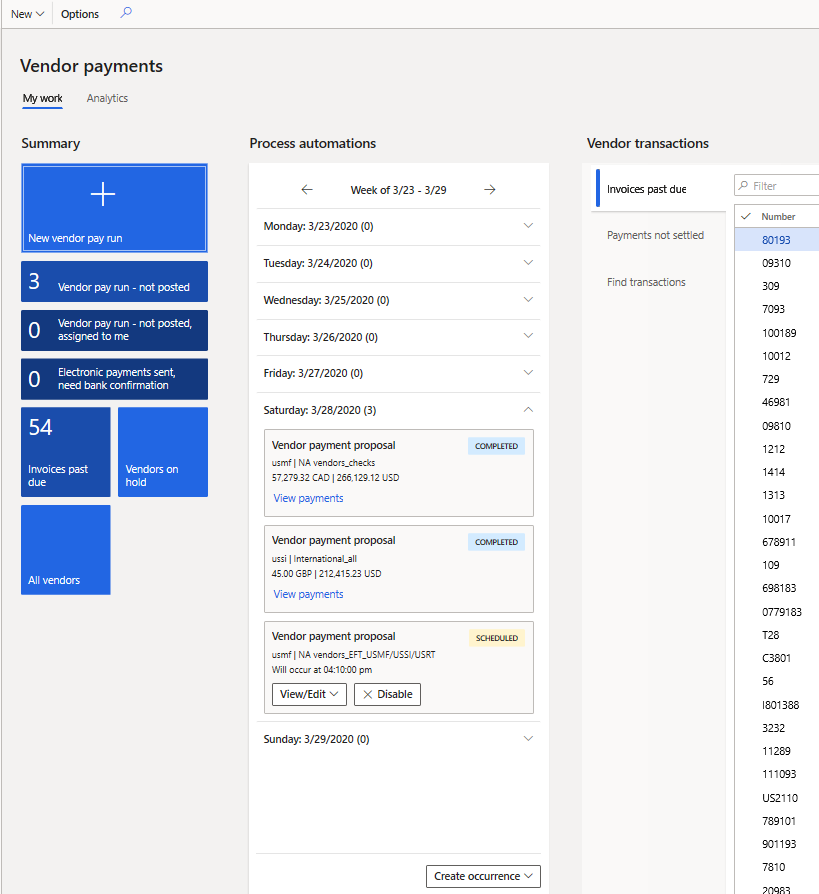

---
# required metadata

title: Automate vendor payment proposals
description: This article explains how organizations that pay vendors on a recurring schedule can automate the process of generating vendor payment proposals.
author: kweekley
ms.date: 06/08/2023
ms.topic: article
ms.prod: 
ms.technology: 

# optional metadata

# ms.search.form: 
# ROBOTS: 
audience: Application User
# ms.devlang: 
ms.reviewer: twheeloc
# ms.tgt_pltfrm: 
ms.custom: 262034
ms.assetid: 9db38b3f-26b3-436e-8449-7ff243568a18
ms.search.region: Global
# ms.search.industry: 
ms.author: kweekley
ms.search.validFrom: 2020-04-08
ms.dyn365.ops.version: 10.0.11

---

# Automate vendor payment proposals

[!include [banner](../includes/banner.md)]

Organizations that pay vendors on a recurring schedule can now automate the process of generating vendor payment proposals. Vendor payment proposal automations define the following details:

- When payment proposals are run
- What criteria are used to select the invoices that should be paid
- What vendor payment journal the resulting payments are saved in

Payment proposal automations don't automatically post the payments. Therefore, you can continue to use any validation and workflow processes that you currently use to approve the payments that are created.

> [!NOTE]
> The **Vendor payment proposal automation** feature must be enabled in **Feature management** to utilize this functionality. 

## Define the occurrence of vendor payment proposals

Vendor payment proposal automations use the Process automation framework. Different business processes use this framework to define the recurrence of a selected process. For vendor payment proposals, the automation can be accessed at **Accounts payable \> Payment setup \> Process automation**.

First, use the **Create new process** automation option, and select **Vendor payment proposal**. A wizard then guides you through the process of setting up the vendor payment proposal.

## General page

On the **General** page of the wizard, enter the name of the vendor payment proposal that you're creating. For example, if you pay all domestic vendors by check on Monday, enter a descriptive name such as **Domestic\_Check**. The name that you enter is shown in the process automation weekly view in the **Vendor payments** workspace.

Next, define the owner of the payment journal that is created. The owner is usually the Accounts payable payment clerk, who is responsible for the payment journal after it's created.

The remaining settings on the page are generic and are used to define the occurrence pattern for this version of the vendor payment proposal. For example, if an occurrence is for check payments on Monday, you can define it so that it runs weekly, and you can select Monday as the day of the week when it runs. You can also enter an early schedule time, such as 2:00 AM, so that the process automation will be completed before the start of the next business day.

It's important that you understand that you're using the wizard to define when the vendor payment proposal is processed. You aren't defining when the vendor payments are generated, printed, and posted. In the weekly view, the process automation for vendor payment proposals will appear on the days that are selected in the occurrence pattern.

For more information about the other fields on the **General** page, see the process automation documentation.

## Vendor payment proposal page

The next page in the wizard is the **Vendor payment proposal** page. It's used to define the criteria for selecting the vendor invoices that should be paid. In general, the same options are found in the payment proposal in the vendor payment journal. However, there are a few exceptions. For example, all dates on this page must be defined as relative dates, because the payment proposal date changes every time that the proposal is run.

### Journal name

The **Journal name** field defines the journal name that the vendor payments are created in. The results of the vendor payment proposal automation will create payments in the defined journal, but the journal isn't posted.

### From date and to date

Instead of defining a "from" date and a "to" date to select invoices based on the due date or cash discount date, you must use the **Define to date criteria** option and the **Number of days adjustment for To date** field to define the "to" date. There is no concept of a "from" date in payment proposal automations.

By default, the **Define to date criteria** option is set to **No**. If you use this default value, the process will select all invoices for payment when the process is run, because no "to" date has been defined.

If you set the **Define to date criteria** option to **Yes**, use the **Number of days adjustment for To date** field to define the date when invoices are selected as the specified number of days before or after the date when the process runs. The number can be positive, negative, or 0 (zero). The invoices will be paid when the due dates, or cash discount dates, are the specified number of days before or after the date when the process runs. For example, for all invoices that are due on or before Friday, the payment series creates payments to all vendors by check on Wednesday. In this case, set the **Number of days adjustment for To date** field to **2**. When the occurrence of the payment proposal is run on Wednesday, March 25, all invoices that have a due date or cash discount date on or before March 27 will be selected for payment.

### Minimum payment date

The minimum payment date defines the earliest date that is used when payments are created. You must first set the **Define minimum payment date criteria** option to **Yes**. This setting lets you use the minimum payment date functionality. If this option is set to **Yes**, use the **Number of days adjustment for minimum payment date** field to define the minimum payment date as the specified number of days before or after the date when the process runs. The number can be positive, negative, or 0 (zero). For example, the payment series generates payments on Wednesday to include all payments that have a minimum payment date of the preceding Monday. In this case, set the **Number of days adjustment for minimum payment date** field to **-2**.

Below is an example that shows how the fields for the "to" date and the minimum payment date work together. The payment proposal automation is set up to run on Wednesday. The **Number of days adjustment for To date** field is set to **1** to define the "to" date based on the due date. The **Number of days adjustment for minimum payment date** field is set to **-2**. If the payment process automation starts on Wednesday, March 25, all invoices that are due on or before March 26 will be included in the payment proposal. Payment proposals will be generated in the following way:

- All invoices that are due on or before March 23 will have a payment date of March 23.
- Invoices that are due on March 24 will have a payment date of March 24.
- Invoices that are due on March 25 will have a payment date of March 25.
- Invoices that are due on March 26 will have a payment date of March 26.

### Summarized payment date

The summarized payment date is used only when the **Period** field is set to **Total** for the method of payment of the invoices. If the **Period** field is set to **Total** for your methods of payment, you must set the **Define summarized payment date criteria** option to **Yes**. If this option is set to **Yes**, use the **Number of days adjustment for summarized payment date** field to define the summarized payment date as the specified number of days before or after the date when the process runs. The number can be positive, negative or 0 (zero). For example, the series generates payments on Wednesday, and the company wants to create a summarized payment on Wednesday. In this case, set the **Number of days adjustment for summarized payment date** field to **0**.

### Records to include

The filter options can still be defined for the payment proposal. If a filter is defined, the filter criteria aren't shown on the wizard page. However, they can be viewed by reopening the filter.

The remaining fields for the proposal work just as they work for the payment proposal in the vendor payment journal. For information about the other fields, see [Create vendor payments by using payment proposal](create-vendor-payments-payment-proposal.md).

> [!NOTE]
> Some country/region-specific fields, and some Public sector fields, aren't yet available in vendor payment proposal automations.

We recommend that you evaluate whether the automation will be beneficial to your organization, based on your requirements.

## View the results of a vendor payment proposal automation

After the vendor payment proposal automation series is created, the occurrences for each payment are shown in the process automation weekly view. For vendor payments, the process automation weekly view has been added to both the **Vendor payments** workspace and the **Process automation** page.

The process automation weekly view in the **Vendor payments** workspace shows only vendor payment proposal automations. It shows all occurrences of payments for the current week, for all legal entities that the signed-in user has security permissions to. For example, if the AP payment clerk is responsible for payments in the USMF and USSI companies, they will see the occurrences of the vendor payment proposal automation for those two companies but not for other companies.

Each occurrence shows the company that the payment journal was or will be created in. If payments are created by using centralized payments, the company that is shown is the company that payments will be created in. The occurrence doesn't necessarily show which companies' invoices will be paid.

The name of each occurrence is also shown to help identify the payment proposal.

Additionally, the status of each occurrence is shown. The following statuses are used:

- **Scheduled** – The payment proposal is scheduled, but it hasn't yet run.
- **Error** – The payment proposal has run, but an error occurred. You can view the errors by selecting the **View results** button.
- **Completed** – The payment proposal has successfully run. You can view the payments by selecting the **View payments** link. This link opens the payment journal that was created by the occurrence.

After the payments are created, you can view the payment amounts in the journal. The amounts are shown in the transaction currencies. For example, if the payment journal contains payments in both US dollars and Canadian dollars, the total payments for each currency are shown. 

The payment journal can be deleted after it's created through the process automation. If a payment is completely deleted, the following events occur:

- The status of the process automation for the week remains **Completed**.
- The process removes the payment totals, and the **View payments** link is replaced with a **View results** button.
- When you view the results, you receive a message that states that the original journal was deleted.

After a payment is deleted, the invoices will be open again for payment. A new occurrence can then be created to pay the invoices again.

## Edit a vendor payment proposal automation

The Process automation framework lets you edit the payment, the series, and the occurrences that are created for the payment proposal. The series can be edited from either the **Process automation** page or the process automation weekly view. For example, if the AP manager decides to generate all checks for domestic vendors on Wednesday instead of Monday, they can find an occurrence in the weekly view and select **View/Edit – Series**. If you edit a series, the system prompts you to specify whether the change should be made to all existing occurrences or only to new occurrences. Historical occurrences that already have a status of **Completed**, or that ended in an **Error** status won't be changed.

You can also add a new occurrence or change an existing occurrence. For example, the next payment proposal occurrence is scheduled to run Wednesday, January 1, but this date is a holiday. You can change the occurrence from either the process automation weekly view or the **Process automation** page. A page is opened that shows the schedule details and payment proposal criteria. Here, you can edit the scheduled time and date. You can also edit the payment proposal criteria, if changes are required. For example, if you change the scheduled date of the payment occurrence from January 1 to January 2, you might also want to change the relative dates for the "to" date.

You can also disable an occurrence or a series. To disable an occurrence and suspend processing for it, select it in the process automation weekly view, and then select **Disable**. You can disable a series on the **Process automation** page.

## Security for payment proposal automations

The following duties and privileges have been added for vendor payment proposal automations. These duties and privileges are the default security settings, but they can be changed based on your organization's requirements. For example, if not only the AP manager but also the AP payment clerk can edit and create schedule recurrence, assign the **Maintain schedule occurrences** duty to the person in the AP payment clerk role.

| Duty                              | Role                                                                       | Privileges |
|-----------------------------------|----------------------------------------------------------------------------|------------|
| Maintain schedule series          | Accounts payable manager                                    | This duty grants the rights to create and maintain the payment proposal automation series and occurrences through the following privileges:<ul><li>Maintain schedule occurrences</li><li>Maintain schedule series</li><li>ProcessScheduleOccurrenceListMaintain</li><li>View the occurrences weekly view</li></ul> |
| Inquiry into schedule occurrences | Accounts payable payment clerk, Accounts payable Centralized payment clerk | This duty grants the rights to view the payment proposal automation occurrences through the following privileges:<ul><li>View schedule occurrences</li><li>View the occurrence weekly view</li></ul> |
| Inquire into schedule series      | None                                                                       | This duty grants the rights to view the settings of the series and occurrences through the following privileges:<ul><li>View schedule occurrences</li><li>View the occurrences list page</li><li>View the occurrence weekly view</li></ul>|
| Maintain schedule occurrences     | None                                                                       | This duty grants the rights to create and maintain an occurrence through the following privileges:<ul><li>Maintain schedule occurrences</li><li>View the occurrence weekly view</li></ul> |

[!INCLUDE[footer-include](../../includes/footer-banner.md)]
