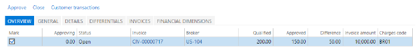

---
# required metadata

title: Broker contract management
description: This article describes broker contract management by automating administrative tasks that comprise it.
author: t-benebo
ms.date: 06/13/2023
ms.topic: article
ms.prod: 
ms.technology: 

# optional metadata

ms.search.form: MCRBrokerContractManagement, MCRCustCategory, MCRCustCategoryHierarchy, PdsRebateAgreementLineInfoPart, MCRRoyaltyTable
audience: Application User
# ms.devlang: 
ms.reviewer: twheeloc
# ms.tgt_pltfrm: 
# ms.custom: 
ms.search.region: Global
# ms.search.industry: 
ms.author: benebotg
ms.search.validFrom: 2018-01-31
ms.dyn365.ops.version: July 2017 update
---

# Broker contract management

[!include [banner](../includes/banner.md)]

Broker contract management helps companies better manage their brokerage agreements by automating tasks that are involved in administering, tracking, and paying the fees that are due to brokers.

This article provides an overview of the typical process for handling broker fees:

- Registering details of the negotiated broker contract
- Running the negotiated contracts through ongoing sales and generating broker claims
- Approving the generated claims, so that they can be passed to Accounts payable for payment
- Handling situations for partial claim approval and differential accounting

## Audience and purpose

The information in this article is intended for business decision makers in enterprise companies, in capacities such as sales manager, accounting manager, and Accounts payable manager, who have the following responsibilities:

- Negotiating contracts with brokers
- Managing staff that processes broker claims and makes fee payments

People in these roles are looking for ways to achieve these goals:

- Flexibly accommodate various definitions of broker contracts and their conditions.
- Reduce the administrative burden and errors that are associated with tracking and processing broker claims.
- Improve cash flow forecasts by accruing for future payables.

## Broker contract

A broker contract is a record of an agreement with a broker. It specifies the negotiated terms and conditions under which the brokerage company qualifies for a monetary reward in return for achieving preset sales targets.

Broker contracts are registered on the **Broker contracts** page. 

The contract includes a negotiated condition about who will incur in the broker fee (the customer that buys the product or the selling company). This condition is set up on the associated **Charges codes** page.

The **Contract details** section shows the conditions and the item that qualifies for brokerage. The monetary reward that the broker will receive for achieving the sales objective is shown under **Break**.

The setup of the **Broker Fees** charge indicates that the customer won't incur the fee for the broker services. Instead, the selling company will incur the broker fee as a sales expense.

> [!NOTE]
> If a contract stipulates that the customer will incur the fee for the broker services, the associated charge must be set up so that the **Type** field in the **Debit** section is set to **Customer/Vendor**. In this case, the company first receives the fee payment from the customer and then pays its liability to the broker. If it is the selling company that will incur the broker fee as a sales expense, then the associated charge must be set up so that the **Type** field both in the **Debit** and **Credit** sections is set to **Ledger account**. 

The debit account receives the intermediary expenses on the income statement, and the credit account is an interim liability account that hosts the charge (fee) amount from the time when the charge is posted to the time when the broker claim is approved and moved to the real payable as a result of invoice posting.

The **Contract details** section of the broker contract shows the conditions and the item that qualifies for brokerage. The monetary reward that the broker will receive for achieving the sales objective is shown under **Break**.

The contract **Status** has to be **Approved** to be applied to sales orders that meet its conditions.

## Sell products that qualify for a broker commission and generate a claim

When you create a sales order that has lines that fulfill the requirements of the broker contract, you can view the related information on the **Sales order** page. 

Because broker fee accruals are handled as a charge, you can also access the broker commission by opening the standard charges page from the sales order. Select the order line, and then select **Sales order line** \> **Financials** \> **Manage charges**.

When you post the invoice for the sales order, in addition to the regular sales invoice transactions, the following postings occur:

- The broker claim is generated for the invoice line.
- The accrued charge that represents the broker fee is posted to the interim liability and expense accounts, as appropriate.

The accrued broker fee posting can be viewed on the voucher transactions associated with the sales invoice journal.

## Review and process claims

After claims are either fully or partially approved, the vendor invoice is created and posted, if posting is supported by the Accounts payable policy. In this way, the vendor credit is passed to the regular payable processing.

You can view all the claims on the **Broker claims** page. For each fee, the **Qualified** field specifies the amount of the fee that, after it's approved, will be paid to vendor of brokerage services.

>[!Note] 
>The fields in the lower section of the page specify details about the originating sales invoice, such as the invoice number, invoice line net amount, and associated customer transactions.

To approve a claim, in the **Mark** column, select the checkbox for the line. On the Action Pane, select **Approve**.

As a result of the approval, the following events will occur:

- An Expense journal posting has reversed the previous interim amount on both the accrual liability account and the accrual expense account.
- A broker claim (vendor) invoice for the approved broker fee amount has been created.

    > [!NOTE]
    > A broker claim invoice can be posted either automatically as part of the claim approval process or manually. The **Manual posting** field on the **Broker and royalty** tab of the **Accounts payable parameters** page specifies the policy that controls the posting behavior.

- As a result of posting the broker claim invoice, the expense account has been debited, and the vendor payable account has been credited.

    > [!NOTE]
    > The expense account number is specified for the procurement category when purchase expenditure for expense posting is set up for purchase orders. The procurement category itself is defined on the **Broker and royalty** tab of the **Accounts payable parameters** page.
    
On the **Broker claims** page, you can review the postings and documents associated with the claim, a vendor invoice number that was created for the broker. If the vendor invoice was posted (automatically or manually), on the **Invoices** tab, the **Date** and **Amount in transaction currency** fields contain the appropiate values. If the invoice is still pending, those fields are blank.    

If the **Approved** field for the claim line contains the same amount as the **Qualified** field, the **Difference** field contains 0, it means that the claim has no unsettled issues and can be closed.

## Partially process claims

If a customer returns some units of a sales order, the broker might no longer qualify for the fee that is related to the returned quantity. In this case, the second claim for the partial amount must be approved. Select **Accounts payable** \> **Broker and royalties** \> **Broker claims**, and select the claim. In the **Approving** field, enter the total quantity minus the returned units. Then, on the Action Pane, select **Approve**.

If there is a difference between the value in the **Approved** field and the value in the **Qualified** field, it is recorded in the **Difference** field. These values indicate that the claim is still outstanding, and that the difference must be handled before the claim can be considered closed.

The difference must be handled selecting the unsettled claim line, and then, on the Action Pane, clicking **Close**.

The system identifies that the claim still has an outstanding number of units and prompts the user to enter the reason code that explains the difference.

After closing the claim, the following events occur:

- An expense journal posting has reversed the previous interim amount on the accrual expense account
- The same posting reversed the previous interim amount on the accrual liability account

The line under the **Differentials** tab specifies the broker fee amount that was disapproved for payout.

In the scenario where your company, not the customer, pays the broker fee, profit or loss that is associated with the overpayment or underpayment of a fee doesn't have to be accounted for the income statement. In this case, no differential journal will be associated with the differential line. 

If you were handling differences in a fee scenario where the customer pays the broker fee, you would notice that the system posts a differential journal at claim closing. This journal debits/credits the broker fee write-off account and credits/debits the interim liability account. 

> [!NOTE]
> The write-off expense account number is specified in the **Main account** field for a specific reason code on the **Differential reasons** page.

[!INCLUDE[footer-include](../../includes/footer-banner.md)]
