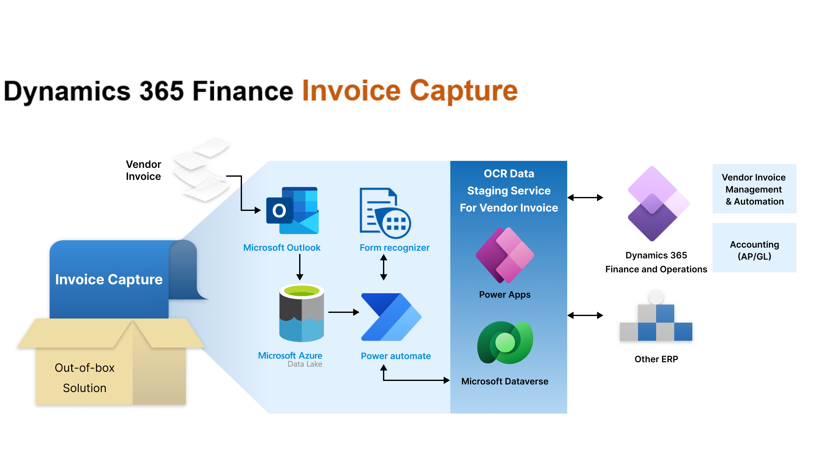

---
# required metadata

title: Invoice capture solution overview
description: This article provides information about the Invoice capture solution.
author: sunfzam
ms.date: 04/03/2023
ms.topic: overview
ms.prod: 
ms.technology: 

# optional metadata

ms.search.form: VendorInvoiceWorkspace, VendInvoiceInfoListPage
# ROBOTS: 
audience: Application User
# ms.devlang: 
ms.reviewer: twheeloc
# ms.tgt_pltfrm: 
ms.custom: ["13971", "intro-internal"]
ms.assetid: 0ec4dbc0-2eeb-423b-8592-4b5d37e559d3
ms.search.region: Global
# ms.search.industry: 
ms.author: zezhangzhao
ms.search.validFrom: 2022-09-28
ms.dyn365.ops.version: 

---

# Invoice capture solution

[!include [banner](../includes/banner.md)]
[!include [preview banner](../includes/preview-banner.md)]

This article provides information about the Invoice capture solution that automatically creates vendor invoices from digital invoice images.

The Accounts payable (AP) department manages and processes invoices for goods and services that are received. The AP accountant verifies data on vendor invoices for the following reasons:

- To avoid extra effort if adjustments or corrections are required during period close
- To pay vendor invoices in a timely manner and prevent financial loss because of error or fraud

Optical character recognition (OCR) has become widely used by different industries in past years. It's now common for printed texts to be digitized, so that they can be electronically edited, searched, stored more compactly, and displayed online. The digital text can be used in machine processes such as cognitive computing, machine translation, text-to-speech, key data, and text mining.

The evolution of artificial intelligence (AI) technology has enabled modern OCR solutions to read different invoice formats from different vendors without requiring much human intervention. More companies are recognizing that they can save effort and improve accuracy by processing invoices via automation instead of doing manual processing.

## System landscape

The following illustration shows the major components and steps in the Invoice capture solution.

## Required roles

The following table shows the roles that are required to set up and use the Invoice capture solution.

| Role          | Actions | Systems | Role names |
|---------------|---------|---------|-----------|
| Administrator | <ul><li>Set up environments in Microsoft Power Platform.</li><li>Deploy solutions in Microsoft Power Platform.</li><li>Set up connections between Dynamics 365 and AI Builder.</li><li>Set up Azure Data Lake Storage locations.</li></ul> | <ul><li>Dynamics 365</li><li>Microsoft Power Platform</li><li>Azure Data Lake Storage</li></ul> | <ul><li>Dynamics 365 administrator</li><li>Power Platform administrator</li><li>Storage Blob data owner</li></ul> |
| AI maker      | <ul><li>Maintain flows.</li><li>Create custom AI models.</li></ul> | <ul><li>Microsoft Power Platform</li></ul> | <ul><li>Citizen makers</li></ul> |
| AP clerk      | <ul><li>Review and take actions in the vendor invoice staging area.</li><ul> | <ul><li>Microsoft Power Platform</li></ul> | <ul><li>New AP clerk role in Power Platform</li></ul> |
| AP clerk      | <ul><li>Perform daily operations as an AP clerk.</li><li>Navigate to the vendor invoice staging area.</li></ul> | <ul><li>Dynamics 365</li></ul> | <ul><li>Accounts payable clerk</li></ul> |
  
For more information about installing Invoice capture, see [Install Invoice capture](../accounts-payable/install-invoice-capture.md).  
