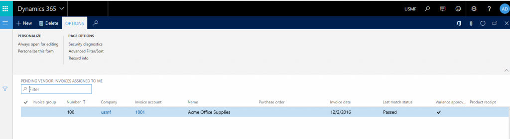
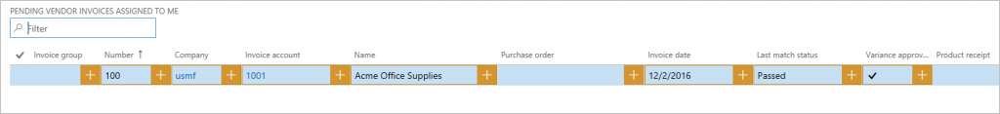
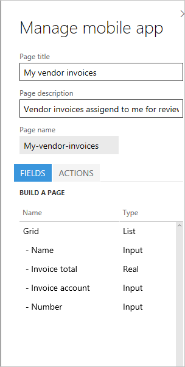
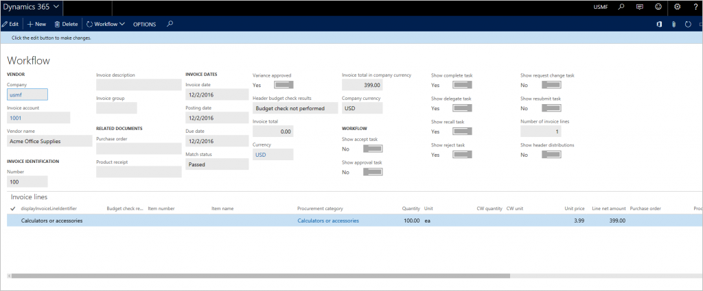
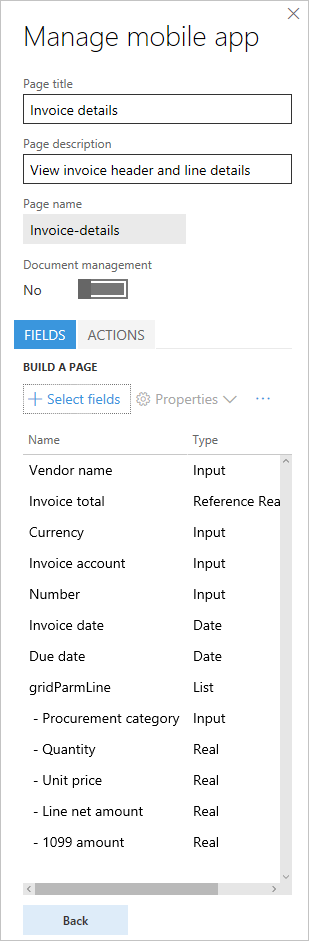
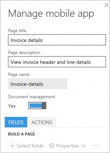
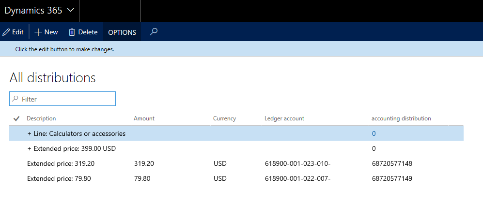

---
# required metadata

title: Mobile invoice approvals
description: This article is intended to provide a practical approach to designing mobile scenarios by taking vendor invoice approvals for mobile as a use case. 
author: abruer
ms.date: 08/22/2017
ms.topic: article
ms.prod: 
ms.technology: 

# optional metadata

# ms.search.form: 
# ROBOTS: 
audience: Application User
# ms.devlang: 
ms.reviewer: twheeloc
# ms.tgt_pltfrm: 
ms.custom: 262034
ms.assetid: 9db38b3f-26b3-436e-8449-7ff243568a18
ms.search.region: Global
# ms.search.industry: 
ms.author: shpandey
ms.search.validFrom: 2016-11-30
ms.dyn365.ops.version: Version 1611

---

# Mobile invoice approvals

[!include [banner](../includes/banner.md)]

Mobile capabilities let a business user design mobile experiences. For advanced scenarios, the platform also lets developers extend the capabilities as they desire. The most effective way to learn some of the new concepts on mobile is to go through the process of designing a few scenarios. This article is intended to provide a practical approach to designing mobile scenarios by taking vendor invoice approvals for mobile as a use case. This article should help you design other variations of the scenarios and can also be applied to other scenarios that aren’t related to vendor invoices.

## Prerequisites

| Prerequisite                                                                                            | Description                       |
|---------------------------------------------------------------------------------------------------------|--------------------------------------------|
| Mobile handbook pre-read                                                                                |[Mobile platform](../../fin-ops-core/dev-itpro/mobile-apps/platform/mobile-platform-home-page.md)                                                                                                  |
| Dynamics 365 Finance                                                                              | An environment that has version 1611 and Platform update 3 (November 2016)                   |
| Install hotfix KB 3204341.                                                                              | Task recorder can erroneously record two Close commands for dropdown dialogs; this is included in Platform update 3 (November 2016 update). |
| Install hotfix KB 3207800.                                                                              | This hotfix enables attachments to be viewed on the mobile client; this is included in Platform update 3 (November 2016 update).           |
| Install hotfix KB 3208224.                                                                              | Application code for the mobile vendor invoice approval application; this is included in version 7.0.1 (May 2016).                          |
| An Android or iOS or a Windows device that has the mobile app installed. | Search for the app in the appropriate app store.                            |

## Introduction
Mobile approvals for vendor invoices require the three hotfixes that are mentioned in the “Prerequisites” section. These hotfixes don’t provide a workspace for the invoice approvals. To learn what a workspace is in the context of mobile, read the mobile handbook that is mentioned in the “Prerequisites” section. The invoice approvals workspace must be designed. 

Every organization orchestrates and defines its business process for vendor invoices differently. Before you design a mobile experience for vendor invoice approvals, you should consider the following aspects of the business process. The idea is to use these data points as much as possible to optimize the user experience on the device.

-   What fields from the invoice header will the user want to see in the mobile experience, and in what order?
-   What fields from the invoice lines will the user want to see in the mobile experience, and in what order?
-   How many invoice lines are there in an invoice? Apply the 80-20 rule here, and optimize for the 80 percent.
-   Will users want to see accounting distributions (invoice coding) on the mobile device during reviews? If the answer to this question is yes, consider the following questions:
    -   How many accounting distributions (extended price, sales tax, charges, splits, and so on) are there for an invoice line? Again, apply the 80-20 rule.
    -   Do the invoices also have accounting distributions on the invoice header? If so, should these accounting distributions be available on the device?

    > [!NOTE]
    > This article doesn’t explain how to edit accounting distributions, because this functionality isn’t currently supported for mobile scenarios.

-   Will users want to see attachments for the invoice on the device?

The design of the mobile experience for invoice approvals will differ, depending on the answers to these questions. The objective is to optimize the user experience for the business process on mobile in an organization. In the rest of this article, we will look at two scenario variations that are based on different answers to the preceding questions. 

As a general guidance, when working with the mobile designer, make sure to 'publish' the changes to prevent losing the updates.

## Designing a simple invoice approval scenario for Contoso
<table>
<colgroup>
<col width="50%" />
<col width="50%" />
</colgroup>
<thead>
<tr class="header">
<th>Scenario attribute</th>
<th>Answer</th>
</tr>
</thead>
<tbody>
<tr class="odd">
<td>What fields from the invoice header will the user want to see in the mobile experience, and in what order?</td>
<td><ol>
<li>Vendor name</li>
<li>Invoice total</li>
<li>Invoice account</li>
<li>Invoice number</li>
<li>Invoice date</li>
<li>Invoice description</li>
<li>Due date</li>
<li>Invoice currency</li>
</ol></td>
</tr>
<tr class="even">
<td>What fields from the invoice lines will the user want to see in the mobile experience, and in what order?</td>
<td><ol>
<li>Procurement category</li>
<li>Quantity</li>
<li>Unit price</li>
<li>Line net amount</li>
<li>1099 amount</li>
</ol></td>
</tr>
<tr class="odd">
<td>How many invoice lines are there in an invoice? Apply the 80-20 rule here, and optimize for the 80 percent.</td>
<td>1</td>
</tr>
<tr class="even">
<td>Will users want to see accounting distributions (invoice coding) on the mobile device during reviews?</td>
<td>Yes</td>
</tr>
<tr class="odd">
<td>How many accounting distributions (extended price, sales tax, charges, and so on) are there for an invoice line? Again, apply the 80-20 rule.</td>
<td>Extended price: 2 Sales tax: 0 Charges: 0</td>
</tr>
<tr class="even">
<td>Do the invoices also have accounting distributions on the invoice header? If so, should these accounting distributions be available on the device?</td>
<td>Not used</td>
</tr>
<tr class="odd">
<td>Will users want to see attachments for the invoice on the device?</td>
<td>Yes</td>
</tr>
</tbody>
</table>

### Create the workspace

1.  In a browser, and sign in to the application.
2.  After you’ve signed in, append **&mode=mobile** to the URL as shown in the following example, and refresh the page: https://&lt;yoururl&gt;/?cmp=usmf&mi=DefaultDashboard**&mode=mobile**
3.  Click the **Settings** (gear) button in the upper right of the page, and then click **Mobile app**. The mobile app designer must show up just as Task recorder shows up.
4.  Click **Add** to create a new workspace. For this example, name the workspace **My approvals**.
5.  Enter a description.
6.  Select a workspace color. The workspace color will be used for the overall style of the mobile experience for this workspace.
7.  Select an icon for the workspace.
8.  Click **Done**
9.  Click **Publish workspace** to save the changes

### Vendor invoices assigned to me

The first mobile page that you should design is the list of invoices that are assigned to the user for review. To design this mobile page, use the **VendMobileInvoiceAssignedToMeListPage** page. Before you complete this procedure, make sure that at least one vendor invoice is assigned to you for review, and that the invoice line has two distributions. This setup meets the requirements for this scenario.

1.  In the URL, replace the name of the menu item with **VendMobileInvoiceAssignedToMeListPage** to open the mobile version of the **Pending vendor invoices assigned to me** list page in the **Accounts payable** module. Depending on the number of invoices that you have in your system assigned to you, this page will show those invoices. To find a specific invoice, you can use the filter on the left. However, we don’t require a specific invoice for this example. We just require some invoice assigned to you which is going to allow you to design the mobile page. The new pages that are available have been designed specifically for developing mobile scenarios for vendor invoice. Therefore, you must use these pages. The URL should resemble the following URL, and after you enter it, the page that is shown in the illustration must appear: https://&lt;yourURL&gt;/?cmp=usmf&mi=**VendMobileInvoiceAssignedToMeListPage**&mode=mobile 

    [](./media/mobile-invoice-approvals01.png)
    
2.  Click the **Settings** (gear) button in the upper right of the page, and then click **Mobile app**
3.  Select your workspace and click **Edit**
4.  Click **Add page** to create the first mobile page.
5.  Enter a name, such as **My vendor invoices**, and a description, such as **Vendor invoices assigned to me for review**.
6.  Click **Done**.
7.  In the mobile designer, on the **Fields** tab, click **Select fields**. The columns on the list page must resemble the following illustration. 

    [](./media/mobile-invoice-approvals02.png)
    
8.  Add the required columns from the list page that must be shown to the users in the mobile page. The order in which you add is the order in which the fields will be displayed to the end user. The only way to change the ordering of the fields will be by re-selecting all the fields. Based on the requirements for this scenario, the following eight fields are required. However, some users might consider eight fields too much information to have on a mobile device. Therefore, we will show only the most important fields in the mobile list view. The remaining fields will appear in the details view that we will design later. For now, we will add the following fields. Click the plus sign (**+**) in these columns to add to the mobile page.
    - Vendor name
    - Invoice total
    - Invoice account
    - Invoice number
    - Invoice date

    After the fields are added, the mobile page must resemble the following illustration. 
    
    [](./media/mobile-invoice-approvals03.png)

9.  You must also add the following columns now, so that we can enable workflow actions later.
    - Show complete task
    - Show delegate task
    - Show recall task
    - Show reject task
    - Show request completion task
    - Show resubmit task

10. Click **Done** to exit edit mode.
11. Click **Back** and then **Done** to exit the workspace
12. Click **Publish workspace** to save your work.
13. Enable **Display invoice total on pending vendor invoices list** in accounts payable parameters form under **Invoice**. Note that, only by enabling this parameter, invoice totals will be calculated to be displayed on the pending vendor invoices list page. This is a new capability as part of the pre-requisite hot fix 3208224.

### Vendor invoice details

To design the invoice details page for mobile, use the **VendMobileInvoiceHeaderDetails** page. Note that, depending on the number of invoices that you have in your system, this page shows the oldest invoice (the invoice that was created first). To find a specific invoice, you can use the filter on the left. However, we don’t require a specific invoice for this example. We just require some invoice data so that we can design the mobile page. 

[](./media/mobile-invoice-approvals04.png)

1. In the URL, replace the name of the menu item with **VendMobileInvoiceHeaderDetails** to open the form

2. Open the mobile designer from the **Settings** (gear) button.

3. Click the **Edit** button to start edit mode in the workspace.

4. Select the **My vendor invoices** page that you created earlier, and then click **Edit**.

5. On the **Fields** tab, click the **Grid** column heading.

6. Click **Properties &gt; Add page**. **Note:** When you click the **Grid** heading and add a page, the relationship with the details page is established automatically.

7. Enter a page title, such as **Invoice details**, and a description, such as **View invoice header and line details**.

8. Click **Select fields**. Note that, the order in which you add is the order in which the fields will be displayed to the end user. The only way to change the ordering of the fields will be by re-selecting all the fields. 

9. Add the following fields from the header, based on the requirements for this scenario:
   - Vendor name
   - Invoice total
   - Invoice account
   - Invoice number
   - Invoice date
   - Invoice description
   - Due date
   - Invoice currency

10. Add the following fields from the lines grid on the page:
    - Procurement category
    - Quantity
    - Unit price
    - Line net amount
    - 1099 amount

11. After all the fields from the previous two steps have been added, click **Done**. The page must resemble the following illustration.
    
    [](./media/mobile-invoice-approvals05.png)

12. Click **Done** to exit edit mode.

13. Click **Back** and then **Done** to exit the workspace

14. Click **Publish workspace** to save your work

### Workflow actions

To add workflow actions, use the **VendMobileInvoiceHeaderDetails** page. To open this page, replace the name of the menu item in the URL, as you did earlier. Then open the mobile designer from the **Settings** (gear) button. Follow these steps to add workflow actions on the details page. You must have invoices assigned to you that are in the appropriate state to make the workflow actions available to you that you are going to design for.

#### Record workflow actions
1.  Click the **Edit** button to start edit mode in the workspace.
2.  Select the **Invoice details** page that you created earlier, and then click **Edit**.
3.  On the **Actions** tab, click **Add action**.
4.  Enter an action title, such as **Approve**, and a description, such as **Approve invoice**. Note that the action title that you enter here becomes the name of the action that is shown to the user in the mobile app.
5.  Click **Done**.
6.  Click **Select fields**.
7.  Go through the workflow process on the **VendMobileInvoiceHeaderDetails** page, and complete the action that you wanted to record. Make sure that you enter workflow comments during this process, so that a comments field is also included in the mobile experience.
8.  After the workflow action is run, click **Done** to complete the Select fields task.
9.  Click **Done** to exit edit mode.
10. Click **Back** and then **Done** to exit the workspace
11. Click **Publish workspace** to save your work
12. Repeat the previous steps to record all the required workflow actions. 

#### Create a .js file
1. Open Notepad or Microsoft Visual Studio, and paste the following code. Save the file as a .js file. This code does the following:
    - It hides the extra workflow-related columns that we added earlier on the mobile list page. We added these columns so that the app has that information in context and can do the next step.
    - Based on the workflow step that is active, it applies logic to show only those actions.

    > [!NOTE]
    > The name of the pages and other controls in the code must be the same as the names in the workspace.

    ```javascript
    function main(metadataService, dataService, cacheService, $q) {
           return {
               appInit: function (appMetadata) {
                   // Hide controls that need to be present, but not visible
                   metadataService.configureControl('My-vendor-invoices', 'ShowAccept', { hidden: true });
                   metadataService.configureControl('My-vendor-invoices', 'ShowApprove', { hidden: true });
                   metadataService.configureControl('My-vendor-invoices', 'ShowReject', { hidden: true });
                   metadataService.configureControl('My-vendor-invoices', 'ShowDelegate', { hidden: true });
                   metadataService.configureControl('My-vendor-invoices', 'ShowRequestChange', { hidden: true });
                 metadataService.configureControl('My-vendor-invoices', 'ShowRecall', { hidden: true });
                   metadataService.configureControl('My-vendor-invoices', 'ShowComplete', { hidden: true });
               metadataService.configureControl('My-vendor-invoices', 'ShowResubmit', { hidden: true });
               },
               pageInit: function (pageMetadata, params) {
        if (pageMetadata.Name == 'Invoice-details') {
                       // Show/hide workflow actions based on workflow step
                       metadataService.configureAction('Accept', { visible: true });
                       metadataService.configureAction('Approve', { visible: true });
                       metadataService.configureAction('Reject', { visible: true });
                       metadataService.configureAction('Delegate', { visible: true });
                       metadataService.configureAction('Request-change', { visible: true });
                       metadataService.configureAction('Recall', { visible: true });
                       metadataService.configureAction('Complete', { visible: true });
                       metadataService.configureAction('Resubmit', { visible: true });

                       var entityContextParts = params.pageContext.split(':');
                       var data = dataService.getEntityData(entityContextParts[0], entityContextParts[1]);

                       var acceptControl = data.getPropertyValue('VendInvoiceInfoTable/showAccept');
                       var approveControl = data.getPropertyValue('VendInvoiceInfoTable/showApprove');
                       var rejectControl = data.getPropertyValue('VendInvoiceInfoTable/showReject');
                       var delegateControl = data.getPropertyValue('VendInvoiceInfoTable/showDelegate');
                       var requestChangeControl = data.getPropertyValue('VendInvoiceInfoTable/showRequestChange');
                       var recallControl = data.getPropertyValue('VendInvoiceInfoTable/showRecall');
                       var completeControl = data.getPropertyValue('VendInvoiceInfoTable/showComplete');
                       var resubmitControl = data.getPropertyValue('VendInvoiceInfoTable/showResubmit');

                       var showAcceptControl = Boolean(acceptControl == 1);
                       var showApproveControl = Boolean(approveControl == 1);
                       var showRejectControl = Boolean(rejectControl == 1);
                      var showDelegateControl = Boolean(delegateControl == 1);
                       var showRequestChangeControl = Boolean(requestChangeControl == 1);
                       var showRecallControl = Boolean(recallControl == 1);
                       var showCompleteControl = Boolean(completeControl == 1);
                       var showResubmitControl = Boolean(resubmitControl == 1);

                       metadataService.configureAction('Accept', { visible: showAcceptControl });
                       metadataService.configureAction('Approve', { visible: showApproveControl });
                       metadataService.configureAction('Reject', { visible: showRejectControl });
                       metadataService.configureAction('Delegate', { visible: showDelegateControl });
                       metadataService.configureAction('Request-change', { visible: showRequestChangeControl });
                       metadataService.configureAction('Recall', { visible: showRecallControl });
                       metadataService.configureAction('Complete', { visible: showCompleteControl });
                     metadataService.configureAction('Resubmit', { visible: showResubmitControl });
                   }
                 },
           };
        }
    ```

2.  Upload the code file to the workspace by selecting the **Logic** tab
3.  Click **Done** to exit edit mode.
4.  Click **Back** and then **Done** to exit the workspace
5.  Click **Publish workspace** to save your work

### Vendor invoice attachments

1. Click the **Settings** (gear) button in the upper right of the page, and then click **Mobile app**

2. Click the **Edit** button to start edit mode in the workspace.

3. Select the <strong>Invoice details **page that you created earlier, and then click **Edit</strong>.

4. Set the **Document management** option to **Yes** as shown below. **Note:** If there are no requirements to show attachments on the mobile device, you can leave this option set to **No**, which is the default setting.
   
   

5. Click **Done** to exit edit mode.

6. Click **Back** and then **Done** to exit the workspace

7. Click **Publish workspace** to save your work

### Vendor invoice line distributions

The requirements for this scenario confirm that there will be only line-level distributions, and that an invoice will always have only one line. Because this scenario is simple, the user experience on the mobile device must also be simple enough that the user doesn’t have to drill down several levels to view the distributions. Vendor invoices include the option of showing all distributions from the invoice header. This experience is what we need for the mobile scenario. Therefore, we will use the **VendMobileInvoiceAllDistributionTree** page to design this part of the mobile scenario. 

> [!NOTE] 
> Knowing the requirements helps us decide which specific page to use and how exactly to optimize the mobile experience for the user when we design the scenario. In the second scenario, we will use a different page to show the distributions, because the requirements for that scenario differ.

1.  In the URL, replace the name of the menu item, as you did before. The page that appears should resemble the following illustration.

    [](./media/mobile-invoice-approvals06.png)

2.  Open the mobile designer from the **Settings** (gear) button.

3.  Click the **Edit** button to start edit mode in the workspace. **Note:** You will see that two new pages were created automatically. The system creates these pages, because you turned on document management in the previous section. You can ignore these new pages.

4.  Click **Add page**.

5.  Enter a page title, such as **View accounting**, and a description, such as **View accounting for the invoice**.

6.  Click **Done**.

7.  On the **Fields** tab, click **Select fields**, select the following fields from the distributions page, and then click **Done**:
    1.  Amount
    2.  Currency
    3.  Ledger account

    > [!NOTE] 
    > We didn’t select the **Description** column from the distributions grid, because the requirements for this scenario confirmed that the extended price is the only amount that there will be distributions for. Therefore, the user won’t require another field to determine the amount type that the distribution is for. However, in the next scenario, we **will** use this information, because the requirements for that scenario specify that other amount types have distributions (for example, sales tax).

8.  Click **Done** to exit edit mode.

9.  Click **Back** and then **Done** to exit the workspace

10. Click **Publish workspace** to save your work

#### Adding navigation to "View accounting" page

The **View accounting** mobile page isn’t currently linked to any of the mobile pages that we have designed so far. Because the user should be able to navigate to the **View accounting** page from the **Invoice details** page on the mobile device, we must provide navigation from the **Invoice details** page to the **View accounting** page. We establish this navigation by using additional logic via JavaScript.

1.  Open the .js file that you created earlier, and add the lines that are highlighted in the following code. This code does two things:
    1.  It helps guarantee that users can’t navigate directly from the workspace to the **View accounting** page.
    2.  It establishes a navigation control from the **Invoice details** page to the **View accounting** page.

    > [!NOTE] 
    > The name of the pages and other controls in the code must be the same as the names in the workspace.

    ```javascript
    function main(metadataService, dataService, cacheService, $q) {
           return {
               appInit: function (appMetadata) {
                   // Hide controls that need to be present, but not visible
                   metadataService.configureControl('My-vendor-invoices', 'ShowAccept', { hidden: true });
                   metadataService.configureControl('My-vendor-invoices', 'ShowApprove', { hidden: true });
                   metadataService.configureControl('My-vendor-invoices', 'ShowReject', { hidden: true });
                   metadataService.configureControl('My-vendor-invoices', 'ShowDelegate', { hidden: true });
                   metadataService.configureControl('My-vendor-invoices', 'ShowRequestChange', { hidden: true });
                 metadataService.configureControl('My-vendor-invoices', 'ShowRecall', { hidden: true });
                   metadataService.configureControl('My-vendor-invoices', 'ShowComplete', { hidden: true });
               metadataService.configureControl('My-vendor-invoices', 'ShowResubmit', { hidden: true });
                   // Hide pages not applicable for root navigation
                   metadataService.hideNavigation('View-accounting');
                   //Link to view accounting
                   metadataService.addLink('Invoice-details', 'View-accounting', 'View-accounting-nav-control', 'View accounting', true);
               },
               pageInit: function (pageMetadata, params) {
        if (pageMetadata.Name == 'Invoice-details') {
                       // Show/hide workflow actions based on workflow step
                       metadataService.configureAction('Accept', { visible: true });
                       metadataService.configureAction('Approve', { visible: true });
                       metadataService.configureAction('Reject', { visible: true });
                       metadataService.configureAction('Delegate', { visible: true });
                       metadataService.configureAction('Request-change', { visible: true });
                       metadataService.configureAction('Recall', { visible: true });
                       metadataService.configureAction('Complete', { visible: true });
                       metadataService.configureAction('Resubmit', { visible: true });

                       var entityContextParts = params.pageContext.split(':');
                       var data = dataService.getEntityData(entityContextParts[0], entityContextParts[1]);

                       var acceptControl = data.getPropertyValue('VendInvoiceInfoTable/showAccept');
                       var approveControl = data.getPropertyValue('VendInvoiceInfoTable/showApprove');
                       var rejectControl = data.getPropertyValue('VendInvoiceInfoTable/showReject');
                       var delegateControl = data.getPropertyValue('VendInvoiceInfoTable/showDelegate');
                       var requestChangeControl = data.getPropertyValue('VendInvoiceInfoTable/showRequestChange');
                       var recallControl = data.getPropertyValue('VendInvoiceInfoTable/showRecall');
                       var completeControl = data.getPropertyValue('VendInvoiceInfoTable/showComplete');
                       var resubmitControl = data.getPropertyValue('VendInvoiceInfoTable/showResubmit');

                       var showAcceptControl = Boolean(acceptControl == 1);
                       var showApproveControl = Boolean(approveControl == 1);
                     var showRejectControl = Boolean(rejectControl == 1);
                       var showDelegateControl = Boolean(delegateControl == 1);
                       var showRequestChangeControl = Boolean(requestChangeControl == 1);
                       var showRecallControl = Boolean(recallControl == 1);
                       var showCompleteControl = Boolean(completeControl == 1);
                       var showResubmitControl = Boolean(resubmitControl == 1);

                       metadataService.configureAction('Accept', { visible: showAcceptControl });
                       metadataService.configureAction('Approve', { visible: showApproveControl });
                       metadataService.configureAction('Reject', { visible: showRejectControl });
                       metadataService.configureAction('Delegate', { visible: showDelegateControl });
                       metadataService.configureAction('Request-change', { visible: showRequestChangeControl });
                       metadataService.configureAction('Recall', { visible: showRecallControl });
                       metadataService.configureAction('Complete', { visible: showCompleteControl });
                       metadataService.configureAction('Resubmit', { visible: showResubmitControl });
        }
                 },
           };
        }
    ```
    
2.  Upload the code file to the workspace by selecting the **Logic** tab to overwrite the previous code
3.  Click **Done** to exit edit mode.
4.  Click **Back** and then **Done** to exit the workspace
5.  Click **Publish workspace** to save your work

### Validation

From your mobile device, open the app, and connect to your instance. Make sure that you sign in to the company where vendor invoices are assigned to you for review. You should be able to perform the following actions:

-   See the **My approvals** workspace.
-   Drill into the **My approvals** workspace and see the **My vendor invoices** page.
-   Drill into the **My vendor invoices** page and see the list of invoices that are assigned to you.
-   Drill into one of the invoices, and see the invoice header details and line details.
-   On the details page, see a link to attachments, and use this link to navigate to the attachments list and view the attachments.
-   On the details page, see a link to the **View accounting** page, and use this link to navigate to the distributions page and view the distributions.
-   On the details page, click the **Actions** menu at the bottom, and perform workflow actions that are applicable to the workflow step.

## Designing a complex invoice approval scenario for Fabrikam
<table>
<colgroup>
<col width="50%" />
<col width="50%" />
</colgroup>
<thead>
<tr class="header">
<th>Scenario attribute</th>
<th>Answer</th>
</tr>
</thead>
<tbody>
<tr class="odd">
<td>What fields from the invoice header will the user want to see in the mobile experience, and in what order?</td>
<td><ol>
<li>Vendor name</li>
<li>Invoice amount</li>
<li>Invoice account</li>
<li>Invoice number</li>
<li>Invoice date</li>
<li>Invoice description</li>
<li>Due date</li>
<li>Invoice currency</li>
</ol></td>
</tr>
<tr class="even">
<td>What fields from the invoice lines will the user want to see in the mobile experience, and in what order?</td>
<td><ol>
<li>Procurement category</li>
<li>Quantity</li>
<li>Unit price</li>
<li>Line net amount</li>
<li>1099 amount</li>
</ol></td>
</tr>
<tr class="odd">
<td>How many invoice lines are there in an invoice? Apply the 80-20 rule here, and optimize for the 80 percent.</td>
<td>5</td>
</tr>
<tr class="even">
<td>Will users want to see accounting distributions (invoice coding) on the mobile device during reviews?</td>
<td>Yes</td>
</tr>
<tr class="odd">
<td>How many accounting distributions (extended price, sales tax, charges, and so on) are there for an invoice line? Again, apply the 80-20 rule.</td>
<td>Extended price: 2 Sales tax: 2 Charges: 2</td>
</tr>
<tr class="even">
<td>Do the invoices also have accounting distributions on the invoice header? If so, should these accounting distributions be available on the device?</td>
<td>Not used</td>
</tr>
<tr class="odd">
<td>Will users want to see attachments for the invoice on the device?</td>
<td>Yes</td>
</tr>
</tbody>
</table>

### Next steps

The following variations can be done for scenario 1, based on the requirements for scenario 2. You can use this section to improve your mobile app experience.

1.  Because more invoice lines are expected in scenario 2, the following changes to the design will help optimize the user experience on the mobile device:
    1.  Instead of viewing invoice lines on the details page (as in scenario 1), users can choose to view lines on a separate mobile page.
    2.  Because more than one invoice line is expected in this scenario, if the **VendMobileInvoiceAllDistributionTree** page is used to design the distributions page for mobile (as in scenario 1), it might be confusing for the user to correlate lines to distributions. Therefore, use the **VendMobileInvoiceLineDistributionTree** page to design the distributions page.
    3.  Ideally, the distributions should be shown in the context of an invoice line in this scenario. Therefore, make sure that the user can drill into a line to see the distributions page. Use the page link capability to establish the drill-through, just as you did for the header and details pages in scenario 1.

2.  Because more than one amount type is expected on the distributions in scenario 2 (sales tax, charges, and so on), it will be useful to show the description of the amount type. (We omitted this information in scenario 1.)


[!INCLUDE[footer-include](../../includes/footer-banner.md)]
