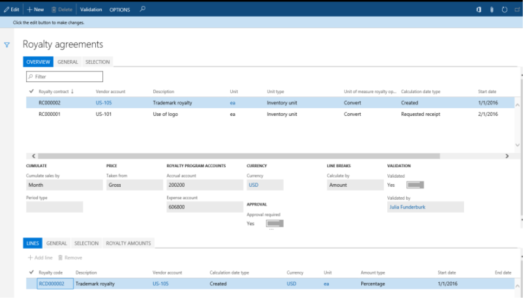
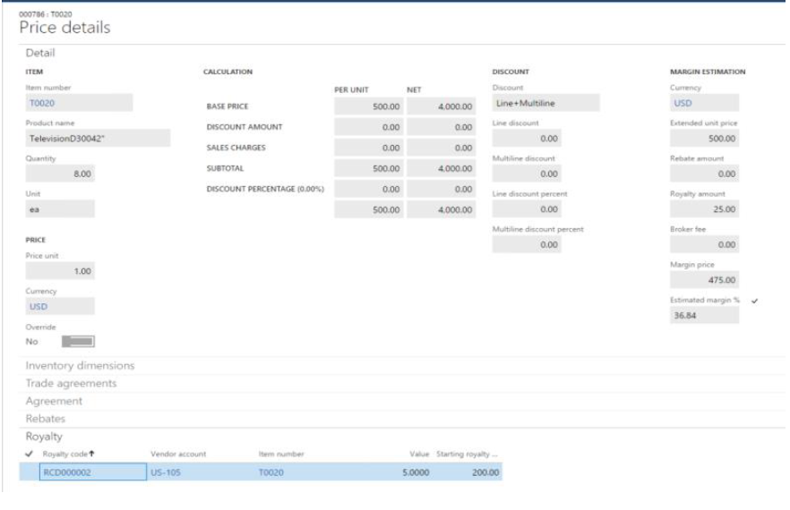

---
# required metadata

title: Royalty contract management
description: This article describes royalty contract management for Microsoft Dynamics 365 Finance.
author: t-benebo
ms.date: 08/02/2018
ms.topic: article
ms.prod: 
ms.technology: 

# optional metadata

ms.search.form: MCRBrokerCommission, MCRRoyaltyContractLineInfoPart, PdsRebatePayment 
audience: Application User
# ms.devlang: 
ms.reviewer: twheeloc
# ms.tgt_pltfrm: 
# ms.custom: 
ms.search.region: Global
# ms.search.industry: 
ms.author: benebotg
ms.search.validFrom: 2018-01-31
ms.dyn365.ops.version: July 2017 update
---

# Royalty contract management

[!include [banner](../includes/banner.md)]

Royalty contract management is intended for companies that exercise the right to use a third party's assets and/or intellectual property. It helps companies better manage their royalty agreements by automating tasks that are involved in administering, tracking, and making royalty payments.

This article provides an overview of the typical process for handling royalty fees:

- Register details of the negotiated royalty contract.
- Run negotiated contracts through ongoing sales, and generate royalty claims.
- Approve and process the generated claims, so that they can be passed on to Accounts payable (A/P) for payment.

## Audience and purpose

The information in this article is intended for business decision makers in enterprise companies, in capacities such as sales manager, accounting manager, and A/P manager, who have the following responsibilities:

- Negotiating contracts with the licensor
- Recording royalty agreement terms and fee rates in the system
- Managing staff that processes royalty claims and makes fee payments

People in these roles are looking for ways to achieve these goals:

- Flexibly accommodate different definitions of royalty contracts and their conditions.
- Reduce the administrative burden and errors that are associated with tracking and processing royalty claims.
- Improve cash flow forecasts by accruing for future payables and avoiding interest on delayed payments.

## Royalty contracts

A royalty contract is a record of an agreement with an asset or intellectual property owner. It specifies the negotiated terms and conditions under which the licensor qualifies for a monetary reward when the licensee uses its property to obtain revenue.

Royalty contracts are registered on the **Royalty contracts** page. To open the **Royalty contracts** page, select **Accounts payable \> Broker and royalties \> Royalty agreements**.

The **Selection** tab in the lower part of the page shows the products that qualify for a royalty fee.

On the **General** tab in the upper part of the page, several fields provide more details about the agreement's conditions as they were negotiated with the licensor:

- The **Cumulate sales by** field specifies the period that a royalty amount will be calculated for, based on cumulative sales. For example, the period might be a month. Alternatively, to calculate the royalty amount every time that a sales order line is invoiced, select **Invoice**.
- If the **Approval required** option is set to **Yes**, a royalty program owner must approve the claims before a royalty can be turned into an invoice that is payable to the licensor.
- The **Accrual account** and **Expense account** fields must specify account numbers that will receive accrued amounts during the intermediate stage between approval and processing.

You set up royalty rates on the **Royalty amounts** tab in the lower part of the page. To set up the rates as tiers, add a line for each tier, and set the **From value** and **To value** fields.

> [!IMPORTANT]
> To make an agreement valid, you must select **Validation** on the Action Pane. The **Validated** option on the **General** tab in the upper part of the page will then be set to **Yes**.

## Sell products that qualify for a royalty fee and generate a claim

When a sales processor creates a sales order for a product that the company has a royalty contract for, if the order line's details qualify for the royalty, the program identifies the future royalty fee.

To see whether a sales order line qualifies for a royalty fee, select **Sales order line \> View \> Price details**. On the **Price details** page, select the **Royalty** FastTab.

The **Royalty** FastTab shows the royalty fee from the valid contract code that is applied to a line. Additionally, the **Royalty amount** field under **Margin estimation** on the **Detail** FastTab specifies the royalty fee per product unit.

> [!NOTE]
> To access the **Price details** page, on the **Accounts receivable parameters** page, on the **Prices** tab, on the **Price details** FastTab, set the **Enable price details** option to **Yes**.

The royalty claim is created when the sales order is invoiced.

## Process claims and pass them as payable to A/P

Royalty claims that are generated represent future payments to the licensor. The contract owner cumulates the claims for the relevant period and then creates an interim liability for the licensor by approving those claims.

The royalty agreement owner is responsible for periodically reviewing and, as required by the company's policy, approving the claims that are generated. After the claims are approved, the A/P administrator passes them as purchase invoices to the regular payable processing.

To view all the claims, select **Accounts payable \> Broker and royalties \> Royalty claims**.

On the **Royalty claims** page, the **Starting royalty amount** field specifies the fee amount that, after it's approved and processed, will be paid to the vendor as a royalty.

The fields in the **Sales** section of the page specify the details about the originating sales invoice, such as the invoice number, invoice line net amount, and quantity.

Note that when a claim is generated on a time basis, its status is set to **To be calculated**. This status is used because the royalty is granted on that time basis. The claim won't be included, together with other claims, in the cumulative calculation until the end of the period.

If there are multiple sales orders for the same vendor, the claims must be recalculated so that any cumulative effect is considered. On the Action Pane, select **Cumulate**.

When the **Cumulate** action is run, an accrual journal for the claim amounts is posted. To view the details of the posting, find the claim in the list of royalty claims, and then, on the Action Pane, select **Royalty transactions** to see and access the accrual journal.

The posted voucher specifies that the royalty accrual account is credited for the expected royalty fee, and that the interim accrued royalty expense account is debited for the expected expense.

To move the claims to the regular A/P process, the A/P clerk must complete the royalty claim. On the **Royalty claims** page, on the Action Pane, select **Process**.

The following events occur, and the claim's status is changed to **Completed**:

- A Royalty accrual journal posting reverses the previous interim amounts on the accrual payable and expense amounts.
- A vendor invoice for the royalty amount is created and posted.
- As a result, the vendor's payable account is credited, and the royalty fees account is debited.

> [!NOTE]
> The account number for royalty fees is specified for the procurement category that is used on the purchase invoice line for the royalty. That procurement category, in turn, is set on the **Broker and royalty** tab of the **Accounts payable parameters** page.

To see the vendor invoice number, open the **Royalty transactions** page from the royalty claim.

## Summary

The process for handling royalties involves multiple manual tracking tasks that are often tedious. By automating those tasks, the royalty contract management feature helps you move through the following process:

- Generating accurate royalty claims
- Accruing the expected payables and interim expense in the general ledger
- Updating the vendor balance and the income statement with the royalties that are due

In this way, the feature helps you avoid potential errors and interest on unpaid royalties, and contributes to a timely cash flow forecast for the company.

[!INCLUDE[footer-include](../../includes/footer-banner.md)]
