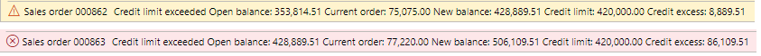
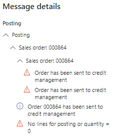

# Credit limit holds FAQ

This article answers some frequently asked questions about credit checks, credit holds, and the warning and error messages that you might receive in Credit management.

To open the **Credit and collections parameters** page, go to **Credit and collections** > **Setup** > **Credit and collections parameters**. To set up the blocking rules, go to **Credit and collections** > **Setup** > **Credit management setup** > **Blocking rules**.

For more information, see [Finance troubleshooting and FAQs](../finance-troubleshooting.md).

### After I upgrade to version 10.0.35 or later, the credit check no longer works. However, it worked before the upgrade

Blocking rules and credit management checkpoints are required to check the customer credit limit on a sales order. Confirm that a blocking rule is set up for the credit limit that you use (or another blocking rule), and that you select the credit management checkpoints on the **Credit and collections parameters** page. For more information about blocking rules, see [Credit holds for sales orders](cm-sales-order-credit-holds.md).

### I'm receiving a warning or error message on a sales order. However, the sales order isn't on credit hold, and I don't see it in the Credit management hold list

You might receive the following message as either a warning (in yellow) or an error (in red). In both cases, the message is from earlier credit functionality.

> Sales order \<*order number*\> Credit limit exceeded Open balance: \<*balance amount*\> Current order: \<*order amount*\> New balance: \<*balance amount*\> Credit limit: \<*limit amount*\> Credit excess: \<*excess amount*\>

The following illustration shows an example of a warning message and an error message.

The type of message (error or warning) depends on the value of the **Message when exceeding credit limit** field on the **Credit limits** FastTab on the **Credit** tab of the **Credit and collections parameters** page. The message appears because the **Check credit limit on sales order** option is set to **Yes** to specify that the credit limit should be checked on sales orders.

You can't suppress these warning or error messages because they're the same messages that are used with free text invoices. They appear regardless of whether Credit management is enabled or disabled. However, when Credit management is enabled, you can ignore them.

### How can I tell whether a sales order is on credit hold if the warning or error message isn't used?

When you send a sales order to the **Credit management hold** list, **Message details** shows the following posting message:

> Order has been sent to credit management

The order appears in the **Credit management hold** list at **Credit and collections** > **Credit management hold list** > **All credit holds** or **Open credit holds**.

### If I set a credit limit of 0.00 USD for a customer, does that customer have unlimited credit?

When you enable Credit management, a credit limit of 0.00 indicates that the customer has *no* credit. To use the blocking rules to put a sales order on hold with a 0.00 credit limit, set the **Mandatory credit limit** option to **Yes** on the **Credit and collections** FastTab of the customer record.

If the customer should have unlimited credit, set the **Unlimited credit limit** option to **Yes** on the **Credit and collections** FastTab of the customer record.

A credit limit of 0.00 indicates unlimited credit only when Credit management is disabled. This behavior is part of the "old" credit functionality.

### I set up credit management groups, but sales orders still aren't blocked based on the credit limit

Sales orders are blocked if you set up blocking rules and credit management checkpoints, even when you use customer credit groups. For more information about how credit is calculated when credit limit groups are used, see [Credit limit scenarios](credit-limit-scenarios.md).

### Credit management check skipped for intercompany sales orders

If you enable the **Intercompany sales order exclusion from credit management** feature, the blocking rules for the legal entity of the intercompany sales order are skipped. The **Exclude from credit management** option is enabled by default on the sales order header for intercompany sales order. If you want to enforce credit limit checks for specific orders, disable the exclusion property.
