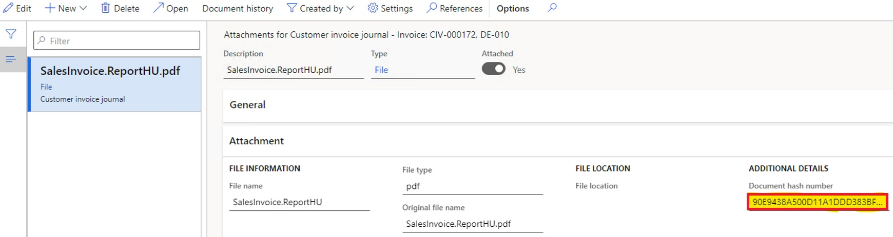

# Archive printed customer invoices with hash numbers

[!include [banner](../includes/banner.md)]

In some countries/regions, there is a legal requirement to store calculated hash numbers in the system together with printouts of some documents. Hash numbers can be used for reporting to authorities and during audits.

This article explains how to configure archiving in order to store printed customer invoices with hash numbers.

## Prerequisites

- In the **Feature management** workspace, turn on the feature, **Archive printed customer invoices with hash numbers**. For more information, see [Feature management overview](../../fin-ops-core/fin-ops/get-started/feature-management/feature-management-overview.md).
- Configure the printable formats of required documents in **Print management**.

This functionality is applicable to the following documents.

**Accounts receivable**
- Customer invoice
- Customer credit note
- Free text invoice
- Free text credit note

**Project management and accounting**
- Project invoice
- Project credit note

## Configure customer master data
Complete the following steps to configure customer data and turn on the ability to automatically save printed invoices as attachments.

1. Go to **Accounts receivable** > **All customers**. 
2. Select a customer, and on the **Invoice and delivery** FastTab, in the **E-INVOCE** section, in the **eInvoice attachment** field, select **Yes**.

## Print invoices
You can post and print any free text, customer, and project invoice or credit note for the customer configured in the previous procedure.

Open the **Attachments** page for the printed invoice. On the **Attachment** FastTab, in the **Additional details** field group, in **Document hash number** field, find the stored hash number calculated for the printed invoice.

