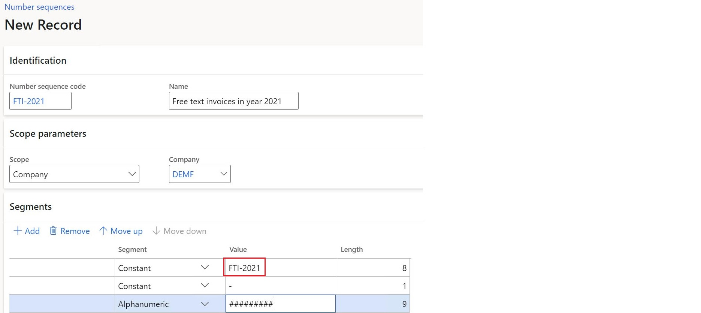
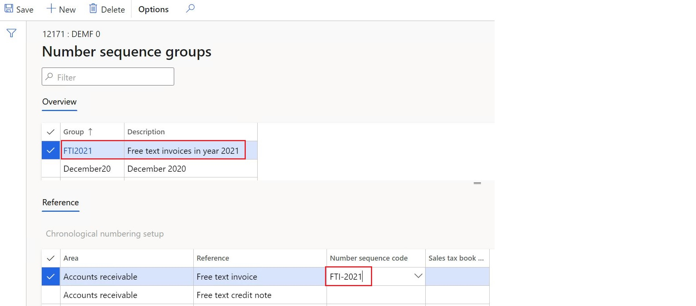
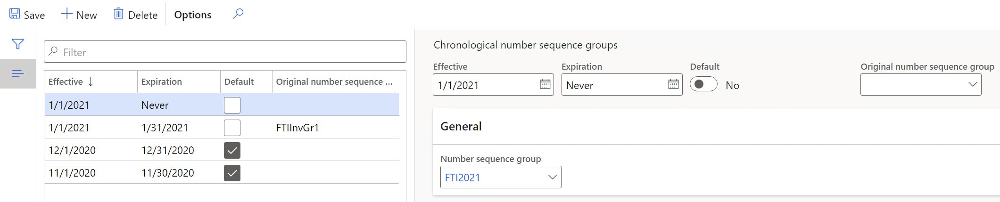
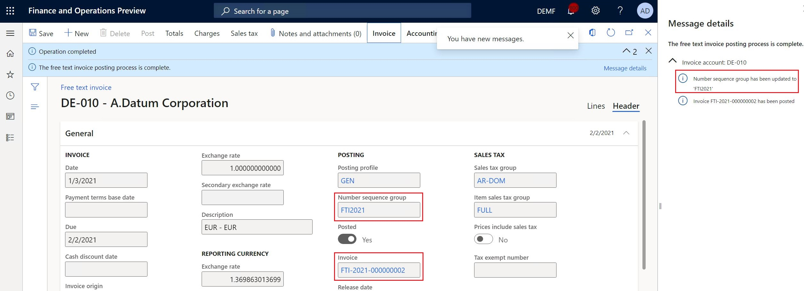

# Numbering documents and vouchers chronologically

[!include [banner](../includes/banner.md)]

In some countries/regions, there is a legal requirement to number documents and related vouchers in chronological order. The chronology must be supported by periods. All of the numbers that belong to earlier periods must be less than the numbers that belong to later periods. To meet this requirement, chronological numbering functionality has been implemented. 
This article explains how to configure and use chronological numbers for applicable documents and related vouchers.

## Prerequisites

In the Feature management workspace, turn on the **Chronological numbering** feature. For more information, see [Feature management overview](../../fin-ops-core/fin-ops/get-started/feature-management/feature-management-overview.md).

## Configure chronological numbering

Chronological numbering affects the following documents.

**Accounts receivable**
- Customer invoice
- Customer invoice voucher
- Sales credit note
- Sales credit note voucher
- Free text invoice
- Free text invoice voucher
- Free text credit note
- Free text credit note voucher
- Packing slip
- Packing slip voucher
- Packing slip correction voucher
- Interest note voucher
- Collection letter voucher

**Accounts payable**
- Invoice voucher
- Credit note voucher
- Product receipt voucher

**Project management**
- Invoice
- Invoice voucher
- Credit note
- Credit note voucher 

### Define number sequences

To define number sequences, go to **Organization administration** > **Number sequences** > **Number sequences**. You can define as many number sequences as required to cover the affected periods for required documents. 

Specify a company for each number sequence. The segments of the number sequences must be defined so that they provide chronological order for periods. For example, the segment names can contain a special prefix that identifies a specific period.

### Configure number sequence groups

To configure number sequence groups, go to **Accounts receivable** > **Setup** > **Accounts receivable parameters**. On the **Number sequences** tab, define as many number sequences groups as required to cover the affected periods. 

For each group, in the **Reference** section, select one of the supported document references, and in the **Number sequence code** field, refer to a number sequence that was previously created for the related period.

Similarly, configure number sequence groups in **Accounts payable** and **Project management and accounting** modules.

### Configure number sequence groups chronology

To configure number sequence groups chronology, go to **Organization administration** > **Number sequences** > **Chronological number sequence groups**. Define the applicability conditions for number sequence groups.

| Field            | Description                                                                                                                                                                                                                                                                                                                                                                                   |
|---------------------|------------------------------------------------------------------------------------------------------------------------------------------------------------------------------------------------------------------------------------------------------------------------------------------------------------------------------------------------------------------------------------------------|
| Effective  | The start date of number sequence group applicability. |
| Expiration      | The end date of number sequence group applicability. If no end date is applied, select **Never**. |
| Number sequence group | Number sequence group that will be used to generate document numbers during the period. |
| Original number sequence group | This number sequence group code is used for additional filtering for the cases when documents already have a specific *permanent* number sequence group assigned. An empty value is considered a specific value. If you need to ignore a preliminary assigned group, use the **Default** option for this setup. |
| Default | If turned on, the system ignores the preliminary assigned document number sequence group and uses only the periods start and end dates for applicability analysis. If turned off, the system uses the full combination **Effective** + **Expiration** + **Original number sequence group** for selection. |

## Document posting
When you post a document, the appropriate number sequence group is assigned to the document, based on document's posting date, and then used to generate a document number based on the detected number sequence. The system provides a message regarding the number sequence group assignment.

> [!NOTE]
> For some countries/regions, there is a specific logic already implemented for document numbering. In this case, country/region-specific logic will override the **Chronological numbering** feature.

[!INCLUDE[footer-include](../../includes/footer-banner.md)]
