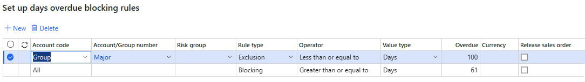
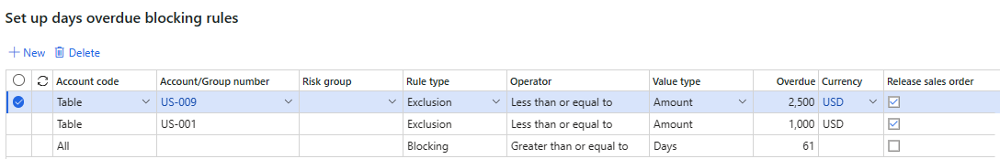

# Credit holds for sales orders

[!include [banner](../includes/banner.md)]

This article describes how to set up rules that place a sales order on credit hold. The credit management blocking rules can apply to an individual customer or a group of customers. Blocking rules define responses to the following circumstances:

1. Number of days overdue
1. Accounts status
1. Terms of payment
1. Credit limit expired
1. Overdue amount
1. Sales order amount
1. Portion of available credit used

In addition, two parameters control additional scenarios that block a sales order:

1. Change in payment terms
1. Change in settlement discounts

## Set up blocking rules and exclusion rules

When a customer initiates a sales transaction, the system reviews the information on the sales order against a set of blocking rules. Those rules guide the decision of whether or not to extend credit to the customer and allow the sale to move forward. You can also define exclusions that override the blocking rules and allow a sales order to be processed. Set up blocking rules and exclusion rules on the **Credit management > Setup > Credit management setup > Blocking rules** page.

Starting with version 10.0.21, the system re-architects the blocking rules in Credit management in the following ways:

- Extensibility requests are enabled, and blocking rules can be created.
- The **Release sales order** checkbox is available for all blocking rules. Previously, it was available only for the Sales order blocking rule. When you select this checkbox, the exclusion rule releases the sales order without considering any other rules that can block sales orders. This checkbox is available only for the **Exclusion** rule type.

Blocking rules and Credit management checkpoints are required to check the credit limit on a sales order. In version 10.0.34 and earlier, a bug allowed the credit check without the blocking rules setup. Starting with version 10.0.35, this bug is fixed, and blocking rules are required with Credit management.

### Days overdue

Open the **Days overdue** tab if the blocking rule applies to a customer with one or more invoices that are past due for a certain number of days.

1. Select the range of customers that this rule is **Valid for**.
   - Select **Table** if the rule applies to a specific customer.
   - Select **Group** if the rule applies at the customer group level.
   - Select **All** if the rule applies to all customers.
1. After you select the range, specify the **Account/group** used in the range.
   - For the **Table** range, the lookup provides a list of customers to select.
   - Select a **Group** if the rule applies to a customer credit management group.
   - Select **All** if the rule applies to all customers.
1. Select a **Risk group** to use criteria for applying a credit management hold on customers that are grouped by a common set of factors. Factors can include their Dun and Bradstreet rating, the number of years that they've been in business, and the amount of time they've been your customer. If you're using a risk group, an account group must be selected first.
1. Select the type of rule that you're setting up. The **Blocking** option creates a rule that blocks an order. The **Exclusion** option creates a rule that excludes another rule from blocking an order.
1. Select a **Value type**. The default entry is a fixed number of days. If you're creating an exclusion, you can specify a fixed number of days or an amount instead.
1. Enter the number of days **Overdue** allowed for the selected blocking rule before an order is placed on credit management hold for review. The number of days overdue represents an additional number of grace days added to the number of days beyond the payment due date before the invoice is considered overdue. If you specified the **Value type** as an amount for an exclusion, enter an amount and a currency for that amount. This amount represents the total amount overdue for the customer. It isn't the sales order amount.

**Example 1:** You want to block sales orders (put them on a credit hold) for all customers if they have invoices that are more than 61 days past due. However, you want to exclude some customers (or groups) from a credit hold if they're less than 100 days past due. Provided that the value type is the same, the exclusion rule overrides the blocking rule.

**Example 2:** You want to block sales orders (put them on a credit hold) for all customers if they have invoices that are more than 61 days past due. However, you want to exclude customer US-001 from a credit hold if their total amount overdue is less than $1,000. In addition, you want to exclude customer US-009 from a credit hold if their overdue amount is less than $2,500. Because the **Amount** value type differs from the **Days** value type, the exclusion rule at the customer (or group) level doesn't override the blocking rule. In this case, you must select the **Release sales order** checkbox for this scenario to work.

### Account status

Open the **Account status** tab if the blocking rule applies to a customer with the selected account status.

1. Select the type of rule that you want to set up. **Blocking** creates a rule that blocks an order. **Exclusion** creates a rule that excludes a rule from blocking an order.
1. Select the **Account status** that causes the rule to place a sales order on hold or to exclude it.

### Terms of payment

Select **Terms of payment** if the blocking rule applies to the selected payment term.

1. Select the type of rule that you want to set up. **Blocking** creates a rule that blocks an order. **Exclusion** creates a rule that excludes a rule from blocking an order.
1. Select the **Terms of payment** that cause the rule to place a sales order on hold or to exclude it.

### Credit limit expired

Open the **Credit limit expired** tab if the blocking rule applies to customers with credit limits that have expired.

1. Select the range of customers that this rule is **Valid for**.
   - Select **Table** if the rule applies to a specific customer.
   - Select **Group** if the rule applies at the customer group level.
   - Select **All** if the rule applies to all customers.
1. After you select the range, specify the **Account/group** used in the range.
   - For the **Table** range, the lookup provides a list of customers to select from.
   - Select a **Group** if the rule applies to a customer credit management group.
   - Select **All** if the rule applies to all customers.
1. Select a **Risk group** to further limit the list of customers that the rule places on credit management hold. If you're using a risk group, you must select an account group first.
1. Select the type of rule that you want to set up.
   - Select **Blocking** to create a rule that blocks an order.
   - Select **Exclusion** to create a rule that excludes another rule from blocking an order.
1. Enter the **Days credit limit expired** for the selected blocking rule before an order is placed on credit management hold. The number of days overdue represents additional grace days that are added to the number of days that the credit limit expired.

### Overdue amount

Open the **Overdue Amount** tab if the blocking rule applies to customers with overdue invoice amounts.

1. Select the range of customers that this rule is **Valid for**.
   - Select **Table** if the rule applies to a specific customer.
   - Select **Group** if the rule applies to a customer group.
   - Select **All** if the rule applies to all customers.
1. After you specify the range, specify the **Account/group** used in the range.
   - For the **Table** range, the lookup provides a customer lookup.
   - Select a **Group** if the rule applies to a customer credit management group.
   - Select **All** if the rule applies to all customers.
1. Select a **Risk group** if you want to further limit the list of customers that go on credit management hold. If you're using a risk group, you must select an account group first.
1. Select the type of rule that you want to set up.
   - Select **Blocking** to create a rule that blocks an order.
   - Select **Exclusion** to create a rule that excludes another rule from blocking an order.
1. Enter the **Overdue amount** for the selected blocking rule before an order is placed on credit management hold for review.
1. Select the **Value type** that defines the type of value used to test how much of the credit limit is used. Blocking rules and exclusion rules allow a percentage only for **Overdue amount**. The **Threshold** relates to the **Credit limit**.
1. Enter the **Credit limit threshold** value for the selected rule before a customer goes on credit management hold.
1. The rule checks that the **Overdue amount** is exceeded and the **Credit limit threshold** is exceeded.

### Sales order

Select **Sales order** if the blocking rule applies to the value of the sales order.

1. Select the range of customers that this rule is **Valid for**.
   - Select **Table** if the rule applies to a specific customer.
   - Select **Group** if the rule applies to a customer group.
   - Select **All** if the rule applies to all customers.
1. After you select the range, specify the **Account/group** used in the range.
   - For the **Table** range, the lookup provides a customer lookup.
   - Select a **Group** if the rule applies to a customer credit management group.
   - Select **All** if the rule applies to all customers.
1. Select a **Risk group** if you want to further limit the list of customers that go on credit management hold. If you're using a risk group, you must select an account group first.
1. Select the type of rule that you want to set up.  
   - Select **Blocking** to create a rule that blocks an order.
   - Select **Exclusion** to create a rule that excludes another rule from blocking an order.
1. Enter the **Sales order amount** for the selected blocking rule before an order is placed on credit management hold.

### Credit limit used

Select **Credit limit used** if the blocking rule applies to the customer credit limit amount utilized.

1. Select the range of customers that this rule is **Valid for**.
   - Select **Table** if the rule applies to a specific customer.
   - Select **Group** if the rule applies to a customer group.
   - Select **All** if the rule applies to all customers.
1. After you select the range, specify the **Account/group** used in the range.
   - For the **Table** range, the lookup provides a customer lookup.
   - Select a **Group** if the rule applies to a customer credit management group.
   - Select **All** if the rule applies to all customers.
1. Select a **Risk group** if you want to further limit the list of customers that go on credit management hold. If you're using a risk group, you must select an account group first.
1. Select the type of rule that you want to set up.
   - Select **Blocking** to create a rule that blocks an order.
   - Select **Exclusion** to create a rule that excludes another rule from blocking an order.
1. Select the **Threshold remaining** that defines the percentage of the credit limit that blocks the sales order. If the value of an order increases the amount of the credit limit used above the percentage, the order is placed on hold.

## Put a sales order on hold based on other criteria
  
### Rank payment terms 

You can force the credit control rules to execute when payment terms change. You must rank the payment terms and assign them a ranking value. If you change the payment terms on the order to payment terms that are ranked higher than the old payment terms, the order is sent to credit management and requires approval.

To set up the payment terms rankings, follow these steps:

1. Go to **Credit management \> Setup \> Credit management setup \> Rank payment terms**.
1. In the **Terms of payment** field, select payment terms to rank.
1. In the **Rank** field, select the rank of the payment terms. The values are all relative to each other. Therefore, you can use 1,2,3 or 10,20,30. You can also use the same value for most of the payment terms, so that only one or two payment terms trigger a credit check.

### Rank settlement discounts 

You can force the credit control rules to be executed when settlement discounts are changed. You must rank the settlement discounts and assign them a ranking value. If you change the settlement discounts on the order to settlement discounts that are ranked higher than the old settlement discounts, then the order is sent to credit management and require approval.

Set up the payment terms rankings on the **Credit management > Setup > Credit management setup > Rank settlement discounts** page.

1. Select the **Cash discount** that you want to rank. The **Description** of the settlement discount is displayed.
2. Select the **Rank** value. The values are all relative to each other. Therefore, you can use 1,2,3 or 10,20,30. You can also use the same value for most of the settlement discounts, so that only one or two settlement discounts trigger the credit check.

## Sequence the application of rules

Rules are run in a specific order to suit the needs of your organization.

- Any exclusion rule can override all rules that might block a sales order. In each blocking rule, you can create an exclusion rule and mark the **Release Sales order** option. The order won't be put on hold if that exclusion rule is true, and no other rules are checked.
- Blocking rules put the order on hold.
- Exclusion rules run after blocking rules. Exclusion rules only affect the rule on which they're defined.
- Blocking and exclusion rules are run in **Table**, then **Group**, and then **All** orders. Because of this order of processing, it's possible to have a blocking rule at the **All** level that won't run because of an exclusion rule at the **Table** or **Group** level. This fact is true when the value type of the blocking and exclusion rules is the same. See the examples in the [Days overdue](#days-overdue) section earlier in this article.
- Exclusions don't override the blocking rule if they are at the same level. For example, an exclusion rule at the **Group** level won't override the blocking rule at the **Group** level. You don't need to set up exclusions at the **All** level except as noted earlier with the use of the **Release sales order** checkbox.

The behavior of the **Credit limit used** rule changes based on the settings for the **Check credit limit for sales order** parameter on the **Credit and collections parameters** page.

- If you set the parameter to **No**, the **Credit limit used** rule isn't run.
- If you set the parameter to **Yes**, the **Credit limit used** rule runs.
- Set up blocking rules to put the sales order on a credit hold.  

## Settings that will change the way an order is placed on hold

Orders can be excluded from credit management even if there are rules in place.

- If you change the **Exclude customer from credit management** in **All customers > Select a customer > Credit and collections** FastTab to **Yes**, no orders for that customer are processed.
- If you change the **Exclude from credit management** on the **Sales orders header** in the **Credit management fast tab** to **Yes**, then the credit management rules aren't processed.

## Processing orders on hold by using the credit management hold list

The **Credit management hold** list displays all sales orders placed on hold and the holds removed when the credit issues have been mitigated. You can view the hold list on the **All credit holds** page (**Credit management > Credit management hold list > All credit holds**).
Sales orders from all legal entities are sent to the same credit management hold list, providing a centralized view of all transactions that require attention. Users see information for the legal entities that they have access to. Go to **Credit and collections > Setup > Credit management setup > Credit management reasons** in each legal entity where the credit hold is released to set up **Release reason codes**.

You can place a sales order in the hold list for the following reasons:

1. The customer has an invoice that is overdue for a specified number of days.
1. The order has a specific account status.
1. The order has specific terms of payment.
1. The customer has an expired credit limit.
1. The customer has an overdue amount and has used a specified percentage of its credit limit.
1. The sales order exceeds a certain amount.
1. The customer exceeds a certain percentage of its credit limit.
1. The payment terms differ from the default payment terms for the customer.
1. The settlement discounts differ from the default settlement discount for the customer.

The blocking reason displays for each sales order in the hold list. If there's more than one reason for the hold, the reason displays **Multiple**. Use **Blocking reasons** to view the reasons why the sales order was placed on hold. You can also view the **Blocking reasons** in a FactBox.

### Releasing orders from the hold list for processing

After you address the reasons for the hold, you can release the sales orders for further processing.

1. Select a line in the hold list. To release multiple orders, select more than one line.
1. Select a **Release reason** for the order that you selected for release.  
1. Enter the **Review date** for each order that you selected for release.  
1. Select the **Release** menu on the action pane to release an order. This menu is available after you select transactions. You see two options:
   - **With posting** - This option removes the hold and posts the document using the same posting process used when it was placed on hold. For example, if the sales order confirmation was placed on hold, the sales order confirmation would be completed after the release. The sales order posting page lets the user post the confirmation.
   - **Without posting** - This option removes the hold without doing any further processing. The sales order can be manually posted.

### Rejecting orders in the hold list

Use the **Reject** menu on the action pane to reject a sales order.

1. Select a line in the hold list. To release multiple orders, select more than one line.
1. The order is removed from the hold list, and the sales order header updates to show that the order was rejected.

### Automatically releasing credit management holds

Sales orders are placed in the hold list based on the blocking rules. Some reasons for the holds may changes over time if the sales order remains in the hold list for a period of time. For example, a customer may pay their bill, freeing up their credit limit.

Use the **Evaluate for release** menu to review the sales orders in the hold list and automatically release them if the reason for the hold is resolved.

1. Select the **Evaluate for release** menu.
1. Select **Process blocking rules** to review all of the sales orders. Select **Process blocking rules for selected lines** to review only the lines that you selected.
1. A slider appears so that you can select a single customer. Leave the customer drop down blank for all customers.
1. When you select **Ok**, the process runs in the background, and you can continue working on other tasks. If you select batch processing before you select **Ok**, the process runs in batch when you select **Ok**. It might take some time to process the orders on hold in the list. Select **Refresh** to update the status of the orders.
1. If a blocking reason is no longer applicable for an order, the blocking reason is no longer valid, and you don't see a check mark next to the reason when you view the blocking reasons.
1. If all of the blocking reasons are cleared, then **Ready to release** is added to the list of blocking reasons. The sales order can be automatically released.
1. If the **Automatically release** parameter in **Credit and collections > Setup > Credit and collections parameters > Credit > Auto release** tab is set to **With posting**, you're prompted to post by using the posting page for the document that was blocked.
1. If the **Automatically release** parameter in **Credit and collections > Setup > Credit and collections parameters > Credit > Auto release** tab is set to **Without posting**, then post the order manually.

### Credit management approval workflow

Create **Credit management workflows** to control the release of credit holds. After you set up the workflow by using the **Credit management > Setup > Credit management workflows** page, the orders marked for release or rejection go to workflow where they must be approved first before they're released or rejected.

If you include the tasks for release with posting or release without posting in your workflow, the workflow approval process releases the sales order. If there's a failure in the release process, recall the sales order from workflow, fix the issue that caused the failure, and submit the order to workflow again.

If you don't include the tasks for release with posting or release without posting in your workflow, the workflow approval process enables you to release the sales order manually after the approval is complete.

### Forced credit hold 
  
Sales orders may need to be blocked even though the order doesn't meet the criteria of the blocking rules. For example, a credit manager may be notified of a non-credit related issue with the customer and decide to manually put orders on hold immediately until the issue is cleared up. You can manually force a sales order to be on hold.

1. Open the sales order that you want to place on hold.  
1. Select **Force credit hold** in the **Credit management** tab on the **Credit management** action pane.
1. Select a **Forced hold reason**.
1. Select **OK**. The sales order is returned to the **Credit management hold list**.

You can also force multiple orders to be on hold by using the **Credit management > Periodic tasks > Force credit hold** page. For example, you can place all sales orders on hold for a specific customer.

1. Select **Forced hold reason**.
1. Select **Records to include** to select the sales orders to place on hold.
1. Select **OK** to process the selected sales orders.

You can't process sales orders that are on forced hold by using workflow.

#### Releasing orders that were added to the credit management hold list with a forced credit hold

Sales orders that have a forced hold reason can't be released automatically. If the sales order was forced on hold and you use a process that automatically releases sales orders, the sales order shows as **Ready to release** and remains in the hold list. Use the **Release** menu to release the order.

## Free text invoices, orders, and project invoice support in Credit management

Credit management can only be used currently for sales orders. Free text invoices, point of sales orders and call center orders will use the temporary credit limits and insurance/guarantees that are added to adjust the credit limit. They won't use the blocking rules and they won't be placed in the hold list if there is an issue with the credit limit.

Credit management doesn't support project invoices.

[!INCLUDE[footer-include](../../includes/footer-banner.md)]
