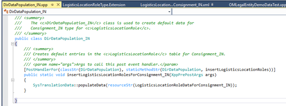
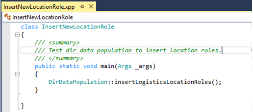
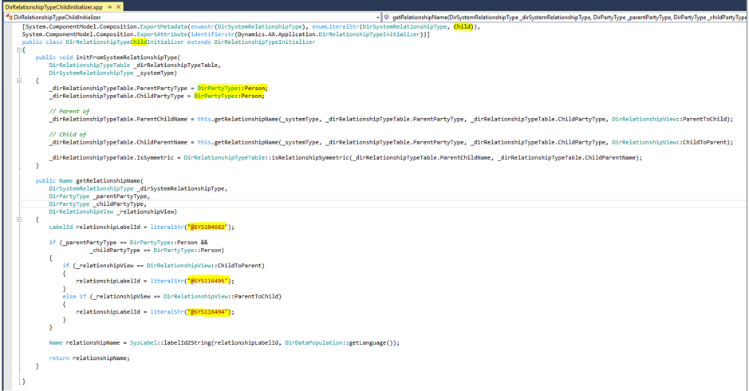
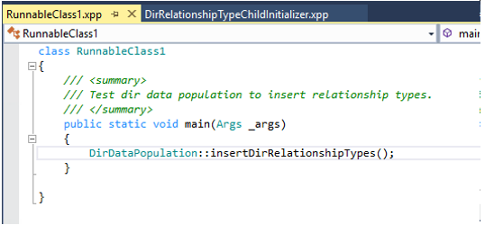

---
# required metadata

title: Add location and party relationship types
description: This article explains how to add a new location and party relationship type.
author: ShivamPandey-msft
ms.date: 05/01/2018
ms.topic: article
ms.prod: 
ms.technology: 

# optional metadata

ms.search.form: 
# ROBOTS: 
audience: Application User
# ms.devlang: 
ms.reviewer: kfend
# ms.tgt_pltfrm: 
ms.assetid: 2a0a4789-8619-4974-bef9-0923cc848420
ms.search.region: Global
# ms.search.industry: 
ms.author: shpandey
ms.search.validFrom: 2018-05-02
ms.dyn365.ops.version: AX 8.0.0

---

# Add location and party relationship types 

[!include [banner](../includes/banner.md)]

## Add location roles

There are two ways to add a new location roles for address and contact information:

-  Add it through the **Address and contact information purpose** page. The new role will be saved to the **LogisticsLocationRole** table with type = 0, which indicates that the role is not a system role defined in the **LogisticsLocationRoleType** enum and its extensions. A user will be able to use this role when creating address or contact information.

    

-  Add it to the **LogisticsLocationRoleType** enum extension, and let it populate through the database sync process.

    1.  Create an extension to the **LogisticsLocationRoleType** enum and add the new role in the extension. 
  
        

    2. Create a new resource file for the new role, and then assign a value for its properties.
     
     
        
    3.  Create a data population class and provide a handler method to populate the new role. 

        

    4.  To test populating the new location role, you can create a runnable class, and call DirDataPopulation::insertLogisticsLocationRoles() in Main(). After this process is complete, you should see the new role populated in the **LogisticsLocationRole** table with type \> 0. The new role will display on the **Address and contact information purpose** page.

        

## Add party relationship types 

There are two ways to add a new relationship type:

-   Add it through the **Relationship types** page. The new relationship will be saved to **DirRelationshipTypeTable** with systemtype = 0.

    

-  Add it to the extension of the **DirSystemRelationshipType** enum, and let it populate through database sync process.

    1.  Create an extension to the **DirSystemRelationshipType** enum and add the new relationship type.

    2. Create an initializer for this new type. You can find several examples in the core code, one of them is  **DirRelationshipTypeChildInitialize**. This is an initializer class for party relationship type “Child”. You can start with your initializer by copying and pasting this code and then update the highlighted areas.
    
    

    3.  To test populating the new relationship type, you can create a runnable class, and call DirDataPopulation::insertDirRelationshipTypes() in Main(). You should see the new relationship type in the **DirRelationshipTypeTable**, and the new relationship type will be available on the **Relationship types** page.

        

[!INCLUDE[footer-include](../../includes/footer-banner.md)]
